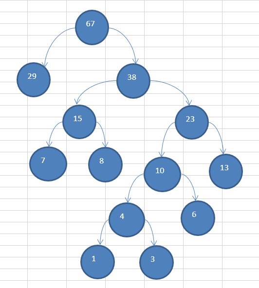
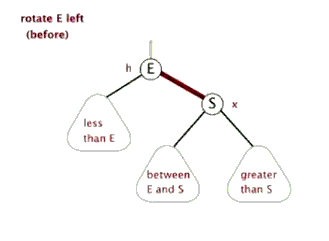
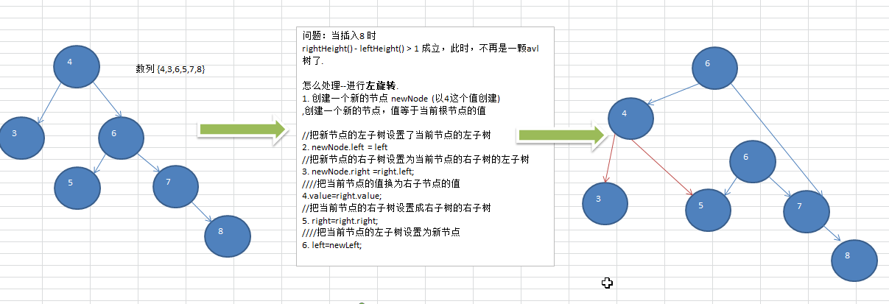
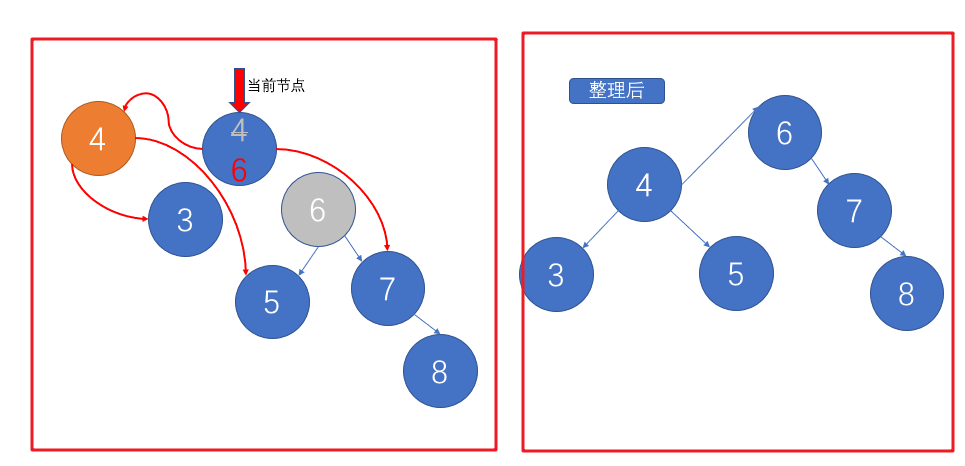
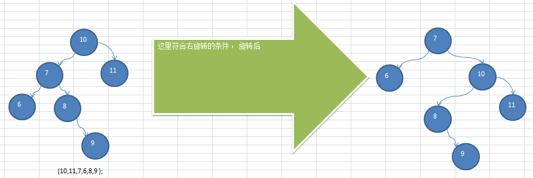
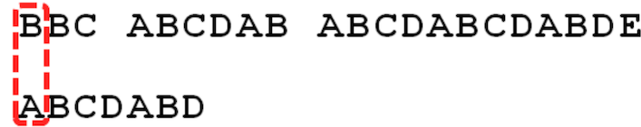
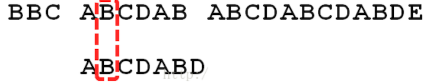
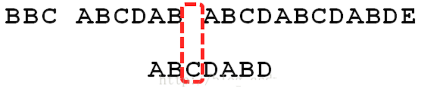

# 数据结构与算法


## 目录

- [第 1 章 内容介绍和授课方式](https://www.cnblogs.com/huangwenjie/p/13660641.html)
- [第 2 章 数据结构和算法概述](https://www.cnblogs.com/huangwenjie/p/13660646.html)
- [第 3 章 稀疏数组和队列](https://www.cnblogs.com/huangwenjie/p/13660657.html)
- [第 4 章 链表](https://www.cnblogs.com/huangwenjie/p/13660665.html)
- [第 5 章 栈](https://www.cnblogs.com/huangwenjie/p/13660669.html)
- [第 6 章 递归](https://www.cnblogs.com/huangwenjie/p/13660720.html)
- [第 7 章 排序算法](https://www.cnblogs.com/huangwenjie/p/13660736.html)
- [第 8 章 查找算法](https://www.cnblogs.com/huangwenjie/p/13660743.html)
- [第 9 章 哈希表](https://www.cnblogs.com/huangwenjie/p/13660749.html)
- [第 10 章 树结构的基础部分](https://www.cnblogs.com/huangwenjie/p/13660751.html)
- [第 11 章 树结构实际应用](https://www.cnblogs.com/huangwenjie/p/13660756.html)
- [第 12 章 多路查找树](https://www.cnblogs.com/huangwenjie/p/13660763.html)
- [第 13 章 图](https://www.cnblogs.com/huangwenjie/p/13660771.html)
- [第 14 章 程序员常用 10 种算法](https://www.cnblogs.com/huangwenjie/p/13660775.html)

## 参考资料

- [尚硅谷Java数据结构与java算法，韩顺平数据结构与算法](https://www.bilibili.com/video/BV1E4411H73v)

- [笔记整理 github](https://zq99299.github.io/dsalg-tutorial/dsalg-java-hsp/)

# 第 1 章 内容介绍和授课方式

## 1.1 数据结构和算法内容介绍

### 1.1.1 先看几个经典的算法面试题

- 字符串匹配问题
  - 暴力匹配 [简单， 但是效率低]
  - KMP 算法《部分匹配表》
- 汉诺塔游戏
- 八皇后问题【92中解  分治算法】
- 马踏棋盘
  - 马踏棋盘算法也被称为骑士周游问题
  - 会使用到图的深度优化遍历算法(DFS) + 贪心算法优化

### 1.1.2 数据结构和算法的重要性

1. 算法是程序的灵魂
2. 一般来讲 程序会使用了内存计算框架(比如 Spark)和缓存技术(比如 Redis 等)来优化程序,再深入的思考一下， 这些计算框架和缓存技术
3. 数据结构和算法面试需要
4. **如果你不想永远都是代码工人，那就花时间来研究下数据结构和算法**

# 第 2 章 数据结构和算法概述

## 2.1 数据结构和算法的关系

1. 数据（data）结构（structure）是一门**研究组织数据方式**的学科， 有了编程语言也就有了数据结构。学好数据结构可以编写出更加漂亮,更加有效率的代码。
2. 要学习好数据结构就要多多考虑如何将生活中遇到的问题，用程序去实现解决
3. **程序 = 数据结构 + 算法**
4. **数据结构是算法的基础**，换言之， 想要学好算法， 需要把数据结构学到位

## 2.2 看几个实际编程中遇到的问题

- 字符串替换问题
- 五子棋程序  =>稀疏数组
- 约瑟夫（ Josephu ）问题（丢手帕问题）=>单向环形链表
- 其它常见算法问题
  - 修路问题 => 最小生成树（加权值）【数据结构】 + 普利姆算法
  - 最短路径问题 => 图+弗洛伊德算法
  - 汉诺塔 => 分治算法
  - 八皇后问题 => 回溯法

## 2.3 线性结构和非线性结构

**数据结构包括： 线性结构和非线性结构。**

### 2.3.1 线性结构

- 线性结构作为**最常用**的数据结构， 其特点是**数据元素之间存在一对一的线性关系**
- 线性结构有两种不同的存储结构， 即 *顺序* 存储结构（数组）和 *链式*存储结构（链表）
  - 顺序存储的线性表称为顺序表， 顺序表中的**存储元素是连续**的
  - 链式存储的线性表称为链表， 链表中的**存储元素不一定是连续**的， **元素节点中存放数据元素以及相邻元素的地址信息**
- 线性结构常见的有： **数组**、 **队列**、 **链表**和**栈**， 后面我们会详细讲解.

### 2.3.2 非线性结构

非线性结构包括： 二维数组， 多维数组， 广义表， **树结构**， **图结构**

# 第 3 章 稀疏数组和队列

## 3.1 稀疏数组（ sparse array ）

### 3.1.1 先看一个实际的需求

编写的五子棋程序中， 有存盘退出和续上盘的功能。


分析问题: 因为该二维数组的很多值是默认值 0, 因此**记录了很多没有意义的数据->稀疏数组。**

### 3.1.2 基本介绍

当一个数组中大部分元素为０，或者为同一个值的数组时， 可以使用稀疏数组来保存该数组。

稀疏数组的处理方法是:

1. 记录数组一共有几行几列， 有多少个不同的值
2. 把具有不同值的元素的行列及值记录在一个小规模的数组中， 从而**缩小程序的规模**

稀疏数组举例说明：


> **第0行**： 6 * 7 表示矩阵大小， 8表示 保存8个数据

### 3.1.3应用实例

1. 使用稀疏数组， 来保留类似前面的二维数组(棋盘、 地图等等)
2. 把稀疏数组存盘， 并且可以从新恢复原来的二维数组数
3. 整体思路分析

   - 二维数组 转 稀疏数组的思路
     1. 遍历 原始的二维数组，得到有效数据的个数 `sum`
     2. 根据sum 就可以创建 稀疏数组 `int[sum + 1][3] sparseArr`
     3. 将二维数组的有效数据数据存入到 稀疏数组
   - 稀疏数组转原始的二维数组的思路
     1. 先读取稀疏数组的第一行，根据第一行的数据，创建原始的二维数组， `int[11][11] chessArr2`
     2. 再读取稀疏数组后几行的数据，并赋给 原始的二维数组 即可.

### 3.1.4 代码实现

```java
package com.atguigu.sparsearray;

public class SparseArray {

	public static void main(String[] args) {
		// 创建一个原始的二维数组 11 * 11
		// 0: 表示没有棋子， 1 表示 黑子 2 表蓝子
		int chessArr1[][] = new int[11][11];
		chessArr1[1][2] = 1;
		chessArr1[2][3] = 2;
		chessArr1[4][5] = 2;
		// 输出原始的二维数组
		System.out.println("原始的二维数组~~");
		for (int[] row : chessArr1) {
			for (int data : row) {
				System.out.printf("%d\t", data);
			}
			System.out.println();
		}

		// 将二维数组 转 稀疏数组的思
		// 1. 先遍历二维数组 得到非0数据的个数
		int sum = 0;
		for (int i = 0; i < 11; i++) {
			for (int j = 0; j < 11; j++) {
				if (chessArr1[i][j] != 0) {
					sum++;
				}
			}
		}

		// 2. 创建对应的稀疏数组
		int sparseArr[][] = new int[sum + 1][3];
		// 给稀疏数组赋值
		sparseArr[0][0] = 11;
		sparseArr[0][1] = 11;
		sparseArr[0][2] = sum;
		
		// 遍历二维数组，将非0的值存放到 sparseArr中
		int count = 0; //count 用于记录是第几个非0数据
		for (int i = 0; i < 11; i++) {
			for (int j = 0; j < 11; j++) {
				if (chessArr1[i][j] != 0) {
					count++;
					sparseArr[count][0] = i;
					sparseArr[count][1] = j;
					sparseArr[count][2] = chessArr1[i][j];
				}
			}
		}
		
		// 输出稀疏数组的形式
		System.out.println();
		System.out.println("得到稀疏数组为~~~~");
		for (int i = 0; i < sparseArr.length; i++) {
			System.out.printf("%d\t%d\t%d\t\n", sparseArr[i][0], sparseArr[i][1], sparseArr[i][2]);
		}
		System.out.println();
		
		//将稀疏数组 --》 恢复成 原始的二维数组
		/*
		 *  1. 先读取稀疏数组的第一行，根据第一行的数据，创建原始的二维数组，比如上面的  chessArr2 = int [11][11]
			2. 在读取稀疏数组后几行的数据，并赋给 原始的二维数组 即可.
		 */
		
		//1. 先读取稀疏数组的第一行，根据第一行的数据，创建原始的二维数组
		
		int chessArr2[][] = new int[sparseArr[0][0]][sparseArr[0][1]];
		
		//2. 在读取稀疏数组后几行的数据(从第二行开始)，并赋给 原始的二维数组 即可
		
		for(int i = 1; i < sparseArr.length; i++) {
			chessArr2[sparseArr[i][0]][sparseArr[i][1]] = sparseArr[i][2];
		}
		
		// 输出恢复后的二维数组
		System.out.println();
		System.out.println("恢复后的二维数组");
		
		for (int[] row : chessArr2) {
			for (int data : row) {
				System.out.printf("%d\t", data);
			}
			System.out.println();
		}
	}

}
```

## 3.2 队列

### 3.2.1 队列的一个使用场景

排队系统

### 3.2.2 队列介绍

1. 队列是一个**有序列表**， 可以用**数组**或是**链表**来实现。

2. 遵循**先入先出**[FIFO]的原则。 即： **先存入队列的数据， 要先取出。 后存入的要后取出**

3. 示意图： (使用数组模拟队列示意图)

   

### 3.2.3 数组模拟队列思路

- 队列本身是有序列表， 若使用数组的结构来存储队列的数据， 则队列数组的声明如下图, 其中 maxSize 是该队列的最大容量。

- 因为队列的输入、 输出是分别从前后端来处理， 因此需要两个变量 `front` 及 `rear` 分别记录队列前后端的下标，front 会随着数据输出而改变， 而 rear 则是随着数据输入而改变

- 当我们将数据存入队列时称为 addQueue ， addQueue 的处理需要有两个步骤：

  1. 将尾指针往后移： rear+1 , 特殊情况： front == rear 【空】
  2. 若尾指针 rear 小于队列的最大下标 maxSize - 1， 则将数据存入 rear 所指的数组元素中， 否则无法存入数据。 特殊情况：rear == maxSize - 1【队列满】

- 代码实现

  ```java
  package com.atguigu.queue;
  
  import java.util.Scanner;
  
  // 使用数组模拟队列-编写一个ArrayQueue类  fix：不是环形队列
  class ArrayQueue {
  	private int maxSize; // 表示数组的最大容量
  	private int front; // 队列头
  	private int rear; // 队列尾
  	private int[] arr; // 该数据用于存放数据, 模拟队列
  
  	// 创建队列的构造器
  	public ArrayQueue(int arrMaxSize) {
  		maxSize = arrMaxSize;
  		arr = new int[maxSize];
  		front = -1; // 指向队列头部，分析出front是指向队列头的前一个位置.
  		rear = -1; // 指向队列尾，指向队列尾的数据(即就是队列最后一个数据)
  	}
  
  	// 判断队列是否满
  	public boolean isFull() {
  		return rear == maxSize - 1;
  	}
  
  	// 判断队列是否为空
  	public boolean isEmpty() {
  		return rear == front;
  	}
  
  	// 添加数据到队列
  	public void addQueue(int n) {
  		// 判断队列是否满
  		if (isFull()) {
  			System.out.println("队列满，不能加入数据~");
  			return;
  		}
  		rear++; // 让rear 后移
  		arr[rear] = n;
  	}
  
  	// 获取队列的数据, 出队列
  	public int getQueue() {
  		// 判断队列是否空
  		if (isEmpty()) {
  			// 通过抛出异常
  			throw new RuntimeException("队列空，不能取数据");
  		}
  		front++; // front后移
  		return arr[front];
  
  	}
  
  	// 显示队列的所有数据
  	public void showQueue() {
  		// 遍历
  		if (isEmpty()) {
  			System.out.println("队列空的，没有数据~~");
  			return;
  		}
  		for (int i = 0; i < arr.length; i++) {
  			System.out.printf("arr[%d]=%d\n", i, arr[i]);
  		}
  	}
  
  	// 显示队列的头数据， 注意不是取出数据
  	public int headQueue() {
  		// 判断
  		if (isEmpty()) {
  			throw new RuntimeException("队列空的，没有数据~~");
  		}
  		return arr[front + 1];
  	}
  }
  
  //通过控制台输入测试
  public class ArrayQueueDemo {
  
  	public static void main(String[] args) {
  		//测试一把
  		//创建一个队列
  		ArrayQueue queue = new ArrayQueue(3);
  		char key = ' '; //接收用户输入
  		Scanner scanner = new Scanner(System.in);//
  		boolean loop = true;
  		//输出一个菜单
  		while(loop) {
  			System.out.println("s(show): 显示队列");
  			System.out.println("e(exit): 退出程序");
  			System.out.println("a(add): 添加数据到队列");
  			System.out.println("g(get): 从队列取出数据");
  			System.out.println("h(head): 查看队列头的数据");
  			key = scanner.next().charAt(0);//接收一个字符
  			switch (key) {
  			case 's':
  				queue.showQueue();
  				break;
  			case 'a':
  				System.out.println("输出一个数");
  				int value = scanner.nextInt();
  				queue.addQueue(value);
  				break;
  			case 'g': //取出数据
  				try {
  					int res = queue.getQueue();
  					System.out.printf("取出的数据是%d\n", res);
  				} catch (Exception e) {
  					// TODO: handle exception
  					System.out.println(e.getMessage());
  				}
  				break;
  			case 'h': //查看队列头的数据
  				try {
  					int res = queue.headQueue();
  					System.out.printf("队列头的数据是%d\n", res);
  				} catch (Exception e) {
  					// TODO: handle exception
  					System.out.println(e.getMessage());
  				}
  				break;
  			case 'e': //退出
  				scanner.close();
  				loop = false;
  				break;
  			default:
  				break;
  			}
  		}
  		
  		System.out.println("程序退出~~");
  	}
  
  }
  ```
  
- 问题分析并优化

  - 目前数组使用一次就不能用， 没有达到复用的效果

  - 将这个数组使用算法， 改进成一个**环形的队列** 取模： %


### 3.2.4 数组模拟环形队列

将普通队列想象成逻辑上的首位相连的圆环，把这个叫循环队列，在循环队列中，**当队列为空时，有`front=rear`**，而当所有队列空间全占满时，也有front=rear。为了<u>区别这两种情</u>况，**规定循环队列最多只能有MaxSize-1个队列元素**，当循环队列中只剩下一个空存储单元时，队列就已经满了。因此，队列判空的条件是front=rear，而队列判满的条件是`front=（rear+1)%MaxSize`

**添加数据，直接加载rear位置，rear后移一位，且需要%运算**


分析说明：

1）尾索引的下一个为头索引时表示队列满，即将队列容量空出一个作为约定，这个在做判断队列满的时候需要注意（rear＋1）％maxSize＝＝front 满］

2）rear＝＝front［空］ 


思路如下:

1. front 变量的含义做一个调整： `front 就指向队列的第一个元素`, 也就是说 arr[front] 就是队列的第一个元素 front 的初始值 = 0
2. rear 变量的含义做一个调整：`rear 指向队列的最后一个元素的后一个位置`。因为希望空出一个空间做为约定。rear 的初始值 = 0
3. 当队列**【满】**时，条件是 `(rear + 1) % maxSize == front`  `说明：rear + 1 刚好等于front  或者超一圈`
4. 对队列为**【空】**的条件， `rear == front`
5. 当我们这样分析， 队列中有效的数据的个数 `(rear + maxSize - front) % maxSize` // rear = 1 front = 0

   > 两种情况：
   >
   > 没有超圈 = （rear  - front）
   > 超圈： rear + maxSize - front   
   >
   > 但是 maxSize % maxSize =0，上述可以合并为`(rear + maxSize - front) % maxSize`
6. 我们就可以在原来的队列上修改得到，一个环形队列

代码实现：

```java
package com.atguigu.queue;

import java.util.Scanner;

class CircleArray {
	private int maxSize; // 表示数组的最大容量
	//front 变量的含义做一个调整： front 就指向队列的第一个元素, 也就是说 arr[front] 就是队列的第一个元素 
	//front 的初始值 = 0
	private int front; 
	//rear 变量的含义做一个调整：rear 指向队列的最后一个元素的后一个位置. 因为希望空出一个空间做为约定.
	//rear 的初始值 = 0
	private int rear; // 队列尾
	private int[] arr; // 该数据用于存放数据, 模拟队列
	
	public CircleArray(int arrMaxSize) {
		maxSize = arrMaxSize;
		arr = new int[maxSize];
	}
	
	// 判断队列是否满
	public boolean isFull() {
		return (rear  + 1) % maxSize == front;
	}
	
	// 判断队列是否为空
	public boolean isEmpty() {
		return rear == front;
	}
	
	// 添加数据到队列
	public void addQueue(int n) {
		// 判断队列是否满
		if (isFull()) {
			System.out.println("队列满，不能加入数据~");
			return;
		}
		//直接将数据加入
		arr[rear] = n;
		//将 rear 后移, 这里必须考虑取模
		rear = (rear + 1) % maxSize;
	}
	
	// 获取队列的数据, 出队列
	public int getQueue() {
		// 判断队列是否空
		if (isEmpty()) {
			// 通过抛出异常
			throw new RuntimeException("队列空，不能取数据");
		}
		// 这里需要分析出 front是指向队列的第一个元素
		// 1. 先把 front 对应的值保留到一个临时变量
		// 2. 将 front 后移, 考虑取模
		// 3. 将临时保存的变量返回
		int value = arr[front];
		front = (front + 1) % maxSize;
		return value;

	}
	
	// 显示队列的所有数据
	public void showQueue() {
		// 遍历
		if (isEmpty()) {
			System.out.println("队列空的，没有数据~~");
			return;
		}
		// 思路：从front开始遍历，遍历多少个元素
		// 动脑筋
		for (int i = front; i < front + size() ; i++) {
			System.out.printf("arr[%d]=%d\n", i % maxSize, arr[i % maxSize]);
		}
	}
	
	// 求出当前队列有效数据的个数
	public int size() {
		// rear = 2
		// front = 1
		// maxSize = 3 
		return (rear + maxSize - front) % maxSize;   
	}
	
	// 显示队列的头数据， 注意不是取出数据
	public int headQueue() {
		// 判断
		if (isEmpty()) {
			throw new RuntimeException("队列空的，没有数据~~");
		}
		return arr[front];
	}
}

public class CircleArrayQueueDemo {

	public static void main(String[] args) {
		
		//测试一把
		System.out.println("测试数组模拟环形队列的案例~~~");
		
		// 创建一个环形队列
		CircleArray queue = new CircleArray(4); //说明设置4, 其队列的有效数据最大是3
		char key = ' '; // 接收用户输入
		Scanner scanner = new Scanner(System.in);//
		boolean loop = true;
		// 输出一个菜单
		while (loop) {
			System.out.println("s(show): 显示队列");
			System.out.println("e(exit): 退出程序");
			System.out.println("a(add): 添加数据到队列");
			System.out.println("g(get): 从队列取出数据");
			System.out.println("h(head): 查看队列头的数据");
			key = scanner.next().charAt(0);// 接收一个字符
			switch (key) {
			case 's':
				queue.showQueue();
				break;
			case 'a':
				System.out.println("输出一个数");
				int value = scanner.nextInt();
				queue.addQueue(value);
				break;
			case 'g': // 取出数据
				try {
					int res = queue.getQueue();
					System.out.printf("取出的数据是%d\n", res);
				} catch (Exception e) {
					// TODO: handle exception
					System.out.println(e.getMessage());
				}
				break;
			case 'h': // 查看队列头的数据
				try {
					int res = queue.headQueue();
					System.out.printf("队列头的数据是%d\n", res);
				} catch (Exception e) {
					// TODO: handle exception
					System.out.println(e.getMessage());
				}
				break;
			case 'e': // 退出
				scanner.close();
				loop = false;
				break;
			default:
				break;
			}
		}
		System.out.println("程序退出~~");
	}
}
```

# 第 4 章 链表

## 4.1 链表(Linked List)介绍

**链表是有序的列表**， 但是它在内存中是存储如下


1. 链表是以节点的方式来存储，是**链式存储**
2. 每个节点包含 data 域， **next 域： 指向下一个节点.**
3. 如图： 发现**链表的各个节点不一定是连续存储**
4. **链表分带头节点的链表和没有头节点的链表**， 根据实际的需求来确定


## 4.2 单链表的应用实例

使用带 head 头的单向链表实现 – 水浒英雄排行榜管理完成对英雄人物的增删改查操作

### 第一种方法 直接添加到链表的尾部

添加（创建）：

1. 先创建一个head 头节点， 作用就是表示单链表的头
2. 后面我们每添加一个节点，就直接加入到 链表的最后

遍历：

1. 通过一个辅助变量遍历，帮助遍历整个链表

#### 代码实现

节点实现：

```java
//定义HeroNode ， 每个HeroNode 对象就是一个节点
class HeroNode {
	public int no;
	public String name;
	public String nickname;
	public HeroNode next; //指向下一个节点
	//构造器
	public HeroNode(int no, String name, String nickname) {
		this.no = no;
		this.name = name;
		this.nickname = nickname;
	}
	//为了显示方法，我们重新toString
	@Override
	public String toString() {
		return "HeroNode [no=" + no + ", name=" + name + ", nickname=" + nickname + "]";
	}
	
}

```

链表实现：

```java
//定义SingleLinkedList 管理我们的英雄
class SingleLinkedList {
	//先初始化一个头节点, 头节点不要动, 不存放具体的数据
	private HeroNode head = new HeroNode(0, "", "");
	
	
	//返回头节点
	public HeroNode getHead() {
		return head;
	}

	//添加节点到单向链表
	//思路，当不考虑编号顺序时
	//1. 找到当前链表的最后节点
	//2. 将最后这个节点的next 指向 新的节点
	public void add(HeroNode heroNode) {
		
		//因为head节点不能动，因此我们需要一个辅助遍历 temp
		HeroNode temp = head;
		//遍历链表，找到最后
		while(true) {
			//找到链表的最后
			if(temp.next == null) {//
				break;
			}
			//如果没有找到最后, 将将temp后移
			temp = temp.next;
		}
		//当退出while循环时，temp就指向了链表的最后
		//将最后这个节点的next 指向 新的节点
		temp.next = heroNode;
	}
	
	
	//显示链表[遍历]
	public void list() {
		//判断链表是否为空
		if(head.next == null) {
			System.out.println("链表为空");
			return;
		}
		//因为头节点，不能动，因此我们需要一个辅助变量来遍历
		HeroNode temp = head.next;
		while(true) {
			//判断是否到链表最后
			if(temp == null) {
				break;
			}
			//输出节点的信息
			System.out.println(temp);
			//将temp后移， 一定小心
			temp = temp.next;
		}
	}
}
```

测试功能：

```java
public class HeroLinkedListTest {
    public static void main(String[] args) {

        HeroNode hero1 = new HeroNode(1, "宋江", "及时雨");
        HeroNode hero2 = new HeroNode(2, "卢俊义", "玉麒麟");
        HeroNode hero3 = new HeroNode(3, "吴用", "智多星");
        HeroNode hero4 = new HeroNode(4, "林冲", "豹子头");

        HeroLinkedList list = new HeroLinkedList();
        list.add(hero1);
        list.add(hero2);
        list.add(hero3);
        list.add(hero4);
        list.list();
    }
}
```

### 第二种方式  根据排名将英雄插入到指定位置(如果有这个排名， 则添加失败， 并给出提示)

> 基本思想：**找到一个大于待插入的值节点**，这个节点即为插入节点的前一个位置，如果没找到即说明待插入的为最大。插入末尾。

需要按照编号的顺序添加

1. 首先找到新添加的节点的位置, 是通过辅助变量(指针), 通过遍历来搞定**,
2. 新的节点.next = temp.next
3. 将temp.next = 新的节点

#### 代码实现

添加方法：

```java
	//第二种方式在添加英雄时，根据排名将英雄插入到指定位置
	//(如果有这个排名，则添加失败，并给出提示)
	public void addByOrder(HeroNode heroNode) {
		//因为头节点不能动，因此我们仍然通过一个辅助指针(变量)来帮助找到添加的位置
		//因为单链表，因为我们找的temp 是位于 添加位置的前一个节点，否则插入不了
		HeroNode temp = head;
		boolean flag = false; // flag标志添加的编号是否存在，默认为false
		while(true) {
			if(temp.next == null) {//说明temp已经在链表的最后
				break; //
			} 
			if(temp.next.no > heroNode.no) { //位置找到，就在temp的后面插入
				break;
			} else if (temp.next.no == heroNode.no) {//说明希望添加的heroNode的编号已然存在
				
				flag = true; //说明编号存在
				break;
			}
			temp = temp.next; //后移，遍历当前链表
		}
		//判断flag 的值
		if(flag) { //不能添加，说明编号存在
			System.out.printf("准备插入的英雄的编号 %d 已经存在了, 不能加入\n", heroNode.no);
		} else {
			//插入到链表中, temp的后面
			heroNode.next = temp.next;
			temp.next = heroNode;
		}
	}
```

测试功能：

```java
    public static void main(String[] args) {

        HeroNode hero1 = new HeroNode(1, "宋江", "及时雨");
        HeroNode hero2 = new HeroNode(2, "卢俊义", "玉麒麟");
        HeroNode hero3 = new HeroNode(3, "吴用", "智多星");
        HeroNode hero4 = new HeroNode(4, "林冲", "豹子头");

        HeroLinkedList list = new HeroLinkedList();
        // list.add(hero1);
        // list.add(hero4);
        // list.add(hero3);
        // list.add(hero2);
        // list.add(hero3);  xxx，这里不可以插入重复节点，否则会造成链表节点间循环


        list.addByOrder(hero1);
        list.addByOrder(hero4);
        list.addByOrder(hero3);
        list.addByOrder(hero2);
        // list.addByOrder(hero4);

        list.list();
    }
```

### 更新节点

更新功能：

```java

	//修改节点的信息, 根据no编号来修改，即no编号不能改.
	//说明
	//1. 根据 newHeroNode 的 no 来修改即可
	public void update(HeroNode newHeroNode) {
		//判断是否空
		if(head.next == null) {
			System.out.println("链表为空~");
			return;
		}
		//找到需要修改的节点, 根据no编号
		//定义一个辅助变量
		HeroNode temp = head.next;
		boolean flag = false; //表示是否找到该节点
		while(true) {
			if (temp == null) {
				break; //已经遍历完链表
			}
			if(temp.no == newHeroNode.no) {
				//找到
				flag = true;
				break;
			}
			temp = temp.next;
		}
		//根据flag 判断是否找到要修改的节点
		if(flag) {
			temp.name = newHeroNode.name;
			temp.nickname = newHeroNode.nickname;
		} else { //没有找到
			System.out.printf("没有找到 编号 %d 的节点，不能修改\n", newHeroNode.no);
		}
	}
```

测试功能：

```java
public static void main(String[] args) {

        HeroNode hero1 = new HeroNode(1, "宋江", "及时雨");
        HeroNode hero2 = new HeroNode(2, "卢俊义", "玉麒麟");
        HeroNode hero3 = new HeroNode(3, "吴用", "智多星");
        HeroNode hero4 = new HeroNode(4, "林冲", "豹子头");

        HeroLinkedList list = new HeroLinkedList();
        // list.add(hero1);
        // list.add(hero4);
        // list.add(hero3);
        // list.add(hero2);
        // list.add(hero3);  xxx，这里不可以插入重复节点，否则会造成链表节点间循环


        list.addByOrder(hero1);
        list.addByOrder(hero4);
        list.addByOrder(hero3);
        list.addByOrder(hero2);
        // list.addByOrder(hero4);

        list.list();

        System.out.println("修改英雄信息");
        HeroNode hero33 = new HeroNode(2, "吴用2", "智多星3");
        list.update(hero33);
        list.list();
    }
```

### 删除节点

删除功能：

```java
	//删除节点
	//思路
	//1. head 不能动，因此我们需要一个temp辅助节点找到待删除节点的前一个节点
	//2. 说明我们在比较时，是temp.next.no 和  需要删除的节点的no比较
	public void del(int no) {
		HeroNode temp = head;
		boolean flag = false; // 标志是否找到待删除节点的
		while(true) {
			if(temp.next == null) { //已经到链表的最后
				break;
			}
			if(temp.next.no == no) {
				//找到的待删除节点的前一个节点temp
				flag = true;
				break;
			}
			temp = temp.next; //temp后移，遍历
		}
		//判断flag
		if(flag) { //找到
			//可以删除
			temp.next = temp.next.next;
		}else {
			System.out.printf("要删除的 %d 节点不存在\n", no);
		}
	}
```

测试功能：

```java
public static void main(String[] args) {

        HeroNode hero1 = new HeroNode(1, "宋江", "及时雨");
        HeroNode hero2 = new HeroNode(2, "卢俊义", "玉麒麟");
        HeroNode hero3 = new HeroNode(3, "吴用", "智多星");
        HeroNode hero4 = new HeroNode(4, "林冲", "豹子头");

        HeroLinkedList list = new HeroLinkedList();
        // list.add(hero1);
        // list.add(hero4);
        // list.add(hero3);
        // list.add(hero2);
        // list.add(hero3);  xxx，这里不可以插入重复节点，否则会造成链表节点间循环


        list.addByOrder(hero1);
        list.addByOrder(hero4);
        list.addByOrder(hero3);
        list.addByOrder(hero2);
        // list.addByOrder(hero4);

        list.list();

        System.out.println("修改英雄信息");
        HeroNode hero33 = new HeroNode(2, "吴用2", "智多星3");
        list.update(hero33);
        list.list();

        System.out.println("删除英雄信息");
        list.delete(1);
        // list.delete(2);
        // list.delete(3);
        // list.delete(4);
        // list.delete(5);
        list.list();
    }
```

## 4.3 ** 单链表面试题

### 求单链表中有效节点的个数

```java
	//方法：获取到单链表的节点的个数(如果是带头结点的链表，需求不统计头节点)
	/**
	 * 
	 * @param head 链表的头节点
	 * @return 返回的就是有效节点的个数
	 */
	public static int getLength(HeroNode head) {
		if(head.next == null) { //空链表
			return 0;
		}
		int length = 0;
		//定义一个辅助的变量, 这里我们没有统计头节点
		HeroNode cur = head.next;
		while(cur != null) {
			length++;
			cur = cur.next; //遍历
		}
		return length;
	}
```

### 查找单链表中的倒数第 k 个结点

```java
	//查找单链表中的倒数第k个结点 【新浪面试题】
	//思路
	//1. 编写一个方法，接收head节点，同时接收一个index 
	//2. index 表示是倒数第index个节点
	//3. 先把链表从头到尾遍历，得到链表的总的长度 getLength
	//4. 得到size 后，我们从链表的第一个开始遍历 (size-index)个，就可以得到
	//5. 如果找到了，则返回该节点，否则返回nulll
	public static HeroNode findLastIndexNode(HeroNode head, int index) {
		//判断如果链表为空，返回null
		if(head.next == null) {
			return null;//没有找到
		}
		//第一个遍历得到链表的长度(节点个数)
		int size = getLength(head);
		//第二次遍历  size-index 位置，就是我们倒数的第K个节点
		//先做一个index的校验
		if(index <=0 || index > size) {
			return null; 
		}
		//定义给辅助变量， for 循环定位到倒数的index
		HeroNode cur = head.next; //3 // 3 - 1 = 2
		for(int i =0; i< size - index; i++) {
			cur = cur.next;
		}
		return cur;
		
	}
```

### 单链表的反转

思路:

1. 先定义一个节点 reverseHead = new HeroNode();
2. **从头到尾遍历原来的链表，每遍历一个节点，就将其取出，并放在新的链表reverseHead 的最前端.**
3. 原来的链表的head.next = reverseHead.next

```java
	//将单链表反转
	public static void reversetList(HeroNode head) {
		//如果当前链表为空，或者只有一个节点，无需反转，直接返回
		if(head.next == null || head.next.next == null) {
			return ;
		}
		
		//定义一个辅助的指针(变量)，帮助我们遍历原来的链表
		HeroNode cur = head.next;
		HeroNode next = null;// 指向当前节点[cur]的下一个节点
		HeroNode reverseHead = new HeroNode(0, "", "");
		//遍历原来的链表，每遍历一个节点，就将其取出，并放在新的链表reverseHead 的最前端
		//动脑筋
		while(cur != null) { 
			next = cur.next;//先暂时保存当前节点的下一个节点，因为后面需要使用
			cur.next = reverseHead.next;//将cur的下一个节点指向新的链表的最前端
			reverseHead.next = cur; //将cur 连接到新的链表上
			cur = next;//让cur后移
		}
		//将head.next 指向 reverseHead.next , 实现单链表的反转
		head.next = reverseHead.next;
	}
    
    
    
    

/**
 * 翻转单链表，不改变原链表
 */
public HeroLinkedList reverseList() {
    HeroLinkedList reverseList = new HeroLinkedList();
    HeroNode reverseHead = reverseList.head;

    HeroNode curNode = head.getNext();
    while (true) {
        if (curNode == null) {
            break;
        }

        HeroNode heroNode = new HeroNode(curNode);
        // 将当前节点插入翻转单链表
        heroNode.setNext(reverseHead.getNext());
        reverseHead.setNext(heroNode);

        curNode = curNode.getNext();
    }

    return reverseList;
}
```

### 从尾到头打印单链表

思路

1. 上面的题的要求就是逆序打印单链表.

2. 方式1： 先将单链表进行反转操作，然后再遍历即可，这样的做的问题是会破坏原来的单链表的结构，**不建议**

3. **方式**2：可以利用栈这个数据结构，将各个节点压入到**栈**中，然后利用栈的**先进后出**的特点，就实现了逆序打印的效果.

**举例演示栈的使用** **Stack**

```java
	//方式2：
	//可以利用栈这个数据结构，将各个节点压入到栈中，然后利用栈的先进后出的特点，就实现了逆序打印的效果
	public static void reversePrint(HeroNode head) {
		if(head.next == null) {
			return;//空链表，不能打印
		}
		//创建要给一个栈，将各个节点压入栈
		Stack<HeroNode> stack = new Stack<HeroNode>();
		HeroNode cur = head.next;
		//将链表的所有节点压入栈
		while(cur != null) {
			stack.push(cur);
			cur = cur.next; //cur后移，这样就可以压入下一个节点
		}
		//将栈中的节点进行打印,pop 出栈
		while (stack.size() > 0) {
			System.out.println(stack.pop()); //stack的特点是先进后出
		}
	}
```


### 合并两个有序的单链表， 合并之后的链表依然有序

```java
/**
 * 合并两个有序的单链表， 合并之后的链表依然有序
 */
   public static SingleLinkedList mergerLinkedList(SingleLinkedList list1, SingleLinkedList list2) {
        SingleLinkedList res = new SingleLinkedList();
        HeroNode l1 = list1.getHead().next;
        HeroNode l2 = list2.getHead().next;

        while (true) {
            if (l1 == null || l2 == null) {
                break;
            }
            if (l1.no < l2.no) {
                HeroNode next = l1.next;
                l1.next = null;//下一个节点置空
                res.add(l1);//插入未部
                l1 = next;
            } else {
                HeroNode next = l2.next;
                l2.next = null;
                res.add(l2);
                l2 = next;
            }
        }

        //判断两个是否合并完毕
        if (l1 == null) {
            res.add(l2);
        } else {
            res.add(l1);
        }

        return res;
    }
```

## 4.4 双向链表

### 4.4.1双向链表的操作分析和实现

使用带 head 头的双向链表实现 – 水浒英雄排行榜

管理单向链表的缺点分析:

1. 单向链表， 查找的方向只能是一个方向， 而双向链表可以向前或者向后查找。
2. 单向链表不能自我删除， 需要靠辅助节点 ， 而双向链表， 则可以自我删除， 所以前面我们单链表删除时节点， 总是找到 temp,temp 是待删除节点的前一个节点,【单向链表从后到前，节点不能互相联系】

分析 双向链表的遍历，添加，修改，删除的操作思路===》代码实现

1. 遍历 方和 单链表一样，只是可以向前，也可以向后查找
2. 添加 (默认添加到双向链表的最后)
   1. 先找到双向链表的最后这个节点
   2. temp.next = newHeroNode
   3. newHeroNode.pre = temp;
3. 修改 思路和 原来的单向链表一样.
4. 删除
   1. 因为是双向链表，因此，我们可以实现自我删除某个节点
   2. 直接找到要删除的这个节点，比如temp
   3. temp.pre.next = temp.next
   4. temp.next.pre = temp.pre;

#### 双向链表的代码实现

节点类：

```java
// 定义HeroNode2 ， 每个HeroNode 对象就是一个节点
class HeroNode2 {
    public int no;
    public String name;
    public String nickname;
    public HeroNode2 next; // 指向下一个节点, 默认为null
    public HeroNode2 pre; // 指向前一个节点, 默认为null
    // 构造器

    public HeroNode2(int no, String name, String nickname) {
        this.no = no;
        this.name = name;
        this.nickname = nickname;
    }

    // 为了显示方法，我们重新toString
    @Override
    public String toString() {
        return "HeroNode [no=" + no + ", name=" + name + ", nickname=" + nickname + "]";
    }

}
```

双向列表实现：

```java
// 创建一个双向链表的类
class DoubleLinkedList {

    // 先初始化一个头节点, 头节点不要动, 不存放具体的数据
    private HeroNode2 head = new HeroNode2(0, "", "");

    // 返回头节点
    public HeroNode2 getHead() {
        return head;
    }

    // 遍历双向链表的方法
    // 显示链表[遍历]
    public void list() {
        // 判断链表是否为空
        if (head.next == null) {
            System.out.println("链表为空");
            return;
        }
        // 因为头节点，不能动，因此我们需要一个辅助变量来遍历
        HeroNode2 temp = head.next;
        while (true) {
            // 判断是否到链表最后
            if (temp == null) {
                break;
            }
            // 输出节点的信息
            System.out.println(temp);
            // 将temp后移， 一定小心
            temp = temp.next;
        }
    }

    // 添加一个节点到双向链表的最后.
    public void add(HeroNode2 heroNode) {

        // 因为head节点不能动，因此我们需要一个辅助遍历 temp
        HeroNode2 temp = head;
        // 遍历链表，找到最后
        while (true) {
            // 找到链表的最后
            if (temp.next == null) {//
                break;
            }
            // 如果没有找到最后, 将将temp后移
            temp = temp.next;
        }
        // 当退出while循环时，temp就指向了链表的最后
        // 形成一个双向链表
        temp.next = heroNode;
        heroNode.pre = temp;
    }

    // 修改一个节点的内容, 可以看到双向链表的节点内容修改和单向链表一样
    // 只是 节点类型改成 HeroNode2
    public void update(HeroNode2 newHeroNode) {
        // 判断是否空
        if (head.next == null) {
            System.out.println("链表为空~");
            return;
        }
        // 找到需要修改的节点, 根据no编号
        // 定义一个辅助变量
        HeroNode2 temp = head.next;
        boolean flag = false; // 表示是否找到该节点
        while (true) {
            if (temp == null) {
                break; // 已经遍历完链表
            }
            if (temp.no == newHeroNode.no) {
                // 找到
                flag = true;
                break;
            }
            temp = temp.next;
        }
        // 根据flag 判断是否找到要修改的节点
        if (flag) {
            temp.name = newHeroNode.name;
            temp.nickname = newHeroNode.nickname;
        } else { // 没有找到
            System.out.printf("没有找到 编号 %d 的节点，不能修改\n", newHeroNode.no);
        }
    }

    // 从双向链表中删除一个节点,
    // 说明
    // 1 对于双向链表，我们可以直接找到要删除的这个节点
    // 2 找到后，自我删除即可
    public void del(int no) {

        // 判断当前链表是否为空
        if (head.next == null) {// 空链表
            System.out.println("链表为空，无法删除");
            return;
        }

        HeroNode2 temp = head.next; // 辅助变量(指针)
        boolean flag = false; // 标志是否找到待删除节点的
        while (true) {
            if (temp == null) { // 已经到链表的最后
                break;
            }
            if (temp.no == no) {
                // 找到的待删除节点的前一个节点temp
                flag = true;
                break;
            }
            temp = temp.next; // temp后移，遍历
        }
        // 判断flag
        if (flag) { // 找到
            // 可以删除
            // temp.next = temp.next.next;[单向链表]
            temp.pre.next = temp.next;
            // 这里我们的代码有问题?
            // 如果是最后一个节点，就不需要执行下面这句话，否则出现空指针
            if (temp.next != null) {
                temp.next.pre = temp.pre;
            }
        } else {
            System.out.printf("要删除的 %d 节点不存在\n", no);
        }
    }
    
    //插入时排序
      public void addByOrder(HeroNode2 heroNode) {
        HeroNode2 curNode = head;
        boolean existFlag = false;
        while (true) {
            if (curNode.getNext() == null) {
                // 已到达链表尾部
                break;
            }

            if (curNode.getNext().getNo() > heroNode.getNo()) {
                // 找到应插入位置
                break;
            }

            if (curNode.getNext().getNo() == heroNode.getNo()) {
                // 已存在此编号英雄
                existFlag = true;
                break;
            }
            curNode = curNode.getNext();
        }

        if (existFlag) {
            System.out.printf("已存在编号为 %d 英雄，不能添加\n", heroNode.getNo());
        } else {
            // 将节点插入链表

            if (curNode.getPre() == null) {
                // 如果为 head
                heroNode.setNext(curNode.getNext());
                curNode.setNext(heroNode);
                heroNode.setPre(curNode.getPre());
            } else {
                curNode.getPre().setNext(heroNode);
                heroNode.setPre(curNode.getPre());
                curNode.setPre(heroNode);
                heroNode.setNext(curNode);
            }

        }
    }

}
```

测试功能：

```java
public class DoubleLinkedListDemo {

    public static void main(String[] args) {
        // 测试
        System.out.println("双向链表的测试");
        // 先创建节点
        HeroNode2 hero1 = new HeroNode2(1, "宋江", "及时雨");
        HeroNode2 hero2 = new HeroNode2(2, "卢俊义", "玉麒麟");
        HeroNode2 hero3 = new HeroNode2(3, "吴用", "智多星");
        HeroNode2 hero4 = new HeroNode2(4, "林冲", "豹子头");
        // 创建一个双向链表
        DoubleLinkedList doubleLinkedList = new DoubleLinkedList();
        doubleLinkedList.add(hero1);
        doubleLinkedList.add(hero2);
        doubleLinkedList.add(hero3);
        doubleLinkedList.add(hero4);

        doubleLinkedList.list();

        // 修改
        HeroNode2 newHeroNode = new HeroNode2(4, "公孙胜", "入云龙");
        doubleLinkedList.update(newHeroNode);
        System.out.println("修改后的链表情况");
        doubleLinkedList.list();

        // 删除
        doubleLinkedList.del(3);
        System.out.println("删除后的链表情况~~");
        doubleLinkedList.list();
    }

}
```

## 4.5 Josephu（约瑟夫） 问题

### 问题描述

Josephu 问题为：设编号为1，2，… n的n个人围坐一圈，约定编号为k（1<=k<=n）的人从1开始报数，数到m 的那个人出列，它的下一位又从1开始报数，数到m的那个人又出列，依次类推，直到所有人出列为止，由此产生一个出队编号的序列。

n = 5 , 即有5个人
k = 1, 从第一个人开始报数
m = 2, 数2下

出圈的顺序
2->4->1->5->3

> 提示：
>
> 用一个不带头结点的循环链表来处理Josephu 问题：先构成一个有n个结点的单循环链表，然后由k结点起从1开始计数，计到m时，对应结点从链表中删除，然后再从被删除结点的下一个结点又从1开始计数，直到最后一个结点从链表中删除算结束

### 思路分析

用一个不带头结点的循环链表来处理 Josephu 问题： 先构成一个有 n 个结点的单循环链表，然后由 k 结点起从 1 开始计数， 计到 m 时， 对应结点从链表中删除， 然后再从被删除结点的下一个结点又从 1 开始计数， 直到最后一个结点从链表中删除算法结束。

构建一个单向的环形链表思路

1. 先创建第一个节点, 让 first 指向该节点，并形成环形
2. 后面当我们每创建一个新的节点，就把该节点，加入到已有的环形链表中即可.

遍历环形链表

1. 先让一个辅助指针(变量) curBoy，指向first节点
2. 然后通过一个while循环遍历 该环形链表即可 curBoy.next == first 结束

> 还可以通过数组取模实现

出圈：


### 代码实现

节点类：

```java
// 创建一个Boy类，表示一个节点
class Boy {
	private int no;// 编号
	private Boy next; // 指向下一个节点,默认null

	public Boy(int no) {
		this.no = no;
	}

	public int getNo() {
		return no;
	}

	public void setNo(int no) {
		this.no = no;
	}

	public Boy getNext() {
		return next;
	}

	public void setNext(Boy next) {
		this.next = next;
	}

}

```

单向环形链表实现：

```java
// 创建一个环形的单向链表
class CircleSingleLinkedList {
	// 创建一个first节点,当前没有编号
	private Boy first = null;

	// 添加小孩节点，构建成一个环形的链表
	public void addBoy(int nums) {
		// nums 做一个数据校验
		if (nums < 1) {
			System.out.println("nums的值不正确");
			return;
		}
		Boy curBoy = null; // 辅助指针，帮助构建环形链表
		// 使用for来创建我们的环形链表
		for (int i = 1; i <= nums; i++) {
			// 根据编号，创建小孩节点
			Boy boy = new Boy(i);
			// 如果是第一个小孩
			if (i == 1) {
				first = boy;
				first.setNext(first); // 构成环
				curBoy = first; // 让curBoy指向第一个小孩
			} else {
				curBoy.setNext(boy);//
				boy.setNext(first);//
				curBoy = boy;
			}
		}
	}

	// 遍历当前的环形链表
	public void showBoy() {
		// 判断链表是否为空
		if (first == null) {
			System.out.println("没有任何小孩~~");
			return;
		}
		// 因为first不能动，因此我们仍然使用一个辅助指针完成遍历
		Boy curBoy = first;
		while (true) {
			System.out.printf("小孩的编号 %d \n", curBoy.getNo());
			if (curBoy.getNext() == first) {// 说明已经遍历完毕
				break;
			}
			curBoy = curBoy.getNext(); // curBoy后移
		}
	}

	/**
	 * 根据用户的输入，计算出小孩出圈的顺序
	 * @param startNo	  表示从第几个小孩开始数数
	 * @param countNum	  表示数几下
	 * @param nums	      表示最初有多少小孩在圈中
	 */
	public void countBoy(int startNo, int countNum, int nums) {
		// 先对数据进行校验
		if (first == null || startNo < 1 || startNo > nums) {
			System.out.println("参数输入有误， 请重新输入");
			return;
		}
		// 创建要给辅助指针,帮助完成小孩出圈
		Boy helper = first;
		// 需求创建一个辅助指针(变量) helper , 事先应该指向环形链表的最后这个节点
		while (true) {
			if (helper.getNext() == first) { // 说明helper指向最后小孩节点
				break;
			}
			helper = helper.getNext();
		}
		//小孩报数前，先让 first 和  helper 移动 k - 1次
		for(int j = 0; j < startNo - 1; j++) {
			first = first.getNext();
			helper = helper.getNext();
		}
		//当小孩报数时，让first 和 helper 指针同时 的移动  m  - 1 次, 然后出圈
		//这里是一个循环操作，知道圈中只有一个节点
		while(true) {
			if(helper == first) { //说明圈中只有一个节点
				break;
			}
			//让 first 和 helper 指针同时 的移动 countNum - 1
			for(int j = 0; j < countNum - 1; j++) {
				first = first.getNext();
				helper = helper.getNext();
			}
			//这时first指向的节点，就是要出圈的小孩节点
			System.out.printf("小孩%d出圈\n", first.getNo());
			//这时将first指向的小孩节点出圈
			first = first.getNext();
			helper.setNext(first); //
			
		}
		System.out.printf("最后留在圈中的小孩编号%d \n", first.getNo());
		
	}
}
```

测试功能：

```java
public class CircleSingleLinkedListTest {
    public static void main(String[] args) {
        CircleSingleLinkedList list = new CircleSingleLinkedList();
        list.addBoyNodes(5);
        list.listBoyNodes();

        list.calcJosephuOrder(1,2);
    }
}
```

# 第 5 章 栈

## 5.1 栈的一个实际需求

请输入一个表达式

计算式:[7*2*2-5+1-5+3-3] 点击计算

请问: 计算机底层是如何运算得到结果的？ 注意不是简单的把算式列出运算,因为我们看这个算式 7 * 2 * 2 - 5, 但是计算机怎么理解这个算式的(对计算机而言， 它接收到的就是一个字符串)， 我们讨论的是这个问题。 -> 栈

## 5.2 栈的介绍

1. 栈的英文为 **`Stack`**
2. 栈是一个**先入后出** (FILO-First In Last Out) 的有序列表。
3. 栈(stack)是限制线性表中元素的插入和删除只能在线性表的同一端进行的**一种特殊线性表**。 允许插入和删除的一端， 为**变化的一端， 称为栈顶**(Top)， 另一端为**固定的一端， 称为栈底**(Bottom)。
4. 根据栈的定义可知， 最先放入栈中元素在栈底， 最后放入的元素在栈顶， 而删除元素刚好相反， 最后放入的元素最先删除， 最先放入的元素最后删除
5. 图解方式说明 **出栈(pop)** 和 **入栈(push)** 的概念

可以参考下图的，入栈和出栈图示：


## 5.3 栈的应用场景

1. 子程序的调用： 在跳往子程序前， 会先将下个指令的地址存到堆栈中， 直到子程序执行完后再将地址取出， 以回到原来的程序中。
2. 处理递归调用： 和子程序的调用类似， 只是除了储存下一个指令的地址外， 也将参数、 区域变量等数据存入堆栈中。
3. 表达式的转换[中缀表达式转后缀表达式]与求值(实际解决)。
4. 二叉树的遍历。
5. 图形的深度优先(depth-first)搜索法。

## 5.4 栈的快速入门

1. 用数组模拟栈的使用， 由于栈是一种有序列表， 当然可以使用数组的结构来储存栈的数据内容，下面我们就用数组模拟栈的出栈， 入栈等操作。
2. 实现思路分析,并画出示意图

### 实现 栈的 思路分析


1. 使用数组来模拟栈
2. 定义一个 top 来表示栈顶，初始化 为 -1
3. 入栈的操作，当有数据加入到栈时， top++; stack[top] = data;
4. 出栈的操作， int value = stack[top]; top--, return value

### 代码实现

```java
public class ArrayStack {
    private int maxSize; // 栈的大小
	private int[] stack; // 数组，数组模拟栈，数据就放在该数组
	private int top = -1;// top表示栈顶，初始化为-1
	
	//构造器
	public ArrayStack(int maxSize) {
		this.maxSize = maxSize;
		stack = new int[this.maxSize];
	}
	
	//栈满
	public boolean isFull() {
		return top == maxSize - 1;
	}
	//栈空
	public boolean isEmpty() {
		return top == -1;
	}
	//入栈-push
	public void push(int value) {
		//先判断栈是否满
		if(isFull()) {
			System.out.println("栈满");
			return;
		}
		top++;
		stack[top] = value;
	}
	//出栈-pop, 将栈顶的数据返回
	public int pop() {
		//先判断栈是否空
		if(isEmpty()) {
			//抛出异常
			throw new RuntimeException("栈空，没有数据~");
		}
		int value = stack[top];
		top--;
		return value;
	}
	//显示栈的情况[遍历栈]， 遍历时，需要从栈顶开始显示数据
	public void list() {
		if(isEmpty()) {
			System.out.println("栈空，没有数据~~");
			return;
		}
		//需要从栈顶开始显示数据
		for(int i = top; i >= 0 ; i--) {
			System.out.printf("stack[%d]=%d\n", i, stack[i]);
		}
	}

    public static void main(String[] args) {
        //测试一下ArrayStack 是否正确
        //先创建一个ArrayStack对象->表示栈
        ArrayStack stack = new ArrayStack(4);
        String key = "";
        boolean loop = true; //控制是否退出菜单
        Scanner scanner = new Scanner(System.in);

        while(loop) {
            System.out.println("show: 表示显示栈");
            System.out.println("exit: 退出程序");
            System.out.println("push: 表示添加数据到栈(入栈)");
            System.out.println("pop: 表示从栈取出数据(出栈)");
            System.out.println("请输入你的选择");
            key = scanner.next();
            switch (key) {
                case "show":
                    stack.list();
                    break;
                case "push":
                    System.out.println("请输入一个数");
                    int value = scanner.nextInt();
                    stack.push(value);
                    break;
                case "pop":
                    try {
                        int res = stack.pop();
                        System.out.printf("出栈的数据是 %d\n", res);
                    } catch (Exception e) {
                        // TODO: handle exception
                        System.out.println(e.getMessage());
                    }
                    break;
                case "exit":
                    scanner.close();
                    loop = false;
                    break;
                default:
                    break;
            }
        }

        System.out.println("程序退出~~~");
    }
}
```

### 链表实现栈

节点类：

```java
@Data
public class StackNode {
    private int data;
    private StackNode next; // 指向下一个节点

    public StackNode(int data) {
        this.data = data;
    }

    @Override
    public String toString() {
        return "StackNode{" + "data=" + data + '}';
    }
}
```

链表实现类：

```java
public class LinkedListStack {
    private StackNode head = new StackNode(-1);
    private StackNode top = head; // 栈顶节点

    private boolean isEmpty() {
        return top == head;
    }

    public void push(StackNode node) {
        top.setNext(node);
        top = node;
    }

    public StackNode pop() {
        if (isEmpty()) {
            throw new RuntimeException("栈空，无法出栈");
        }
        StackNode res = top;
        // 找到最后一个节点
        StackNode cur = head;
        while (true) {
            if (cur.getNext() == top) {
                top = cur;
                top.setNext(null);
                break;
            }
            cur = cur.getNext();
        }

        return res;
    }

    public void list() {
        Stack<StackNode> stack = new Stack<>();
        StackNode cur = head.getNext();
        while (true) {
            if (cur == null) {
                break;
            }
            stack.push(cur);
            cur = cur.getNext();
        }

        while (stack.size() > 0) {
            System.out.println(stack.pop());
        }
    }

    public static void main(String[] args) {
        //测试一下ArrayStack 是否正确
        //先创建一个ArrayStack对象->表示栈
        LinkedListStack stack = new LinkedListStack();
        String key = "";
        boolean loop = true; //控制是否退出菜单
        Scanner scanner = new Scanner(System.in);

        while(loop) {
            System.out.println("show: 表示显示栈");
            System.out.println("exit: 退出程序");
            System.out.println("push: 表示添加数据到栈(入栈)");
            System.out.println("pop: 表示从栈取出数据(出栈)");
            System.out.println("请输入你的选择");
            key = scanner.next();
            switch (key) {
                case "show":
                    stack.list();
                    break;
                case "push":
                    System.out.println("请输入一个数");
                    int value = scanner.nextInt();
                    stack.push(new StackNode(value));
                    break;
                case "pop":
                    try {
                        StackNode res = stack.pop();
                        System.out.printf("出栈的数据是 %d\n", res.getData());
                    } catch (Exception e) {
                        // TODO: handle exception
                        System.out.println(e.getMessage());
                    }
                    break;
                case "exit":
                    scanner.close();
                    loop = false;
                    break;
                default:
                    break;
            }
        }

        System.out.println("程序退出~~~");
    }
}
```

## 5.5 栈实现综合计算器(中缀表达式)

使用栈来实现综合计算器，输入表达式，计算结果，例如，输入 3+2*6-2 ，返回 13


### 什么是中缀表达式

中缀表达式是一个通用的 **算术** 或 **逻辑公式表示方法**。 **操作符** 是以 **中缀形式** 处于操作数的 **中间**（例：3 + 4），中缀表达式是人们常用的算术表示方法。


### 思路分析


如上图：

1. 需要先扫描字符串，可以通过一个 **index** 变量来辅助扫描

2. 如果 **发现是一个数字**，**直接入数栈**

3. 如果 **发现是一个操作符**，分以下情况：

   1. 当 **当前操作符** 的优先级 **大于** **栈顶符号**：将 **当前操作符** 入符号栈

   1. 当 **当前操作符** 的优先级 **小于** **栈顶符号栈**：
      1. 弹出数栈中的 2 个数值
      2. 弹出符号栈顶的符号
      3. 2 个数字和这个符号进行计算
      4. 将计算结果压入数栈
      5. 将当前操作符压入符号栈

4. 当扫描完毕时：

   1. 顺序的从数栈中弹出 2 个数，
   2. 从符号栈中弹出 1 个操作符
   3. 将他们进行计算，然后把计算结果压入数栈中

   然后重复上面的三个步骤

5. 最后在数栈中只会存在一个数值，它就是结果。

上图经过一个简化的计算表达式，描述了每个重要步骤栈中数据的分布。可以跟着推敲下。

#### 代码实现

```java
package com.atguigu.stack;

public class Calculator {

	public static void main(String[] args) {
		//根据前面老师思路，完成表达式的运算
		String expression = "7*2*2-5+1-5+3-4"; // 15//如何处理多位数的问题？
		//创建两个栈，数栈，一个符号栈
		ArrayStack2 numStack = new ArrayStack2(10);
		ArrayStack2 operStack = new ArrayStack2(10);
		//定义需要的相关变量
		int index = 0;//用于扫描
		int num1 = 0; 
		int num2 = 0;
		int oper = 0;
		int res = 0;
		char ch = ' '; //将每次扫描得到char保存到ch
		String keepNum = ""; //用于拼接 多位数
		//开始while循环的扫描expression
		while(true) {
			//依次得到expression 的每一个字符
			ch = expression.substring(index, index+1).charAt(0);
			//判断ch是什么，然后做相应的处理
			if(operStack.isOper(ch)) {//如果是运算符
				//判断当前的符号栈是否为空
				if(!operStack.isEmpty()) {
					//如果符号栈有操作符，就进行比较,如果当前的操作符的优先级小于或者等于栈中的操作符,就需要从数栈中pop出两个数,
					//在从符号栈中pop出一个符号，进行运算，将得到结果，入数栈，然后将当前的操作符入符号栈
					if(operStack.priority(ch) <= operStack.priority(operStack.peek())) {
						num1 = numStack.pop();
						num2 = numStack.pop();
						oper = operStack.pop();
						res = numStack.cal(num1, num2, oper);
						//把运算的结果如数栈
						numStack.push(res);
						//然后将当前的操作符入符号栈
						operStack.push(ch);
					} else {
						//如果当前的操作符的优先级大于栈中的操作符， 就直接入符号栈.
						operStack.push(ch);
					}
				}else {
					//如果为空直接入符号栈..
					operStack.push(ch); // 1 + 3
				}
			} else { //如果是数，则直接入数栈
				
				//numStack.push(ch - 48); //? "1+3" '1' => 1
				//分析思路
				//1. 当处理多位数时，不能发现是一个数就立即入栈，因为他可能是多位数
				//2. 在处理数，需要向expression的表达式的index 后再看一位,如果是数就进行扫描，如果是符号才入栈
				//3. 因此我们需要定义一个变量 字符串，用于拼接
				
				//处理多位数
				keepNum += ch;
				
				//如果ch已经是expression的最后一位，就直接入栈
				if (index == expression.length() - 1) {
					numStack.push(Integer.parseInt(keepNum));
				}else{
				
					//判断下一个字符是不是数字，如果是数字，就继续扫描，如果是运算符，则入栈
					//注意是看后一位，不是index++
					if (operStack.isOper(expression.substring(index+1,index+2).charAt(0))) {
						//如果后一位是运算符，则入栈 keepNum = "1" 或者 "123"
						numStack.push(Integer.parseInt(keepNum));
						//重要的!!!!!!, keepNum清空
						keepNum = "";
						
					}
				}
			}
			//让index + 1, 并判断是否扫描到expression最后.
			index++;
			if (index >= expression.length()) {
				break;
			}
		}
		
		//当表达式扫描完毕，就顺序的从 数栈和符号栈中pop出相应的数和符号，并运行.
		while(true) {
			//如果符号栈为空，则计算到最后的结果, 数栈中只有一个数字【结果】
			if(operStack.isEmpty()) {
				break;
			}
			num1 = numStack.pop();
			num2 = numStack.pop();
			oper = operStack.pop();
			res = numStack.cal(num1, num2, oper);
			numStack.push(res);//入栈
		}
		//将数栈的最后数，pop出，就是结果
		int res2 = numStack.pop();
		System.out.printf("表达式 %s = %d", expression, res2);
	}

}

//先创建一个栈,直接使用前面创建好
//定义一个 ArrayStack2 表示栈, 需要扩展功能
class ArrayStack2 {
	private int maxSize; // 栈的大小
	private int[] stack; // 数组，数组模拟栈，数据就放在该数组
	private int top = -1;// top表示栈顶，初始化为-1
	
	//构造器
	public ArrayStack2(int maxSize) {
		this.maxSize = maxSize;
		stack = new int[this.maxSize];
	}
	
	//增加一个方法，可以返回当前栈顶的值, 但是不是真正的pop
	public int peek() {
		return stack[top];
	}
	
	//栈满
	public boolean isFull() {
		return top == maxSize - 1;
	}
	//栈空
	public boolean isEmpty() {
		return top == -1;
	}
	//入栈-push
	public void push(int value) {
		//先判断栈是否满
		if(isFull()) {
			System.out.println("栈满");
			return;
		}
		top++;
		stack[top] = value;
	}
	//出栈-pop, 将栈顶的数据返回
	public int pop() {
		//先判断栈是否空
		if(isEmpty()) {
			//抛出异常
			throw new RuntimeException("栈空，没有数据~");
		}
		int value = stack[top];
		top--;
		return value;
	}
	//显示栈的情况[遍历栈]， 遍历时，需要从栈顶开始显示数据
	public void list() {
		if(isEmpty()) {
			System.out.println("栈空，没有数据~~");
			return;
		}
		//需要从栈顶开始显示数据
		for(int i = top; i >= 0 ; i--) {
			System.out.printf("stack[%d]=%d\n", i, stack[i]);
		}
	}
	//返回运算符的优先级，优先级是程序员来确定, 优先级使用数字表示
	//数字越大，则优先级就越高.
	public int priority(int oper) {
		if(oper == '*' || oper == '/'){
			return 1;
		} else if (oper == '+' || oper == '-') {
			return 0;
		} else {
			return -1; // 假定目前的表达式只有 +, - , * , /
		}
	}
	//判断是不是一个运算符
	public boolean isOper(char val) {
		return val == '+' || val == '-' || val == '*' || val == '/';
	}
	//计算方法
	public int cal(int num1, int num2, int oper) {
		int res = 0; // res 用于存放计算的结果
		switch (oper) {
		case '+':
			res = num1 + num2;
			break;
		case '-':
			res = num2 - num1;// 注意顺序
			break;
		case '*':
			res = num1 * num2;
			break;
		case '/':
			res = num2 / num1;
			break;
		default:
			break;
		}
		return res;
	}
	
}
```


### 修改后的思路小括号

在老师的思路上进行了一些修改，修改后支持：

- 表达式中存在括号
- 表达式中存在多位数

总体思路为：

对括号中的表达式进行优先处理，处理后将结果数组替换到表达式中，并去掉括号。将所有括号去掉后，计算剩下的表达式；

计算表达式的思路为：

1. 将字符串分为数和操作符两类，分别放入两个数组，并定义两个栈
2. 循环处理操作符数组，每次遍历前将数放入到数栈
   1. 如果发现当前的符号栈为 空，就直接入栈
   2. 如果符号栈有操作符，就进行比较，如果当前的操作符的优先级小于或者等于栈中的操作符，需要从数栈中 pop 出两个数，再从符号栈中 pop 出一个符号，进行运算，将得到结果，压入数栈，将当前的操作符入符号栈
   3. 如果当前的操作符的优先级大于栈中的操作符， 就直接入符号栈.
3. 当表达式扫描完毕，就顺序的从 数栈和符号栈中 pop 出相应的数和符号，并运行.
4. 最后在数栈只有一个数字，就是表达式的结果

#### 代码实现

增加了一些功能的栈：

```java
public class ArrayStack {
    private int[] data; // 存储栈中数据
    private int maxSize; // 栈大小
    private int top = -1; // 栈顶索引，初始化为 -1

    public ArrayStack(int maxSize) {
        this.maxSize = maxSize;
        this.data = new int[maxSize];
    }

    public int size() {
        return top + 1;
    }

    public boolean isFull() {
        return top == maxSize - 1;
    }

    public boolean isEmpty() {
        return top == -1;
    }

    public void push(int item) {
        if (isFull()) {
            System.out.println("栈满，无法入栈");
            return;
        }
        data[++top] = item;
    }

    public int peek() {
        if (isEmpty()) {
            throw new RuntimeException("栈空，无法获取");
        }

        return data[top];
    }

    public int pop() {
        if (isEmpty()) {
            throw new RuntimeException("栈空，无法出栈");
        }
        return data[top--];
    }

    public void list() {
        for (int i = top; i >= 0; i--) {
            System.out.printf("Stack[%d] = %d\n", i, data[i]);
        }
    }

}
```

简单计算器实现：

```java
/**
 * 计算四则运算
 * <p>
 * 使用栈完成表达式的计算 思路
 * 1. 通过一个 index  值（索引），来遍历我们的表达式
 * 2. 如果我们发现是一个数字, 就直接入数栈
 * 3. 如果发现扫描到是一个符号,  就分如下情况
 * 3.1 如果发现当前的符号栈为 空，就直接入栈
 * 3.2 如果符号栈有操作符，就进行比较,如果当前的操作符的优先级小于或者等于栈中的操作符， 就需要从数栈中pop出两个数,在从符号栈中pop出一个符号，进行运算，将得到结果，入数栈，然后将当前的操作符入符号栈， 如果当前的操作符的优先级大于栈中的操作符， 就直接入符号栈.
 * 4. 当表达式扫描完毕，就顺序的从 数栈和符号栈中pop出相应的数和符号，并运行.
 * 5. 最后在数栈只有一个数字，就是表达式的结果
 * <p>
 * 验证： 3+2*6-2 = 13
 */
public class SimpleCalculator {

    public static void main(String[] args) {
        // String str = "3+2*6-2"; // 13
        String str = "(3+2)*(6-2)"; // 13

        // System.out.println(str);

        // 对 () 的特殊处理
        // 将 () 优先计算，然后替换字符串
        while (true) {

            int left = str.indexOf('(');
            int right = str.indexOf(')');
            if (left == -1) {
                break;
            }
            String subStr = str.substring(left + 1, right);
            // System.out.println(subStr);
            int result = calcStr(subStr);
            str = str.substring(0, left) + result + str.substring(right + 1);
        }

        int result = calcStr(str);

        System.out.println("结果是：" + result);

    }

    private static int calcStr(String calcStr) {
        // 1. 将字符串分为数和操作符两类
        String[] split = calcStr.split("[0-9]+");
        String[] operStrArr = Arrays.copyOfRange(split, 1, split.length); // 排除开始的空格
        String[] numArr = calcStr.split("[+|\\-|*|/]");
        int[] operArr = Stream.of(operStrArr).mapToInt(s -> s.charAt(0)).toArray();

        // System.out.println("operArr = " + Arrays.toString(operArr));
        // System.out.println("numArr = " + Arrays.toString(numArr));

        ArrayStack numStack = new ArrayStack(20);
        ArrayStack operStack = new ArrayStack(20);

        // 2. 将数和操作符分别压入栈中
        /*
         * * 2. 如果我们发现是一个数字, 就直接入数栈
         * 3. 如果发现扫描到是一个符号,  就分如下情况
         * 3.1 如果发现当前的符号栈为 空，就直接入栈
         * 3.2 如果符号栈有操作符，就进行比较,如果当前的操作符的优先级小于或者等于栈中的操作符，
         * 就需要从数栈中pop出两个数,在从符号栈中pop出一个符号，进行运算，将得到结果，入数栈，
         * 然后将当前的操作符入符号栈， 如果当前的操作符的优先级大于栈中的操作符， 就直接入符号栈.
         */

        int count = 0;

        while (true) {
            // 数先入数栈
            numStack.push(Integer.valueOf(numArr[count]));

            if (count >= operArr.length) {
                break;
            }

            if (operStack.isEmpty()) {
                operStack.push(operArr[count]);
            } else {
                if (getOperPriority(operArr[count]) <= getOperPriority(operStack.peek())) {
                    // 如果当前的操作符的优先级小于或者等于栈中的操作符，
                    // 就需要从数栈中pop出两个数,在从符号栈中pop出一个符号，进行运算，
                    // 将得到结果，入数栈，然后将当前的操作符入符号栈
                    int num1 = numStack.pop();
                    int num2 = numStack.pop();
                    int oper = operStack.pop();
                    int result = calc(num1, num2, oper);
                    numStack.push(result);
                    operStack.push(operArr[count]);
                } else {
                    // 如果当前的操作符的优先级大于栈中的操作符， 就直接入符号栈.
                    operStack.push(operArr[count]);
                }
            }

            count++;
        }

        // 4. 当表达式扫描完毕，就顺序的从 数栈和符号栈中pop出相应的数和符号，并运行.


        while (true) {
            if (operStack.isEmpty()) {
                break;
            }
            int num1 = numStack.pop();
            int num2 = numStack.pop();
            int oper = operStack.pop();
            int result = calc(num1, num2, oper);
            numStack.push(result);
        }

        // 5. 最后在数栈只有一个数字，就是表达式的结果
        return numStack.pop();
    }

    private static int getOperPriority(int oper) {

        int result = 0;

        if (oper == '*' || oper == '/') {
            result = 2;
        }

        if (oper == '+' || oper == '-') {
            result = 1;
        }

        return result;
    }

    private static int calc(int num1, int num2, int oper) {
        int result = 0;

        switch (oper) {
            case '+': {
                result = num1 + num2;
                break;
            }
            case '-': {
                result = num2 - num1;
                break;
            }
            case '*': {
                result = num1 * num2;
                break;
            }
            case '/': {
                result = num2 / num1;
                break;
            }
            default:
                break;
        }

        return result;
    }
}
```

## 5.6 逆波兰计算器

### 前缀、中缀、后缀表达式(逆波兰表达式)

#### 前缀表达式(波兰表达式)

前缀表达式又称波兰式，前缀表达式的运算符位于操作数之前

举例说明： `(3+4)×5-6` 对应的前缀表达式就是 `- x + 3 4 5 6`

##### 前缀表达式的计算机求值

1. 从 **右到左** 扫描表达式

2. 遇到 **数字** 时，将数字压入堆栈

3. 遇到 **运算符** 时

   弹出栈顶的两个数（栈顶和次顶），用运算符对它们做相应的计算，并将结果入栈。

   计算顺序是：**先** 弹出来的 (运算符) **后** 弹出来的

然后重复以上步骤，直到表达式的最左端，最后运算出的值则是表达式的值。

看完前缀表达式的计算逻辑，那么你要明白的是，从一个 **中缀表达式 **转换为 **前缀表达式** 时，**优先级顺序是已经处理好的**，因为在求值时，不进行优先级的判定

例如: `(3+4)×5-6` 对应的前缀表达式就是 `- × + 3 4 5 6` , 针对前缀表达式求值步骤如下:

1. **从右至左**扫描，将6、5、4、3压入堆栈
2. 遇到+运算符，因此弹出3和4（3为栈顶元素，4为次顶元素），计算出3+4的值，得7，再将7入栈
3. 接下来是×运算符，因此弹出7和5，计算出7×5=35，将35入栈
4. 最后是-运算符，计算出35-6的值，即29，由此得出最终结果

#### 中缀表达式

中缀表达式就是常见的运算表达式，如(3+4)×5-6

中缀表达式的求值是我们人最熟悉的，但是对计算机来说却不好操作(前面我们讲的案例就能看的这个问题)，因此，在计算结果时，往往会将中缀表达式转成其它表达式来操作(**一般转成后缀表达式**.)

#### 后缀表达式

后缀表达式又称逆波兰表达式,与前缀表达式相似，只是运算符位于操作数之后

中举例说明： `(3+4)×5-6` 对应的后缀表达式就是 `3 4 + 5 × 6 –`

再比如:

| 正常的表达式 | 逆波兰表达式  |
| ------------ | ------------- |
| a+b          | a b +         |
| a+(b-c)      | a b c - +     |
| a+(b-c)*d    | a b c – d * + |
| a+d*(b-c)    | a d b c - * + |
| a=1+3        | a 1 3 + =     |

##### 后缀表达式的计算机求值

从左至右扫描表达式，遇到数字时，将数字压入堆栈，遇到运算符时，弹出栈顶的两个数，用运算符对它们做相应的计算（次顶元素 和 栈顶元素），并将结果入栈；重复上述过程直到表达式最右端，最后运算得出的值即为表达式的结果

例如: `(3+4)×5-6` 对应的后缀表达式就是 `3 4 + 5 × 6 -` , 针对后缀表达式求值步骤如下:

1. **从左至右扫描**，将3和4压入堆栈；
2. 遇到+运算符，因此弹出4和3（4为栈顶元素，3为次顶元素），计算出3+4的值，得7，再将7入栈；
3. 将5入栈；
4. 接下来是×运算符，因此弹出5和7，计算出7×5=35，将35入栈；
5. 将6入栈；
6. 最后是 - 运算符，计算出35-6的值，即29，由此得出最终结果

## 5.6 逆波兰计算器

我们完成一个逆波兰计算器， 要求完成如下任务:

1. 输入一个逆波兰表达式(后缀表达式)， 使用栈(Stack), 计算其结果

2. 支持小括号和多位数整数， 因为这里我们主要讲的是数据结构， 因此计算器进行简化， 只支持对整数的计算。

3. 思路分析

   ```makefile
   例如: (3+4)× 5-6 对应的后缀表达式就是 3 4 + 5 × 6 - , 针对后缀表达式求值步骤如下:
   1． 从左至右扫描， 将 3 和 4 压入堆栈；
   2． 遇到+运算符， 因此弹出 4 和 3（4 为栈顶元素， 3 为次顶元素） ， 计算出 3+4 的值， 得 7， 再将 7 入栈；
   3． 将 5 入栈；
   4． 接下来是× 运算符， 因此弹出 5 和 7， 计算出 7× 5=35， 将 35 入栈；
   5． 将 6 入栈；
   6． 最后是-运算符， 计算出 35-6 的值， 即 29， 由此得出最终结果
   ```

4. 代码完成

   ```java
   /**
   	完成对逆波兰表达式的运算
   	1)从左至右扫描，将3和4压入堆栈；
   	2)遇到+运算符，因此弹出4和3（4为栈顶元素，3为次顶元素），计算出3+4的值，得7，再将7入栈；
   	3)将5入栈；
   	4)接下来是×运算符，因此弹出5和7，计算出7×5=35，将35入栈；
   	5)将6入栈；
   	6)最后是-运算符，计算出35-6的值，即29，由此得出最终结果
   */
   public class PolandNotation {
   
       public static void main(String[] args) {
           
   		//先定义给逆波兰表达式
   		//(30+4)×5-6  => 30 4 + 5 × 6 - => 164
   		// 4 * 5 - 8 + 60 + 8 / 2 => 4 5 * 8 - 60 + 8 2 / +
   		//测试
   		//说明为了方便，逆波兰表达式 的数字和符号使用空格隔开
   		//String suffixExpression = "30 4 + 5 * 6 -";
   		String suffixExpression = "4 5 * 8 - 60 + 8 2 / +"; // 76
   		//思路
   		//1. 先将 "3 4 + 5 × 6 - " => 放到ArrayList中
   		//2. 将 ArrayList 传递给一个方法，遍历 ArrayList 配合栈 完成计算
   
   		List<String> list = getListString(suffixExpression);
   		System.out.println("rpnList=" + list);
   		int res = calculate(list);
   		System.out.println("计算的结果是=" + res);
           
       }
   
   
       //将一个逆波兰表达式， 依次将数据和运算符 放入到 ArrayList中
       public static List<String> getListString(String suffixExpression) {
           //将 suffixExpression 分割
           String[] split = suffixExpression.split(" ");
           List<String> list = new ArrayList<String>();
           for (String ele : split) {
               list.add(ele);
           }
           return list;
       }
   
   
       public static int calculate(List<String> ls) {
           // 创建给栈, 只需要一个栈即可
           Stack<String> stack = new Stack<String>();
           // 遍历 ls
           for (String item : ls) {
               // 这里使用正则表达式来取出数
               if (item.matches("\\d+")) { // 匹配的是多位数
                   // 入栈
                   stack.push(item);
               } else {
                   // pop出两个数，并运算， 再入栈
                   int num2 = Integer.parseInt(stack.pop());
                   int num1 = Integer.parseInt(stack.pop());
                   int res = 0;
                   if (item.equals("+")) {
                       res = num1 + num2;
                   } else if (item.equals("-")) {
                       res = num1 - num2;
                   } else if (item.equals("*")) {
                       res = num1 * num2;
                   } else if (item.equals("/")) {
                       res = num1 / num2;
                   } else {
                       throw new RuntimeException("运算符有误");
                   }
                   //把res 入栈
                   stack.push("" + res);
               }
   
           }
           //最后留在stack中的数据是运算结果
           return Integer.parseInt(stack.pop());
       }
   }
   ```

## 5.7 中缀表达式转换为后缀表达式

### 5.7.1 具体步骤

1. 初始化两个栈： 运算符栈 s1 和储存中间结果的栈 s2；
2. 从左至右扫描中缀表达式；
3. 遇到操作数时， 将其压 s2；
4. 遇到运算符时， 比较其与 s1 栈顶运算符的优先级：
   1. 如果 s1 为空， 或栈顶运算符为左括号 `(` ， 则直接将此运算符入栈；
   2. 否则， 若优先级比栈顶运算符的高， 也将运算符压入 s1；
   3. 否则， 将 s1 栈顶的运算符弹出并压入到 s2 中， 再次转到 (4.a) 与 s1 中新的栈顶运算符相比较；
5. 遇到括号时：
   1. 如果是左括号 `(`， 则直接压入 s1
   2. 如果是右括号 `)` ， 则依次弹出 s1 栈顶的运算符， 并压入 s2， 直到遇到左括号为止， 此时将这一对括号丢弃
6. 重复步骤 2 至 5， 直到表达式的最右边
7. 将 s1 中剩余的运算符依次弹出并压入 s2
8. 依次弹出 s2 中的元素并输出， 结果的逆序即为中缀表达式对应的后缀表达式

### 5.7.2 举例说明

将中缀表达式 `1+((2+3)*4)-5` 转换为后缀表达式的过程如下


因此结果为 : `1 2 3 + 4 * + 5 –`

### 5.7.3 代码实现中缀表达式转为后缀表达式

```java
package data.structures._4_stack;

import java.util.ArrayList;
import java.util.List;
import java.util.Stack;

public class PolandNotation {

    public static void main(String[] args) {


        //完成将一个中缀表达式转成后缀表达式的功能
        //说明
        //1. 1+((2+3)×4)-5 => 转成  1 2 3 + 4 × + 5 –
        String expression = "1+((2+3)*4)-5";//注意表达式

        //2. 因为直接对str 进行操作，不方便，因此 先将  "1+((2+3)×4)-5" =》 中缀的表达式对应的List
        //   即 "1+((2+3)×4)-5" => ArrayList [1,+,(,(,2,+,3,),*,4,),-,5]
        List<String> infixExpressionList = toInfixExpressionList(expression);
        System.out.println("中缀表达式对应的List=" + infixExpressionList); // ArrayList [1,+,(,(,2,+,3,),*,4,),-,5]

        //3. 将得到的中缀表达式对应的List => 后缀表达式对应的List
        //   即 ArrayList [1,+,(,(,2,+,3,),*,4,),-,5]  =》 ArrayList [1,2,3,+,4,*,+,5,–]
        List<String> suffixExpreesionList = parseSuffixExpreesionList(infixExpressionList);
        System.out.println("后缀表达式对应的List" + suffixExpreesionList); //ArrayList [1,2,3,+,4,*,+,5,–]

        System.out.printf("expression=%d", calculate(suffixExpreesionList)); // ?


		/*

		//先定义给逆波兰表达式
		//(30+4)×5-6  => 30 4 + 5 × 6 - => 164
		// 4 * 5 - 8 + 60 + 8 / 2 => 4 5 * 8 - 60 + 8 2 / +
		//测试
		//说明为了方便，逆波兰表达式 的数字和符号使用空格隔开
		//String suffixExpression = "30 4 + 5 * 6 -";
		String suffixExpression = "4 5 * 8 - 60 + 8 2 / +"; // 76
		//思路
		//1. 先将 "3 4 + 5 × 6 - " => 放到ArrayList中
		//2. 将 ArrayList 传递给一个方法，遍历 ArrayList 配合栈 完成计算

		List<String> list = getListString(suffixExpression);
		System.out.println("rpnList=" + list);
		int res = calculate(list);
		System.out.println("计算的结果是=" + res);

		*/
    }


    //即 ArrayList [1,+,(,(,2,+,3,),*,4,),-,5]  =》 ArrayList [1,2,3,+,4,*,+,5,–]
    //方法：将得到的中缀表达式对应的List => 后缀表达式对应的List
    public static List<String> parseSuffixExpreesionList(List<String> ls) {
        //定义两个栈
        Stack<String> s1 = new Stack<String>(); // 符号栈
        //说明：因为s2 这个栈，在整个转换过程中，没有pop操作，而且后面我们还需要逆序输出
        //因此比较麻烦，这里我们就不用 Stack<String> 直接使用 List<String> s2
        //Stack<String> s2 = new Stack<String>(); // 储存中间结果的栈s2
        List<String> s2 = new ArrayList<String>(); // 储存中间结果的Lists2

        //遍历ls
        for (String item : ls) {
            //如果是一个数，加入s2
            if (item.matches("\\d+")) {
                s2.add(item);
            } else if (item.equals("(")) {
                s1.push(item);
            } else if (item.equals(")")) {
                //如果是右括号“)”，则依次弹出s1栈顶的运算符，并压入s2，直到遇到左括号为止，此时将这一对括号丢弃
                while (!s1.peek().equals("(")) {
                    s2.add(s1.pop());
                }
                s1.pop();//!!! 将 ( 弹出 s1栈， 消除小括号
            } else {
                //当item的优先级小于等于s1栈顶运算符, 将s1栈顶的运算符弹出并加入到s2中，再次转到(4.1)与s1中新的栈顶运算符相比较
                //问题：我们缺少一个比较优先级高低的方法
                while (s1.size() != 0 && Operation.getValue(s1.peek()) >= Operation.getValue(item)) {
                    s2.add(s1.pop());
                }
                //还需要将item压入栈
                s1.push(item);
            }
        }

        //将s1中剩余的运算符依次弹出并加入s2
        while (s1.size() != 0) {
            s2.add(s1.pop());
        }

        return s2; //注意因为是存放到List, 因此按顺序输出就是对应的后缀表达式对应的List

    }

    //方法：将 中缀表达式转成对应的List
    //  s="1+((2+3)×4)-5";
    public static List<String> toInfixExpressionList(String s) {
        //定义一个List,存放中缀表达式 对应的内容
        List<String> ls = new ArrayList<String>();
        int i = 0; //这时是一个指针，用于遍历 中缀表达式字符串
        String str; // 对多位数的拼接
        char c; // 每遍历到一个字符，就放入到c
        do {
            //如果c是一个非数字，我需要加入到ls
            if ((c = s.charAt(i)) < 48 || (c = s.charAt(i)) > 57) {
                ls.add("" + c);
                i++; //i需要后移
            } else { //如果是一个数，需要考虑多位数
                str = ""; //先将str 置成"" '0'[48]->'9'[57]
                while (i < s.length() && (c = s.charAt(i)) >= 48 && (c = s.charAt(i)) <= 57) {
                    str += c;//拼接
                    i++;
                }
                ls.add(str);
            }
        } while (i < s.length());
        return ls;//返回
    }

    //将一个逆波兰表达式， 依次将数据和运算符 放入到 ArrayList中
    public static List<String> getListString(String suffixExpression) {
        //将 suffixExpression 分割
        String[] split = suffixExpression.split(" ");
        List<String> list = new ArrayList<String>();
        for (String ele : split) {
            list.add(ele);
        }
        return list;

    }

    //完成对逆波兰表达式的运算
	/*
	 * 1)从左至右扫描，将3和4压入堆栈；
		2)遇到+运算符，因此弹出4和3（4为栈顶元素，3为次顶元素），计算出3+4的值，得7，再将7入栈；
		3)将5入栈；
		4)接下来是×运算符，因此弹出5和7，计算出7×5=35，将35入栈；
		5)将6入栈；
		6)最后是-运算符，计算出35-6的值，即29，由此得出最终结果
	 */
    public static int calculate(List<String> ls) {
        // 创建给栈, 只需要一个栈即可
        Stack<String> stack = new Stack<String>();
        // 遍历 ls
        for (String item : ls) {
            // 这里使用正则表达式来取出数
            if (item.matches("\\d+")) { // 匹配的是多位数
                // 入栈
                stack.push(item);
            } else {
                // pop出两个数，并运算， 再入栈
                int num2 = Integer.parseInt(stack.pop());
                int num1 = Integer.parseInt(stack.pop());
                int res = 0;
                if (item.equals("+")) {
                    res = num1 + num2;
                } else if (item.equals("-")) {
                    res = num1 - num2;
                } else if (item.equals("*")) {
                    res = num1 * num2;
                } else if (item.equals("/")) {
                    res = num1 / num2;
                } else {
                    throw new RuntimeException("运算符有误");
                }
                //把res 入栈
                stack.push("" + res);
            }

        }
        //最后留在stack中的数据是运算结果
        return Integer.parseInt(stack.pop());
    }

}

//编写一个类 Operation 可以返回一个运算符 对应的优先级
class Operation {
    private static int ADD = 1;
    private static int SUB = 1;
    private static int MUL = 2;
    private static int DIV = 2;

    //写一个方法，返回对应的优先级数字
    public static int getValue(String operation) {
        int result = 0;
        switch (operation) {
            case "+":
                result = ADD;
                break;
            case "-":
                result = SUB;
                break;
            case "*":
                result = MUL;
                break;
            case "/":
                result = DIV;
                break;
            default:
                System.out.println("不存在该运算符" + operation);
                break;
        }
        return result;
    }

}
```

# 第 6 章 递归

## 6.1 递归应用场景

看个实际应用场景， 迷宫问题(回溯)， 递归(Recursion)

## 6.2 递归的概念

简单的说: 递归就是方法自己调用自己,每次调用时传入不同的变量.递归有助于编程者解决复杂的问题,同时可以让代码变得简洁。

## 6.3 递归调用机制

1. 当程序执行到一个方法时，就会开辟一个独立的空间(栈)

2. 每个空间的数据(局部变量)，是独立的.


列举两个小案例，回顾一下递归调用机制

1. 打印问题
2. 阶乘问题
3. 使用图解方式说明了递归的调用机制

### 打印问题

```java
public class RecursionTest {

    public static void main(String[] args) {
        test(4);

        //int res = factorial(3);
        //System.out.println("res=" + res);
    }

    public static void test(int n) {
        if (n > 2) {
            test(n - 1);
        } 
        // ！！！当有 else 时，结果不同
        //else {
        System.out.println("n=" + n);
        // }
    }
}
```

```ini
没有 else 时，结果为
n=2
n=3
n=4

有 else 时，结果为
n=2
```


### 阶乘问题

```cpp
public static int factorial(int n) {
	if (n == 1) {
		return 1;
	} else {
		return factorial(n - 1) * n; // 1 * 2 * 3
	}
}
```

## 6.4 递归能解决什么样的问题

递归用于解决什么样的问题

1. 各种数学问题如: 8 皇后问题 , 汉诺塔, 阶乘问题, 迷宫问题, 球和篮子的问题（google 编程大赛）
2. 各种算法中也会使用到递归， 比如快排， 归并排序， 二分查找， 分治算法等
3. 将用栈解决的问题 --> 递归代码比较简洁

## 6.5 递归需要遵守的重要规则

递归需要遵守的重要规则：

1. 执行一个方法时， 就创建一个新的受保护的独立空间(栈空间)
2. 方法的局部变量是独立的， 不会相互影响, 比如 n 变量
3. 如果方法中使用的是引用类型变量(比如数组)， 就会共享该引用类型的数据.
4. 递归必须向退出递归的条件逼近， 否则就是无限递归，出现 StackOverflowError
5. 当一个方法执行完毕， 或者遇到 return， 就会返回， 遵守谁调用， 就将结果返回给谁， 同时当方法执行完毕或者返回时， 该方法也就执行完毕

## 6.6 递归-迷宫问题

### 6.6.1 迷宫问题


从 (1,1) 开始，小球走到右下角 (6,5)

### 6.6.2 代码实现

```java
public class MyMiGong {

    public static int count=0;
    public static void main(String[] args) {
        // 先创建一个二维数组，模拟迷宫
        // 地图
        int[][] map = initMap();
        // 输出地图
        System.out.println("地图的情况");
        printMap(map);

        //使用递归回溯给小球找路
        setWay(map, 1, 1);

        //输出新的地图, 小球走过，并标识过的递归
        System.out.println("小球走过，并标识过的 地图的情况");
        printMap(map);

        System.out.println("调用 setWay 方法次数为："+count);

    }


    /**
     * 使用递归回溯来给小球找路
     * 说明
     * 1. map 表示地图
     * 2. i,j 表示从地图的哪个位置开始出发 (1,1)
     * 3. 如果小球能到 map[6][5] 位置，则说明通路找到.
     * 4. 约定： 当map[i][j] 为 0 表示该点没有走过 当为 1 表示墙  ； 2 表示通路可以走 ； 3 表示该点已经走过，但是走不通
     * 5. 在走迷宫时，需要确定一个策略(方法) 下->右->上->左 , 如果该点走不通，再回溯
     *
     * @param map
     * @param i
     * @param j
     * @return 如果找到通路，就返回true, 否则返回false
     */
    private static boolean setWay(int[][] map, int i, int j) {
        count++;
        if (map[6][5] == 2) {
            return true;
        } else {
            if(map[i][j] == 0) { //如果当前这个点还没有走过
				//按照策略 下->右->上->左  走
				map[i][j] = 2; // 假定该点是可以走通.
				if(setWay(map, i+1, j)) {//向下走
					return true;
				} else if (setWay(map, i, j+1)) { //向右走
					return true;
				} else if (setWay(map, i-1, j)) { //向上
					return true;
				} else if (setWay(map, i, j-1)){ // 向左走
					return true;
				} else {
					//说明该点是走不通，是死路
					map[i][j] = 3;
					return false;
				}
			} else { // 如果map[i][j] != 0 , 可能是 1， 2， 3
				return false;
			}
        }
    }

    
    private static int[][] initMap() {
        int[][] map = new int[8][7];
        // 使用1 表示墙
        // 上下全部置为1
        for (int i = 0; i < 7; i++) {
            map[0][i] = 1;
            map[7][i] = 1;
        }

        // 左右全部置为1
        for (int i = 0; i < 8; i++) {
            map[i][0] = 1;
            map[i][6] = 1;
        }

        //设置挡板, 1 表示
        map[3][1] = 1;
        map[3][2] = 1;
        // map[1][2] = 1;
        // map[2][2] = 1;


        return map;
    }

    private static void printMap(int[][] map) {
        for (int i = 0; i < 8; i++) {
            for (int j = 0; j < 7; j++) {
                System.out.print(map[i][j] + " ");
            }
            System.out.println();
        }
    }
}
```

### 6.6.3对迷宫问题的讨论

1. 小球得到的路径， 和程序员设置的找路策略有关即： 找路的上下左右的顺序相关
2. 再得到小球路径时， 可以先使用(下右上左)， 再改成(上右下左)， 看看路径是不是有变化
3. 测试回溯现象
4. 思考: 如何求出最短路径? 思路 --> 代码实现.

## 6.7 递归-八皇后问题(回溯算法)

### 6.7.1八皇后问题介绍

八皇后问题， 是一个古老而著名的问题， 是回溯算法的典型案例。 该问题是国际西洋棋棋手马克斯· 贝瑟尔于 1848 年提出： 在 8×8 格的国际象棋上摆放八个皇后， 使其不能互相攻击， 即： 任意两个皇后都不能处于同一行、同一列或同一斜线上， 问有多少种摆法 (**92**)。


### 6.7.2八皇后问题算法思路分析

1. 第一个皇后先放第一行第一列
2. 第二个皇后放在第二行第一列、 然后判断是否 OK， 如果不 OK， 继续放在第二列、 第三列、 依次把所有列都放完， 找到一个合适
3. 继续第三个皇后， 还是第一列、 第二列……直到第 8 个皇后也能放在一个不冲突的位置， 算是找到了一个正确解
4. 当得到一个正确解时， 在栈回退到上一个栈时， 就会开始回溯， 即将第一个皇后， 放到第一列的所有正确解，全部得到.
5. 然后回头继续第一个皇后放第二列， 后面继续循环执行 1,2,3,4 的步骤

说明：

理论上应该创建一个二维数组来表示棋盘， 但是实际上可以通过算法， 用一个一维数组即可解决问题.

arr[8] = {0 , 4, 7, 5, 2, 6, 1, 3}

对应 arr 下标 表示第几行， 即第几个皇后， arr[i] = val , val 表示第 i+1 个皇后， 放在第 i+1 行的第 val+1 列

```java
public class MyQueen8 {
    //定义一个max表示共有多少个皇后
    int max = 8;
    //定义数组array, 保存皇后放置位置的结果,比如 arr = {0 , 4, 7, 5, 2, 6, 1, 3}
    int[] array = new int[max];
    static int count = 0;
    static int judgeCount = 0;

    static int[] countArr = new int[8];
    static int x = 0;

    public static void main(String[] args) {
        //测试一把 ， 8皇后是否正确
        MyQueen8 queue8 = new MyQueen8();
        queue8.check(0);

        System.out.printf("一共有%d解法\n", count);
        System.out.printf("一共判断冲突的次数%d次\n", judgeCount); // 1.5w
        System.out.println("当第一枚棋子在各个位置时的解法数：" + Arrays.toString(countArr));
    }


    //编写一个方法，放置第n个皇后
    //特别注意： check 是 每一次递归时，进入到check中都有  for(int i = 0; i < max; i++)，因此会有回溯
    private void check(int n) {
        if (n == max) {  //n = 8 , 其实8个皇后就既然放好
            print();
            return;
        }

        //依次放入皇后，并判断是否冲突
        for (int i = 0; i < max; i++) {
            //先把当前这个皇后 n , 放到该行的第1列
            array[n] = i;
            //判断当放置第n个皇后到i列时，是否冲突
            if (judge(n)) { // 不冲突
                //接着放n+1个皇后,即开始递归
                check(n + 1); //
            }
            //如果冲突，就继续执行 array[n] = i; 即将第n个皇后，放置在本行得 后移的一个位置
            if (n == 0) {
                if (x == 0) {
                    countArr[x] = count;
                } else {
                    countArr[x] = count - calc(countArr, x);
                }
                x++;
            }
        }
    }

    private int calc(int[] arr, int n) {
        if (n < 0) {
            return 0;
        } else {
            return arr[n] + calc(arr, n - 1);
        }
    }

    /**
     * 查看当我们放置第n个皇后, 就去检测该皇后是否和前面已经摆放的皇后冲突
     * 
     * @param n 表示第n个皇后
     * @return
     */
    private boolean judge(int n) {
        judgeCount++;
        for (int i = 0; i < n; i++) {
            // 说明
            //1. array[i] == array[n]  表示判断 第n个皇后是否和前面的n-1个皇后在同一列
            //2. Math.abs(n-i) == Math.abs(array[n] - array[i]) 表示判断第n个皇后是否和第i皇后是否在同一斜线
            //      n = 1  放置第 2列 1 n = 1 array[1] = 1
            //      Math.abs(1-0) == 1  Math.abs(array[n] - array[i]) = Math.abs(1-0) = 1
            //3. 判断是否在同一行, 没有必要，n 每次都在递增
            if (array[i] == array[n] || Math.abs(n - i) == Math.abs(array[n] - array[i])) {
                return false;
            }
        }
        return true;
    }

    //写一个方法，可以将皇后摆放的位置输出
    private void print() {
        count++;
        for (int i = 0; i < array.length; i++) {
            System.out.print(array[i] + " ");
        }
        System.out.println();
    }
}
```

# 第 7 章 排序算法

## 7.1 排序算法的介绍

排序也称排序算法(Sort Algorithm)， 排序是将一组数据， 依指定的顺序进行排列的过程。

## 7.2 排序的分类：

1. 内部排序:

   指将需要处理的所有数据都加载到内部存储器(内存)中进行排序。

2. 外部排序法：

   **数据量过大**， 无法全部加载到内存中， 需要借助外部存储(文件等)进行排序。

### 常见的排序算法分类


## 7.3 算法的时间复杂度

### 7.3.1度量一个程序(算法)执行时间的两种方法

1. 事后统计的方法

   这种方法可行, 但是有两个问题： 一是要想对设计的算法的运行性能进行评测， 需要实际运行该程序； 二是所得时间的统计量依赖于计算机的硬件、 软件等环境因素, 这种方式， 要在同一台计算机的相同状态下运行， 才能比较那个算法速度更快。

2. 事前估算的方法

   通过分析某个算法的时间复杂度来判断哪个算法更优.

### 时间频度

**基本介绍**

时间频度：一个算法花费的时间与算法中语句的执行次数成正比例，哪个算法中语句执行次数多，它花费时间就多。一个算法中的语句执行次数称为语句频度或时间频度。记为T（n）。［举例说明］

**举例说明-基本案例** 


## 7.3.3 时间复杂度

1. 一般情况下， **算法中的基本操作语句的重复执行次数是问题规模 n 的某个函数**， 用 T(n)表示， 若有某个辅助函数 f(n)， 使得当 n 趋近于无穷大时， T(n) / f(n) 的极限值为不等于零的常数， 则称 f(n)是 T(n)的同数量级函数。记作 `T(n)=Ｏ(f(n))`， 称Ｏ(f(n)) 为算法的渐进时间复杂度， 简称时间复杂度。

2. T(n) 不同， 但时间复杂度可能相同。 如： T(n)=n²+7n+6 与 T(n)=3n²+2n+2 它们的 T(n) 不同， 但时间复杂度相同， 都为 O(n²)。

   

> 计算时间复杂度的方法：
>
> - 用常数 1 代替运行时间中的所有加法常数 T(n)=3n²+7n+6 => T(n)=3n²+7n+1
> - 修改后的运行次数函数中， 只保留最高阶项 T(n)=3n²+7n+1 => T(n) = 3n²
> - 去除最高阶项的系数 T(n) = 3n² => T(n) = n² => O(n²)

### 7.3.4常见的时间复杂度

常数阶O(1)
对数阶O(log2n)
线性阶O(n)
线性对数阶O(nlog2n)
平方阶O(n^2)
立方阶O(n^3)
k次方阶O(n^k)
指数阶O(2^n)


**说明**：

•常见的算法时间复杂度由小到大依次为：Ο(1)＜Ο(log2n)＜Ο(n)＜Ο(nlog2n)＜Ο(n2)＜Ο(n3)＜ Ο(nk) ＜Ο(2n)  ，随着问题规模n的不断增大，上述时间复杂度不断增大，算法的执行效率越低

•从图中可见，我们应该尽可能避免使用指数阶的算法

1. 常数阶 O(1)

   

2. 对数阶 O(log2n)
   

3. 线性阶 O(n)
   

4. 线性对数阶 O(nlog2n)
   

5. 平方阶 O(n^2)
   

6. 立方阶O(n³)、K次方阶O(n^k)
   **说明**：参考上面的O(n²) 去理解就好了，O(n³)相当于三层n循环，其它的类似

7. 指数阶 O(2^n)


### 7.3.5 平均时间复杂度和最坏时间复杂度

1. 平均时间复杂度是指所有可能的输入实例均以等概率出现的情况下， 该算法的运行时间。
2. 最坏情况下的时间复杂度称最坏时间复杂度。 一般讨论的时间复杂度均是最坏情况下的时间复杂度。 这样做的原因是： 最坏情况下的时间复杂度是算法在任何输入实例上运行时间的界限， 这就保证了算法的运行时间不会比最坏情况更长。
3. 平均时间复杂度和最坏时间复杂度是否一致， 和算法有关(如图:)。


## 7.4 算法的空间复杂度简介

1. 类似于时间复杂度的讨论， 一个算法的空间复杂度(Space Complexity)定义为该算法所耗费的存储空间， 它也是问题规模 n 的函数。
2. 空间复杂度(Space Complexity)是对一个算法在运行过程中临时占用存储空间大小的量度。 有的算法需要占用的临时工作单元数与解决问题的规模 n 有关， 它随着 n 的增大而增大， 当 n 较大时， 将占用较多的存储单元， 例如快速排序和归并排序算法, 基数排序就属于这种情况
3. 在做算法分析时， 主要讨论的是时间复杂度。 **从用户使用体验上看， 更看重的程序执行的速度**。 一些缓存产品 (redis, memcache) 和算法(基数排序)本质就是用空间换时间.

## 7.5 冒泡排序

### 7.5.1基本介绍

冒泡排序（Bubble Sorting） 的**基本思想**是： 通过对待排序序列从前向后（从下标较小的元素开始） ,**依次比较**相邻元素的值， 若发现逆序则交换， 使值较大的元素逐渐从前移向后部， 就象水底下的气泡一样逐渐向上冒。


优化：因为排序的过程中， 各元素不断接近自己的位置， **如果一趟比较下来没有进行过交换， 就说明序列有序**， 因此要在排序过程中设置一个标志 flag 判断元素是否进行过交换。 从而减少不必要的比较。 (这里说的优化， 可以在冒泡排序写好后， 再进行)

**对冒泡排序的理解**：

以 n 个值的数组从小到大排序为例，冒泡排序就是**从前向后每两个进行比较**，如果逆序，则进行位置交换。其结果就是第一次从前到后全部比较后，最大值到达最后的位置；第二次完整比较后，第二大值到达倒数第二的位置，依次类推，完整比较的次数为 n-1 次。

```java
public static void bubbleSort(int[] arr) {
    int temp;
    for (int i = 0; i < arr.length - 1; i++) {
        for (int j = 0; j < arr.length - 1; j++) {
            if (arr[j] > arr[j + 1]) {
                temp = arr[j];
                arr[j] = arr[j + 1];
                arr[j + 1] = temp;
            }
        }
    }
}
```

优化一：

第一次比较需要进行从前到后的完整比较，第二次只需要比较前 n-1 个数字最后一个数字是最大的了，第三次只需要比较前 n-2 个，依次类推

```java
public static void bubbleSort(int[] arr) {
    int temp;
    for (int i = 0; i < arr.length - 1; i++) {
        for (int j = 0; j < arr.length - 1 -i; j++) {
            if (arr[j] > arr[j + 1]) {
                temp = arr[j];
                arr[j] = arr[j + 1];
                arr[j + 1] = temp;
            }
        }
    }
}
```

优化二：

当一次从前到后比较完成后，发现没有进行一次交换时，此时数组已经完全有序，可以提前结束

```java
	public static void bubbleSort(int[] arr) {
		// 冒泡排序 的时间复杂度 O(n^2), 自己写出
		int temp = 0; // 临时变量
		boolean flag = false; // 标识变量，表示是否进行过交换
		for (int i = 0; i < arr.length - 1; i++) {

			for (int j = 0; j < arr.length - 1 - i; j++) {
				// 如果前面的数比后面的数大，则交换
				if (arr[j] > arr[j + 1]) {
					flag = true;
					temp = arr[j];
					arr[j] = arr[j + 1];
					arr[j + 1] = temp;
				}
			}
			// System.out.println("第" + (i + 1) + "趟排序后的数组");
			// System.out.println(Arrays.toString(arr));

			if (!flag) { // 在一趟排序中，一次交换都没有发生过
				break;
			} else {
				flag = false; // 重置flag!!!, 进行下次判断
			}
		}
	}
```

#### 测试冒泡排序

随机 80000 个数字进行排序，数字范围在 [0, 800000)

```log
未优化：15677 ms
优化一：12984 ms
优化二：12423 ms
```

## 7.6 选择排序

### 7.6.1 基本介绍

选择式排序也属于内部排序法， 是从欲排序的数据中， 按指定的规则选出某一元素， 再依规定交换位置后达到排序的目的。

### 7.6.2 选择排序思想

选择排序（select sorting） 也是一种简单的排序方法。 它的基本思想是： 

第一次从 arr[0]~arr[n-1]中选取最小值，与 arr[0] 交换， 

第二次从 arr[1]~arr[n-1]中选取最小值， 与 arr[1]交换， 

第三次从 arr[2]~arr[n-1]中选取最小值， 与 arr[2] 交换， 

…， 

第 i 次从 arr[i-1]~arr[n-1]中选取最小值， 与 arr[i-1]交换， 

…, 

第 n-1 次从 arr[n-2]~arr[n-1]中选取最小值，与 arr[n-2]交换， 总共通过 n-1 次， 得到一个按排序码从小到大排列的有序序列。

### 7.6.3 选择排序思路分析图


### 7.6.4 代码实现

```java
    public static void selectSort(int[] arr) {

        for (int i = 0; i < arr.length - 1; i++) {
            int minIndex = i;//假定第一个值就是最小的
            for (int j = i; j < arr.length; j++) {
                if (arr[j] < arr[minIndex]) {
                    minIndex = j;//发现更小值，更新索引值
                }
            }
            //交换
            int temp = arr[i];
            arr[i] = arr[minIndex];
            arr[minIndex] = temp;
        }
    }
```

**测试**：

80000 个随机值的数组排序用时 3141 ms

## 7.7 插入排序

### 7.7.1 插入排序法介绍

插入式排序属于内部排序法， 是对于欲排序的元素以插入的方式找寻该元素的适当位置， 以达到排序的目的。

### 7.7.2 插入排序法思想

插入排序（Insertion Sorting） 的基本思想是： **把 n 个待排序的元素看成为一个有序表和一个无序表， 开始时有序表中只包含一个元素， 无序表中包含有 n-1 个元素**， 排序过程中每次从无序表中取出第一个元素， 把它的排序码依次与有序表元素的排序码进行比较， 将它插入到有序表中的适当位置， 使之成为新的有序表。

### 7.7.3 插入排序思路图


### 7.7.3 代码实现

```java
	//插入排序  移动法
	public static void insertSort(int[] arr) {
		int insertVal = 0;
		int insertIndex = 0;
		//使用for循环来把代码简化
		for(int i = 1; i < arr.length; i++) {
			//定义待插入的数
			insertVal = arr[i];
			insertIndex = i - 1; // 即arr[1]的前面这个数的下标
	
			// 给insertVal 找到插入的位置
			// 说明
			// 1. insertIndex >= 0 保证在给insertVal 找插入位置，不越界
			// 2. insertVal < arr[insertIndex] 待插入的数，还没有找到插入位置
			// 3. 就需要将 arr[insertIndex] 后移
			while (insertIndex >= 0 && insertVal < arr[insertIndex]) {
				arr[insertIndex + 1] = arr[insertIndex];// arr[insertIndex]
				insertIndex--;
			}
			
            
			//这里我们判断是否需要赋值
			if(insertIndex + 1 != i) {
				arr[insertIndex + 1] = insertVal;// 当退出while循环时，说明插入的位置找到, insertIndex + 1   举例：理解不了，我们一会 debug
			}
	
			//System.out.println("第"+i+"轮插入");
			//System.out.println(Arrays.toString(arr));
		}
		
		
		/*
		//使用逐步推导的方式来讲解，便利理解
		//第1轮 {101, 34, 119, 1};  => {34, 101, 119, 1}
		
		
		//{101, 34, 119, 1}; => {101,101,119,1}
		//定义待插入的数
		int insertVal = arr[1];
		int insertIndex = 1 - 1; //即arr[1]的前面这个数的下标
		
		//给insertVal 找到插入的位置
		//说明
		//1. insertIndex >= 0 保证在给insertVal 找插入位置，不越界
		//2. insertVal < arr[insertIndex] 待插入的数，还没有找到插入位置
		//3. 就需要将 arr[insertIndex] 后移
		while(insertIndex >= 0 && insertVal < arr[insertIndex] ) {
			arr[insertIndex + 1] = arr[insertIndex];// arr[insertIndex]
			insertIndex--;
		}
		//当退出while循环时，说明插入的位置找到, insertIndex + 1
		//举例：理解不了，我们一会 debug
		arr[insertIndex + 1] = insertVal;
		
		System.out.println("第1轮插入");
		System.out.println(Arrays.toString(arr));
		
		//第2轮
		insertVal = arr[2];
		insertIndex = 2 - 1; 
		
		while(insertIndex >= 0 && insertVal < arr[insertIndex] ) {
			arr[insertIndex + 1] = arr[insertIndex];// arr[insertIndex]
			insertIndex--;
		}
		
		arr[insertIndex + 1] = insertVal;
		System.out.println("第2轮插入");
		System.out.println(Arrays.toString(arr));
		
		
		//第3轮
		insertVal = arr[3];
		insertIndex = 3 - 1;

		while (insertIndex >= 0 && insertVal < arr[insertIndex]) {
			arr[insertIndex + 1] = arr[insertIndex];// arr[insertIndex]
			insertIndex--;
		}

		arr[insertIndex + 1] = insertVal;
		System.out.println("第3轮插入");
		System.out.println(Arrays.toString(arr)); */
		
	}
```

**测试**：

80000 个随机值的数组排序用时 716 ms

## 7.8 希尔排序

### 7.8.1简单插入排序存在的问题

我们看简单的插入排序可能存在的问题.

数组 arr = {2,3,4,5,6,1} 这时需要插入的数 1(最小), 这样的过程是：

```undefined
[2, 3, 4, 5, 1, 6]
[2, 3, 4, 1, 5, 6]
[2, 3, 1, 4, 5, 6]
[2, 1, 3, 4, 5, 6]
[1, 2, 3, 4, 5, 6]
```

**结论: 当需要插入的数是较小的数时， 后移的次数明显增多， 对效率有影响.**

### 7.8.2 希尔排序法介绍

希尔排序是希尔（Donald Shell） 于 1959 年提出的一种排序算法。 希尔排序也是一种**插入排序**， 它是简单插入排序经过改进之后的一个**更高效**的版本， 也称为**缩小增量排序**。

### 7.8.3 希尔排序法基本思想

希尔排序是把记录按下标的一定增量分组， 对每组使用直接插入排序算法排序； 随着增量逐渐减少， 每组包含的关键词越来越多， 当增量减至 1 时， 整个文件恰被分成一组， 算法便终止

### 7.8.4 希尔排序法的示意图


### 7.8.5 希尔排序法代码实现

#### 交换法

```java
private static void shellSort(int[] arr) {
    int temp;
    int count = 0;
    for (int gap = arr.length / 2; gap > 0; gap /= 2) {
        for (int i = gap; i < arr.length; i++) {
            // 遍历各组中所有的元素(共5组，每组有2个元素), 步长5
            for (int j = i - gap; j >= 0; j -= gap) {
                if (arr[j] > arr[j + gap]) {
                    temp = arr[j];
                    arr[j] = arr[j + gap];
                    arr[j + gap] = temp;
                }
            }
        }
        // System.out.println("第" + (++count) + "轮后，结果为：" + Arrays.toString(arr));
    }
}
```

**测试**：

80000 个随机值的数组排序用时 6772 ms

#### 移动法

```java
private static void shellSort2(int[] arr) {
    // 增量gap, 并逐步的缩小增量
    for (int gap = arr.length / 2; gap > 0; gap /= 2) {
        // 从第gap个元素，逐个对其所在的组进行直接插入排序
        for (int i = gap; i < arr.length; i++) {
            int j = i;
            int temp = arr[i];
            if (temp < arr[j - gap]) {
                while (j - gap >= 0 && temp < arr[j - gap]) {
                    //移动
                    arr[j] = arr[j - gap];
                    j -= gap;
                }
                
                //当退出while后，就给temp找到插入的位置
                arr[j] = temp;
            }
        }
    }
}
```

**测试**：

80000 个随机值的数组排序用时 20 ms

## 7.9 快速排序

### 7.9.1 快速排序法介绍

快速排序（Quicksort） 是对**冒泡排序**的一种改进。 

> **基本思想**是： 通过一趟排序将要排序的数据分割成独立的两部分， 其中一部分的所有数据都比另外一部分的所有数据都要小， 然后再按此方法对这两部分数据分别进行快速排序， 整个排序过程可以递归进行， 以此达到整个数据变成有序序列

### 7.9.2 快速排序法示意图


### 7.9.3 代码实现

```java
public class QuickSort {

    public static void main(String[] args) {
        int[] arr = new int[]{-9, 1, 2, 3, 4, 5, 6, 7, -9};
        int left = 0, right = arr.length - 1;
        System.out.println(Arrays.toString(arr));
        quickSort(arr, left, right);
        System.out.println(Arrays.toString(arr));
    }


    public static void quickSort(int[] nums, int l, int r) {
        if (l < r) {
            int i = adjustArray(nums, l, r);
            quickSort(nums, l, i - 1);
            quickSort(nums, i + 1, r);
        }
    }

    /**
     * 首先将nums[l]保存到base中，这样nums[l]就被挖走了，我们从右往左找到第一个小于base的，交换到nums[l]，这样nums[r]又被挖了坑
     * 然后从左往右找到第一个大于base的交换到nums[r]，如此类推直到l>=r，最后将base放到nums[l]的位置，
     * nums[l]左侧都小于nums[l]，nums[l]右侧都大于nums[l] ,然后递归即可
     */
    public static int adjustArray(int[] nums, int start, int end) {
        int l = start, r = end;

        int base = nums[l];//1. 左边开始为第一个坑
        while (l < r) {

            while (l < r && nums[r] >= base) {//2. 从右边找到一个小于的基准值的
                r--;
            }//nums[r]<base

            if (l < r) { //3. 将基准值移动到右边坑
                nums[l] = nums[r];//nums[l]成了新坑
                l++;
            }

            while (l < r && nums[l] <= base) {//4. 从左边找到一个大于的基准值的
                l++;
            }//nums[l]>base

            if (l < r) {//5. 将基准值移动到左边坑
                nums[r] = nums[l];
                r--;
            }
        }
        nums[l] = base;
        return l;
    }

}
```

> 辅助理解挖坑过程
>
>  * 首先将nums[l]保存到base中，这样nums[l]就被挖走了，我们从右往左找到第一个小于base的，交换到nums[l]，这样nums[r]又被挖了坑
>  * 然后从左往右找到第一个大于base的交换到nums[r]，如此类推直到l>=r，最后将base放到nums[l]的位置，
>  * nums[l]左侧都小于nums[l]，nums[l]右侧都大于nums[l] ,然后递归即可
>
> 


## 7.10 归并排序

### 7.10.1 归并排序介绍

归并排序（MERGE-SORT） 是利用归并的思想实现的排序方法， 该算法采用经典的**分治（divide-and-conquer）策略**（**分治法将问题分(divide)成一些小的问题然后递归求解， 而治(conquer)的阶段则将分的阶段得到的各答案"修补"在一起， 即分而治之**)。

### 7.10.2 归并排序思想示意图 1-基本思想


> 可以看到这种结构很像一棵完全二叉树，本文的归并排序我们采用递归去实现（也可采用迭代的方式去实现）。**分**阶段可以理解为就是递归拆分子序列的过程。

### 7.10.3 归并排序思想示意图 2-合并相邻有序子序列

再来看看治阶段， 我们需要将两个已经有序的子序列合并成一个有序序列， 比如上图中的最后一次合并， 要将[4,5,7,8]和[1,2,3,6]两个已经有序的子序列， 合并为最终序列[1,2,3,4,5,6,7,8]， 来看下实现步骤


### 7.10.4 代码实现

```java
public class MergeSort {
    public static void main(String[] args) {
        int arr[] = {8, 4, 5, 7, 1, 3, 6, 2};

        int temp[] = new int[arr.length]; //归并排序需要一个额外空间
        mergeSort(arr, 0, arr.length - 1, temp);
        System.out.println("归并排序后=" + Arrays.toString(arr));
    }

    //分+合方法
    public static void mergeSort(int[] arr, int left, int right, int[] temp) {
        if (left < right) {
            int mid = (left + right) / 2; //中间索引
            System.out.println(111);
            //向左递归进行分解
            mergeSort(arr, left, mid, temp);
            System.out.println(222);
            //向右递归进行分解
            mergeSort(arr, mid + 1, right, temp);
            System.out.println(333);
            //合并
            merge(arr, left, mid, right, temp);
        }
    }

    //合并的方法

    /**
     * @param arr   排序的原始数组
     * @param left  左边有序序列的初始索引
     * @param mid   中间索引
     * @param right 右边索引
     * @param temp  做中转的数组
     */
    public static void merge(int[] arr, int left, int mid, int right, int[] temp) {

        System.out.println("left=" + left + ",right=" + right);

        int i = left; // 初始化i, 左边有序序列的初始索引
        int j = mid + 1; //初始化j, 右边有序序列的初始索引
        int t = 0; // 指向temp数组的当前索引

        //(一)
        //先把左右两边(有序)的数据按照规则填充到temp数组
        //直到左右两边的有序序列，有一边处理完毕为止
        while (i <= mid && j <= right) {//继续
            //如果左边的有序序列的当前元素，小于等于右边有序序列的当前元素
            //即将左边的当前元素，填充到 temp数组
            //然后 t++, i++
            if (arr[i] <= arr[j]) {
                temp[t] = arr[i];
                t += 1;
                i += 1;
            } else { //反之,将右边有序序列的当前元素，填充到temp数组
                temp[t] = arr[j];
                t += 1;
                j += 1;
            }
        }

        //(二)
        //把有剩余数据的一边的数据依次全部填充到temp
        while (i <= mid) { //左边的有序序列还有剩余的元素，就全部填充到temp
            temp[t] = arr[i];
            t += 1;
            i += 1;
        }

        while (j <= right) { //右边的有序序列还有剩余的元素，就全部填充到temp
            temp[t] = arr[j];
            t += 1;
            j += 1;
        }


        //(三)
        //将temp数组的元素拷贝到arr
        //注意，并不是每次都拷贝所有
        t = 0;
        int tempLeft = left; //
        //第一次合并 tempLeft = 0 , right = 1 //  tempLeft = 2  right = 3 // tL=0 ri=3
        //最后一次 tempLeft = 0  right = 7
        while (tempLeft <= right) {
            arr[tempLeft] = temp[t];
            t += 1;
            tempLeft += 1;
        }

    }
}
```

## 7.11 基数排序

### 7.11.1 基数排序(桶排序)介绍:

1. 基数排序（radix sort） 属于“分配式排序” （distribution sort） ， 又称“桶子法” （bucket sort） 或 bin sort， 顾
   名思义， 它是通过键值的各个位的值， 将要排序的元素分配至某些“桶” 中， 达到排序的作用
2. 基数排序法是属于稳定性的排序， 基数排序法的是效率高的**稳定性**排序法
3. 基数排序(Radix Sort)是桶排序的扩展
4. 基数排序是 1887 年赫尔曼· 何乐礼发明的。 它是这样实现的： 将整数按位数切割成不同的数字， 然后按每个位数分别比较

### 7.11.2 基数排序基本思想

将所有待比较数值统一为同样的数位长度， 数位较短的数前面补零。 然后， 从最低位开始， 依次进行一次排序。这样从最低位排序一直到最高位排序完成以后, 数列就变成一个有序序列。

### 7.11.3 基数排序示例

将数组 {53, 3, 542, 748, 14, 214} 使用基数排序, 进行升序排序。


### 7.11.4 基数排序代码实现

```java
public class RadixSort {
    public static void main(String[] args) {
        int arr[] = {53, 3, 542, 748, 14, 214};
        radixSort(arr);
        System.out.println("基数排序后 " + Arrays.toString(arr));
    }

    public static void radixSort(int[] arr) {
        //根据前面的推导过程，我们可以得到最终的基数排序代码

        //1. 得到数组中最大的数的位数
        int max = arr[0]; //假设第一数就是最大数
        for (int i = 1; i < arr.length; i++) {
            if (arr[i] > max) {
                max = arr[i];
            }
        }
        //得到最大数是几位数
        int maxLength = (max + "").length();


        //定义一个二维数组，表示10个桶, 每个桶就是一个一维数组
        //说明
        //1. 二维数组包含10个一维数组
        //2. 为了防止在放入数的时候，数据溢出，则每个一维数组(桶)，大小定为arr.length
        //3. 明确，基数排序是使用空间换时间的经典算法
        int[][] bucket = new int[10][arr.length];

        //为了记录每个桶中，实际存放了多少个数据,我们定义一个一维数组来记录各个桶的每次放入的数据个数
        //可以这样理解
        //比如：bucketElementCounts[0] , 记录的就是  bucket[0] 桶的放入数据个数
        int[] bucketElementCounts = new int[10];


        //这里我们使用循环处理
        for (int i = 0, n = 1; i < maxLength; i++, n *= 10) {
            
            //(针对每个元素的对应位进行排序处理)， 第一次是个位，第二次是十位，第三次是百位..
            for (int j = 0; j < arr.length; j++) {
                //取出每个元素的对应位的值
                int digitOfElement = arr[j] / n % 10;
                //放入到对应的桶中
                bucket[digitOfElement][bucketElementCounts[digitOfElement]] = arr[j];
                bucketElementCounts[digitOfElement]++;
            }
            
            //按照这个桶的顺序(一维数组的下标依次取出数据，放入原来数组)
            int index = 0;
            //遍历每一桶，并将桶中是数据，放入到原数组
            for (int k = 0; k < bucketElementCounts.length; k++) {
                //如果桶中，有数据，我们才放入到原数组
                if (bucketElementCounts[k] != 0) {
                    //循环该桶即第k个桶(即第k个一维数组), 放入
                    for (int l = 0; l < bucketElementCounts[k]; l++) {
                        //取出元素放入到arr
                        arr[index++] = bucket[k][l];
                    }
                }
                //第i+1轮处理后，需要将每个 bucketElementCounts[k] = 0 ！！！！
                bucketElementCounts[k] = 0;
            }
            //System.out.println("第"+(i+1)+"轮，对个位的排序处理 arr =" + Arrays.toString(arr));

        }
    }
}
```

### 7.11.5 基数排序的说明:

1. 基数排序是对传统**桶排序**的扩展， 速度很快.
2. 基数排序是经典的**空间换时间**的方式， **占用内存很大**, 当对海量数据排序时， 容易造成 OutOfMemoryError 。
3. 基数排序是**稳定的**。 [注:假定在待排序的记录序列中， 存在多个具有相同的关键字的记录， 若经过排序， 这些记录的相对次序保持不变， 即在原序列中， r[i]=r[j]， 且 r[i]在 r[j]之前， 而在排序后的序列中， r[i]仍在 r[j]之前，则称这种排序算法是稳定的； 否则称为不稳定的]
4. **有负数的数组， 我们不用基数排序来进行排序**

### 7.11.6 拓展

- 桶排序
- 计数排序

## 7.12 常用排序算法总结和对比

### 7.12.1 一张排序算法的比较图


### 7.12.2 相关术语解释：

1. 稳定： 如果 a 原本在 b 前面， 而 a=b， 排序之后 a 仍然在 b 的前面；
2. 不稳定： 如果 a 原本在 b 的前面， 而 a=b， 排序之后 a 可能会出现在 b 的后面；
3. 内排序： 所有排序操作都在内存中完成；
4. 外排序： 由于数据太大， 因此把数据放在磁盘中， 而排序通过磁盘和内存的数据传输才能进行；
5. 时间复杂度： 一个算法执行所耗费的时间。
6. 空间复杂度： 运行完一个程序所需内存的大小。
7. n: 数据规模
8. k: “桶” 的个数
9. In-place: 不占用额外内存
10. Out-place: 占用额外内存

# 第 8 章 查找算法

## 8.1 查找算法介绍

在 java 中， 我们常用的查找有四种：

1. 顺序(线性)查找
2. 二分查找/折半查找
3. 插值查找
4. 斐波那契查找

## 8.2 线性查找算法

```java
public class SeqSearch {

    public static void main(String[] args) {
        int arr[] = {1, 9, 11, -1, 34, 89};// 没有顺序的数组
        int index = seqSearch(arr, 11);
        if (index == -1) {
            System.out.println("没有找到");
        } else {
            System.out.println("找到，下标为=" + index);
        }
    }

    /**
     * 这里我们实现的线性查找是找到一个满足条件的值，就返回
     *
     * @param arr
     * @param value
     * @return
     */
    public static int seqSearch(int[] arr, int value) {
        // 线性查找是逐一比对，发现有相同值，就返回下标
        for (int i = 0; i < arr.length; i++) {
            if (arr[i] == value) {
                return i;
            }
        }
        return -1;
    }

}
```

## 8.3 二分查找算法

### 8.3.1 二分查找

- 使用二分查找的前提是该数组是有序的

### 8.3.2 二分查找算法的思路

1. 首先确定该数组的中间的下标

   mid = (left + right) / 2

2. 然后让需要查找的数 findVal 和 arr[mid] 比较

   1. findVal > arr[mid] , 说明你要查找的数在mid 的右边, 因此需要递归的向右查找
   2. findVal < arr[mid], 说明你要查找的数在mid 的左边, 因此需要**递归**的向左查找
   3. findVal == arr[mid]，说明找到，就返回

什么时候我们需要结束递归：

1. 找到就结束递归
2. 递归完整个数组，仍然没有找到 findVal ，也需要结束递归，当 left > right 就需要退出

### 8.3.3 代码实现

```java
/**
 * @param arr     数组
 * @param left    左边的索引
 * @param right   右边的索引
 * @param findVal 要查找的值
 * @return 如果找到就返回下标，如果没有找到，就返回 -1
 */
public static int binarySearch(int[] arr, int left, int right, int findVal) {


	// 当 left > right 时，说明递归整个数组，但是没有找到
	if (left > right) {
		return -1;
	}
	int mid = (left + right) / 2;
	int midVal = arr[mid];

	if (findVal > midVal) { // 向右递归
		return binarySearch(arr, mid + 1, right, findVal);
	} else if (findVal < midVal) { // 向左递归
		return binarySearch(arr, left, mid - 1, findVal);
	} else {
		return mid;
	}
}


public static void main(String[] args) {
    //int arr[] = { 1, 8, 10, 89,1000,1000, 1234 };
    int arr[] = { 1, 2, 3, 4, 5, 6, 7, 8, 9, 10 , 11, 12, 13,14,15,16,17,18,19,20 };

    int resIndex = binarySearch(arr, 0, arr.length - 1, 1000);
    System.out.println("resIndex=" + resIndex);

}
```

## 8.4 插值查找算法

1. 使用二分查找的前提是该数组是有序的

2. 插值查找原理介绍:

   **插值查找算法类似于二分查找， 不同的是插值查找每次从自适应 mid 处开始查找。**

3. 将折半查找中的求 mid 索引的公式 , low 表示左边索引 left, high 表示右边索引 right.

   key 就是前面我们讲的 findVal

   

   ```java
   int mid = low + (high - low) * (key - arr[low]) / (arr[high] - arr[low]) ;/*插值索引*/
   ```


> 插值查找算法的 举例说明 
>
> 数组 arr = [1, 2, 3, ......., 100]
>
> 假如我们需要查找的值 1
>
> 使用二分查找的话，我们需要多次递归，才能找到 1
>
> 使用插值查找算法
>
> int mid = left + (right – left) * (findVal – arr[left]) / (arr[right] – arr[left])
>
> int mid = 0 + (99 - 0) * (1 - 1)/ (100 - 1) = 0 + 99 * 0 / 99 = 0
>
> 比如我们查找的值 100
>
> int mid = 0 + (99 - 0) * (100 - 1) / (100 - 1) = 0 + 99 * 99 / 99 = 0 + 99 = 99 

### 8.4.1 代码实现

```java
//编写插值查找算法
//说明：插值查找算法，也要求数组是有序的

/**
 * @param arr     数组
 * @param left    左边索引
 * @param right   右边索引
 * @param findVal 查找值
 * @return 如果找到，就返回对应的下标，如果没有找到，返回-1
 */
public static int insertValueSearch(int[] arr, int left, int right, int findVal) {

	System.out.println("插值查找次数~~");

	//注意：findVal < arr[0]  和  findVal > arr[arr.length - 1] 必须需要
	//否则我们得到的 mid 可能越界
	if (left > right || findVal < arr[0] || findVal > arr[arr.length - 1]) {
		return -1;
	}

	// 求出mid, 自适应
	int mid = left + (right - left) * (findVal - arr[left]) / (arr[right] - arr[left]);
	int midVal = arr[mid];
	
	if (findVal > midVal) { // 说明应该向右边递归
		return insertValueSearch(arr, mid + 1, right, findVal);
	} else if (findVal < midVal) { // 说明向左递归查找
		return insertValueSearch(arr, left, mid - 1, findVal);
	} else {
		return mid;
	}

}
```

### 8.4.2插值查找注意事项

1. 对于**数据量较大， 关键字分布比较均匀**的查找表来说， 采用插值查找, 速度较快.
2. 关键字分布不均匀的情况下， 该方法不一定比折半查找要好

## 8.5 斐波那契(黄金分割法)查找算法

### 8.5.1 斐波那契(黄金分割法)查找基本介绍

1. 黄金分割点是指把一条线段分割为两部分， 使其中一部分与全长之比等于另一部分与这部分之比。 取其前三位数字的近似值是 **0.618**。 由于按此比例设计的造型十分美丽， 因此称为黄金分割， 也称为中外比。 这是一个神奇的数字， 会带来意想不到的效果。
2. 斐波那契数列 {1, 1, 2, 3, 5, 8, 13, 21, 34, 55 }，发现斐波那契数列的**两个相邻数的比例**，无限接近 黄金分割值 0.618

### 8.5.2 斐波那契(黄金分割法)原理

斐波那契查找原理与前两种相似， 仅仅改变了中间结点（mid） 的位置， mid 不再是中间或插值得到， 而是位于黄金分割点附近， 即 `mid=low+F(k-1)-1`（F 代表斐波那契数列） ， 如下图所示：


#### 对 F(k-1)-1 的理解：

1. 由斐波那契数列 `F[k]=F[k-1]+F[k-2]` 的性质， 可以得到 `(F[k]-1) =(F[k-1]-1) + (F[k-2]-1) +1` 。 该式说明：
   只要顺序表的长度为 `F[k]-1`， 则可以将该表分成长度为 `F[k-1]-1` 和 `F[k-2]-1` 的两段， 即如上图所示。 从而中间位置为 `mid=low+F(k-1)-1`

2. 类似的， 每一子段也可以用相同的方式分割

3. 但顺序表长度 n 不一定刚好等于 `F[k]-1`， 所以需要将原来的顺序表长度 n 增加至 `F[k]-1`。 这里的 k 值只要能使得 `F[k]-1` 恰好大于或等于 n 即可， 由以下代码得到，顺序表长度增加后， 新增的位置（从 n+1 到 `F[k]-1` 位置），都赋为 n 位置的值即可。

   ```java
   while(n > fib(k) - 1)
   	k++;
   ```

### 8.5.3 代码实现

```java
public class FibonacciSearch {

    public static int maxSize = 20;

    public static void main(String[] args) {
        int[] arr = {1, 8, 10, 89, 1000, 1234};

        System.out.println("index=" + fibSearch(arr, 7));// 0

    }

    //因为后面我们mid=low+F(k-1)-1，需要使用到斐波那契数列，因此我们需要先获取到一个斐波那契数列
    //非递归方法得到一个斐波那契数列
    public static int[] fib() {
        int[] f = new int[maxSize];
        f[0] = 1;
        f[1] = 1;
        for (int i = 2; i < maxSize; i++) {
            f[i] = f[i - 1] + f[i - 2];
        }
        return f;
    }

    //编写斐波那契查找算法
    //使用非递归的方式编写算法

    /**
     * @param arr   数组
     * @param key 我们需要查找的关键码(值)
     * @return 返回对应的下标，如果没有-1
     */
    public static int fibSearch(int[] arr, int key) {
        int low = 0;
        int high = arr.length - 1;
        int k = 0; //表示斐波那契分割数值的下标
        int mid = 0; //存放mid值
        int f[] = fib(); //获取到斐波那契数列

        //获取到斐波那契分割数值的下标
        while (high > f[k] - 1) {
            k++;
        }

        //因为 f[k] 值 可能大于 arr 的 长度，因此我们需要使用Arrays类，构造一个新的数组，并指向temp[]
        //temp 的长度一定大于 arr，不足的部分会使用 0 填充
        int[] temp = Arrays.copyOf(arr, f[k]);

        //实际上需求使用 arr 数组最后的数填充 temp
        //举例:
        //temp = {1,8, 10, 89, 1000, 1234, 0, 0}  => {1,8, 10, 89, 1000, 1234, 1234, 1234,}
        for (int i = high + 1; i < temp.length; i++) {
            temp[i] = arr[high];
        }

        // 使用while来循环处理，找到我们的数 key
        while (low <= high) { // 只要这个条件满足，就可以找
            mid = low + f[k - 1] - 1;

            if (key < temp[mid]) { //我们应该继续向数组的前面查找(左边)
                high = mid - 1;
                //为甚是 k--
                //说明
                //1. 全部元素 = 前面的元素 + 后边元素
                //2. f[k] = f[k-1] + f[k-2]
                //因为 前面有 f[k-1]个元素,所以可以继续拆分 f[k-1] = f[k-2] + f[k-3]
                //即 在 f[k-1] 的前面继续查找 k--
                //即下次循环 mid = f[k-1-1]-1
                k--;
            } else if (key > temp[mid]) { // 我们应该继续向数组的后面查找(右边)
                low = mid + 1;
                //为什么是k -=2
                //说明
                //1. 全部元素 = 前面的元素 + 后边元素
                //2. f[k] = f[k-1] + f[k-2]
                //3. 因为后面我们有f[k-2] 所以可以继续拆分 f[k-2] = f[k-3] + f[k-4]
                //4. 即在f[k-2] 的前面进行查找 k -=2
                //5. 即下次循环 mid = f[k - 1 - 2] - 1
                k -= 2;
            } else { //找到
                //需要确定，返回的是哪个下标
                if (mid <= high) {
                    return mid;
                } else {
                    return high;
                }
            }
        }

        return -1;
    }
}
```

# 第 9 章 哈希表

## 9.1 哈希表(散列)-Google 上机题

1. 看一个实际需求， google 公司的一个上机题:
2. 有一个公司,当有新的员工来报道时,要求将该员工的信息加入(id,性别,年龄,住址..),当输入该员工的 id 时,要求查找到该员工的 所有信息.
3. 要求: 不使用数据库,尽量节省内存,速度越快越好=>哈希表(散列)

## 9.2 哈希表的基本介绍

散列表（Hash table， 也叫哈希表） ， 是根据关键码值(Key value)而直接进行访问的数据结构。 也就是说， 它通过把关键码值映射到表中一个位置来访问记录， 以加快查找的速度。 这个映射函数叫做**散列函数**， 存放记录的数组叫做**散列表**。


## 9.3 google 公司的一个上机题

有一个公司,当有新的员工来报道时,要求将该员工的信息加入(id,性别,年龄,名字,住址..),当输入该员工的 id 时, 要求查找到该员工的 所有信息.

要求:

1. 不使用数据库，速度越快越好=>哈希表(散列)
2. 添加时，保证按照 id 从低到高插入 [课后思考： 如果 id 不是从低到高插入， 但要求各条链表仍是从低到高， 怎么解决?]
3. 使用链表来实现哈希表, 该链表不带表头 [即: 链表的第一个结点就存放雇员信息]

## 9.4 代码实现

```java
public class HashTabDemo {

    public static void main(String[] args) {

        //创建哈希表
        HashTab hashTab = new HashTab(7);

        //写一个简单的菜单
        String key = "";
        Scanner scanner = new Scanner(System.in);
        while (true) {
            System.out.println("add:  添加雇员");
            System.out.println("list: 显示雇员");
            System.out.println("find: 查找雇员");
            System.out.println("exit: 退出系统");

            key = scanner.next();
            switch (key) {
                case "add":
                    System.out.println("输入id");
                    int id = scanner.nextInt();
                    System.out.println("输入名字");
                    String name = scanner.next();
                    //创建 雇员
                    Emp emp = new Emp(id, name);
                    hashTab.add(emp);
                    break;
                case "list":
                    hashTab.list();
                    break;
                case "find":
                    System.out.println("请输入要查找的id");
                    id = scanner.nextInt();
                    hashTab.findEmpById(id);
                    break;
                case "exit":
                    scanner.close();
                    System.exit(0);
                default:
                    break;
            }
        }

    }

}
@Test
pubic void test(){
      EmpLinkedList empLinkedList = new EmpLinkedList();
        Emp jack1 = new Emp(11, "jack1");
        Emp jack2 = new Emp(21, "jack2");
        Emp jack3 = new Emp(31, "jack4");
        Emp jack4 = new Emp(18, "jack4");
        Emp jack5 = new Emp(25, "jack4");

        HashTab hashTab = new HashTab(7);
        hashTab.add(jack1);
        hashTab.add(jack2);
        hashTab.add(jack3);
        hashTab.add(jack4);
        hashTab.add(jack5);
        hashTab.list();

        hashTab.deleteByID(25);
        hashTab.deleteByID(11);

        hashTab.list();
}

//创建HashTab 管理多条链表
class HashTab {
    private EmpLinkedList[] empLinkedListArray;
    private int size; //表示有多少条链表

    //构造器
    public HashTab(int size) {
        this.size = size;
        //初始化empLinkedListArray
        empLinkedListArray = new EmpLinkedList[size];
        //？留一个坑, 这时不要分别初始化每个链表
        for (int i = 0; i < size; i++) {
            empLinkedListArray[i] = new EmpLinkedList();
        }
    }

    //添加雇员
    public void add(Emp emp) {
        //根据员工的id ,得到该员工应当添加到哪条链表
        int empLinkedListNO = hashFun(emp.id);
        //将emp 添加到对应的链表中
        empLinkedListArray[empLinkedListNO].add(emp);

    }

    //遍历所有的链表,遍历hashtab
    public void list() {
        for (int i = 0; i < size; i++) {
            empLinkedListArray[i].list(i);
        }
    }

    //根据输入的id,查找雇员
    public void findEmpById(int id) {
        //使用散列函数确定到哪条链表查找
        int empLinkedListNO = hashFun(id);
        Emp emp = empLinkedListArray[empLinkedListNO].findEmpById(id);
        if (emp != null) {//找到
            System.out.printf("在第%d条链表中找到 雇员 id = %d\n", (empLinkedListNO + 1), id);
        } else {
            System.out.println("在哈希表中，没有找到该雇员~");
        }
    }
    
   public void deleteByID(int id) {
        int hash = hashFun(id);
        EmpLinkedList empLinkedList = empLinkedListArray[hash];
        empLinkedList.deleteByid(id);

    }

    //编写散列函数, 使用一个简单取模法
    public int hashFun(int id) {
        return id % size;
    }


}

//创建EmpLinkedList ,表示链表
class EmpLinkedList {
    //头指针，执行第一个Emp,因此我们这个链表的head 是直接指向第一个Emp
    private Emp head; //默认null

    //添加雇员到链表
    //说明
    //1. 假定，当添加雇员时，id 是自增长，即id的分配总是从小到大
    //   因此我们将该雇员直接加入到本链表的最后即可
    public void add(Emp emp) {
        //如果是添加第一个雇员
        if (head == null) {
            head = emp;
            return;
        }
        //如果不是第一个雇员，则使用一个辅助的指针，帮助定位到最后
        Emp curEmp = head;
        while (true) {
            if (curEmp.next == null) {//说明到链表最后
                break;
            }
            curEmp = curEmp.next; //后移
        }
        //退出时直接将emp 加入链表
        curEmp.next = emp;
    }

    //遍历链表的雇员信息
    public void list(int no) {
        if (head == null) { //说明链表为空
            System.out.println("第 " + (no + 1) + " 链表为空");
            return;
        }
        System.out.print("第 " + (no + 1) + " 链表的信息为");
        Emp curEmp = head; //辅助指针
        while (true) {
            System.out.printf(" => id=%d name=%s\t", curEmp.id, curEmp.name);
            if (curEmp.next == null) {//说明curEmp已经是最后结点
                break;
            }
            curEmp = curEmp.next; //后移，遍历
        }
        System.out.println();
    }

    //根据id查找雇员
    //如果查找到，就返回Emp, 如果没有找到，就返回null
    public Emp findEmpById(int id) {
        //判断链表是否为空
        if (head == null) {
            System.out.println("链表为空");
            return null;
        }
        //辅助指针
        Emp curEmp = head;
        while (true) {
            if (curEmp.id == id) {//找到
                break;//这时curEmp就指向要查找的雇员
            }
            //退出
            if (curEmp.next == null) {//说明遍历当前链表没有找到该雇员
                curEmp = null;
                break;
            }
            curEmp = curEmp.next;//以后
        }

        return curEmp;
    }
    
    public void deleteByid(int id) {
        if (head == null) {
            throw new RuntimeException("this list is null");
        }

        Emp curEmp = head;
        Emp preNode = null;

        do {
            if (curEmp.id != id) {//找到
                preNode = curEmp;
                curEmp = curEmp.next;
            } else {//找到
                if (preNode == null) {//头结点既是
                    head = curEmp.next;
                } else {
                    preNode.next = curEmp.next;
                }
                return;
            }
        } while (curEmp != null);
    }
}

//表示一个雇员
class Emp {
    public int id;
    public String name;
    public Emp next; //next 默认为 null

    public Emp(int id, String name) {
        super();
        this.id = id;
        this.name = name;
    }
}
```

# 第 10 章 树结构的基础部分

## 10.1 二叉树

### 10.1.1 为什么需要树这种数据结构

1. **数组存储方式**的分析

   - **优点**： 通过下标方式访问元素， 速度快。 对于有序数组， 还可使用二分查找提高检索速度。
   - **缺点**： 如果要检索具体某个值， 或者插入值(按一定顺序)会整体移动， 效率较低

2. **链式存储方式**的分析

   - **优点**： 在一定程度上对数组存储方式有优化(比如： 插入一个数值节点， 只需要将插入节点， 链接到链表中即可，删除效率也很好)。
   - **缺点**： 在进行检索时， 效率仍然较低， 比如(检索某个值， 需要从头节点开始遍历)

3. **树存储方式**的分析

   **能提高数据存储、读取的效率**，比如利用二叉排序树(Binary Sort Tree)， 既可以保证数据的检索速度， 同时也可以保证数据的插入、删除、修改的速度。

### 10.1.2 树示意图


#### 树的常用术语：

- 节点
- 根节点
- 父节点
- 子节点
- 叶子节点 (没有子节点的节点)
- 节点的权(节点值)
- 路径(从 root 节点找到该节点的路线)
- 层
- 子树
- 树的高度(最大层数)
- 森林（多颗子树构成森林）

### 10.1.3 二叉树的概念

- 树有很多种，每个节点 **最多只能有两个子节点** 的一种形式称为 **二叉树**

- 二叉树的子节点分为 **左节点** 和 **右节点**

  

- 如果该二叉树的所有 **叶子节点** 都在 **最后一层**，并且 **节点总数 =** 2n-1 （n 为层数），则我们称为 **满二叉树**

  

- 如果该二叉树的所有叶子节点都在最 **后一层或倒数第二层**，而且 **最后一层的叶子节点在左边连续**，**倒数第二层的叶子节点在右边连续**，我们称为 **完全二叉树**

  

### 10.1.4 二叉树遍历的说明

使用前序， 中序和后序对下面的二叉树进行遍历

1. **前序遍历**: 先输出**父节点**， 再遍历左子树和右子树
2. **中序遍历**: 先遍历左子树， 再输出**父节点**， 再遍历右子树
3. **后序遍历**: 先遍历左子树， 再遍历右子树， 最后输出**父节点**
4. **小结: 看输出父节点的顺序， 就确定是前序， 中序还是后序**

#### 二叉树遍历思路分析


- 前序遍历：

  1. 先输出当前节点（初始节点是 root 节点）
  2. 如果左子节点不为空，则递归继续前序遍历
  3. 如果右子节点不为空，则递归继续前序遍历

  上图的输出顺序为：1、2、3、4

- 中序遍历：

  1. 如果当前节点的左子节点不为空，则递归中序遍历
  2. 输出当前节点
  3. 如果当前节点的右子节点不为空，则递归中序

  上图的输出顺序为：2、1、4、3

- 后序遍历：

  1. 如果左子节点不为空，则递归继续前序遍历
  2. 如果右子节点不为空，则递归继续前序遍历
  3. 输出当前节点

  上图的输出顺序为：2、4、3、1


### 10.1.5 二叉树遍历代码实现(前序,中序,后序)


```java
public class BinaryTreeTest {
    public static void main(String[] args) {
        //先需要创建一颗二叉树
        BinaryTree binaryTree = new BinaryTree();
        //创建需要的结点
        HeroNode root = new HeroNode(1, "宋江");
        HeroNode node2 = new HeroNode(2, "吴用");
        HeroNode node3 = new HeroNode(3, "卢俊义");
        HeroNode node4 = new HeroNode(4, "林冲");


        //说明，我们先手动创建该二叉树，后面我们学习递归的方式创建二叉树
        root.setLeft(node2);
        root.setRight(node3);
        node3.setRight(node4);

        binaryTree.setRoot(root);

        System.out.println("\n 前序遍历：");
        binaryTree.preOrder();
        System.out.println("\n 中序遍历：");
        binaryTree.infixOrder();
        System.out.println("\n 后序遍历：");
        binaryTree.postOrder();


    }

}

//定义BinaryTree 二叉树
class BinaryTree {
    private HeroNode root;

    public void setRoot(HeroNode root) {
        this.root = root;
    }

    //前序遍历
    public void preOrder() {
        if (this.root != null) {
            this.root.preOrder();
        } else {
            System.out.println("二叉树为空，无法遍历");
        }
    }

    //中序遍历
    public void infixOrder() {
        if (this.root != null) {
            this.root.infixOrder();
        } else {
            System.out.println("二叉树为空，无法遍历");
        }
    }

    //后序遍历
    public void postOrder() {
        if (this.root != null) {
            this.root.postOrder();
        } else {
            System.out.println("二叉树为空，无法遍历");
        }
    }

}

//先创建HeroNode 结点
class HeroNode {
    private int no;
    private String name;
    private HeroNode left; //默认null
    private HeroNode right; //默认null

    public HeroNode(int no, String name) {
        this.no = no;
        this.name = name;
    }

    public int getNo() {
        return no;
    }

    public void setNo(int no) {
        this.no = no;
    }

    public String getName() {
        return name;
    }

    public void setName(String name) {
        this.name = name;
    }

    public HeroNode getLeft() {
        return left;
    }

    public void setLeft(HeroNode left) {
        this.left = left;
    }

    public HeroNode getRight() {
        return right;
    }

    public void setRight(HeroNode right) {
        this.right = right;
    }

    @Override
    public String toString() {
        return "HeroNode [no=" + no + ", name=" + name + "]";
    }

    //编写前序遍历的方法
    public void preOrder() {
        System.out.println(this); //先输出父结点
        //递归向左子树前序遍历
        if (this.left != null) {
            this.left.preOrder();
        }
        //递归向右子树前序遍历
        if (this.right != null) {
            this.right.preOrder();
        }
    }

    //中序遍历
    public void infixOrder() {

        //递归向左子树中序遍历
        if (this.left != null) {
            this.left.infixOrder();
        }
        //输出父结点
        System.out.println(this);
        //递归向右子树中序遍历
        if (this.right != null) {
            this.right.infixOrder();
        }
    }

    //后序遍历
    public void postOrder() {
        if (this.left != null) {
            this.left.postOrder();
        }
        if (this.right != null) {
            this.right.postOrder();
        }
        System.out.println(this);
    }

}
```

```
 前序遍历：
HeroNode [no=1, name=宋江]
HeroNode [no=2, name=吴用]
HeroNode [no=3, name=卢俊义]
HeroNode [no=4, name=林冲]

 中序遍历：
HeroNode [no=2, name=吴用]
HeroNode [no=1, name=宋江]
HeroNode [no=3, name=卢俊义]
HeroNode [no=4, name=林冲]

 后序遍历：
HeroNode [no=2, name=吴用]
HeroNode [no=4, name=林冲]
HeroNode [no=3, name=卢俊义]
HeroNode [no=1, name=宋江]

进程已结束,退出代码0
```

那么现在来考考你：


给 **卢俊义** 增加一个节点 **关胜**，写出他的前、中、后序的打印顺序：

注意的是：上面这个新增的节点，并不是按照顺序增加的，这里考的知识点是 **前、中、后序的遍历规则**

- 前序：1、2、3、5、4

- 中序：2、1、5、3，4

- 后序：~~2、1、5、4、3~~ `-> 正确答案为：` 2、5、4、3、1

  通过后面的程序检测，发现这里的确是答案错误了！

那么下面通过程序来检测答案是否正确：

```java
    /**
     * 考题：给卢俊新增一个 left 节点，然后打印前、中、后 遍历顺序
     */
    @Test
    public void fun2() {
       //先需要创建一颗二叉树
        BinaryTree binaryTree = new BinaryTree();
        //创建需要的结点
        HeroNode root = new HeroNode(1, "宋江");
        HeroNode node2 = new HeroNode(2, "吴用");
        HeroNode node3 = new HeroNode(3, "卢俊义");
        HeroNode node4 = new HeroNode(4, "林冲");
        HeroNode node5 = new HeroNode(5, "关胜");

        //说明，我们先手动创建该二叉树，后面我们学习递归的方式创建二叉树
        root.setLeft(node2);
        root.setRight(node3);
        node3.setRight(node4);
        node3.setLeft(node5);
        binaryTree.setRoot(root);

        System.out.println("\n 前序遍历：");
        binaryTree.preOrder();
        System.out.println("\n 中序遍历：");
        binaryTree.infixOrder();
        System.out.println("\n 后序遍历：");
        binaryTree.postOrder();
    }
```


输出信息

```text
 前序遍历：
HeroNode{id=1, name='宋江'}
HeroNode{id=2, name='无用'}
HeroNode{id=3, name='卢俊'}
HeroNode{id=5, name='关胜'}
HeroNode{id=4, name='林冲'}

 中序遍历：
HeroNode{id=2, name='无用'}
HeroNode{id=1, name='宋江'}
HeroNode{id=5, name='关胜'}
HeroNode{id=3, name='卢俊'}
HeroNode{id=4, name='林冲'}

 后序遍历：
HeroNode{id=2, name='无用'}
HeroNode{id=5, name='关胜'}
HeroNode{id=4, name='林冲'}
HeroNode{id=3, name='卢俊'}
HeroNode{id=1, name='宋江'}
```

可以看到，后序是最容易弄错的规则，所以在后续上，一定要多多 debug ，看下他的调用轨迹。

### 10.1.6 二叉树-查找指定节点（前中后序）

```java
//BinaryTree 


    /**
     * 前序查找
     */
    public HeroNode preOrderSearch(int id) {
        if (root == null) {
            System.out.println("二叉树为空");
            return null;
        }
        return root.preOrderSearch(id);
    }

    /**
     * 中序查找
     */
    public HeroNode infixOrderSearch(int id) {
        if (root == null) {
            System.out.println("二叉树为空");
            return null;
        }
        return root.infixOrderSearch(id);
    }

    /**
     * 后序查找
     */
    public HeroNode postOrderSearch(int id) {
        if (root == null) {
            System.out.println("二叉树为空");
            return null;
        }
        return root.postOrderSearch(id);
    }


//在HeroNode 添加

    /**
     * 前序遍历查找
     * @param no 查找no
     * @return 如果找到就返回该Node ,如果没有找到返回 null
     */
    public HeroNode preOrderSearch(int no) {
        System.out.println("进入前序遍历");
        //比较当前结点是不是
        if (this.no == no) {
            return this;
        }
        //1.则判断当前结点的左子节点是否为空，如果不为空，则递归前序查找
        //2.如果左递归前序查找，找到结点，则返回
        HeroNode resNode = null;
        if (this.left != null) {
            resNode = this.left.preOrderSearch(no);
        }
        if (resNode != null) {//说明我们左子树找到
            return resNode;
        }
        //1.左递归前序查找，找到结点，则返回，否继续判断，
        //2.当前的结点的右子节点是否为空，如果不空，则继续向右递归前序查找
        if (this.right != null) {
            resNode = this.right.preOrderSearch(no);
        }
        return resNode;
    }

    //中序遍历查找
    public HeroNode infixOrderSearch(int no) {
        //判断当前结点的左子节点是否为空，如果不为空，则递归中序查找
        HeroNode resNode = null;
        if (this.left != null) {
            resNode = this.left.infixOrderSearch(no);
        }
        if (resNode != null) {
            return resNode;
        }
        System.out.println("进入中序查找");
        //如果找到，则返回，如果没有找到，就和当前结点比较，如果是则返回当前结点
        if (this.no == no) {
            return this;
        }
        //否则继续进行右递归的中序查找
        if (this.right != null) {
            resNode = this.right.infixOrderSearch(no);
        }
        return resNode;

    }

    //后序遍历查找
    public HeroNode postOrderSearch(int no) {

        //判断当前结点的左子节点是否为空，如果不为空，则递归后序查找
        HeroNode resNode = null;
        if (this.left != null) {
            resNode = this.left.postOrderSearch(no);
        }
        if (resNode != null) {//说明在左子树找到
            return resNode;
        }

        //如果左子树没有找到，则向右子树递归进行后序遍历查找
        if (this.right != null) {
            resNode = this.right.postOrderSearch(no);
        }
        if (resNode != null) {
            return resNode;
        }
        System.out.println("进入后序查找");
        //如果左右子树都没有找到，就比较当前结点是不是
        if (this.no == no) {
            return this;
        }
        return resNode;
    }


//测试

 public class BinaryTreeTest {
    public static void main(String[] args) {
        //先需要创建一颗二叉树
        BinaryTree binaryTree = new BinaryTree();
        //创建需要的结点
        HeroNode root = new HeroNode(1, "宋江");
        HeroNode node2 = new HeroNode(2, "吴用");
        HeroNode node3 = new HeroNode(3, "卢俊义");
        HeroNode node4 = new HeroNode(4, "林冲");
        HeroNode node5 = new HeroNode(5, "关胜");

        //说明，我们先手动创建该二叉树，后面我们学习递归的方式创建二叉树
        root.setLeft(node2);
        root.setRight(node3);
        node3.setRight(node4);
        node3.setLeft(node5);
        binaryTree.setRoot(root);

//        System.out.println("\n 前序遍历：");
//        binaryTree.preOrder();
//        System.out.println("\n 中序遍历：");
//        binaryTree.infixOrder();
//        System.out.println("\n 后序遍历：");
//        binaryTree.postOrder();

        //查找 id=5 的前、中、后序测试
        System.out.println("找到测试：");
        int id = 5;
        System.out.println("\n前序遍历查找 id=" + id);
        System.out.println(binaryTree.preOrderSearch(id));
        System.out.println("\n中序遍历查找 id=" + id);
        System.out.println(binaryTree.infixOrderSearch(id));
        System.out.println("\n后序遍历查找 id=" + id);
        System.out.println(binaryTree.postOrderSearch(id));

        System.out.println("找不到测试：");
        id = 15;
        System.out.println("\n前序遍历查找 id=" + id);
        System.out.println(binaryTree.preOrderSearch(id));
        System.out.println("\n中序遍历查找 id=" + id);
        System.out.println(binaryTree.infixOrderSearch(id));
        System.out.println("\n后序遍历查找 id=" + id);
        System.out.println(binaryTree.postOrderSearch(id));

    }
}
```

### 10.1.7 二叉树-删除节点  简单版

要求：

1. 如果删除的节点是 **叶子节点**，则删除该节点
2. 如果删除的节点是非叶子节点，则删除该子树

测试：删除 5 号叶子节点和 3 号子树。

说明：目前的二叉树不是规则的，如果不删除子树，则需要考虑哪一个节点会被上提作为父节点。这个后续讲解排序二叉树时再来实现。先实现简单的

思路分析：

- 由于我们的二叉树是单向的

- 所以我们判定一个节点是否可以删除，是判断它的 **子节点**，是否可删除，否则则没法回到父节点删除了，因为要判断被删除的节点满足前面的两点要求

  1. 当前节点的 **左子节点** 不为空，并且左子节点就是要删除的节点，则 left = null，并且返回（结束递归删除）
  2. 当前节点的 **右子节点** 不为空，并且右子节点就是要删除的节点，则 right = null，并且返回（结束递归删除）

  如果前面都没有删除，则继续向左、右进行递归删除。上面的要求是 2 点，实际上是，找到符合条件的节点则直接删除（因为不考虑是否有子树）

  如果树只有一个 root 节点，则将 root 节点置空


```java
    /**
     * 删除节点，老师的思路写法，先看左右，看完再递归
     *
     * @param id
     * @return 如果删除成功，则返回删除的节点
     */
    public HeroNode delete(int id) {
        // 判断左子节点是否是要删除的节点
        HeroNode target = null;
        if (this.left != null && this.left.no == id) {
            target = this.left;
            this.left = null;
            return target;
        }

        if (this.right != null && this.right.no == id) {
            target = this.right;
            this.right = null;
            return target;
        }

        // 尝试左递归
        if (this.left != null) {
            target = this.left.delete(id);
            if (target != null) {
                return target;
            }
        }

        // 尝试右递归
        if (this.right != null) {
            target = this.right.delete(id);
            if (target != null) {
                return target;
            }
        }
        return null;
    }
```


```java
    // HeroNode 中新增删除方法

    /**
    * 删除节点，老师的思路写法，先看左右，看完再递归
    * @param id
    * @return 如果删除成功，则返回删除的节点
    */
    public HeroNode delete(int id) {
      // 判断左子节点是否是要删除的节点
      HeroNode target = null;
      if (this.left != null && this.left.id == id) {
        target = this.left;
        this.left = null;
        return target;
      }

      if (this.right != null && this.right.id == id) {
        target = this.right;
        this.right = null;
        return target;
      }

      // 尝试左递归
      if (this.left != null) {
        target = this.left.delete(id);
        if (target != null) {
          return target;
        }
      }

      // 尝试右递归
      if (this.right != null) {
        target = this.right.delete(id);
        if (target != null) {
          return target;
        }
      }
      return null;
    }
```

老师代码 ：无法判断某一边是否删除结束

```java
//递归删除结点
	//1.如果删除的节点是叶子节点，则删除该节点
	//2.如果删除的节点是非叶子节点，则删除该子树
	public void delNode(int no) {
		
		//思路
		/*
		 * 	1. 因为我们的二叉树是单向的，所以我们是判断当前结点的子结点是否需要删除结点，而不能去判断当前这个结点是不是需要删除结点.
			2. 如果当前结点的左子结点不为空，并且左子结点 就是要删除结点，就将this.left = null; 并且就返回(结束递归删除)
			3. 如果当前结点的右子结点不为空，并且右子结点 就是要删除结点，就将this.right= null ;并且就返回(结束递归删除)
			4. 如果第2和第3步没有删除结点，那么我们就需要向左子树进行递归删除
			5.  如果第4步也没有删除结点，则应当向右子树进行递归删除.

		 */
		//2. 如果当前结点的左子结点不为空，并且左子结点 就是要删除结点，就将this.left = null; 并且就返回(结束递归删除)
		if(this.left != null && this.left.no == no) {
			this.left = null;
			return;
		}
		//3.如果当前结点的右子结点不为空，并且右子结点 就是要删除结点，就将this.right= null ;并且就返回(结束递归删除)
		if(this.right != null && this.right.no == no) {
			this.right = null;
			return;
		}
		//4.我们就需要向左子树进行递归删除
		if(this.left != null) {
			this.left.delNode(no);
		}
		//5.则应当向右子树进行递归删除
		if(this.right != null) {
			this.right.delNode(no);
		}
	} 
```

### 二叉树的删除-课后练习

上面讲解了二叉树的删除，但是没有考虑子树的情况。


如上二叉树：

- 删除 1，则所有都删除了
- 删除 3，则删除的有 3、5、4

现在要求，考虑子树的情况，如：

- 删除 1，则保留 2，但是 1， 3，5，4 会被删除掉
- 删除 3，则保留 5，但是 3，4 会被删除掉

因为要考虑如何提升节点的问题，那么 就需要一个规则，现在制定规则如下：

1. 如果该非叶子节点 A 只有一个 **子节点 B**，则子 **节点 B 替代节点 A**

2. 如果该非叶子节点 A 有 **左子节点 B** 和 **右子节点 C**，则让 **左子节点 B 替代节点 A**

   **注意这里**：如果删除节点 3，那么节点 5 会保留下来，节点 4 会被删除掉

这里暂时实现这一一个规则。后续讲解 **二叉排序树** 时，再来考虑如何完整的提升节点

```java
// HeroNode#deleteV2
  
/**
         * 删除节点，考虑子节点
         * 1. 如果该非叶子节点 A 只有一个 **子节点 B**，则子 **节点 B 替代节点 A**
         * 2. 如果该非叶子节点 A 有 **左子节点 B** 和 **右子节点 C**，则让 **左子节点 B 替代节点 A**
         *
         * @param id
         * @return
         */
        public HeroNode deleteV2(int id) {
            // 先判断左是否有要删除的节点
            HeroNode target = null;
            // 如果是要删除的节点
            if (this.left != null && this.left.id == id) {
                target = this.left;
                // 如果当前删除的节点就是叶子节点，则直接删除
                if (left.left == null && left.right == null) {
                    this.left = null;
                    return target;
                }
                // 如果有两个子节点,则让左子节点替代该节点
                if (left.left != null && left.right != null) {
                    left = left.left;
                    return target;
                }
                // 如果只有一个子节点，则子节点替代该节点
                if (left.left != null) {
                    left = left.left;
                    return target;
                }

                if (left.right != null) {
                    left = left.right;
                    return target;
                }
                return target;
            }

            if (this.right != null && this.right.id == id) {
                target = this.right;
                // 如果当前删除的节点就是叶子节点，则直接删除
                if (right.left == null && right.right == null) {
                    this.right = null;
                    return target;
                }
                // 如果有两个子节点,则让左子节点替代该节点
                if (right.left != null && right.right != null) {
                    right = right.left;
                    return target;
                }
                // 如果只有一个子节点，则子节点替代该节点
                if (right.left != null) {
                    right = right.left;
                    return target;
                }

                if (right.right != null) {
                    right = right.right;
                    return target;
                }
                return target;
            }

            // 尝试左递归
            if (this.left != null) {
                target = this.left.delete(id);
                if (target != null) {
                    return target;
                }
            }

            // 尝试右递归
            if (this.right != null) {
                target = this.right.delete(id);
                if (target != null) {
                    return target;
                }
            }
            return null;
        }

```

```java
// BinaryTree#deleteV2

        /**
         * 删除节点，考虑子节点
         * 1. 如果该非叶子节点 A 只有一个 **子节点 B**，则子 **节点 B 替代节点 A**
         * 2. 如果该非叶子节点 A 有 **左子节点 B** 和 **右子节点 C**，则让 **左子节点 B 替代节点 A**
         *
         * @param id
         * @return
         */
        public HeroNode deleteV2(int id) {
            if (root == null) {
                System.out.println("树为空");
            }
            HeroNode target = null;
            // 如果是 root 节点，则按照上述的规则进行提升节点
            if (root.id == id) {
                target = root;
                // 如果当前删除的节点就是叶子节点，则直接删除
                if (root.left == null && root.right == null) {
                    root = null;
                    return target;
                }
                // 如果有两个子节点,则让左子节点替代该节点
                if (root.left != null && root.right != null) {
                    root = root.left;
                    return target;
                }
                // 如果只有一个子节点，则子节点替代该节点
                if (root.left != null) {
                    root = root.left;
                    return target;
                }

                if (root.right != null) {
                    root = root.right;
                    return target;
                }
            } else {
                target = this.root.deleteV2(id);
            }
            return target;
        }

```

测试代码

```java
 @Test
    public void deleteV2() {
        System.out.println("\n删除 3 号节点");
        delete3V2();
        System.out.println("\n删除 5 号节点");
        delete5V2();
        System.out.println("\n删除一个不存在的节点");
        deleteFailV2();
        System.out.println("\n删除 root 节点");
        deleteRootV2();
    }

    @Test
    public void delete3V2() {
        // 创建节点与构建二叉树
        BinaryTree binaryTree = buildBinaryTree();
        binaryTree.preOrder();

        // 删除 3 号节点
        HeroNode target = binaryTree.deleteV2(3);
        String msg = (target == null ? "删除失败，未找到" : "删除成功：" + target.toString());
        System.out.println(msg);
        binaryTree.preOrder();
    }


    @Test
    public void delete5V2() {
        // 创建节点与构建二叉树
        BinaryTree binaryTree = buildBinaryTree();
        binaryTree.preOrder();

        // 删除 5 号节点
        HeroNode target = binaryTree.deleteV2(5);
        String msg = (target == null ? "删除失败，未找到" : "删除成功：" + target.toString());
        System.out.println(msg);
        binaryTree.preOrder();
    }

    /**
     * 删除一个不存在的节点
     */
    @Test
    public void deleteFailV2() {
        // 创建节点与构建二叉树
        BinaryTree binaryTree = buildBinaryTree();
        binaryTree.preOrder();

        // 删除 5 号节点
        HeroNode target = binaryTree.deleteV2(9);
        String msg = (target == null ? "删除失败，未找到" : "删除成功：" + target.toString());
        System.out.println(msg);
        binaryTree.preOrder();
    }

    /**
     * 删除 root 节点
     */
    @Test
    public void deleteRootV2() {
        // 创建节点与构建二叉树
        BinaryTree binaryTree = buildBinaryTree();
        binaryTree.preOrder();

        // 删除 1 号节点
        HeroNode target = binaryTree.deleteV2(1);
        String msg = (target == null ? "删除失败，未找到" : "删除成功：" + target.toString());
        System.out.println(msg);
        binaryTree.preOrder();
    }   
```

测试输出

```text
删除 3 号节点
HeroNode{id=1, name='宋江'}
HeroNode{id=2, name='无用'}
HeroNode{id=3, name='卢俊'}
HeroNode{id=5, name='关胜'}
HeroNode{id=4, name='林冲'}
删除成功：HeroNode{id=3, name='卢俊'}
HeroNode{id=1, name='宋江'}
HeroNode{id=2, name='无用'}
HeroNode{id=5, name='关胜'}

删除 5 号节点
HeroNode{id=1, name='宋江'}
HeroNode{id=2, name='无用'}
HeroNode{id=3, name='卢俊'}
HeroNode{id=5, name='关胜'}
HeroNode{id=4, name='林冲'}
删除成功：HeroNode{id=5, name='关胜'}
HeroNode{id=1, name='宋江'}
HeroNode{id=2, name='无用'}
HeroNode{id=3, name='卢俊'}
HeroNode{id=4, name='林冲'}

删除一个不存在的节点
HeroNode{id=1, name='宋江'}
HeroNode{id=2, name='无用'}
HeroNode{id=3, name='卢俊'}
HeroNode{id=5, name='关胜'}
HeroNode{id=4, name='林冲'}
删除失败，未找到
HeroNode{id=1, name='宋江'}
HeroNode{id=2, name='无用'}
HeroNode{id=3, name='卢俊'}
HeroNode{id=5, name='关胜'}
HeroNode{id=4, name='林冲'}

删除 root 节点
HeroNode{id=1, name='宋江'}
HeroNode{id=2, name='无用'}
HeroNode{id=3, name='卢俊'}
HeroNode{id=5, name='关胜'}
HeroNode{id=4, name='林冲'}
删除成功：HeroNode{id=1, name='宋江'}
HeroNode{id=2, name='无用'}
 
```

## 10.2 顺序存储二叉树

### 10.2.1 顺序存储二叉树的概念

#### 基本说明

从数据存储来看， 数组存储方式和树的存储方式可以相互转换， 即**数组可以转换成树， 树也可以转换成数组**，看右面的示意图。


要求:

1. 右图的二叉树的结点， 要求以数组的方式来存放 arr : [1, 2, 3, 4, 5, 6, 7]
2. 要求在遍历数组 arr 时， 仍然可以以前序遍历， 中序遍历和后序遍历的方式完成结点的遍历

顺序存储二叉树的特点：

1. **顺序二叉树通常只考虑完全二叉树**
2. 第 n 个元素的左子节点为 `2 * n + 1`
3. 第 n 个元素的右子节点为 `2 * n + 2`
4. 第 n 个元素的父节点为 `(n-1) / 2`
5. n：表示二叉树中的第几个元素(**按 0 开始编号**)

### 10.2.2 顺序存储二叉树遍历

需求：给你一个数组 `{1,2,3,4,5,6,7}`，要求以二叉树前序遍历的方式进行遍历。 前序遍历的结果应当为 `1,2,4,5,3,6,7`

```java
public class ArrBinaryTreeDemo {

    public static void main(String[] args) {
        int[] arr = {1, 2, 3, 4, 5, 6, 7};
        //创建一个 ArrBinaryTree
        ArrBinaryTree arrBinaryTree = new ArrBinaryTree(arr);
        arrBinaryTree.preOrder(); // 1,2,4,5,3,6,7
    }

}

//编写一个ArrayBinaryTree, 实现顺序存储二叉树遍历

class ArrBinaryTree {
    private int[] arr;//存储数据结点的数组

    public ArrBinaryTree(int[] arr) {
        this.arr = arr;
    }

    //重载preOrder
    public void preOrder() {
        this.preOrder(0);
    }

    //编写一个方法，完成顺序存储二叉树的前序遍历

    /**
     * @param index 数组的下标
     */
    public void preOrder(int index) {
        //如果数组为空，或者 arr.length = 0
        if (arr == null || arr.length == 0) {
            System.out.println("数组为空，不能按照二叉树的前序遍历");
        }
        
        //输出当前这个元素
        System.out.println(arr[index]);
        
        //向左递归遍历
        if ((index * 2 + 1) < arr.length) {
            preOrder(2 * index + 1);
        }
        //向右递归遍历
        if ((index * 2 + 2) < arr.length) {
            preOrder(2 * index + 2);
        }
    }

}
```

## 10.3 线索化二叉树

将数列 {1, 3, 6, 8, 10, 14 } 构建成一颗二叉树


可以看到上图的二叉树为一颗 **完全二叉树**。对他进行分析，可以发现如下的一些问题：

1. 当对上面的二叉树进行中序遍历时，数列为 `8,3,10,1,14,6`
2. 但是 `6,8,10,14` 这几个节点的左右指针，并没有完全用上

如果希望充分利用各个节点的左右指针，让各个节点可以 **指向自己的前后节点**，这个时候就可以使用 **线索化二叉树** 了


### 10.3.2 线索二叉树基本介绍

n 个节点的二叉树链表中含有 `n + 1` 个空指针域，他的推导公式为 `2n-(n-1) = n + 1`。

利用二叉链表中的空指针域，存放指向该节点在 **某种遍历次序 *下的 *前驱* 和 *后继* 节点的指针，这种附加的指针称为*「线索」**

- 前驱：一个节点的前一个节点
- 后继：一个节点的后一个节点

如下图，在中序遍历中，下图的中序遍历为 `8,3,10,1,14,6`，那么 8 的后继节点就为 3，3 的后继节点是 10


这种加上了线索的二叉树链表称为 **线索链表**（节点存储了下一个节点，组成了链表，并且一般的二叉树本来就是用链表实现的），相应的二叉树称为 **线索二叉树（Threaded BinaryTree）**。根据线索性质的不同，线索二叉树可分为：前、中、后序线索二叉树。

利用二叉链表中的空指针域，存放指向该节点在 **某种遍历次序 \**下的 \*\*前驱\*\* 和 \*\*后继\*\* 节点的指针，这种附加的指针称为\**「线索」**

- 前驱：一个节点的前一个节点
- 后继：一个节点的后一个节点

如下图，在中序遍历中，下图的中序遍历为 `8,3,10,1,14,6`，那么 8 的后继节点就为 3，3 的后继节点是 10


这种加上了线索的二叉树链表称为 **线索链表**（节点存储了下一个节点，组成了链表，并且一般的二叉树本来就是用链表实现的），相应的二叉树称为 **线索二叉树（Threaded BinaryTree）**。根据线索性质的不同，线索二叉树可分为：前、中、后序线索二叉树。

### 10.3.3 线索二叉树应用案例

应用案例说明： 将下面的二叉树， 进行中序线索二叉树。 中序遍历的数列为 `{8, 3, 10, 1, 14, 6}`


- 8 的后继节点为 3
- 3 由于 **左右节点都有元素，不能线索化**
- 10 的前驱节点为 3，后继节点为 1
- 1 不能线索化
- 14 的前驱节点为 1，后继节点为 6
- 6 有左节点，不能线索化

注意：当线索化二叉树后，那么一个 Node 节点的 left 和 right 属性，就有如下情况：

1. left 指向的是 **左子树**，也可能是指向 **前驱节点**

   例如：节点 1 left 节点指向的是左子树，节点 10 的 left 指向的就是前驱节点

2. right 指向的是 **右子树**，也可能是指向 **后继节点**

   例如：节点 3 的 right 指向的是右子树，节点 10 的 right 指向的是后继节点


### 10.3.4 中序线索化

1. 说明： 对前面的中序线索化的二叉树， 进行遍历
2. 分析： 因为线索化后， **各个结点指向有变化， 因此原来的遍历方式不能使用**， 这时需要使用新的方式遍历线索化二叉树， 各个节点可以通过线型方式遍历， 因此无需使用递归方式， 这样也提高了遍历的效率。 遍历的次序应当和中序遍历保持一致。

#### 代码实现

下面的代码，有几个地方需要注意：

- HeroNode 就是一个 简单的二叉树节点，不同的是多了两个 type 属性：

  - leftType：左节点的类型：0：左子树，1：前驱节点
  - rightType：右节点的类型：0：右子树，1：后继节点

  为什么需要？上面原理讲解了，left 或则 right 会有两种身份，需要一个额外 的属性来指明

- threadeNodes：线索化二叉树

  是将一颗二叉树，进行线索化标记。只是将可以线索化的节点进行赋值。

```java
/**
 * 线索化二叉树
 */
public class ThreadedBinaryTreeTest {
    //node
    class HeroNode {
        public int id;
        public String name;
        public HeroNode left;//0：左子树，1：前驱节点
        public HeroNode right;//0：右子树，1：后继节点
        /**
         * 左节点的类型：0：左子树，1：前驱节点
         */
        public int leftType;
        /**
         * 右节点的类型：0：右子树，1：后继节点
         */
        public int rightType;

        public HeroNode(int id, String name) {
            this.id = id;
            this.name = name;
        }

        @Override
        public String toString() {
            return "HeroNode{" +
                    "id=" + id +
                    ", name='" + name + '\'' +
                    '}';
        }
    }

    class ThreadedBinaryTree {
        public HeroNode root;
        public HeroNode pre; // 保留上一个节点

        /**
         * 线索化二叉树：以 中序的方式线索化
         */
        public void threadeNodes() {
            // 从 root 开始遍历，然后 线索化
            this.threadeNodes(root);
        }

        private void threadeNodes(HeroNode node) {
            if (node == null) {
                return;
            }
            // 中序遍历顺序：先左、自己、再右
            threadeNodes(node.left);
            // 难点就是在这里，如何线索化自己
            // 当自己的 left 节点为空，则设置为前驱节点
            if (node.left == null) {
                node.left = pre;
                node.leftType = 1;
            }

            // 因为要设置后继节点，只有回到自己的后继节点的时候，才能把自己设置为前一个的后继节点
            // 当前一个节点的 right 为空时，则需要自己是后继节点
            if (pre != null && pre.right == null) {
                pre.right = node;
                pre.rightType = 1;
            }

            // 数列： 1,3,6,8,10,14
            // 中序： 8,3,10,1,14,6
            // 这里最好结合图示的二叉树来看，容易理解
            // 因为中序遍历，先遍历左边，所以 8 是第一个输出的节点
            // 当 node = 8 时，pre 还没有被赋值过，则为空。这是正确的，因为 8 就是第一个节点
            // 当 8 处理完成之后，处理 3 时
            // 当 node = 3 时，pre 被赋值为 8 了。
            pre = node;
            threadeNodes(node.right);
        }
    }

    @Test
    public void threadeNodesTest() {
        HeroNode n1 = new HeroNode(1, "宋江");
        HeroNode n3 = new HeroNode(3, "无用");
        HeroNode n6 = new HeroNode(6, "卢俊");
        HeroNode n8 = new HeroNode(8, "林冲2");
        HeroNode n10 = new HeroNode(10, "林冲3");
        HeroNode n14 = new HeroNode(14, "林冲4");
        n1.left = n3;
        n1.right = n6;
        n3.left = n8;
        n3.right = n10;
        n6.left= n14;

        ThreadedBinaryTree tree = new ThreadedBinaryTree();
        tree.root = n1;

        tree.threadeNodes();

        // 验证：
        HeroNode left = n10.left;
        HeroNode right = n10.right;
        System.out.println("10 号节点的前驱节点：" + left.id);
        System.out.println("10 号节点的后继节点：" + right.id);
    }
}
```

测试输出

```text
10 号节点的前驱节点：3
10 号节点的后继节点：1 
```


如果看代码注释看不明白的话 ，现在来解释：

- 线索化的时候，就是要按照 **中序遍历** 的顺序，去找可以线索化的节点

  中序遍历顺序：先左、自己、再右

  我们主要的代码是在 **自己这一块**

- 确定前一个节点 pre

  这个 pre 很难理解，对照下图进行理解

  

  ```java
  // 数列： 1,3,6,8,10,14
  // 中序： 8,3,10,1,14,6
  
  // 因为中序遍历，先遍历左边，所以 8 是第一个输出的节点
  // 当 node = 8 时，pre 还没有被赋值过，则为空。这是正确的，因为 8 就是第一个节点
  // 当 8 处理完成之后，处理 3 时
  // 当 node = 3 时，pre 被赋值为 8 了。
  ```

  

- 设置前驱节点

  难点的讲解在于 pre，这里就简单了

  如果当 node = 8 时，pre 还是 null，因为 8 就是中序的第一个节点。因此 8 没有前驱

  如果当 node = 3 时，pre = 8，那么 3 是不符合线索化要求的，因为 8 是 3 的 left

- 设置后继节点

  接上面的逻辑。

  如果当 node = 8 时，本来 该给 8 设置他的后继节点，但是此时根本就获取不到节点 3，因为节点是单向的。

  如果利用前一个节点 pre。

  当 node=3 时，pre = 8，这时就可以为节点 8 处理它的后继节点了，**因为根据中序的顺序，左、自己、后。那么自己一定是前一个的后继**。只要前一个的 right 为 null，就符合线索化

上述最难的 3 个点说明，请对照上图看，先看一遍代码，再看说明。然后去 debug 你就了解了。

#### 遍历线索化二叉树

结合图示来看思路说明最直观


对于原来的中序遍历来说，无法使用了，因为左右节点再也不为空了。这里直接利用线索化节点提供的线索，找到他的后继节点遍历，思路如下：

1. 首先找到它的第一个节点，并打印它

   中序遍历，先左，所以一直往左找，直到 left 为 null 时，则是第一个节点

2. 然后看它的 right节点是否为线索化节点，是的话则打印它

   因为：如果 right 是一个线索化节点，也就是 right 是当前节点的 **后继节点**，可以直接打印。

3. right 如果是一个普通节点，那么就直接处理它的右侧节点

   因为：按照中序遍历顺序，左、自己、右，这里就理所当然是右了

看描述索然无味，结合下面的代码来看，就比较清楚了

```java
/**
         * 遍历线索化二叉树
         */
        public void threadedList() {
            // 前面线索化使用的是中序，这里也同样要用中序的方式
            // 但是不适合使用之前那种递归了
            HeroNode node = root;
            while (node != null) {
                // 中序：左、自己、右
                // 数列： 1,3,6,8,10,14
                // 中序： 8,3,10,1,14,6
                // 那么先找到左边的第一个线索化节点，也就是 8. 对照图示理解，比较容易
                while (node.leftType == 0) {
                    node = node.left;
                }
                // 找到这个线索化节点之后，打印它
                System.out.println(node);

                // 如果该节点右子节点也是线索化节点，则打印它
                while (node.rightType == 1) {
                    node = node.right;
                    System.out.println(node);
                }

                // 到达这里，就说明遇到的不是一个 线索化节点了
                // 而且，按中序的顺序来看：这里应该处理右侧了
                node = node.right;
            }
        }
 
```

测试

```java
    /**
     * 线索化遍历测试
     */
    @Test
    public void threadedListTest() {
        // 1,3,6,8,10,14
        HeroNode n1 = new HeroNode(1, "宋江");
        HeroNode n3 = new HeroNode(3, "无用");
        HeroNode n6 = new HeroNode(6, "卢俊");
        HeroNode n8 = new HeroNode(8, "林冲2");
        HeroNode n10 = new HeroNode(10, "林冲3");
        HeroNode n14 = new HeroNode(14, "林冲4");
        n1.left = n3;
        n1.right = n6;
        n3.left = n8;
        n3.right = n10;
        n6.left = n14;

        ThreadedBinaryTree tree = new ThreadedBinaryTree();
        tree.root = n1;

        tree.threadeNodes();
        tree.threadedList(); // 8,3,10,1,14,6
    }
```

输出信息

```text
HeroNode{id=8, name='林冲2'}
HeroNode{id=3, name='无用'}
HeroNode{id=10, name='林冲3'}
HeroNode{id=1, name='宋江'}
HeroNode{id=14, name='林冲4'}
HeroNode{id=6, name='卢俊'} 
```


### 10.3.5 前序线索化

```java
 public void preOrderThreadeNodes() {
            preOrderThreadeNodes(root);
        }

        /**
         * 前序线索化二叉树
         */
        public void preOrderThreadeNodes(HeroNode node) {
            // 前序：自己、左（递归）、右（递归）
            // 数列： 1,3,6,8,10,14
            // 前序： 1,3,8,10,6,14

            if (node == null) {
                return;
            }

            System.out.println(node);
            // 当自己的 left 节点为空，则可以线索化
            if (node.left == null) {
                node.left = pre;
                node.leftType = 1;
            }
            // 当前一个节点 right 为空，则可以把自己设置为前一个节点的后继节点
            if (pre != null && pre.right == null) {
                pre.right = node;
                pre.rightType = 1;
            }

            // 因为是前序，因此 pre 保存的是自己
            // 到下一个节点的时候，下一个节点如果是线索化节点 ，才能将自己作为它的前驱节点
            pre = node;

            // 那么继续往左，查找符合可以线索化的节点
            // 因为先处理的自己，如果 left == null，就已经线索化了
            // 再往左的时候，就不能直接进入了
            // 需要判定，如果不是线索化节点，再进入
            // 比如：当前节点 8，前驱 left 被设置为了 3
            // 这里节点 8 的 left 就为 1 了，就不能继续递归，否则又回到了节点 3 上
            // 导致死循环了。
            if (node.leftType == 0) {
                preOrderThreadeNodes(node.left);
            }
            if (node.rightType == 0) {
                preOrderThreadeNodes(node.right);
            }
        }
```


这里代码相对于中序线索化来说，难点在于：什么时候该继续往左查找，什么时候该继续往右查找。

测试

```java
    /**
     * 前序线索化
     */
    @Test
    public void preOrderThreadedNodesTest() {
        // 1,3,6,8,10,14
        HeroNode n1 = new HeroNode(1, "宋江");
        HeroNode n3 = new HeroNode(3, "无用");
        HeroNode n6 = new HeroNode(6, "卢俊");
        HeroNode n8 = new HeroNode(8, "林冲2");
        HeroNode n10 = new HeroNode(10, "林冲3");
        HeroNode n14 = new HeroNode(14, "林冲4");
        n1.left = n3;
        n1.right = n6;
        n3.left = n8;
        n3.right = n10;
        n6.left = n14;

        ThreadedBinaryTree tree = new ThreadedBinaryTree();
        tree.root = n1;

        tree.preOrderThreadeNodes();

        // 验证： 前序顺序： 1,3,8,10,6,14
        HeroNode left = n10.left;
        HeroNode right = n10.right;
        System.out.println("10 号节点的前驱节点：" + left.id); // 8
        System.out.println("10 号节点的后继节点：" + right.id); // 6

        left = n6.left;
        right = n6.right;
        System.out.println("6 号节点的前驱节点：" + left.id); // 14, 普通节点
        System.out.println("6 号节点的后继节点：" + right.id); // 14,线索化节点
    }  
```


输出

```text
HeroNode{id=1, name='宋江'}
HeroNode{id=3, name='无用'}
HeroNode{id=8, name='林冲2'}
HeroNode{id=10, name='林冲3'}
HeroNode{id=6, name='卢俊'}
HeroNode{id=14, name='林冲4'}
10 号节点的前驱节点：8
10 号节点的后继节点：6
6 号节点的前驱节点：14
6 号节点的后继节点：14
```

可以看到，我们线索化二叉树的时候，是按照中序的顺序 1,3,8,10,6,14 的顺序遍历查找处理的。处理之后的 6 号节点两个都是一样的，但是 left 是正常的节点 14，right 是线索化节点 14

#### [#](https://zq99299.github.io/dsalg-tutorial/dsalg-java-hsp/10/03.html#前序线索化遍历)前序线索化遍历

前序线索化遍历，还是要记住它的特点是：**自己、左（递归）、右（递归）**，那么遍历思路如下：

1. 先打印自己
2. 再左递归打印
3. 直到遇到一个节点有 right 且是后继节点，则直接跳转到该后继节点，继续打印
4. 如果遇到的是一个普通节点，则打印该普通节点，完成一轮循环，进入到下一轮，从第 1 步开始

```java
/**
         * 前序线索化二叉树遍历
         */
        public void preOrderThreadeList() {
            HeroNode node = root;
          // 最后一个节点无后继节点，就会退出了
          // 前序：自己、左（递归）、右（递归）
            while (node != null) {
                // 先打印自己
                System.out.println(node);

                while (node.leftType == 0) {
                    node = node.left;
                    System.out.println(node);
                }
                while (node.rightType == 1) {
                    node = node.right;
                    System.out.println(node);
                }
                node = node.right;
            }
        }  
```


测试代码

```java
    @Test
    public void preOrderThreadeListTest() {
        ThreadedBinaryTree tree = buildTree();
        tree.preOrderThreadeNodes();
        System.out.println("前序线索化遍历");
        tree.preOrderThreadeList(); // 1,3,8,10,6,14
    }
```


测试输出

```text
HeroNode{id=1, name='宋江'}
HeroNode{id=3, name='无用'}
HeroNode{id=8, name='林冲2'}
HeroNode{id=10, name='林冲3'}
HeroNode{id=6, name='卢俊'}
HeroNode{id=14, name='林冲4'}
前序线索化遍历
HeroNode{id=1, name='宋江'}
HeroNode{id=3, name='无用'}
HeroNode{id=8, name='林冲2'}
HeroNode{id=10, name='林冲3'}
HeroNode{id=6, name='卢俊'}
HeroNode{id=14, name='林冲4'}
```


### 10.3.6总结

还有一个后序线索化，笔者这里不写了，从前序、中序获取到几个重要的点：

- 线索化时：

  1. 根据不同的「序」，如何进行遍历的同时，处理线索化节点

     对于中序来说：

     1. 先递归到最左节点
     2. 开始线索化
     3. 再递归到最右节点

     它的顺序：先左（递归）、自己、再右（递归）

     对于前序来说：

     1. 开始线索化
     2. 一直往左递归
     3. 一直往右递归

     它的顺序：自己、左（递归）、右（递归）

  2. 根据不同的「序」，考虑如何跳过或进入下一个节点，**因为要考虑前驱和后继**

     1. 中序：由于它的顺序，第一个线索化节点，就是他的顺序的第一个节点，不用管接下来遇到的节点是否已经线索化过了，这是由于它天然的顺序，已经线索化过的节点，不会在下一次处理
     2. 前序：由于它的顺序，第一个顺序输出的节点，并不是第一个线索化节点。所以它需要对他的 **左右节点进行类型判定**，是普通节点的话，再按：自己、左、右的顺序进行左、右进行递归，因为下一次出现的节点有可能是已经线索化过的节点，如果不进行判定，就会导致又回到了已经遍历过的节点。就会导致死循环了

- 遍历线索化时：基本上和线索化时的「序」一致去考虑，何时该进行输出？什么时候遇到后继节点时，跳转到后继节点处理。最重要的一点是：**遍历时，不用考虑前驱节点，之用考虑何时通过后继节点进行跳转**。


# 第 11 章树结构实际应用

## 11.1 [#](https://zq99299.github.io/dsalg-tutorial/dsalg-java-hsp/11/01.html#大顶堆举例)堆排序

### 基本介绍

堆排序是利用 **堆** 这种 **数据结构** 而设计的一种排序算法，它是一种选择排序，最坏 、最好、平均时间复杂度均为 `O(nlogn)`，它是不稳定排序。

堆是具有以下性质的完全二叉树：

- 大顶堆：每个节点的值都 **大于或等于** 其左右孩子节点的值

  注：**没有要求左右值的大小关系**

- 小顶堆：每个节点的值都 **小于或等于** 其左右孩子节点的值

举例说明：

#### 大顶堆举例


对堆中的节点按层进行编号，映射到数组中如下图


大顶堆特点：`arr[i] >= arr[2*i+1] && arr[i] >= arr[2*i+2]`，i 对应第几个节点，i 从 0 开始编号

#### [#](https://zq99299.github.io/dsalg-tutorial/dsalg-java-hsp/11/01.html#小顶堆举例)小顶堆举例


小顶堆特点：`arr[i] <= arr[2*i+1] && arr[i] <= arr[2*i+2]`，i 对应第几个节点，i 从 0 开始

#### [#](https://zq99299.github.io/dsalg-tutorial/dsalg-java-hsp/11/01.html#排序说明)排序说明

- 升序：一般采用大顶堆
- 降序：一般采用小顶堆

### [#](https://zq99299.github.io/dsalg-tutorial/dsalg-java-hsp/11/01.html#基本思想)基本思想

1. 将待排序序列构造成一个大顶堆

   注意：这里使用的是数组[顺序存储二叉树]，而不是一颗二叉树

2. 此时：整个序列的 **最大值就是堆顶的根节点**

3. 将其 **与末尾元素进行交换**，此时末尾就是最大值

4. 然后将剩余 `n-1` 个元素重新构造成一个堆，这样 就会得到 n 个元素的次小值。如此反复，便能的得到一个有序序列。

### [#](https://zq99299.github.io/dsalg-tutorial/dsalg-java-hsp/11/01.html#堆排序步骤图解)堆排序步骤图解

对数组 `[4,6,8,5,9]` 进行堆排序，将数组升序排序。

#### [#](https://zq99299.github.io/dsalg-tutorial/dsalg-java-hsp/11/01.html#步骤一-构造初始堆)步骤一：构造初始堆

1. 给定无序序列结构 如下：注意这里的操作用数组，树结构只是参考理解


将给定无序序列构造成一个大顶堆。

1. **此时从最后一个非叶子节点开始调整**，从左到右，从上到下进行调整。

叶节点不用调整，第一个非叶子节点 `arr.length/2-1 = 5/2-1 = 1`，也就是 元素为 6 的节点。

```
比较时：先让 5 与 9 比较，得到最大的那个，再和 6 比较，发现 9 大于 6，则调整他们的位置。
```


1. 找到第二个非叶子节点 4，由于 `[4,9,8]` 中，9 元素最大，则 4 和 9 进行交换

   

2. 此时，交换导致了子根 `[4,5,6]` 结构混乱，将其继续调整。`[4,5,6]` 中 6 最大，将 4 与 6 进行调整。

   

此时，就将一个无序序列构造成了一个大顶堆。

#### [#](https://zq99299.github.io/dsalg-tutorial/dsalg-java-hsp/11/01.html#步骤二-将堆顶元素与末尾元素进行交换)步骤二：将堆顶元素与末尾元素进行交换

将堆顶元素与末尾元素进行交换，**使其末尾元素最大**。然后继续调整，再将堆顶元素与末尾元素交换，得到第二大元素。如此反复进行交换、重建、交换。

1. 将堆顶元素 9 和末尾元素 4 进行交换

   

2. 重新调整结构，使其继续满足堆定义

   

3. 再将堆顶元素 8 与末尾元素 5 进行交换，得到第二大元素 8

   

4. 后续过程，继续进行调整、交换，如此反复进行，最终使得整个序列有序

   

#### [#](https://zq99299.github.io/dsalg-tutorial/dsalg-java-hsp/11/01.html#总结思路)总结思路

1. 将无序序列构建成一个堆，根据升序降序需求选择大顶堆或小顶堆
2. 将堆顶元素与末尾元素交换，将最大元素「沉」到数组末端
3. 重新调整结构，使其满足堆定义，然后继续交换堆顶与当前末尾元素，反复执行调整、交换步骤，直到整个序列有序。

### [#](https://zq99299.github.io/dsalg-tutorial/dsalg-java-hsp/11/01.html#代码实现)代码实现

#### [#](https://zq99299.github.io/dsalg-tutorial/dsalg-java-hsp/11/01.html#步骤推演)步骤推演

此推演，对照的是：堆排序步骤图解中的第一步，注意对照图解进行理解代码含义

```java
    @Test
    public void processSortTest() {
        int arr[] = {4, 6, 8, 5, 9};
        processSort(arr);
    }

    private void processSort(int[] arr) {
        // 第一次：从最后一个非叶子节点开始调整，从左到右，从上到下进行调整。
        // 参与比较的元素是：6,5,9
        int i = 1;
        int temp = arr[i]; // 6
        // 如果 i 的左比右大
        int k = i * 2 + 1; // i 的左节点

        // 要将这三个数（堆），调整为一个大顶堆
        // i 的左节点小于右节点
        if (arr[k] < arr[k + 1]) {
            k++; // 右边的大，则将 k 变成最大的那一个
        }
        // 如果左右中最大的一个数，比 i 大。则调整它
        if (arr[k] > temp) {
            arr[i] = arr[k];
            arr[k] = temp;
        }
        System.out.println(Arrays.toString(arr)); // 4,9,8,5,6

        // 第二次调整：参与比较的元素是  4,9,5
        i = 0;
        temp = arr[i]; // 4
        k = i * 2 + 1;
        if (arr[k] < arr[k + 1]) {
            k++; // 右边的大，则将 k 变成最大的那一个
        }
        // 9 比 4 大，交换的是 9 和 4
        if (arr[k] > temp) {
            arr[i] = arr[k];
            arr[k] = temp;
        }
        System.out.println(Arrays.toString(arr)); // 9，4,8,5,6

        // 上面调整导致了，第一次的堆：4,5,6 的混乱。这里要对他进行重新调整
        i = 1;
        temp = arr[i]; // 4
        k = i * 2 + 1;
        if (arr[k] < arr[k + 1]) {
            k++; // 右边的大，则将 k 变成最大的那一个
        }
        // 6 比 4 大，交换它
        if (arr[k] > temp) {
            arr[i] = arr[k];
            arr[k] = temp;
        }
        System.out.println(Arrays.toString(arr)); // 9，6,8,5,4
        // 到这里就构造成了一个大顶堆
    }
```


剩下的，是交换元素，与继续这个流程。

#### [#](https://zq99299.github.io/dsalg-tutorial/dsalg-java-hsp/11/01.html#完整实现)完整实现

这里想说的几点注意事项（代码实现的关键思路）：

1. 第一步构建初始堆：**是自低向上，从左到右**。

   从上往下：每一层的大顶堆一定比它的下一层左右两节点大，也就是说，**每一层都比下一层大**。但是，左右是不要求大小的

2. 第二步让尾部元素与堆顶元素交换，**最大值被放在数组末尾**。

3. 第三步：**是从上到下，从左到右**

   因为第二步的原因，变化在堆顶，所以从堆顶开始调整；

   在初始堆的基础上，一层一层往下调整，如果哪一层没有调整过，则退出当次的调整，**因为初始堆的特点：每一层都比下一层大，可以直接退出**。

```java
import java.time.Duration;
import java.time.Instant;
import java.util.Arrays;

public class HeapSort {

    public static void main(String[] args) {
        //要求将数组进行升序排序  大顶堆
//        int[] arr = {4, 6, 8, 5, 9};

        int max = 800_0000;
//        int max = 8;
        int[] arr = new int[max];
        for (int i = 0; i < max; i++) {
            arr[i] = (int) (Math.random() * max);
        }
        if (arr.length < 10) {
            System.out.println("原始数组：" + Arrays.toString(arr));
        }
        Instant startTime = Instant.now();
        heapSort(arr);
        if (arr.length < 10) {
            System.out.println("排序后：" + Arrays.toString(arr));
        }
        Instant endTime = Instant.now();
        System.out.println("共耗时：" + Duration.between(startTime, endTime).toMillis() + " 毫秒");

    }

    public static void heapSort(int[] arr) {

        int temp = 0;

        // =====  1. 构造初始堆
        // 从第一个非叶子节点开始调整
        // 4,9,8,5,6
        //  adjustHeap(arr, arr.length / 2 - 1, arr.length);
        // 循环调整
        // 从第一个非叶子节点开始调整，自低向上
        //将无序序列构建成一个堆，根据升序降序需求选择大顶堆或小顶堆
        for (int i = arr.length / 2 - 1; i >= 0; i--) {
            adjustHeap(arr, i, arr.length);
        }

		/*
		 * 2).将堆顶元素与末尾元素交换，将最大元素"沉"到数组末端;
         * 3).重新调整结构，使其满足堆定义，然后继续交换堆顶元素与当前末尾元素，反复执行调整+交换步骤，直到整个序列有序。
		 */
        for (int j = arr.length - 1; j > 0; j--) {
            //交换
            temp = arr[j];
            arr[j] = arr[0];
            arr[0] = temp;
            // 这里是从第一个节点开始: 不是构建初始堆了
            adjustHeap(arr, 0, j);
        }
        //System.out.println("数组=" + Arrays.toString(arr));
    }


    /**
     * 将一个数组(二叉树), 调整成一个大顶堆
     * 功能： 完成 将 以 i 对应的非叶子结点的树调整成大顶堆
     * 举例  int arr[] = {4, 6, 8, 5, 9}; => i = 1 => adjustHeap => 得到 {4, 9, 8, 5, 6}
     * 如果我们再次调用  adjustHeap 传入的是 i = 0 => 得到 {4, 9, 8, 5, 6} => {9,6,8,5, 4}
     *
     * @param arr    待调整的数组
     * @param i      表示非叶子结点在数组中索引
     * @param length 表示对多少个元素继续调整， length 是在逐渐的减少
     */
    public static void adjustHeap(int[] arr, int i, int length) {
//        1. 第 n 个元素的左子节点为 `2 * n + 1`
//        2. 第 n 个元素的右子节点为 `2 * n + 2`
//        3. 第 n 个元素的父节点为 `(n - 1) / 2`
        int temp = arr[i];//先取出当前元素的值，保存在临时变量
        //开始调整
        //说明
        //1. k = i * 2 + 1   其中 k 是 i结点的左子结点
        for (int k = i * 2 + 1; k < length; k = k * 2 + 1) {
            if (k + 1 < length && arr[k] < arr[k + 1]) { //说明左子结点的值小于右子结点的值
                k++; // k 指向右子结点
            }
            if (arr[k] > temp) { //如果子结点大于父结点
                arr[i] = arr[k]; //把较大的值赋给当前结点
                i = k; //!!! i 指向 k,继续循环比较
            } else {
                break;//!
            }
        }
        //当for 循环结束后，我们已经将以i 为父结点的树的最大值，放在了 最顶(局部)
        arr[i] = temp;//将temp值放到调整后的位置
    }

}
```

可以看到他的速度非常快，在我的机器上，800 万数据 160 毫秒左右 。


## 11.2 赫夫曼树

### 11.2.1 基本介绍

1. 给定 n 个权值作为 n 个叶子结点， 构造一棵二叉树， **若该树的带权路径长度(wpl)达到最小**， 称这样的二叉树为**最优二叉树**， 也称为哈夫曼树(Huffman Tree), 还有的书翻译为霍夫曼树。
2. **赫夫曼树是带权路径长度最短的树， 权值较大的结点离根较近**

### 11.2.2 重要概念

- **路径** 和 **路径长度**：

  在一颗树中，**从一个节点往下可以到达的孩子或孙子节点之间的通路**，称为 **路径**。

  **通路中分支的数目称为路径长度**。若规定根节点的层数为 `1`，则从根节点到第 `L` 层节点的路径长度为 `L-1`

- **节点的权** 及 **带权路径长度**

  若将树中节点赋给一个有着某种函数的数值，则这个数值称为该节点的 **权**。

  节点的带权路径长度为：从根节点到该节点之间的路径长度与该节点的权的乘积。

- 树的带权路径长度

  **所有叶子节点的带权路径长度之和**，记为 WPL（weighted path length），权值越大的节点离根节点越近的二叉树才是最优二叉树

- WPL 最小的就是赫夫曼树


如上图：

- 权：元素的值
- 路径长度：一个节点到另一个节点的一段路，就叫路径长度
- 带权路径长度：从根节点到 13 有几条路径长度，则是他的带权路径长度
- 树的带权路径长度：（图上的带全路径长度所指的是 树的带全路径长度）

### 11.2.3 赫夫曼树创建思路图解

给你一个数列 {13, 7, 8, 3, 29, 6, 1}， 要求转成一颗赫夫曼树.

构成赫夫曼树的步骤：

1. 从小到大进行排序, 将每一个数据， 每个数据都是一个节点 ， 每个节点可以看成是一颗最简单的二叉树
2. 取出根节点权值最小的两颗二叉树
3. 组成一颗新的二叉树, 该新的二叉树的根节点的权值是前面两颗二叉树根节点权值的和
4. 再将这颗新的二叉树， 以根节点的权值大小 再次排序， 不断重复 1-2-3-4 的步骤， 直到数列中， 所有的数据都被处理， 就得到一颗赫夫曼树


#### 创建思路图解

以数列 `13,7,8,3,29,6,1` 进行讲解。

1. 首先将它进行从小到大进行排序，排序后是：`1,3,6,7,8,13,29`

   其中，每一个数据都是一个节点，每个节点可以看成是一颗最简单的二叉树

2. 取出根节点权值最小的两颗树：`1 和 3`

3. 组成一颗新的二叉树，该二叉树的根节点权值是，这两颗树的权值之和，如下图：

   

4. 再将这颗新的二叉树，以 **根节点的权值大小**，再次排序[4,6,7,8,13,29]，并不断重复上述步骤

   

如图所示：将剩余未处理的节点，与新的根节点权值进行排序，那么再次取最小的两棵树 `4 和 6`，组成新的根节点 `10`


上一步处理完后排序[7,8,10,13,29], 7 、8组成一颗新的二叉树, 和为`15`


上一步处理完后排序[10,13，15,29], 10 、13组成一颗新的二叉树, 和为`23`


上一步处理完后排序[15,23,29], 15、23组成一颗新的二叉树, 和为`38`


上一步处理完后排序[29，38], 29，38组成一颗新的二叉树, 和为`67`



一般来说，可以将左节点指向权值较大的，右节点指向权值较小的。以上过程重复处理，直到组成如上图这颗赫夫曼树


### 11.2.4 代码实现

```java
public class HuffmanTree {

    public static void main(String[] args) {
        int arr[] = {13, 7, 8, 3, 29, 6, 1};
        Node root = createHuffmanTree(arr);

        // 前序遍历
        preOrder(root);

    }

    //编写一个前序遍历的方法
    public static void preOrder(Node root) {
        if (root != null) {
            root.preOrder();
        } else {
            System.out.println("是空树，不能遍历~~");
        }
    }

    // 创建赫夫曼树的方法

    /**
     * @param arr 需要创建成哈夫曼树的数组
     * @return 创建好后的赫夫曼树的root结点
     */
    public static Node createHuffmanTree(int[] arr) {
        // 第一步为了操作方便
        // 1. 遍历 arr 数组
        // 2. 将arr的每个元素构成成一个Node
        // 3. 将Node 放入到ArrayList中
        List<Node> nodes = new ArrayList<Node>();
        for (int value : arr) {
            nodes.add(new Node(value));
        }

        //我们处理的过程是一个循环的过程
        while (nodes.size() > 1) {

            //排序 从小到大
            Collections.sort(nodes);

            System.out.println("nodes =" + nodes);

            //取出根节点权值最小的两颗二叉树
            //(1) 取出权值最小的结点（二叉树）
            Node leftNode = nodes.get(0);
            //(2) 取出权值第二小的结点（二叉树）
            Node rightNode = nodes.get(1);

            //(3)构建一颗新的二叉树
            Node parent = new Node(leftNode.value + rightNode.value);
            parent.left = leftNode;
            parent.right = rightNode;

            //(4)从ArrayList删除处理过的二叉树
            nodes.remove(leftNode);
            nodes.remove(rightNode);
            //(5)将parent加入到nodes
            nodes.add(parent);
        }

        //返回哈夫曼树的root结点
        return nodes.get(0);

    }
}

// 创建结点类
// 为了让Node 对象持续排序Collections集合排序
// 让Node 实现Comparable接口
class Node implements Comparable<Node> {
    int value; // 结点权值
    Node left; // 指向左子结点
    Node right; // 指向右子结点

    //写一个前序遍历
    public void preOrder() {
        System.out.println(this);
        if (this.left != null) {
            this.left.preOrder();
        }
        if (this.right != null) {
            this.right.preOrder();
        }
    }

    public Node(int value) {
        this.value = value;
    }

    @Override
    public String toString() {
        return "Node [value=" + value + "]";
    }

    @Override
    public int compareTo(Node o) {
        // 表示从小到大排序
        return this.value - o.value;
    }

}
```

## 11.3 赫夫曼编码

### 11.3.1 基本介绍

1. 赫夫曼编码也翻译为 哈夫曼编码(Huffman Coding)， 又称霍夫曼编码， 是一种编码方式, 属于一种程序算法
2. 赫夫曼编码是赫哈夫曼树在电讯通信中的经典的应用之一。
3. 赫夫曼编码**广泛地用于数据文件压缩**。 其压缩率通常在 **20%～90%** 之间
4. 赫夫曼码是可变字长编码(VLC)的一种。 Huffman 于 1952 年提出一种编码方法， 称之为**最佳编码**

### 11.3.2 原理剖析

#### 通信领域中信息的处理方式1 - 定长编码

```
i like like like java do you like a java // 共40个字符(包括空格)
对应 Ascii 码：
105 32 108 105 107 101 32 108 105 107 101 32 108 105 107 101 32 106 97 118 97 32 100 111 32 121 111 117 32 108 105 107 101 32 97 32 106 97 118 97 
对应的二进制：
01101001 00100000 01101100 01101001 01101011 01100101 00100000 01101100 01101001 01101011 01100101 00100000 01101100 01101001 01101011 01100101 00100000 01101010 01100001 01110110 01100001 00100000 01100100 01101111 00100000 01111001 01101111 01110101 00100000 01101100 01101001 01101011 01100101 00100000 01100001 00100000 01101010 01100001 01110110 01100001
```

- 按照二进制来传递信息，总的长度是 359 (包括空格)
- [在线转码工具](https://www.mokuge.com/tool/asciito16/)

#### 通信领域中信息的处理方式2 - 变长编码

- i like like like java do you like a java // 共40个字符(包括空格)

- d:1 y:1 u:1 j:2 v:2 o:2 l:4 k:4 e:4 i:5 a:5 :9 // 各个字符对应的个数

- 0= , 1=a, 10=i, 11=e, 100=k, 101=l, 110=o, 111=v, 1000=j, 1001=u, 1010=y, 1011=d

  **说明**：按照各个字符出现的次数进行编码，原则是出现次数越多的，则编码越小，比如 空格出现了9 次， 编码为0 ,其它依次类推.

- 按照上面给各个字符规定的编码，则我们在传输 "i like like like java do you like a java" 数据时，编码就是 10010110100...

- 字符的编码都不能是其他字符编码的前缀，符合此要求的编码叫做前缀编码， 即不能匹配到重复的编码

#### 通信领域中信息的处理方式3 - 赫夫曼编码

- `i like like like java do you like a java` // 共40个字符(包括空格)
- `d:1 y:1 u:1 j:2 v:2 o:2 l:4 k:4 e:4 i:5 a:5 :9` // 各个字符对应的个数
- 按照上面字符出现的次数构建一颗赫夫曼树, 次数作为权值
- **注意**：这个赫夫曼树根据排序方法不同，也可能不太一样，**这样对应的赫夫曼编码也不完全一样，但是wpl 是一样的，都是最小的**


```cpp
//根据赫夫曼树，给各个字符
//规定编码，向左的路径为 0  向右的路径为 1
//编码如下:

o: 1000   u: 10010  d: 100110  y: 100111  i: 101
a : 110   k: 1110   e: 1111    j: 0000    v: 0001
l: 001     : 01

    -- 前缀编码 ： k=1110 即不会出现1110-*开头的其他字符【也就是连续的二进制拆分还原为字符时不会存在歧义】

按照上面的赫夫曼编码，我们的"i like like like java do you like a java"   字符串对应的编码为 (注意这里我们使用的无损压缩)

101 01 001 101 1110 1111 010011011110111101001101111011110100001100001110011001111000011001111000100100100110111101111011100100001100001110
```

此编码总长度为：133，原始的定长编码长度为 359，压缩了 `359-133/359=62.9%`。

赫夫曼编码是无损处理方案

此编码满足`前缀编码`，即字符的编码都不能是其他字符编码的前缀。不会造成匹配的多义性，比如：

```text
比如前面的这一串编码：101010011011110
 i 空格  l    i   k
101 01  001 101 1110
```

简单说就是：上面给出的每个字符的编码都是唯一的

#### 注意事项

赫夫曼树 **根据排序方法不同**，也可能不太一样，这样对应的 **赫夫曼编码** 也不完全一样，但是 WPL 是一样的，都是最小的，最后生成的赫夫曼编码的长度是一样。

什么意思呢：比如这个数列 `4,4,4,4,4,4,4,5,6,7`，有很多相同的树节点，每次取最小的两个组成一颗新树：

```text
原始：4,4,4,4,4,4,4,5,6,7
第一次：4,4,4,4,4,5,6,7,8    # 处理排序之后，减少了两个 4，多了一个 8 的树
第二次：4,4,4,5,6,7,8,8			 # 处理排序之后，减少了两个 4，多了一个 8 的树
```

那么问题就来了：相同的权值，你怎么排序？这个就是排序不稳定。导致后面每次重新生成树的编码都对应不上同一个字符。

但是他们的 WPL 是一样的，也就是最后用赫夫曼编码之后的数据长度都是一样的（压缩程度是一样的）。

下面对比下规则的不同，生成的树不同：

前面给出的图是：每次生成新的二叉树排在相同权值的前面


下面是每次生成新的二叉树总是排在权值相同的二叉树的最后一个，则生成二叉树为：


最明显的就是右下角的，`2+2=4`，第一张图是放在左下角的的 4 节点下，这里是放在右下角的 4 节点下

### 最佳实践-数据压缩

根据赫夫曼编码压缩数据的原理，创建 `i like like like java do you like a java` 字符串对应的赫夫曼树。

#### [#](https://zq99299.github.io/dsalg-tutorial/dsalg-java-hsp/11/03.html#创建赫夫曼树)创建赫夫曼树

思路：

1. 创建 Node，具有如下属性：

   - data：存放对应的字符
   - weight：该字符出现的总次数
   - left：左节点
   - right：右节点

2. 得到该字符串的 byte 数组

   在 JAVA 中，中英文得到的 byte 是不一样的，比如

   ```java
   System.out.println("i".getBytes().length); // 1
   System.out.println("中".getBytes().length); // 3 
   ```

   也就是说，我们是对 byte 进行压缩，最后还原成这个 byte 数组。

   比如 UTF-8 编码得到的 bytes，它的英文一个 byte 就对应了 ASCII 码值

3. 构建这个 byte 数组对应的 Node 列表

4. 对这个 Node 列表进行哈夫曼树构建

代码实现如下：

```java
/**
 * 赫夫曼编码
 */
public class HuffmanCodeTest {
    /**
     * 英文和中文各自对应的 byte 是几个
     */
    @Test
    public void fun1() {
        System.out.println("i".getBytes().length); // 1
        System.out.println("中".getBytes().length); // 3
    }

    /**
     * 创建赫夫曼树
     */
    @Test
    public void createHuffmanTreeTest() {
        String content = "i like like like java do you like a java";
        byte[] contentBytes = content.getBytes(); // 会使用所在系统的默认字符集构建 bytes，一般是 UTF-8
        System.out.println("原始字符串：" + content);
        System.out.println("原始字符串长度：" + contentBytes.length);

        // 1. 构建 nodes 列表
        List<Node> nodes = buildNodes(contentBytes);
        System.out.println("构建的 Nodes 列表打印：" + nodes);

        // 2. 对列表进行赫夫曼树的构建
        Node node = createHuffmanTree(nodes);
        System.out.println("构建后的赫夫曼树打印：");
        // 验证：构建的赫夫曼树。注意: 每次构建的树可能不一致（由于排序不稳定性）
        node.preOrder();
    }


    /**
     * 将 bytes 构建成 node 列表
     *
     * @param contentBytes
     * @return
     */
    private List<Node> buildNodes(byte[] contentBytes) {
        // 1. 统计每个 byte 出现的次数
        Map<Byte, Integer> counts = new HashMap<>();
        for (byte contentByte : contentBytes) {
            Integer count = counts.get(contentByte);
            if (count == null) {
                count = 0;
                counts.put(contentByte, count);
            }
            counts.put(contentByte, count + 1);
        }

        // 2. 构建 Node list
        List<Node> nodes = new ArrayList<>();
        counts.forEach((key, value) -> {
            nodes.add(new Node(key, value));
        });
        return nodes;
    }


    /**
     * 创建 赫夫曼树
     *
     * @param nodes
     * @return 返回赫夫曼树的根节点root；也就是最大的一个节点
     */
    private Node createHuffmanTree(List<Node> nodes) {
        while (nodes.size() > 1) {
            // 1. 先从小到大排序
            Collections.sort(nodes);
            // 2. 取出最小的两个节点组成新的树
            Node left = nodes.get(0);
            Node right = nodes.get(1);
            // 3. 构成父节点：由于赫夫曼树的数据都在叶子节点，父节点只是权值的总和
            Node parent = new Node(null, left.weight + right.weight);
            parent.left = left;
            parent.right = right;
            // 4. 移除处理过的节点
            nodes.remove(left);
            nodes.remove(right);
            nodes.add(parent);
        }
        return nodes.get(0);
    }
}

class Node implements Comparable<Node> {
    Byte value; // 对应的字符；注意：非叶子节点是没有数据的，只有对应叶子节点的权值总和
    int weight; // 权值：字符串出现的总次数
    Node left;
    Node right;

    public Node(Byte value, int weight) {
        this.value = value;
        this.weight = weight;
    }

    /**
     * 前序遍历：方便打印验证
     */
    public void preOrder() {
        System.out.println(this);
        if (left != null) {
            left.preOrder();
        }
        if (right != null) {
            right.preOrder();
        }
    }

    @Override
    public int compareTo(Node o) {
        // 按字符串出现的次数进行：从小到大排序
        return weight - o.weight;
    }

    @Override
    public String toString() {
        return "Node{" +
                "value=" + value +
                ", weight=" + weight +
                '}';
    }
} 
```


测试输出

```text
原始字符串：i like like like java do you like a java
原始字符串长度：40
构建的 Nodes 列表打印：[Node{value=32, weight=9}, Node{value=97, weight=5}, Node{value=100, weight=1}, Node{value=101, weight=4}, Node{value=117, weight=1}, Node{value=118, weight=2}, Node{value=105, weight=5}, Node{value=121, weight=1}, Node{value=106, weight=2}, Node{value=107, weight=4}, Node{value=108, weight=4}, Node{value=111, weight=2}]
构建后的赫夫曼树打印：
Node{value=null, weight=40}
Node{value=null, weight=17}
Node{value=null, weight=8}
Node{value=108, weight=4}
Node{value=null, weight=4}
Node{value=106, weight=2}
Node{value=111, weight=2}
Node{value=32, weight=9}
Node{value=null, weight=23}
Node{value=null, weight=10}
Node{value=97, weight=5}
Node{value=105, weight=5}
Node{value=null, weight=13}
Node{value=null, weight=5}
Node{value=null, weight=2}
Node{value=100, weight=1}
Node{value=117, weight=1}
Node{value=null, weight=3}
Node{value=121, weight=1}
Node{value=118, weight=2}
Node{value=null, weight=8}
Node{value=101, weight=4}
Node{value=107, weight=4}   
```


可以对比前面的赫夫曼树的图例，进行检查校验，看看对不对。

#### [#](https://zq99299.github.io/dsalg-tutorial/dsalg-java-hsp/11/03.html#赫夫曼编码表)赫夫曼编码表

我们要得到 **赫夫曼编码** 前，还要先构建出 **赫夫曼编码表**，如下所示

```text
  =01	a =100		d =11000	u =11001	
e =1110	v =11011	i =101	y =11010	
j =0010	k =1111		l =000	o =0011	
```


注意：前面已经说过了，根据排序稳定性不同，得到编码表可能也不同，但是最终得到的数据编码长度是一致的。

思路分析：

1. 用 `Map<Byte,String>` 来保存编码表
2. 获取到每个叶子节点的 权路径：如 110

代码实现如下

```java
    /**
     * 基于赫夫曼树构建赫夫曼编码表  重载 方便返回
     *
     * @param node
     * @return
     */
    private Map<Byte, String> buildHuffmanCodes(Node node) {
        if (node == null) {
            System.out.println("赫夫曼树为空");
            return null;
        }
        Map<Byte, String> codes = new HashMap<>();
        StringBuilder sb = new StringBuilder();
        // 根节点没有指向性。所以传递空白的路径代码
        buildHuffmanCodes(node, "", codes, sb);
        return codes;
    }

    /**
     * 递归，查找每个叶子节点，得到每个叶子节点的权路径
     *
     * @param node
     * @param code  左节点，则该值为 0，右节点，则该值为 1
     * @param codes 存放赫夫曼编码的容器
     * @param sb    存放节点 权路径 的容器
     */
    private void buildHuffmanCodes(Node node, String code, Map<Byte, String> codes, StringBuilder sb) {
        if (node == null) {
            return;
        }
        // 注意这里：为什么要用一个新的 sb 容器？
        // 如果一直传递第一个 sb 容器，那么该容器中的字符会越来越长
        // 在递归状态下，每次新增一个 sb 容器，当它回溯的时候，它的下一层处理过的路径，就和该容器无关。那么他还可以进行右节点的拼接。
        // 这样才是正确的使用方式
        StringBuilder sbTemp = new StringBuilder(sb);
        sbTemp.append(code);
        // 如果该节点没有数据，则有下一个叶子节点
        if (node.value == null) {
            buildHuffmanCodes(node.left, "0", codes, sbTemp);
            buildHuffmanCodes(node.right, "1", codes, sbTemp);
        } else {
            // 如果是叶子节点，则将
            codes.put(node.value, sbTemp.toString());
        }
      


	/**
     * 基于赫夫曼树，构建赫夫曼编码表
     */
    @Test
    public void buildHuffmanCodesTest() {
        String content = "i like like like java do you like a java";
        byte[] contentBytes = content.getBytes(); // 会使用所在系统的默认字符集构建 bytes，一般是 UTF-8

        // 1. 构建 nodes 列表
        List<Node> nodes = buildNodes(contentBytes);

        // 2. 对列表进行赫夫曼树的构建
        Node node = createHuffmanTree(nodes);

        // 3. 基于赫夫曼树生成 赫夫曼编码表
        Map<Byte, String> codes = buildHuffmanCodes(node);
        System.out.println(codes);
    }
```


测试输出

```text
{32=01, 97=100, 100=11000, 117=11001, 101=1110, 118=11011, 105=101, 121=11010, 106=0010, 107=1111, 108=000, 111=0011}   
```

#### [#](https://zq99299.github.io/dsalg-tutorial/dsalg-java-hsp/11/03.html#赫夫曼编码-2)赫夫曼编码

根据 **编码表** 来得到 **数据编码**，如下所示

```text
1010100110111101111010011011110111101001101111011110100001100001110011001111000011001111000100100100110111101111011100100001100001110
```

思路：

1. 将原始字符串的 byte 数组，转成 **赫夫曼编码对应的值**

   也就是如上的 `10101001101`

   这一步的实现，直接遍历原始字符串的 byte 数组，从编码表中获取对应的编码拼接起来就可以了

2. 将赫夫曼编码字符串，转成 byte 数组，做法如下：

   一个 byte 是 8 位，所以将赫夫曼编码字符串按 8 位分割，每一个 8 位都可以转成一个 byte

   这里涉及到的是 JAVA 高端基础中的二进制转码：原码、补码、反码知识点。 最简单的使用 Integer 的 API

   ```java
   示例： 
   
   parseInt("0", 10) 返回 0
   parseInt("473", 10) 返回 473
   parseInt("-0", 10) 返回 0
   parseInt("-FF", 16) 返回 -255
   parseInt("1100110", 2) 返回 102
   parseInt("2147483647", 10) 返回 2147483647
   parseInt("-2147483648", 10) 返回 -2147483648
   parseInt("2147483648", 10) 抛出 NumberFormatException
   parseInt("99", 8) 抛出 NumberFormatException
   parseInt("Kona", 10) 抛出 NumberFormatException
   parseInt("Kona", 27) 返回 411787
   
   
   int parseInt(String s, int radix)
   ```

   转成一个 Byte 。这是因为数据发送也是通过 byte 二进制发送的。

代码实现

```java
	//编写一个方法，将字符串对应的byte[] 数组，通过生成的赫夫曼编码表，返回一个赫夫曼编码 压缩后的byte[]
	/**
	 * 
	 * @param bytes 这时原始的字符串对应的 byte[]
	 * @param huffmanCodes 生成的赫夫曼编码map
	 * @return 返回赫夫曼编码处理后的 byte[] 
	 * 举例： String content = "i like like like java do you like a java"; =》 byte[] contentBytes = content.getBytes();
	 * 返回的是 字符串 "1010100010111111110010001011111111001000101111111100100101001101110001110000011011101000111100101000101111111100110001001010011011100"
	 * => 对应的 byte[] huffmanCodeBytes  ，即 8位对应一个 byte,放入到 huffmanCodeBytes
	 * huffmanCodeBytes[0] =  10101000(补码) => byte  [推导  10101000=> 10101000 - 1 => 10100111(反码)=> 11011000= -88 ]
	 * huffmanCodeBytes[1] = -88
	 */
	private static byte[] zip(byte[] bytes, Map<Byte, String> huffmanCodes) {
		
		//1.利用 huffmanCodes 将  bytes 转成  赫夫曼编码对应的字符串
		StringBuilder stringBuilder = new StringBuilder();
		//遍历bytes 数组 
		for(byte b: bytes) {
			stringBuilder.append(huffmanCodes.get(b));
		}
		
		//System.out.println("测试 stringBuilder~~~=" + stringBuilder.toString());
		
		//将 "1010100010111111110..." 转成 byte[]
		
		//统计返回  byte[] huffmanCodeBytes 长度
		//一句话 int len = (stringBuilder.length() + 7) / 8;
		int len;
		if(stringBuilder.length() % 8 == 0) {
			len = stringBuilder.length() / 8;
		} else {
			len = stringBuilder.length() / 8 + 1;
		}
		//创建 存储压缩后的 byte数组
		byte[] huffmanCodeBytes = new byte[len];
		int index = 0;//记录是第几个byte
		for (int i = 0; i < stringBuilder.length(); i += 8) { //因为是每8位对应一个byte,所以步长 +8
				String strByte;
				if(i+8 > stringBuilder.length()) {//不够8位
					strByte = stringBuilder.substring(i);
				}else{
					strByte = stringBuilder.substring(i, i + 8);
				}	
				//将strByte 转成一个byte,放入到 huffmanCodeBytes
				huffmanCodeBytes[index] = (byte)Integer.parseInt(strByte, 2);
				index++;
		}
		return huffmanCodeBytes;
	}

	 /**
     * 基于赫夫曼编码表，将字符串压缩成 byte[]
     */
    @Test
    public void zipTest() {
        String content = "i like like like java do you like a java";
        byte[] contentBytes = content.getBytes(); // 会使用所在系统的默认字符集构建 bytes，一般是 UTF-8

        // 1. 构建 nodes 列表
        List<Node> nodes = buildNodes(contentBytes);

        // 2. 对列表进行赫夫曼树的构建
        Node node = createHuffmanTree(nodes);

        // 3. 基于赫夫曼树生成 赫夫曼编码表
        Map<Byte, String> huffmanCodes = buildHuffmanCodes(node);

        // 4. 基于赫夫曼编码表，压缩内容
        byte[] huffmanCodeBytes = zip(contentBytes, huffmanCodes);
        System.out.println("将原始字符串压缩成赫夫曼编码的 byte 数组内容为：" + Arrays.toString(huffmanCodeBytes));
        int huffmanCodeBytesLength = huffmanCodeBytes.length;
        System.out.println("将原始字符串压缩成赫夫曼编码的 byte 数组内容长度为：" + huffmanCodeBytesLength);
        int contentBytesLength = contentBytes.length;
        System.out.println("原始字符串的字节数组为 " + contentBytesLength + " ，压缩之后变成了" + huffmanCodeBytesLength +
                "，那么他的压缩比为 " + ((double) (contentBytesLength - huffmanCodeBytesLength) / contentBytesLength) * 100 + "%");
    }
```


测试输出

```text
原始字符串对应的赫夫曼编码字符串为：1010100010111111110010001011111111001000101111111100100101001101110001110000011011101000111100101000101111111100110001001010011011100
原始字符串对应的赫夫曼编码字符串长度为：133
将原始字符串压缩成赫夫曼编码的 byte 数组内容为：[-88, -65, -56, -65, -56, -65, -55, 77, -57, 6, -24, -14, -117, -4, -60, -90, 28]
将原始字符串压缩成赫夫曼编码的 byte 数组内容长度为：17
原始字符串的字节数组为  40 ，压缩之后变成了 17，那么他的压缩比为 57.49999999999999%
```


可以看到将字符串 `i like like like java do you like a java` 经过赫夫曼编码压缩之后，它的压缩比为 57%，如果该文本更大更长的话，并且重复的字节很多的话，这将节省巨大的空间。

下面将中文进行压缩一下：`我是一个中国人，我热爱中国`

```text
原始字符串对应的赫夫曼编码字符串为：110111000010110101011011011001111111001001111101001001111101101000000111011000001000101110010100111111011100001000111010110110011110001100100111110110100000011101
原始字符串对应的赫夫曼编码字符串长度为：162
将原始字符串压缩成赫夫曼编码的 byte 数组内容为：[-36, 45, 91, 103, -14, 125, 39, -38, 7, 96, -117, -108, -3, -62, 58, -39, -29, 39, -38, 7, 1]
将原始字符串压缩成赫夫曼编码的 byte 数组内容长度为：21
原始字符串的字节数组为 39 ，压缩之后变成了21，那么他的压缩比为 46.15384615384615%
```

这压缩比也挺不错。

### [#](https://zq99299.github.io/dsalg-tutorial/dsalg-java-hsp/11/03.html#最佳实践-数据解压)最佳实践-数据解压

解压指的是：将上面压缩之后的字节数组，转成原始的字符串，如下所示

```text
赫夫曼编码字节数组：[-88, -65, -56, -65, -56, -65, -55, 77, -57, 6, -24, -14, -117, -4, -60, -90, 28]
↓  转换成
原始字符串：i like like like java do you like a java    
```

#### [#](https://zq99299.github.io/dsalg-tutorial/dsalg-java-hsp/11/03.html#byte-转二进制字符串)byte 转二进制字符串

首先里面有一个知识点是：将 byte 转成二进制的字符串显示

需要注意的是：我们之前生成的赫夫曼编码字符串，转成 byte 时，它是补码（正数的补码就是原码）。所以在数据解压的时候，要按补码的方式进行还原。

```java
    /**
     * byte 转成二进制字符串测试
     */
    @Test
    public void byteToBitStringTest() {
        byte num = -1;
        int temp = num;
        // 注意：这里返回的是补码，并非原码：而正数的补码就是原码
        String s = Integer.toBinaryString(temp);
        // 11111111111111111111111111111111
        System.out.println(s);
        // 我们只需要 8 位的，所以需要进行截取
        s = s.substring(s.length() - 8);
        // 11111111
        System.out.println(s);

        // 但是：如果换成正数
        num = 1;
        temp = num;
        s = Integer.toBinaryString(temp);
        // 1
        System.out.println(s);
        // 由于正数，返回的是整数的本身，需要进行高位补位
        //  s = s.substring(s.length() - 8);

        // 高位补位
        // 256 的二进制是 0000 0001 0000 0000
        // 1   的二进制是 0000 0000 0000 0001
        // 进行与计算后：  0000 0001 0000 0001
        // 再截取最后 8 位，         0000 0001
        temp |= 256;
        s = Integer.toBinaryString(temp);
        s = s.substring(s.length() - 8);
        // 0000 0001
        System.out.println(s);
    }
```


测试输出

```text
11111111111111111111111111111111
11111111
1
00000001
```

上面是推导过程，下面将它进行封装成一个函数

```java
 /**
     * 将上面的推导过程封装成函数
     */
    @Test
    public void byteToBitStringTest2() {
        byte num = -1;
        String s = byteToBitString(true, num);
        System.out.println(num + " 的二进制显示：" + s);

        num = 1;
        s = byteToBitString(true, num);
        System.out.println(num + " 的二进制显示：" + s);
    }

    /**
     * <pre>
     *     是否需要补位的场景有：
     *     1. 上面推导过程中的，正数需要补位。而负数不需要补位；
     *        对于负数补位来说，由于是低 8 位， 256 是第 9 位，运行与之后，截取出来的是不变的
     *        那么这里就统一都补位。而末尾的在外部需要判定是否满 8 个字符，没有满的话，则不需要补位
     *     2. 但是在我们将赫夫曼编码字符串转成 bytes 的时候，末尾的 byte 有可能不是 8 位，那么这个就不需要进行补位，补位就无法还原了
     * </pre>
     *
     * @param flag 是否需要补位
     * @param b    将此 byte 转成二进制字符串返回
     * @return
     */
    public String byteToBitString(boolean flag, byte b) {
        int temp = b;
        // 需要补位
        if (flag) {
            // 高位补位
            // 256 的二进制是 0000 0001 0000 0000
            // 1   的二进制是 0000 0000 0000 0001
            // 进行与计算后：  0000 0001 0000 0001
            // 再截取最后 8 位，         0000 0001
            temp |= 256;
            // 对于负数补位来说，由于是低 8 位， 256 是第 9 位，运行与之后，截取出来的是不变的
        }
        String str = Integer.toBinaryString(temp);
        if (flag) {
            // 只截取低 8 位
            return str.substring(str.length() - 8);
        }
        return str;
    }
 
        Copied!
    
```


测试输出

```text
-1 的二进制显示：11111111
1 的二进制显示：00000001  
```


#### [#](https://zq99299.github.io/dsalg-tutorial/dsalg-java-hsp/11/03.html#赫夫曼编码-bytes-转赫夫曼编码字符串)赫夫曼编码 bytes 转赫夫曼编码字符串

利用上面的 byte 转 8 位的二进制字符串，实现将 赫夫曼编码 bytes 转成赫夫曼编码字符串

```java
/**
     * 将赫夫曼二进制数组转成 赫夫曼编码字符串
     */
    @Test
    public void unzipBytesToHuffmanCodeStrTest() {
        byte[] huffmanBytes = {-88, -65, -56, -65, -56, -65, -55, 77, -57, 6, -24, -14, -117, -4, -60, -90, 28};
        String contentHuffmanCodeStr = unzipBytesToHuffmanCodeStr(huffmanBytes);
        System.out.println(contentHuffmanCodeStr);

        // 为了方便验证，把转成赫夫曼数组之前的编码字符串拿过来进行对比
        String oldContentHuffmanCodeStr = "1010100010111111110010001011111111001000101111111100100101001101110001110000011011101000111100101000101111111100110001001010011011100";
        System.out.println(oldContentHuffmanCodeStr.equals(contentHuffmanCodeStr));
    }

    /**
     * 将压缩之后的数据，bytes 转成赫夫曼编码字符串
     *
     * @param huffmanBytes
     * @return 返回的是赫夫曼编码字符串，也就是 101010001011....
     */
    private String unzipBytesToHuffmanCodeStr(byte[] huffmanBytes) {
        StringBuilder contentHuffmanCodeStr = new StringBuilder();
        for (int i = 0; i < huffmanBytes.length; i++) {
            byte huffmanByte = huffmanBytes[i];
            // 是最后一个 byte，则不需要补位
            boolean flag = (i == huffmanBytes.length - 1); // 如果是最后一个，不需要补位
            contentHuffmanCodeStr.append(byteToBitString(!flag, huffmanByte));
        }
        return contentHuffmanCodeStr.toString();
    }
```


测试输出信息

```text
1010100010111111110010001011111111001000101111111100100101001101110001110000011011101000111100101000101111111100110001001010011011100
true
```

#### [#](https://zq99299.github.io/dsalg-tutorial/dsalg-java-hsp/11/03.html#赫夫曼编码字符串解码为原始字符串-bytes)赫夫曼编码字符串解码为原始字符串 bytes

将赫夫曼编码字符串，也就是上一个步骤产生的 `1010100010...` 还原成 bytes 字节，从而还原成原始的字符串 `i like like like java do you like a java`.

思路：

1. 获取到压缩时的码表

   课程中，这里并没有说码表如何产生。直接使用的是 **压缩时构建的码表**

2. 由于赫夫曼树的子节点是数据，那么每一个码表都是唯一的。

   一次获取一个字符，然后尝试去码表中查找，如果查找到，就是一个原始字符。

   如果没有获取到，则将上一次的字符拼接起来，再尝试去码表中查找。

   比如：

   ```text
   压缩时的码表：{32=01, 97=100, 100=11000, 117=11001, 101=1110, 118=11011, 105=101, 121=11010, 106=0010, 107=1111, 108=000, 111=0011}
   解码出来的编码字符串：10101000..
   第一次：1，码表中没有符合的，则保留该字符串
   第二次：将 0 追加到上一次的字符串后面，组成新的  10，再去尝试码表中查找，还是没有
   第三次：将 1 追加到上一次的字符串后面，组成新的  101，尝试去码表中查找，找到了。
   ```

   

代码实现：

```java
@Test
    public void unzipTest() {
        // 由于需要使用构建时的码表，这里先构建一次，把码表拿到
        // 至于这个解压的码表 是如何保留的，这个视频中暂时没有说明

        String content = "i like like like java do you like a java";
//        String content = "我是一个中国人，我热爱中国";
        byte[] contentBytes = content.getBytes(); // 会使用所在系统的默认字符集构建 bytes，一般是 UTF-8

        // 1. 构建 nodes 列表
        List<Node> nodes = buildNodes(contentBytes);

        // 2. 对列表进行赫夫曼树的构建
        Node node = createHuffmanTree(nodes);

        // 3. 基于赫夫曼树生成 赫夫曼编码表
        Map<Byte, String> huffmanCodes = buildHuffmanCodes(node);

        // 4. 基于赫夫曼编码表，压缩内容
        byte[] huffmanCodeBytes = zip(contentBytes, huffmanCodes);

        // 5. 将压缩的内容进行解压，得到原始字符的 byte 数组
        byte[] unzipBytes = unzip(huffmanCodeBytes, huffmanCodes);
        String unzipStr = new String(unzipBytes);
        System.out.println("解压之后的字节数组：" + Arrays.toString(unzipBytes));
        System.out.println("解压之后的字节数组长度：" + unzipBytes.length);  // 如果正常的话，则为 40
        System.out.println("解压之后的原始字符串：" + unzipStr);
        System.out.println("压缩前和解压之后的字符串是否一致：" + content.equals(unzipStr));
    }

    /**
     * 解压
     *
     * @param huffmanCodeBytes 压缩之后的直接数组
     * @param huffmanCodeMap   介于构建时的码表 进行解压
     * @return 返回解压之后的字节数组
     */
    private byte[] unzip(byte[] huffmanCodeBytes, Map<Byte, String> huffmanCodeMap) {
        // 1. 获得码表的转换，反查的时候，要通过权值路径，查找字符串
        Map<String, Byte> codeMap = new HashMap<>();
        huffmanCodeMap.forEach((key, value) -> {
            codeMap.put(value, key);
        });
        // 2. 获得赫夫曼编码字符串
        String huffmanCodeStr = unzipBytesToHuffmanCodeStr(huffmanCodeBytes);
        // 3. 挨个解析，然后从码表中获取

        List<Byte> results = new ArrayList<>();
        // 注意这个循环没有步长
        // 由内部的 while 循环找到一个字符串之后，将 i 重置到下一个开始的字符处
        for (int i = 0; i < huffmanCodeStr.length(); ) {
            int count = 1;
            boolean flag = true;
            Byte aByte = null;
            while (flag) {
                // 1010100010111111110
                // i = 0 时：截取的是 1
                // i = 1 时：截取的是 0
                String key = huffmanCodeStr.substring(i, i + count);
                aByte = codeMap.get(key);
                if (aByte != null) {
                    // 匹配到一个，则退出这次匹配
                    flag = false;
                } else {
                    // 如果当次没有匹配到，则将 count+1，让下一次循环可以往后截取一个字符串
                    // 假设第一次：截取了 1 ，没有匹配
                    // 下一次，将截取到的字符串是 10，依次类推
                    count++;
                }
            }
            // 将 i 重置到下一个字符串开始的位置
            i = i + count;
            results.add(aByte);
        }
        byte[] bytes = new byte[results.size()];
        for (int i = 0; i < results.size(); i++) {
            bytes[i] = results.get(i);
        }
        return bytes;
    }
```


测试输出

```text
原始字符串对应的赫夫曼编码字符串为：1010100010111111110010001011111111001000101111111100100101001101110001110000011011101000111100101000101111111100110001001010011011100
原始字符串对应的赫夫曼编码字符串长度为：133
解压之后的字节数组：[105, 32, 108, 105, 107, 101, 32, 108, 105, 107, 101, 32, 108, 105, 107, 101, 32, 106, 97, 118, 97, 32, 100, 111, 32, 121, 111, 117, 32, 108, 105, 107, 101, 32, 97, 32, 106, 97, 118, 97]
解压之后的字节数组长度：40
解压之后的原始字符串：i like like like java do you like a java
压缩前和解压之后的字符串是否一致：true 
```


#### [#](https://zq99299.github.io/dsalg-tutorial/dsalg-java-hsp/11/03.html#解压失败说明)解压失败说明

下面测试解压下中文

```text
原始字符串：我是一个中国人，我热爱中国
原始字符串对应的赫夫曼编码字符串为：110111000010110101011011011001111111001001111101001001111101101000000111011000001000101110010100111111011100001000111010110110011110001100100111110110100000011101
原始字符串对应的赫夫曼编码字符串长度为：162
解压之后的字节数组：[-26, -120, -111, -26, -104, -81, -28, -72, -128, -28, -72, -86, -28, -72, -83, -27, -101, -67, -28, -70, -70, -17, -68, -116, -26, -120, -111, -25, -125, -83, -25, -120, -79, -28, -72, -83, -27, -101, -72]
解压之后的字节数组长度：39
解压之后的原始字符串：我是一个中国人，我热爱中囸
压缩前和解压之后的字符串是否一致：false
```

可以看到这里原来的对应不上了，这里笔者 debug 定位了问题，原因是：

1. 这个 原始字符串对应的赫夫曼编码字符串长度为：162

2. 压缩成 bytes 的时候，8 个一组，最后一组只有 2 个 bit，就是 `01`

3. 而这个 `01`，转成 byte 后变成了 1

4. 在解压的时候，由于最后一 byte 是 1，转成二进制显示的时候，不需要补位，返回的是 `1`

   在这一步 `01 != 1`，导致解压时还原成的赫夫曼字编码字符串与原始的对应 不上。

这里不止有中文是这样的情况。英文也是这种的情况，那为什么示例中是正常的？原因如下：

```text
示例中有 133 个字符，每 8 位一组，最后一组是 11100
注意看这个二进制，如果补全的是它是 0001 1100，它是一个正数。对应的 byte 值是 28
Integer.toBinaryString(28); 解析之后，返回的正好是 11100.

但是前面出问题的最后一组是 01,补全的话是 0000 0001，对应的 byte 值是 1
Integer.toBinaryString(1); 解析之后，返回的是 1
看到了吗，问题就处在这里。
```

总结：

1. 当最后一组不是 8 位时，如果是以 1 开头的，则不会出现这个问题
2. 如果是以 0 开头的，那么在解压的时候，由于是正数，不会进行补位，返回的不会包含这个 0

解决方案暂时没有想到，如果以末尾补 0，在原始字符还原后，补位的将有可能撞上码表中的一个值，就会多出来一个或多个字符，导致结果不正确；在解压的时候由于并不知道到底补了几个，也没法进行处理。

TIP

这里笔者以为是自己的代码实现有问题，特意将老师的代码文件拿来直接执行，也发现了这个 bug。

包括后续的文件压缩，也是一样的，也会出现问题。

但是在视频中演示，是没有出问题的。难道这么凑巧？

看了后续的文件压缩，笔者想到了一个方法，后续学完文件解压缩，再尝试修补这个 bug

### [#](https://zq99299.github.io/dsalg-tutorial/dsalg-java-hsp/11/03.html#最佳实践-文件压缩)最佳实践-文件压缩

前面的数据解、压缩是在对 **字节数组进行处理**，所以，处理文件时，只需要加入 IO 把文件读取成 byte 数组，进行压缩。解压就相反。

这里特别的说明下思路：也算解答下前面说 **数据解压时，无码表的疑问**：

1. 这里压缩时，使用对象流，将处理好的字节数组写入
2. 其次是将码表再写入到对象流中

也就是说：

- 压缩：需要将码表也一起打包
- 解压：读取压缩的字节数组，再读取到码表，进行解压

下面是代码实现：

```java
 /**
     * 文件压缩
     */
    @Test
    public void fileZipTest() throws IOException {
        // 要压缩的文件
        Path srcPath = Paths.get("/Users/mrcode/Desktop/1.png");
        // 压缩之后的存放路径
        Path distPath = Paths.get("/Users/mrcode/Desktop/1.png.zip");
        fileZip(srcPath, distPath);

        long srcSize = Files.size(srcPath);
        long distSize = Files.size(distPath);
        System.out.println("原始文件大小：" + srcSize / 1024);
        System.out.println("压缩文件大小：" + distSize / 1024);
        System.out.println("压缩比为 " + ((double) (srcSize - distSize) / srcSize) * 100 + "%");
    }

    /**
     * 压缩文件
     *
     * @param srcPath  源文件
     * @param distPath 压缩之后存放路径
     */
    private void fileZip(Path srcPath, Path distPath) {
        try {
            // 拿到源文件的字节数组
            byte[] scrPytes = Files.readAllBytes(srcPath);

            // 1. 构建 nodes 列表
            List<Node> nodes = buildNodes(scrPytes);

            // 2. 对列表进行赫夫曼树的构建
            Node node = createHuffmanTree(nodes);

            // 3. 基于赫夫曼树生成 赫夫曼编码表
            Map<Byte, String> huffmanCodes = buildHuffmanCodes(node);

            // 4. 基于赫夫曼编码表，压缩内容
            byte[] huffmanCodeBytes = zip(scrPytes, huffmanCodes);

            // 写入目标文件
            try (
                    OutputStream outputStream = Files.newOutputStream(distPath);
                    ObjectOutputStream objectOutputStream = new ObjectOutputStream(outputStream);
            ) {
                // 这里使用对象流来方便的写入我们的数据
                // 1. 先写入文件数据
                objectOutputStream.writeObject(huffmanCodeBytes);
                // 2. 再写入码表数据
                objectOutputStream.writeObject(huffmanCodes);
            }
        } catch (IOException e) {
            e.printStackTrace();
        }
    }
```

测试输出

```text
原始文件大小：108
压缩文件大小：99
压缩比为 8.331539482653463%   
```


这里的压缩比很小，这个要和你的图片像素有关系，图片很复杂，颜色很丰富的话，基本上就压缩不了多少。空白很多的话，就会压缩很多，像视频中老师演示的那个画图生成的图片，从 500k 压缩成 78k。

### [#](https://zq99299.github.io/dsalg-tutorial/dsalg-java-hsp/11/03.html#最佳实践-文件解压)最佳实践-文件解压

解压就和压缩相反了。

```java
    @Test
    public void fileUnzipTest() throws IOException {
        // 压缩文件地址
        Path zipPath = Paths.get("/Users/mrcode/Desktop/1.png.zip");
        // 解压之后的存放路径
        Path distPath = Paths.get("/Users/mrcode/Desktop/1.unzip.png");
        fileUnzip(zipPath, distPath);

        // 原始文件
        Path srcPath = Paths.get("/Users/mrcode/Desktop/1.png");
        long srcSize = Files.size(srcPath);
        long distSize = Files.size(distPath);
        System.out.println("原始文件大小：" + srcSize / 1024);
        System.out.println("解压文件大小：" + distSize / 1024);
        System.out.println("是否相等：" + (srcSize == distSize));
    }

    /**
     * 将压缩文件解压
     *
     * @param zipPath  压缩文件地址
     * @param distPath 解压后存放地址
     */
    public void fileUnzip(Path zipPath, Path distPath) {
        try (
                InputStream in = Files.newInputStream(zipPath);
                // 包装成对象流，读入之前写入的码表等数据
                ObjectInputStream ois = new ObjectInputStream(in);
        ) {
            // 读取数据
            byte[] huffmanCodeBytes = (byte[]) ois.readObject();
            // 读取码表
            Map<Byte, String> huffmanCodes = (Map<Byte, String>) ois.readObject();
            byte[] bytes = unzip(huffmanCodeBytes, huffmanCodes);

            // 将还原后的数据写出到文件
            Files.write(distPath, bytes);
        } catch (IOException e) {
            e.printStackTrace();
        } catch (ClassNotFoundException e) {
            e.printStackTrace();
        }
    }
```


测试输出

```text
原始文件大小：108
解压文件大小：108
是否相等：true   
```


随手截图测试了几次，没有发现有问题，当我 `我是中国人，我爱中国`，这个文本存入 txt 文件，再对该文件进行解压时，就运行报错了。事实证明还是那个末尾组有问题。

### [#](https://zq99299.github.io/dsalg-tutorial/dsalg-java-hsp/11/03.html#压缩文件注意事项)压缩文件注意事项

1. 如果文件本身是经过压缩处理的，使用赫夫曼压缩，压缩效率不会有明显的变化。

   比如：视频、ppt 等文件

2. 赫夫曼编码是按字节来处理的，因此可以处理所有的文件

   如：二进制文件、文本文件

3. 如果一个文件中的内容，重复的数据不多，压缩效果也不会很明显

### [#](https://zq99299.github.io/dsalg-tutorial/dsalg-java-hsp/11/03.html#完整无-bug-的赫夫曼编码压缩解压代码)完整无 BUG 的赫夫曼编码压缩解压代码

解决思路：

1. 在将赫夫曼编码字符串转换成 byte 数组时，末尾不足 8 位的用 0 补足 8 位，并记录原始赫夫曼编码的长度

   如：

   ```text
   10010100 01    // 原始赫夫曼编码字符串长度为 12
   10010100 01000000   // 将末尾不足 8 位的用 0 填充
   ```

   

2. 解压时，从压缩字节数组中还原成赫夫曼编码后，**只截取截取原始赫夫曼编码长度** 的字符串

   如：

   ```text
   10010100 01000000		// 用 0 补充后的压缩字符串
   10010100 01 		    // 它的原始长度是 12，那么只截取前面 12 个字符  
   ```

   

```java

import org.junit.Test;

import java.io.*;
import java.nio.file.Files;
import java.nio.file.Path;
import java.nio.file.Paths;
import java.util.*;

/**
 * 赫夫曼编码：最后一组，不足 8 位的用 0 填充，解决在最后一组不足 8 位时，以 0 开头的组，在解压时，无法还原原来的字符
 */
public class MyHuffmanCodeTest {
    /**
     * 基于赫夫曼编码表，将字符串压缩成 byte[]
     */
    @Test
    public void zipTest() {
        String content = "i like like like java do you like a java";
//        String content = "我是一个中国人，我热爱中国";
        System.out.println("\n\n压缩数据测试");
        System.out.println("压缩数据内容为：" + content);
        byte[] contentBytes = content.getBytes(); // 会使用所在系统的默认字符集构建 bytes，一般是 UTF-8
        HuffmanCodeItem item = zip(contentBytes);
        System.out.println("将原始字符串压缩成赫夫曼编码的 byte 数组内容为：" + Arrays.toString(item.codeBytes));
        int huffmanCodeBytesLength = item.codeBytes.length;
        System.out.println("将原始字符串压缩成赫夫曼编码的 byte 数组内容长度为：" + huffmanCodeBytesLength);
        int contentBytesLength = contentBytes.length;
        System.out.println("原始字符串的字节数组为 " + contentBytesLength + " ，压缩之后变成了" + huffmanCodeBytesLength +
                "，那么他的压缩比为 " + ((double) (contentBytesLength - huffmanCodeBytesLength) / contentBytesLength) * 100 + "%");
    }

    @Test
    public void unzipTest() {
//        String content = "i like like like java do you like a java";
        String content = "我是一个中国人，我热爱中国";
        System.out.println("\n\n解压缩数据测试");
        System.out.println("解压数据内容为：" + content);
        byte[] contentBytes = content.getBytes();
        HuffmanCodeItem item = zip(contentBytes);

        // 5. 将压缩的内容进行解压，得到原始字符的 byte 数组
        byte[] unzipBytes = unzip(item.codeBytes, item.codeMap, item.codeStrLength);
        String unzipStr = new String(unzipBytes);
        System.out.println("解压之后的字节数组：" + Arrays.toString(unzipBytes));
        System.out.println("解压之后的字节数组长度：" + unzipBytes.length);  // 如果正常的话，则为 40
        System.out.println("解压之后的原始字符串：" + unzipStr);
        System.out.println("压缩前和解压之后的字符串是否一致：" + content.equals(unzipStr));
    }

    /**
     * 文件压缩
     */
    @Test
    public void fileZipTest() throws IOException {
        System.out.println("\n\n压缩文件测试：文本文件");
        // 要压缩的文件
        Path srcPath = Paths.get("/Users/mrcode/Desktop/1.txt");
        // 压缩之后的存放路径
        Path distPath = Paths.get("/Users/mrcode/Desktop/1.txt.zip");
        fileZip(srcPath, distPath);

        long srcSize = Files.size(srcPath);
        long distSize = Files.size(distPath);
        System.out.println("原始文件大小(byte)：" + srcSize);
        System.out.println("压缩文件大小(byte)：" + distSize);
        System.out.println("压缩比为 " + ((double) (srcSize - distSize) / srcSize) * 100 + "%");
    }

    @Test
    public void fileUnzipTest() throws IOException {
        System.out.println("\n\n解压文件测试：文本文件");
        // 压缩文件地址
        Path zipPath = Paths.get("/Users/mrcode/Desktop/1.txt.zip");
        // 解压之后的存放路径
        Path distPath = Paths.get("/Users/mrcode/Desktop/1.unzip.txt");
        fileUnzip(zipPath, distPath);

        // 原始文件
        Path srcPath = Paths.get("/Users/mrcode/Desktop/1.txt");
        long srcSize = Files.size(srcPath);
        long distSize = Files.size(distPath);
        System.out.println("原始文件大小(byte)：" + srcSize);
        System.out.println("解压文件大小(byte)：" + distSize);
        System.out.println("是否相等：" + (srcSize == distSize));

        String srcTxt = new String(Files.readAllBytes(srcPath));
        String distTxt = new String(Files.readAllBytes(distPath));
        System.out.println("原始文件内容：" + srcTxt);
        System.out.println("解压文件内容：" + distTxt);
        System.out.println("原始文件内容是否等于解压文件内容：" + distTxt.equals(distTxt));
    }


    /**
     * 压缩数据内容
     *
     * @param datas
     * @return
     */
    public HuffmanCodeItem zip(byte[] datas) {
        // 1. 构建 nodes 列表
        List<Node> nodes = buildNodes(datas);

        // 2. 对列表进行赫夫曼树的构建
        Node node = createHuffmanTree(nodes);

        // 3. 基于赫夫曼树生成 赫夫曼编码表
        Map<Byte, String> huffmanCodes = buildHuffmanCodes(node);

        // 4. 基于赫夫曼编码表，压缩内容
        return zip(datas, huffmanCodes);
    }

    /**
     * 压缩文件
     *
     * @param srcPath  源文件
     * @param distPath 压缩之后存放路径
     */
    private void fileZip(Path srcPath, Path distPath) {
        try {
            // 拿到源文件的字节数组
            byte[] scrPytes = Files.readAllBytes(srcPath);
            HuffmanCodeItem item = zip(scrPytes);

            // 写入目标文件
            try (
                    OutputStream outputStream = Files.newOutputStream(distPath);
                    ObjectOutputStream objectOutputStream = new ObjectOutputStream(outputStream);
            ) {
                // 这里使用对象流来方便的写入我们的数据
                // 1. 先写入文件数据
                objectOutputStream.writeObject(item.codeBytes);
                // 2. 再写入码表数据
                objectOutputStream.writeObject(item.codeMap);
                // 3. 最后写入没有补位前的原始赫夫曼编码字符串长度
                objectOutputStream.writeInt(item.codeStrLength);
            }
        } catch (IOException e) {
            e.printStackTrace();
        }
    }


    /**
     * 解压
     *
     * @param huffmanCodeBytes 压缩之后的直接数组
     * @param huffmanCodeMap   使用构建时的码表 进行解压
     * @param codeStrLength    补位之前的原始赫夫曼编码字符串长度
     * @return 返回解压之后的字节数组
     */
    public byte[] unzip(byte[] huffmanCodeBytes, Map<Byte, String> huffmanCodeMap, int codeStrLength) {
        // 1. 获得码表的转换，反查的时候，要通过权值路径，查找字符串
        Map<String, Byte> codeMap = new HashMap<>();
        huffmanCodeMap.forEach((key, value) -> {
            codeMap.put(value, key);
        });

        // 2. 获得赫夫曼编码字符串
        String huffmanCodeStr = unzipBytesToHuffmanCodeStr(huffmanCodeBytes);
        huffmanCodeStr = huffmanCodeStr.substring(0, codeStrLength); // 只截取原始赫夫曼编码，丢弃补位的值

        // 3. 挨个解析，然后从码表中获取
        List<Byte> results = new ArrayList<>();
        // 注意这个循环没有步长
        // 由内部的 while 循环找到一个字符串之后，将 i 重置到下一个开始的字符处
        for (int i = 0; i < huffmanCodeStr.length(); ) {
            int count = 1;
            boolean flag = true;
            Byte aByte = null;
            while (flag) {
                // 1010100010111111110
                // i = 0 时：截取的是 1
                // i = 1 时：截取的是 0
                String key = huffmanCodeStr.substring(i, i + count);
                aByte = codeMap.get(key);
                if (aByte != null) {
                    // 匹配到一个，则退出这次匹配
                    flag = false;
                } else {
                    // 如果当次没有匹配到，则将 count+1，让下一次循环可以往后截取一个字符串
                    // 假设第一次：截取了 1 ，没有匹配
                    // 下一次，将截取到的字符串是 10，依次类推
                    count++;
                }
            }
            // 将 i 重置到下一个字符串开始的位置
            i = i + count;
            results.add(aByte);
        }
        byte[] bytes = new byte[results.size()];
        for (int i = 0; i < results.size(); i++) {
            bytes[i] = results.get(i);
        }
        return bytes;
    }

    /**
     * 将压缩文件解压
     *
     * @param zipPath  压缩文件地址
     * @param distPath 解压后存放地址
     */
    public void fileUnzip(Path zipPath, Path distPath) {
        try (
                InputStream in = Files.newInputStream(zipPath);
                // 包装成对象流，读入之前写入的码表等数据
                ObjectInputStream ois = new ObjectInputStream(in);
        ) {
            // 读取数据
            byte[] huffmanCodeBytes = (byte[]) ois.readObject();
            // 读取码表
            Map<Byte, String> huffmanCodes = (Map<Byte, String>) ois.readObject();
            // 读取原始赫夫曼编码字符串长度
            int codeLength = ois.readInt();
            byte[] bytes = unzip(huffmanCodeBytes, huffmanCodes, codeLength);

            // 将还原后的数据写出到文件
            Files.write(distPath, bytes);
        } catch (IOException e) {
            e.printStackTrace();
        } catch (ClassNotFoundException e) {
            e.printStackTrace();
        }
    }

    /**
     * 将 bytes 构建成 node 列表
     *
     * @param contentBytes
     * @return
     */
    private List<Node> buildNodes(byte[] contentBytes) {
        // 1. 统计每个 byte 出现的次数
        Map<Byte, Integer> counts = new HashMap<>();
        for (byte contentByte : contentBytes) {
            Integer count = counts.get(contentByte);
            if (count == null) {
                count = 0;
                counts.put(contentByte, count);
            }
            counts.put(contentByte, count + 1);
        }

        // 2. 构建 Node list
        List<Node> nodes = new ArrayList<>();
        counts.forEach((key, value) -> {
            nodes.add(new Node(key, value));
        });
        return nodes;
    }


    /**
     * 创建 赫夫曼树
     *
     * @param nodes
     * @return 返回赫夫曼树的根节点；也就是最大的一个节点
     */
    private Node createHuffmanTree(List<Node> nodes) {
        while (nodes.size() > 1) {
            // 1. 先从小到大排序
            Collections.sort(nodes);
            // 2. 取出最小的两个节点组成新的树
            Node left = nodes.get(0);
            Node right = nodes.get(1);
            // 3. 构成父节点：由于赫夫曼树的数据都在叶子节点，父节点只是权值的总和
            Node parent = new Node(null, left.weight + right.weight);
            parent.left = left;
            parent.right = right;
            // 4. 移除处理过的节点
            nodes.remove(left);
            nodes.remove(right);
            nodes.add(parent);
        }
        return nodes.get(0);
    }

    /**
     * 基于赫夫曼树构建赫夫曼编码表
     *
     * @param node
     * @return
     */
    private Map<Byte, String> buildHuffmanCodes(Node node) {
        if (node == null) {
            System.out.println("赫夫曼树为空");
            return null;
        }
        Map<Byte, String> codes = new HashMap<>();
        StringBuilder sb = new StringBuilder();
        // 根节点没有指向性。所以传递空白的路径代码
        buildHuffmanCodes(node, "", codes, sb);
        return codes;
    }

    /**
     * 递归，查找每个叶子节点，得到每个叶子节点的权路径
     *
     * @param node
     * @param code  左节点，则该值为 0，右节点，则该值为 1
     * @param codes 存放赫夫曼编码的容器
     * @param sb    存放节点 权路径 的容器
     */
    private void buildHuffmanCodes(Node node, String code, Map<Byte, String> codes, StringBuilder sb) {
        if (node == null) {
            return;
        }
        // 注意这里：为什么要用一个新的 sb 容器？
        // 如果一直传递第一个 sb 容器，那么该容器中的字符会越来越长
        // 在递归状态下，每次新增一个 sb 容器，当它回溯的时候，它的下一层处理过的路径，就和该容器无关。那么他还可以进行右节点的拼接。
        // 这样才是正确的使用方式
        StringBuilder sbTemp = new StringBuilder(sb);
        sbTemp.append(code);
        // 如果该节点没有数据，则有下一个叶子节点
        if (node.value == null) {
            buildHuffmanCodes(node.left, "0", codes, sbTemp);
            buildHuffmanCodes(node.right, "1", codes, sbTemp);
        } else {
            // 如果是叶子节点，则将
            codes.put(node.value, sbTemp.toString());
        }
    }


    /**
     * 将原始字节数组，压缩为赫夫曼字节数组
     *
     * @param contentBytes
     * @param huffmanCodes
     * @return
     */
    private HuffmanCodeItem zip(byte[] contentBytes, Map<Byte, String> huffmanCodes) {
        // 1. 将原始字符串 byte 数组，转成以 护赫夫曼编码表 组成的字符串
        StringBuilder contentHuffmanCodeStr = new StringBuilder();
        for (byte contentByte : contentBytes) {
            contentHuffmanCodeStr.append(huffmanCodes.get(contentByte));
        }
        // 1010100010111111110010001011111111001000101111111100100101001101110001110000011011101000111100101000101111111100110001001010011011100
        // System.out.println("原始字符串对应的赫夫曼编码字符串为：" + contentHuffmanCodeStr);
        // 这里长度应该是之前分析的 133
        int length = contentHuffmanCodeStr.length();
        //System.out.println("原始字符串对应的赫夫曼编码字符串长度为：" + length);

        // 2. 将字符串每 8 个字符转成一个 byte
        // 计算转换后的 byte 数组长度
        // 下面判断分支对应的一行高效代码为：len = contentHuffmanCodeStr.length() + 7 / 8,原理是让它大于等于 8 ，无论是刚好整除还是有余数，都和下面的结果一致
        int len = 0;
        if (length % 8 == 0) {
            len = length / 8;
        } else {
            len = length / 8 + 1;
        }
        byte[] contentHuffmanCodeBytes = new byte[len];
        // 8 位一切分，所以循环步长为 8
        int index = 0;
        for (int i = 0; i < length; i = i + 8) {
            String huffmanCode;
            if (i + 8 < length) {
                huffmanCode = contentHuffmanCodeStr.substring(i, i + 8);
            } else {
                // 最后一组
                huffmanCode = contentHuffmanCodeStr.substring(i);
                if (huffmanCode.length() != 8) {
                    // 用 0 填充
                    // 将 01 填充为 -> 01000000
                    huffmanCode = fillZero(huffmanCode, 8);
                }
            }
            // 10101000 -> 转成 byte，也就是将二进制字符串转成 byte
            contentHuffmanCodeBytes[index++] = (byte) Integer.parseInt(huffmanCode, 2);
        }
        HuffmanCodeItem huffmanCodeItem = new HuffmanCodeItem();
        huffmanCodeItem.codeBytes = contentHuffmanCodeBytes;
        huffmanCodeItem.codeMap = huffmanCodes;
        huffmanCodeItem.codeStrLength = length;
        return huffmanCodeItem;
    }

    /**
     * 用 0 将低位填充
     *
     * @param huffmanCode
     * @param max
     * @return 将 01 填充为 01000000 返回
     */
    private String fillZero(String huffmanCode, int max) {
        int length = huffmanCode.length();
        String temp = huffmanCode;
        for (int i = length; i < max; i++) {
            temp += 0;
        }
        return temp;
    }

    /**
     * <pre>
     *     是否需要补位的场景有：
     *     1. 上面推导过程中的，正数需要补位。而负数不需要补位；
     *        对于负数补位来说，由于是低 8 位， 256 是第 9 位，运行与之后，截取出来的是不变的
     *        那么这里就统一都补位。而末尾的在外部需要判定是否满 8 个字符，没有满的话，则不需要补位
     *     2. 但是在我们将赫夫曼编码字符串转成 bytes 的时候，末尾的 byte 有可能不是 8 位，那么这个就不需要进行补位，补位就无法还原了
     * </pre>
     *
     * @param flag 是否需要补位
     * @param b    将此 byte 转成二进制字符串返回
     * @return
     */
    public String byteToBitString(boolean flag, byte b) {
        int temp = b;
        // 需要补位
        if (flag) {
            // 高位补位
            // 256 的二进制是 0000 0001 0000 0000
            // 1   的二进制是 0000 0000 0000 0001
            // 进行与计算后：  0000 0001 0000 0001
            // 再截取最后 8 位，         0000 0001
            temp |= 256;
            // 对于负数补位来说，由于是低 8 位， 256 是第 9 位，运行与之后，截取出来的是不变的
        }
        String str = Integer.toBinaryString(temp);
        if (flag) {
            // 只截取低 8 位
            return str.substring(str.length() - 8);
        }
        return str;
    }

    /**
     * 将压缩之后的数据，bytes 转成赫夫曼编码字符串
     *
     * @param huffmanBytes
     * @return 返回的是赫夫曼编码字符串，也就是 101010001011....
     */
    private String unzipBytesToHuffmanCodeStr(byte[] huffmanBytes) {
        StringBuilder contentHuffmanCodeStr = new StringBuilder();
        for (int i = 0; i < huffmanBytes.length; i++) {
            byte huffmanByte = huffmanBytes[i];
            // 全部补位返回
            contentHuffmanCodeStr.append(byteToBitString(true, huffmanByte));
        }
        return contentHuffmanCodeStr.toString();
    }
}

/**
 * 保存 huffman 压缩操作中的相关数据
 */
class HuffmanCodeItem {
    /**
     * 没有补位前的赫夫曼编码字符串长度；解压时只取这里的个数。而丢掉补位的字符
     */
    int codeStrLength;
    /**
     * 数据被压缩后的字节数组
     */
    byte[] codeBytes;
    /**
     * 压缩时使用的码表
     */
    Map<Byte, String> codeMap;
}

class Node implements Comparable<Node> {
    Byte value; // 对应的字符；注意：非叶子节点是没有数据的，只有对应叶子节点的权值总和
    int weight; // 权值：字符串出现的总次数
    Node left;
    Node right;

    public Node(Byte value, int weight) {
        this.value = value;
        this.weight = weight;
    }

    /**
     * 前序遍历：方便打印验证
     */
    public void preOrder() {
        System.out.println(this);
        if (left != null) {
            left.preOrder();
        }
        if (right != null) {
            right.preOrder();
        }
    }

    @Override
    public int compareTo(Node o) {
        // 按字符串出现的次数进行：从小到大排序
        return weight - o.weight;
    }

    @Override
    public String toString() {
        return "Node{" +
                "value=" + value +
                ", weight=" + weight +
                '}';
    }
}
```


测试输出-数据压缩

```text
// 对英文字符进行解压缩测试

压缩数据测试
压缩数据内容为：i like like like java do you like a java
将原始字符串压缩成赫夫曼编码的 byte 数组内容为：[-88, -65, -56, -65, -56, -65, -55, 77, -57, 6, -24, -14, -117, -4, -60, -90, -32]
将原始字符串压缩成赫夫曼编码的 byte 数组内容长度为：17
原始字符串的字节数组为 40 ，压缩之后变成了17，那么他的压缩比为 57.49999999999999%

解压缩数据测试
解压数据内容为：i like like like java do you like a java
解压之后的字节数组：[105, 32, 108, 105, 107, 101, 32, 108, 105, 107, 101, 32, 108, 105, 107, 101, 32, 106, 97, 118, 97, 32, 100, 111, 32, 121, 111, 117, 32, 108, 105, 107, 101, 32, 97, 32, 106, 97, 118, 97]
解压之后的字节数组长度：40
解压之后的原始字符串：i like like like java do you like a java
压缩前和解压之后的字符串是否一致：true


// 对中文字符，之前的 bug 字符进行解压缩测试

压缩数据测试
压缩数据内容为：我是一个中国人，我热爱中国
将原始字符串压缩成赫夫曼编码的 byte 数组内容为：[-36, 45, 91, 103, -14, 125, 39, -38, 7, 96, -117, -108, -3, -62, 58, -39, -29, 39, -38, 7, 64]
将原始字符串压缩成赫夫曼编码的 byte 数组内容长度为：21
原始字符串的字节数组为 39 ，压缩之后变成了21，那么他的压缩比为 46.15384615384615%

解压缩数据测试
解压数据内容为：我是一个中国人，我热爱中国
解压之后的字节数组：[-26, -120, -111, -26, -104, -81, -28, -72, -128, -28, -72, -86, -28, -72, -83, -27, -101, -67, -28, -70, -70, -17, -68, -116, -26, -120, -111, -25, -125, -83, -25, -120, -79, -28, -72, -83, -27, -101, -67]
解压之后的字节数组长度：39
解压之后的原始字符串：我是一个中国人，我热爱中国
压缩前和解压之后的字符串是否一致：true  
```


测试输出-文件压缩，对文本文件压缩。

```text
压缩文件测试：文本文件
原始文件大小(byte)：30
压缩文件大小(byte)：432
压缩比为 -1340.0%

解压文件测试：文本文件
原始文件大小(byte)：30
解压文件大小(byte)：30
是否相等：true
原始文件内容：我是中国人，我爱中国
解压文件内容：我是中国人，我爱中国
原始文件内容是否等于解压文件内容：true
```

就完全正常了

## 11.4 二叉排序树

### 11.4.1 先看一个需求

给你一个数列 (7, 3, 10, 12, 5, 1, 9)， 要求能够**高效**的完成对数据的查询和添加

### 11.4.2 解决方案分析

- 使用数组

  数组未排序， 优点： 直接在数组尾添加， 速度快。 缺点： 查找速度慢

  数组排序， 优点： 可以使用二分查找， 查找速度快， 缺点： 为了保证数组有序， 在添加新数据时， 找到插入位置后， 后面的数据需整体移动， 速度慢。

- 使用链式存储-链表

  不管链表是否有序， 查找速度都慢， 添加数据速度比数组快， 不需要数据整体移动。

那么利用 **二叉排序树（Binary Sort/Search Tree）**，既可以保证数据的检索速度，同时也可以保证数据的**插入**、**删除**、**修改** 的速度

### 11.4.3 二叉排序树介绍

**二叉排序树（Binary Sort/Search Tree）**，简称 BST。

对于二叉排序树的任何一个 **非叶子节点**，要求如下：

- 左节点，比父节点小
- 右节点，比父节点大

特殊说明：如果有有相同的值，可以将该节点放在左节点或右节点。当然，最理想的是没有重复的值，比如 Mysql 中的 B 树索引，就是以主键 ID 来排序的。

比如对下面这个二叉树增加一个节点：


1. 从根节点开始，发现比 7 小，直接往左子树查找，相当于直接折半了
2. 比 3 小，再次折半
3. 比 1 大：直接挂在 1 的右节点

但是这里有一个疑问，如果添加元素为 4，不是应该挂在 3 的右侧吗？


### 11.4.4 二叉排序树创建和遍历

一个数组创建成对应的二叉排序树， 并使用**中序遍历**二叉排序树

```java
/**
 * 二叉排序树
 */
public class BinarySortTreeTest {
    /**
     * 二叉排序树添加和遍历测试
     */
    @Test
    public void addTest() {
        BinarySortTree tree = new BinarySortTree();
        int[] arr = {7, 3, 10, 12, 5, 1, 9};
        for (int i = 0; i < arr.length; i++) {
            tree.add(new Node(arr[i]));
        }
        tree.infixOrder();// 1, 3, 5, 7, 9, 10, 12
        int item = 2;
        tree.add(new Node(item));
        System.out.println("\n添加新节点：" + item + " 到二叉排序树中");
        System.out.println("添加之后的中序顺序：");
        tree.infixOrder();

        item = 4;
        tree.add(new Node(item));
        System.out.println("\n添加新节点：" + item + " 到二叉排序树中");
        System.out.println("添加之后的中序顺序：");
        tree.infixOrder();
    }
}

/**
 * 排序二叉树
 */
class BinarySortTree {
    Node root;

    /**
     * 添加节点
     *
     * @param node
     */
    public void add(Node node) {
        if (root == null) {
            root = node;
            return;
        }
        root.add(node);
    }

    /**
     * 中序遍历
     */
    public void infixOrder() {
        if (root == null) {
            return;
        }
        root.infixOrder();
    }
}

/**
 * 节点
 */
class Node {
    int value;
    Node left;
    Node right;

    public Node(int value) {
        this.value = value;
    }

    /**
     * 添加节点：按照排序二叉树的要求添加
     *
     * @param node
     */
    public void add(Node node) {
        if (node == null) {
            return;
        }
//判断传入的结点的值，和当前子树的根结点的值关系
        // 如果添加的值小于当前节点，则往左走
        if (node.value < this.value) {
            // 左节点为空，则直接挂在上面
            if (this.left == null) {
                this.left = node;
            } else {
                // 否则继续往下查找
                this.left.add(node);
            }
        } else {
            // 往右走
            if (this.right == null) {
               this. right = node;
            } else {
                this.right.add(node);
            }
        }
    }

    /**
     * 中序遍历：刚好是从小到大的顺序
     */
    public void infixOrder() {
        if (this.left != null) {
            this.left.infixOrder();
        }
        System.out.println(this.value);
        if (this.right != null) {
            this.right.infixOrder();
        }
    }
}
```

现在来回答这个疑问，如果添加元素为 4，不是应该挂在 3 的右侧吗？

看输出结果，没有做任何的判定，对于 中序来说就是从小到大的输出，所以这里针对的是 **某一颗子树**，是如下规则：

对于二叉排序树的任何一个 **非叶子节点**，要求如下：

- 左节点，比父节点小
- 右节点，比父节点大

**并不需要针对已经存在的节点进行调整。**


### 11.4.5 二叉排序树的删除

二叉排序树的删除情况比较复杂， 有下面三种情况需要考虑

1. 删除叶子节点 (比如： 2, 5, 9, 12)

2. 删除只有一颗子树的节点 (比如： 1)

3. 删除有两颗子树的节点. (比如： 7, 3， 10 )

4. 操作的思路分析


由于节点只有 left 和 right，是单向节点，要删除一个节点：

1. 先找到这个要删除 **目标节点**

2. 找到这个目标节点的 **父节点**

   只有一种情况没有父节点，那就是目标节点就是 root 节点

找到父节点之后，我们才可以删掉目标节点，那么就有如下三类情况需要考虑：

1. 目标节点是 **叶子节点**

   

   1. 如果目标节点是 **父节点的 left 节点**，那么 left 置空
   2. 如果目标节点是 **父节点的 right 节点**，那么 rigt 置空

   > (比如：2，5，9，12)
   >
   > 1. 1. 需要先找到要删除的节点 targetNode
   >    2. 找到 targetNode 的父节点 parentNode(考虑是否存在父节点)
   >    3. 确定 targetNode 是 parentNode 的左子节点还是右子节点
   >    4. 根据前面的来对应删除，
   >       1. 左子节点=>parent.left = null，
   >       2. 右子节点=>parent.right = null;

2. 目标节点有 **一颗子节点** left 或则 right，那么就需要将目标节点的子节点提升到目标节点位置上 [比如 1]

   

   (1) 需求先去找到要删除的结点 targetNode。
   (2) 找到 targetNode 的 父结点 parent。
   (3) 确定 targetNode 的子结点是左子结点还是右子结点。
   (4) targetNode 是 parent 的左子结点还是右子结点。
   (5) 如果 targetNode 有左子结点
   	a 如果 targetNode 是 parent 的左子结点  parent.left = targetNode.left;
   	b 如果 targetNode 是 parent 的右子结点 parent.right = targetNode.left;
   (6) 如果 targetNode 有右子结点
   	a 如果 targetNode 是 parent 的左子结点 parent.left = targetNode.right;
   	b 如果 targetNode 是 parent 的右子结点 parent.right = targetNode.right

> 1. 1. 

1. 目标节点有 **两颗子节点**

   

   (1) 需求先去找到要删除的结点 targetNode。
   (2) 找到 targetNode 的 父结点 parent。
   (3) 从 targetNode 的右子树找到最小的结点。
   (4) 用一个临时变量， 将最小结点的值保存到 temp
   (5) 删除该最小结点
   (6) targetNode.value = temp

   如上图所示：目标节点是 10

   ```text
   1. 先往右侧为起点：12
   2. 再往左侧找，且一直往左侧找：11，这个时候  11 的左已经为空了，那么temp =  11 就是最小节点
   3. 将 11 删掉
   4. 将目标节点的 10 替换为 temp【11】
   ```


### 11.4.6 完整代码实现

```java
public class BinarySortTreeDemo {

    /**
     * 二叉排序树添加和遍历测试
     */
    @Test
    public void addTest() {
        BinarySortTree tree = new BinarySortTree();
        int[] arr = {7, 3, 10, 12, 5, 1, 9};
        for (int i = 0; i < arr.length; i++) {
            tree.add(new Node(arr[i]));
        }
        tree.infixOrder();
        int item = 2;
        tree.add(new Node(item));
        System.out.println("\n添加新节点：" + item + " 到二叉排序树中");
        System.out.println("添加之后的中序顺序：");
        tree.infixOrder();

        item = 4;
        tree.add(new Node(item));
        System.out.println("\n添加新节点：" + item + " 到二叉排序树中");
        System.out.println("添加之后的中序顺序：");
        tree.infixOrder();
    }

    /**
     * 删除：叶子节点
     */
    @Test
    public void delete1() {
        System.out.println("\n\n删除叶子节点：2，5，9，12");
        BinarySortTree tree = new BinarySortTree();
        int[] arr = {7, 3, 10, 12, 5, 1, 9, 2};
        for (int i = 0; i < arr.length; i++) {
            tree.add(new Node(arr[i]));
        }
        tree.infixOrder();

        // 当只实现了删除叶子节点时，这步骤是删除不成功的
//        tree.delete(1);
//        System.out.println("删除非叶子节点后的内容：");
//        tree.infixOrder();

        tree.delNode(2);
        tree.delNode(5);
        tree.delNode(9);
        tree.delNode(12);
        System.out.println("删除后的内容：");
        tree.infixOrder();
    }

    /**
     * 删除：只有一颗叶子节点的节点
     */
    @Test
    public void delete2() {
        System.out.println("\n\n只有一颗叶子节点的节点：1");
        BinarySortTree tree = new BinarySortTree();
        int[] arr = {7, 3, 10, 12, 5, 1, 9, 2};
        for (int i = 0; i < arr.length; i++) {
            tree.add(new Node(arr[i]));
        }
        tree.infixOrder();

        tree.delNode(1);
        System.out.println("删除后的内容：");
        tree.infixOrder();
    }

    /**
     * 删除：有两颗子节点的 节点
     */
    @Test
    public void delete3() {
        System.out.println("\n\n有两颗子节点的节点: 10");
        BinarySortTree tree = new BinarySortTree();
        int[] arr = {7, 3, 10, 12, 5, 1, 9, 2};
        for (int i = 0; i < arr.length; i++) {
            tree.add(new Node(arr[i]));
        }
        tree.infixOrder();

        tree.delNode(10);
        System.out.println("删除节点后的内容：");
        tree.infixOrder();
    }

    /**
     * 删除  root 节点
     */
    @Test
    public void deleteRoot() {
        System.out.println("\n\n删除 root 节点:7");
        BinarySortTree tree = new BinarySortTree();
        int[] arr = {7, 3, 10, 12, 5, 1, 9, 2};
        for (int i = 0; i < arr.length; i++) {
            tree.add(new Node(arr[i]));
        }
        tree.infixOrder();

        tree.delNode(7);
        System.out.println("删除节点后的内容：");
        tree.infixOrder();
    }

}


class BinarySortTree {
    private Node root;

    //添加结点的方法
    public void add(Node node) {
        if (root == null) {
            root = node;//如果root为空则直接让root指向node
        } else {
            root.add(node);
        }
    }

    //中序遍历
    public void infixOrder() {
        if (root != null) {
            root.infixOrder();
        } else {
            System.out.println("二叉排序树为空，不能遍历");
        }
    }

    /**
     * 查找要删除的结点
     */
    public Node search(int value) {
        if (root == null) {
            return null;
        } else {
            return root.search(value);
        }
    }

    /**
     * 查找父结点
     */
    public Node searchParent(int value) {
        if (root == null) {
            return null;
        } else {
            return root.searchParent(value);
        }
    }

    public void delNode(int value) {
        if (root == null) {
            return;
        } else {
            //1.需求先去找到要删除的结点  targetNode
            Node targetNode = search(value);
            //如果没有找到要删除的结点
            if (targetNode == null) {
                return;
            }
            // 走到这里 = 找到了节点
            // 并且，root 没有子节点了，则说明当前只有 root 一个节点
            //如果我们发现当前这颗二叉排序树只有一个结点
            if (root.left == null && root.right == null) {
                root = null;
                return;
            }

            //去找到targetNode的父结点
            Node parent = searchParent(value);

            //如果要删除的结点是叶子结点
            if (targetNode.left == null && targetNode.right == null) {
                //判断targetNode 是父结点的左子结点，还是右子结点
                if (parent.left != null && parent.left.value == value) { //是左子结点
                    parent.left = null;
                } else if (parent.right != null && parent.right.value == value) {//是由子结点
                    parent.right = null;
                }
            }

            //删除有两颗子树的节点
            else if (targetNode.left != null && targetNode.right != null) {
                int minVal = delRightTreeMin(targetNode.right);
                targetNode.value = minVal;

            }
            // 删除只有一颗子树的结点
            else {
                //如果要删除的结点有左子结点
                if (targetNode.left != null) {
                    if (parent != null) {
                        //如果 targetNode 是 parent 的左子结点
                        if (parent.left.value == value) {
                            parent.left = targetNode.left;
                        } else { //  targetNode 是 parent 的右子结点
                            parent.right = targetNode.left;
                        }
                    } else {
                        root = targetNode.left;//目标节点没有父节点即是root节点
                    }
                } else { //如果要删除的结点有右子结点
                    if (parent != null) {
                        //如果 targetNode 是 parent 的左子结点
                        if (parent.left.value == value) {
                            parent.left = targetNode.right;
                        } else { //如果 targetNode 是 parent 的右子结点
                            parent.right = targetNode.right;
                        }
                    } else {
                        root = targetNode.right;//目标节点没有父节点即是root节点
                    }
                }

            }

        }

    }


    /**
     * 编写方法:
     * 1. 返回的 以node 为根结点的二叉排序树的最小结点的值
     * 2. 删除node 为根结点的二叉排序树的最小结点
     *
     * @param node 传入的结点(当做二叉排序树的根结点)
     * @return 返回的 以node 为根结点的二叉排序树的最小结点的值
     */
    public int delRightTreeMin(Node node) {
        Node target = node;
        //循环的查找左子节点，就会找到最小值
        while (target.left != null) {
            target = target.left;
        }
        //这时 target就指向了最小结点
        //删除最小结点
        delNode(target.value);
        return target.value;
    }

}

class Node {
    int value;
    Node left;
    Node right;

    public Node(int value) {
        this.value = value;
    }

    /**
     * 添加结点的方法
     * 递归的形式添加结点，注意需要满足二叉排序树的要求
     * @param node 待添加节点
     */
    public void add(Node node) {
        if (node == null) {
            return;
        }

        //判断传入的结点的值，和当前子树的根结点的值关系
        if (node.value < this.value) {
            //如果当前结点左子结点为null
            if (this.left == null) {
                this.left = node;
            } else {
                //递归的向左子树添加
                this.left.add(node);
            }
        } else { //添加的结点的值大于 当前结点的值
            if (this.right == null) {
                this.right = node;
            } else {
                //递归的向右子树添加
                this.right.add(node);
            }

        }
    }

    //中序遍历：刚好是从小到大的顺序
    public void infixOrder() {
        if (this.left != null) {
            this.left.infixOrder();
        }

        System.out.println(this);
        if (this.right != null) {
            this.right.infixOrder();
        }

    }

    @Override
    public String toString() {
        return "Node{" + "value=" + value + '}';
    }

    /**
     * 查找要删除的结点
     *
     * @param value 希望删除的结点的值
     * @return 如果找到返回该结点，否则返回null
     */
    public Node search(int value) {
        if (value == this.value) { //找到就是该结点
            return this;
        } else if (value < this.value) {//如果查找的值小于当前结点，向左子树递归查找
            //如果左子结点为空
            if (this.left == null) {
                return null;
            }
            return this.left.search(value);
        } else { //如果查找的值不小于当前结点，向右子树递归查找
            if (this.right == null) {
                return null;
            }
            return this.right.search(value);
        }
    }


    /**
     * 查找要删除结点的父结点
     *
     * @param value 要找到的结点的值
     * @return 返回的是要删除的结点的父结点，如果没有就返回null
     */
    public Node searchParent(int value) {

        //如果当前结点就是要删除的结点的父结点，就返回
        if ((this.left != null && this.left.value == value)
                || (this.right != null && this.right.value == value)) {
            return this;
        } else {
            //如果查找的值小于当前结点的值, 并且当前结点的左子结点不为空
            if (value < this.value && this.left != null) {
                return this.left.searchParent(value); //向左子树递归查找
            } else if (value >= this.value && this.right != null) {
                return this.right.searchParent(value); //向右子树递归查找
            } else {
                return null; // 没有找到父结点
            }
        }

    }
}
```

## 11.5 平衡二叉树(AVL 树)

### 11.5.1 看一个案例(说明二叉排序树可能的问题)

给你一个数列{1,2,3,4,5,6}， 要求创建一颗二叉排序树(BST), 并分析问题所在


BST 存在的问题分析:

1. 左子树全部为空， 从形式上看， 更像一个单链表.
2. 插入速度没有影响
3. 查询速度明显降低(因为需要依次比较), 不能发挥 BST 的优势， 因为每次还需要比较左子树， 其查询速度比单链表还慢
4. 解决方案-平衡二叉树(AVL)

### 11.5.2 基本介绍

平衡二叉树也叫 **平衡二叉搜索树（Self-balancing binary search tree）**，又被称为 AVL 树，可以保证 **查询效率较高**。它是解决 **二叉排序** 可能出现的查询问题。

它的特点：是一颗空树或它的 **左右两个子树的高度差的绝对值不超过 1**，并且左右两个子树都是一颗平衡二叉树。

平衡二叉树的常用实现方法有：

- 红黑树
- AVL（算法）
- 替罪羊树
- Treap
- 伸展树

如下所述，哪些是平衡二叉树？


1. 是平衡二叉树：

   - 左子树高度为 2
   - 右子树高度为 1

   他们差值为 1

2. 也是平衡二叉树

3. 不是平衡二叉树

   1. 左子树高度为 3
   2. 右子树高度为 1

   他们差值为 2，所以不是

### 11.5.3 应用案例-单旋转(左旋转)



要求: 给你一个数列， 创建出对应的平衡二叉树.数列 {4,3,6,5,7,8}

思路分析：下图红线部分是调整流程。

完整流程如下图所示：



插入 8 时，发现左右子树高度相差大于 1，则进行左旋转：

1. 创建一个新的节点 `newNode`，值等于当前 **根节点** 的值（以 4 创建）

   

2. 把新节点的 **左子树** 设置为当前节点的 **左子树**

   ```java
   newNode.left = left
   ```

   

3. 把新节点的 **右子树** 设置为当前节点的 **右子树的左子树**

   ```java
   newNode.right = right.left
   ```

   

4. 把 **当前节点** 的值换为 **右子节点** 的值

   ```java
   value = right.value
   ```

   

5. 把 **当前节点** 的右子树设置为 **右子树的右子树**

   ```java
   right = right.right   
   ```

   

6. 把 **当前节点** 的左子树设置为新节点

   ```java
   left = newNode 
   ```

​	

注：左图是调整期，右图是调整后。注意调整期的 6 那个节点，**调整之后，没有节点指向他了**。也就是说，遍历的时候它是不可达的。那么将会自动的被垃圾回收掉。




#### 树高度计算

前面说过，平衡二叉树是为了解决二叉排序树中可能出现的查找效率问题，那么基本上的代码都可以在之前的二叉排序树上进行优化。那么下面只给出与当前主题相关的代码，最后放出一份完整的代码。

树的高度计算，我们需要得到 3 个高度：

1. 这颗树的整体高度
2. 左子树的高度
3. 右子树的高度

```java
public class AvlTreeTest {
    /**
     * 树高度测试
     */
    @Test
    public void heightTest() {
        AvlTree tree = new AvlTree();
        int[] arr = {4, 3, 6, 5, 7, 8};
        for (int i = 0; i < arr.length; i++) {
            tree.add(new Node(arr[i]));
        }
        tree.infixOrder();
        System.out.println("树高度：" + tree.root.height());   // 4
        System.out.println("左树高度：" + tree.root.leftHeight());  // 1
        System.out.println("右树高度：" + tree.root.rightHeight()); // 3
    }
}

/**
 * 排序二叉树
 */
class AvlTree {
    Node root;

    public Node getRoot() {
        return root;
    }
}

/**
 * 节点
 */
class Node {
   /**
     * 以当前节点为基础：计算出它包含它子树的所有高度
     *
     * @return
     */
    public int height() {
        /*
          这里使用了递归：返回了左右子树中，最高的那一个数值。
          递归原理：第一个开始统计的时候，一定是一个叶子节点
                  根据这个逻辑：叶子节点的 Math.max(0,0) = 0
                  因为当前节点算一层，所以 + 1;

                  返回到上一层的时候，至少是这样：Math.max(1,0) = 1
                  然后把自己本身的层 +1。 以此类推，返回到根节点的时候，就拿到了从包含根节点的树的高度
         */
        return Math.max(
                (left == null ? 0 : left.height()),
                (right == null ? 0 : right.height())
        ) + 1;
    }

    /**
     * 计算左子树的高度
     *
     * @return
     */
    public int leftHeight() {
        if (left == null) {
            return 0;
        }
        // 如果从根节点开始的话
        // 其实它从中间分开，左侧就有很多的小树
        // 所以还是要计算左右树的高度，返回一个最大的值，只不过是开始节点变化了
        return left.height();
    }

    /**
     * 计算右子树的高度
     *
     * @return
     */
    public int rightHeight() {
        if (right == null) {
            return 0;
        }
        return right.height();
    }
}
```

#### 旋转

说下旋转的时机：也就是什么时机采取做旋转的操作？

当然是：`当 右子树高度 - 左子树高度 > 1` 时，才执行左旋转。

这里就得到一些信息:

1. 每次添加完一个节点后，就需要检查树的高度

2. 满足 `右子树高度 - 左子树高度 > 1`，那么一定满足下面的条件：

   1. 左子树高度为 1
   2. 右子树高度为 3

   也就是符合这张图

   

也正是有如上的信息逻辑，在实现旋转的时候，只要按照思路分析写就可以了，不需要进行边界判定了。

```java
class Node {
      /**
     * 添加节点：按照排序二叉树的要求添加
     *
     * @param node
     */
    public void add(Node node) {
        if (node == null) {
            return;
        }
        // 如果添加的值小于当前节点，则往左走
        if (node.value < value) {
            // 左节点为空，则直接挂在上面
            if (left == null) {
                left = node;
            } else {
                // 否则继续往下查找
                left.add(node);
            }
        } else {
            // 往右走
            if (right == null) {
                right = node;
            } else {
                right.add(node);
            }
        }

        // 旋转的时候有以下规则
        // 每添加一个节点之后：检查树的高度是否平衡
        //      如果右子树高度 - 左子树高度 > 1，则左旋转
        //      也就是说：每次旋转的层只涉及到 4 层(对照笔记上的图示理解)
        if (rightHeight() - leftHeight() > 1) {
            leftRotate();
        }
    }

    /**
     * 以当前节点为根节点，进行左旋转
     */
    public void leftRotate() {
        // 1. 创建一个新的节点 newNode，值等于当前 根节点 的值
        Node newNode = new Node(value);
        // 2. 把 新节点的 左子树 设置为当前节点的左子树
        newNode.left = left;
        // 3. 把 新节点的 右子树 设置为当前节点的 右子树的左子树
        newNode.right = right.left;
        // 4. 把 当前节点的值，替换为 右子树 节点的子
        value = right.value;
        // 5. 把 当前节点 的 右节点 设置为 右子树的右子树
        right = right.right;
        // 6. 把 当前节点 的 左节点 设置为 新节点
        left = newNode;
    }
}
```

看完代码之后，它的旋转其实就是，将 root 节点，往下沉到了，root.right 节点下面。


看着上图，是否有想过，貌似根本就可以不用前面讲解的 6 个步骤来旋转：

1. 不用创建新节点
2. 直接将 node 节点下沉
3. 更改 node 的 right 节点为 right.left
4. 更改 right.left = node

其实就已经完成了旋转。但是你仔细想一想，旋转逻辑是写在 node 里面的， avgTree 中的引用如何改变？除非把旋转逻辑移动到 avgTree 中去，就可以省略掉新建节点的步骤来完成。

```java
class AvlTree {
    private Node root;

    public Node getRoot() {
        return root;
    }

    public void left() {
        Node newRoot = root.right;
        Node oldroot = root;
        Node temp = root.right.left;

        newRoot.left = oldroot;
        oldroot.right = temp;
        root = newRoot;

    }
}
```


### 11.5.4 应用案例-单旋转(右旋转)


要求: 给你一个数列， 创建出对应的平衡二叉树.数列 {10,12, 8, 9, 7, 6}

其实这个就很好理解了：

- 左旋转：`右 - 左 > 1`，把右边的往左边旋转一层
- 右旋转：`左 - 右 > 1`，把左边的往右边旋转一层

他们其实是反着来的，那么右旋转的思路如下：

1. 创建一个新的节点 `newNode`，值等于当前 **根节点** 的值（以 4 创建）

2. 把新节点的 **右子树** 设置为当前节点的 **右子树**

   ```java
   newNode.right = right  
   ```

3. 把新节点的 **左子树** 设置为当前节点的 **左子树的右子树**

   ```java
   newNode.left = left.right
   ```

4. 把 **当前节点** 的值换为 **左子节点** 的值

   ```java
   value = left.value
   ```

5. 把 **当前节点** 的左子树设置为 **左子树的左子树**

   ```java
   left = left.left
   ```

6. 把 **当前节点** 的右子树设置为新节点

   ```java
   right = newNode
   ```


```java
class Node {
  /**
     * 添加节点：按照排序二叉树的要求添加
     *
     * @param node
     */
    public void add(Node node) {
        if (node == null) {
            return;
        }
        // 如果添加的值小于当前节点，则往左走
        if (node.value < value) {
            // 左节点为空，则直接挂在上面
            if (left == null) {
                left = node;
            } else {
                // 否则继续往下查找
                left.add(node);
            }
        } else {
            // 往右走
            if (right == null) {
                right = node;
            } else {
                right.add(node);
            }
        }

        // 旋转的时候有以下规则
        // 每添加一个节点之后：检查树的高度是否平衡
        //      如果右子树高度 - 左子树高度 > 1，则左旋转
        //      也就是说：每次旋转的层只涉及到 4 层(对照笔记上的图示理解)
        if (rightHeight() - leftHeight() > 1) {
            leftRotate();
        }

        if (leftHeight() - rightHeight() > 1) {
            rightRotate();
        }
    }
      /**
     * 以当前节点为根节点，进行右旋转
     */
    public void rightRotate() {
        // 1. 创建一个新的节点 newNode，值等于当前 根节点 的值
        Node newNode = new Node(value);
        // 2. 把 新节点的 右子树 设置为当前节点的右子树
        newNode.right = right;
        // 3. 把 新节点的 左子树 设置为当前节点的 左子树的右子树
        newNode.left = left.right;
        // 4. 把 当前节点的值，替换为 左子树 节点的子
        value = left.value;
        // 5. 把 当前节点 的 左节点 设置为 左子树的左子树
        left = left.left;
        // 6. 把 当前节点 的 右节点 设置为 新节点
        right = newNode;
    }
}
```


### 11.5.5 应用案例-双旋转

前面的两个数列， 进行单旋转(即一次旋转)就可以将非平衡二叉树转成平衡二叉树,但是在某些情况下， 单旋转不能完成平衡二叉树的转换。 比如数列

int[] arr = { 10, 11, 7, 6, 8, 9 }; 运行原来的代码可以看到， 并没有转成 AVL 树.



问题分析：

1. 当符号右旋转的条件时（符合左旋转的条件时同理）
2. 如果它的左子树的右子树高度大于它的左子树的高度
3. 先对当前这个结点的左节点进行左旋转
4. 在对当前结点进行右旋转的操作即可


左侧这个树满足 `leftHeight - rightHeight > 1` ，也就是满足右旋转，旋转之后，树结构变化了。但是还是一个非平衡二叉树。

它的主要原因是：root 左子树的 左子树高度 小于 右子树的高度。即：节点 7 的左子树高度小于右子树的高度。

解决办法：

1. 先将 7 这个节点为 root 节点，进行左旋转
2. 再将原始的 root 节点进行右旋转

过程示意图如下：


其实可以参考下前面两个单旋转的图例，它有这样一个特点：

1. 右旋转：
   - root 的 left 左子树高度 大于 右子树高度
   - 右旋转的时候，会将 left.right 旋转到 right.left 节点上
2. 左旋转：
   - root 的 right 右子树高度 大于 左子树高度
   - 左旋转的时候，会将 right.left 旋转到 left.right 上。

如果不满足这个要求，在第二个操作的时候，就会导致 2 层的高度被旋转到 1 层的节点下面，导致不平衡了。

### 11.5.6 AVL完整代码实现

```java
public class AVLTreeDemo {

    public static void main(String[] args) {
        //int[] arr = {4,3,6,5,7,8};
        //int[] arr = { 10, 12, 8, 9, 7, 6 };
        int[] arr = {10, 11, 7, 6, 8, 9};
        //创建一个 AVLTree对象
        AVLTree avlTree = new AVLTree();
        //添加结点
        for (int i = 0; i < arr.length; i++) {
            avlTree.add(new Node(arr[i]));
        }

        //遍历
        System.out.println("中序遍历");
        avlTree.infixOrder();

        System.out.println("在平衡处理~~");
        System.out.println("树的高度=" + avlTree.getRoot().height()); //3
        System.out.println("树的左子树高度=" + avlTree.getRoot().leftHeight()); // 2
        System.out.println("树的右子树高度=" + avlTree.getRoot().rightHeight()); // 2
        System.out.println("当前的根结点=" + avlTree.getRoot());//8


    }

}

// 创建AVLTree
class AVLTree {
    private Node root;

    public Node getRoot() {
        return root;
    }

    // 查找要删除的结点
    public Node search(int value) {
        if (root == null) {
            return null;
        } else {
            return root.search(value);
        }
    }

    // 查找父结点
    public Node searchParent(int value) {
        if (root == null) {
            return null;
        } else {
            return root.searchParent(value);
        }
    }

    // 编写方法:
    // 1. 返回的 以node 为根结点的二叉排序树的最小结点的值
    // 2. 删除node 为根结点的二叉排序树的最小结点

    /**
     * @param node 传入的结点(当做二叉排序树的根结点)
     * @return 返回的 以node 为根结点的二叉排序树的最小结点的值
     */
    public int delRightTreeMin(Node node) {
        Node target = node;
        // 循环的查找左子节点，就会找到最小值
        while (target.left != null) {
            target = target.left;
        }
        // 这时 target就指向了最小结点
        // 删除最小结点
        delNode(target.value);
        return target.value;
    }

    // 删除结点
    public void delNode(int value) {
        if (root == null) {
            return;
        } else {
            // 1.需求先去找到要删除的结点 targetNode
            Node targetNode = search(value);
            // 如果没有找到要删除的结点
            if (targetNode == null) {
                return;
            }
            // 如果我们发现当前这颗二叉排序树只有一个结点
            if (root.left == null && root.right == null) {
                root = null;
                return;
            }

            // 去找到targetNode的父结点
            Node parent = searchParent(value);
            // 如果要删除的结点是叶子结点
            if (targetNode.left == null && targetNode.right == null) {
                // 判断targetNode 是父结点的左子结点，还是右子结点
                if (parent.left != null && parent.left.value == value) { // 是左子结点
                    parent.left = null;
                } else if (parent.right != null && parent.right.value == value) {// 是由子结点
                    parent.right = null;
                }
            } else if (targetNode.left != null && targetNode.right != null) { // 删除有两颗子树的节点
                int minVal = delRightTreeMin(targetNode.right);
                targetNode.value = minVal;

            } else { // 删除只有一颗子树的结点
                // 如果要删除的结点有左子结点
                if (targetNode.left != null) {
                    if (parent != null) {
                        // 如果 targetNode 是 parent 的左子结点
                        if (parent.left.value == value) {
                            parent.left = targetNode.left;
                        } else { // targetNode 是 parent 的右子结点
                            parent.right = targetNode.left;
                        }
                    } else {
                        root = targetNode.left;
                    }
                } else { // 如果要删除的结点有右子结点
                    if (parent != null) {
                        // 如果 targetNode 是 parent 的左子结点
                        if (parent.left.value == value) {
                            parent.left = targetNode.right;
                        } else { // 如果 targetNode 是 parent 的右子结点
                            parent.right = targetNode.right;
                        }
                    } else {
                        root = targetNode.right;
                    }
                }

            }

        }
    }

    // 添加结点的方法
    public void add(Node node) {
        if (root == null) {
            root = node;// 如果root为空则直接让root指向node
        } else {
            root.add(node);
        }
    }

    // 中序遍历
    public void infixOrder() {
        if (root != null) {
            root.infixOrder();
        } else {
            System.out.println("二叉排序树为空，不能遍历");
        }
    }
}

// 创建Node结点
class Node {
    int value;
    Node left;
    Node right;

    public Node(int value) {

        this.value = value;
    }

    // 返回左子树的高度
    public int leftHeight() {
        if (left == null) {
            return 0;
        }
        return left.height();
    }

    // 返回右子树的高度
    public int rightHeight() {
        if (right == null) {
            return 0;
        }
        return right.height();
    }

    // 返回 以该结点为根结点的树的高度
    public int height() {
        return Math.max(left == null ? 0 : left.height(), right == null ? 0 : right.height()) + 1;
    }

    //左旋转方法
    private void leftRotate() {

        //创建新的结点，以当前根结点的值
        Node newNode = new Node(value);
        //把新的结点的左子树设置成当前结点的左子树
        newNode.left = left;
        //把新的结点的右子树设置成带你过去结点的右子树的左子树
        newNode.right = right.left;
        //把当前结点的值替换成右子结点的值
        value = right.value;
        //把当前结点的右子树设置成当前结点右子树的右子树
        right = right.right;
        //把当前结点的左子树(左子结点)设置成新的结点
        left = newNode;


    }

    //右旋转
    private void rightRotate() {
        Node newNode = new Node(value);
        newNode.right = right;
        newNode.left = left.right;
        value = left.value;
        left = left.left;
        right = newNode;
    }

    // 查找要删除的结点

    /**
     * @param value 希望删除的结点的值
     * @return 如果找到返回该结点，否则返回null
     */
    public Node search(int value) {
        if (value == this.value) { // 找到就是该结点
            return this;
        } else if (value < this.value) {// 如果查找的值小于当前结点，向左子树递归查找
            // 如果左子结点为空
            if (this.left == null) {
                return null;
            }
            return this.left.search(value);
        } else { // 如果查找的值不小于当前结点，向右子树递归查找
            if (this.right == null) {
                return null;
            }
            return this.right.search(value);
        }

    }

    // 查找要删除结点的父结点

    /**
     * @param value 要找到的结点的值
     * @return 返回的是要删除的结点的父结点，如果没有就返回null
     */
    public Node searchParent(int value) {
        // 如果当前结点就是要删除的结点的父结点，就返回
        if ((this.left != null && this.left.value == value) || (this.right != null && this.right.value == value)) {
            return this;
        } else {
            // 如果查找的值小于当前结点的值, 并且当前结点的左子结点不为空
            if (value < this.value && this.left != null) {
                return this.left.searchParent(value); // 向左子树递归查找
            } else if (value >= this.value && this.right != null) {
                return this.right.searchParent(value); // 向右子树递归查找
            } else {
                return null; // 没有找到父结点
            }
        }

    }

    @Override
    public String toString() {
        return "Node [value=" + value + "]";
    }

    // 添加结点的方法
    // 递归的形式添加结点，注意需要满足二叉排序树的要求
    public void add(Node node) {
        if (node == null) {
            return;
        }

        // 判断传入的结点的值，和当前子树的根结点的值关系
        if (node.value < this.value) {
            // 如果当前结点左子结点为null
            if (this.left == null) {
                this.left = node;
            } else {
                // 递归的向左子树添加
                this.left.add(node);
            }
        } else { // 添加的结点的值大于 当前结点的值
            if (this.right == null) {
                this.right = node;
            } else {
                // 递归的向右子树添加
                this.right.add(node);
            }

        }

        //当添加完一个结点后，如果: (右子树的高度-左子树的高度) > 1 , 左旋转
        if (rightHeight() - leftHeight() > 1) {
            //如果它的右子树的左子树的高度大于它的右子树的右子树的高度
            if (right != null && right.leftHeight() > right.rightHeight()) {
                //先对右子结点进行右旋转
                right.rightRotate();
                //然后在对当前结点进行左旋转
                leftRotate(); //左旋转..
            } else {
                //直接进行左旋转即可
                leftRotate();
            }
            return; //必须要!!!
        }

        //当添加完一个结点后，如果 (左子树的高度 - 右子树的高度) > 1, 右旋转
        if (leftHeight() - rightHeight() > 1) {
            //如果它的左子树的右子树高度大于它的左子树的高度
            if (left != null && left.rightHeight() > left.leftHeight()) {
                //先对当前结点的左结点(左子树)->左旋转
                left.leftRotate();
                //再对当前结点进行右旋转
                rightRotate();
            } else {
                //直接进行右旋转即可
                rightRotate();
            }
        }
    }

    // 中序遍历
    public void infixOrder() {
        if (this.left != null) {
            this.left.infixOrder();
        }
        System.out.println(this);
        if (this.right != null) {
            this.right.infixOrder();
        }
    }

}
```

# 第 12 章多路查找树

## 12.1 二叉树与 B 树

### 12.1.1 二叉树的问题分析

二叉树的操作效率较高， 但是也存在问题, 请看下面的二叉树


二叉树需要加载到内存的， 如果二叉树的节点少， 没有什么问题， 但是如果二叉树的节点很多(比如 1 亿)， 就存在如下问题:

- 问题 1： 在构建二叉树时， 需要多次进行 i/o 操作(海量数据存在数据库或文件中)， 节点海量， 构建二叉树时，速度有影响
- 问题 2： 节点海量， 也会造成二叉树的高度很大， 会降低操作速度

### 12.1.2 多叉树

1. 在二叉树中， 每个节点有数据项， 最多有两个子节点。 如果允许每个节点可以有更多的数据项和更多的子节点，就是多叉树（multiway tree）
2. 后面我们讲解的 2-3 树， 2-3-4 树就是多叉树， 多叉树通过重新组织节点， 减少树的高度， 能对二叉树进行优化。
3. 举例说明(下面 2-3 树就是一颗多叉树)


### 12.1.3 B 树的基本介绍

B 树通过重新组织节点， 降低树的高度， 并且减少 i/o 读写次数来提升效率。


1. 如图 B 树通过重新组织节点， 降低了树的高度.
2. 文件系统及数据库系统的设计者利用了磁盘预读原理， 将一个节点的大小设为等于一个页(页得大小通常为 4k)，这样每个节点只需要一次 I/O 就可以完全载入
3. 将树的度 M 设置为 1024， 在 600 亿个元素中最多只需要 4 次 I/O 操作就可以读取到想要的元素, B 树(B+)广泛应用于文件存储系统以及数据库系统中

## 12.2 `2-3` 树

### 12.2.1 2-3 树基本介绍

2-3 树是最简单的 B 树结构, 具有如下特点:

1. 2-3 树的**所有叶子节点都在同一层**.(只要是 B 树都满足这个条件)
2. 有两个子节点的节点叫**二节点**， 二节点要么没有子节点， 要么有两个子节点.
3. 有三个子节点的节点叫**三节点**， 三节点要么没有子节点， 要么有三个子节点.
4. **2-3 树是由二节点和三节点构成的树**。

### 12.2.2 2-3 树应用案例

将数列{16, 24, 12, 32, 14, 26, 34, 10, 8, 28, 38, 20} 构建成 2-3 树， 并保证数据插入的大小顺序。

插入规则:

1. 2-3 树的所有叶子节点都在同一层.(只要是 B 树都满足这个条件)
2. 有两个子节点的节点叫二节点， 二节点要么没有子节点， 要么有两个子节点.
3. 有三个子节点的节点叫三节点， 三节点要么没有子节点， 要么有三个子节点
4. 当按照规则插入一个数到某个节点时， 不能满足上面三个要求， 就需要拆， **先向上拆， 如果上层满， 则拆本层**，拆后仍然需要满足上面 3 个条件。
5. 对于三节点的子树的值大小仍然遵守(BST 二叉排序树)的规则


#### 2-3 树构建图解

对数列 `{16, 24, 12, 32, 14, 26, 34, 10, 8, 28, 38, 20}` 构建成一个 2-3 树，那么它构建的规则要满足前面说的特点。下面进行图解后，你就明白，上面的特点是如何限制的。

有几个额外的注意事项：

1. **一个节点中，最多只允许放 2 个数据**。
2. 构建的树必须是有序的，也就是按照二叉排序（BST）的要求构建有序的树

下面是图解步骤：

1. 添加 16、24

   

   添加 16 时，没有数据，直接新建一个节点，放进去。

   添加 24 时，发现有一个节点了，并且比 16 大，此时该节点中只有一个数据，则将 24 放在 16 的右边。

2. 添加 12

   

   此时会发现，12 比 16 小，本来应该放在 16 的左边，此时发现这个节点 **已经有两个数据了**，那么就只能放在 **左子节点** 。

   如果直接将 12 放到 `16,24` 的左节点，就会破坏 2-3 树的条件：**2 节点，要么没有子节点，要么有两个**。

   那么此时就只能将 `16,24` 这个节点进行拆分。如上图：24 变成 16 的右节点，12 变成 16 的左节点。这时就满足了 2-3 的特性。

3. 添加 32

   这个就简单了，以现在的树结构，可以直接添加到 24 的 右边，变成 `24,32`

   

4. 添加 14

   这个也简单，直接添加到 12 的右边，变成 `12,14`

   

5. 添加 26

   此时应该添加到 `24,32` 的中间，由于一个节点只能添加两个数据，那么就需要拆分。

   

   为了满足 B 树特点，发现上层的 `16` 只有一个数，那么就补足它。组成 `16,26`。

   因为此时 `24,32` **这个节点，不满足 BST 的排序了**，24 是小于 26 的。只有 32 满足。

   **拆完上层，再拆本层**：由于 24 介于 `16,26` 之间，**则将它安排在 3 节点中的中间节点**，`24,32` 把 24 拆分出去了，只剩下 `32`，此时完全满足 B 树的特点。

6. 添加 34

   此时就简单了，添加到 `32,34` 中

   

7. 添加 10

   此时应该添加到 `12,14` 的左侧。但是不满足条件：一个节点最多只能装 2 个数据。

   放到 `12,14` 的左节点，也不满足条件：所有叶子节点必须在同一层、也不满足 2-3 节点的数量要求。

   那么此时就需要拆分，先看他的上层 `16,26` 是满的，如何做呢？看下图：

   

   左侧的拆分图，上面我们分析过了，不满足 B 树要求。那么就需要拆分成右图这样：

   1. 将 `12,14` 中的 14 拆分成 右子节点，10 挂在 左节点。
   2. 此时不满足 B 树要求的，则将 `16,26` 中的 26 拆分成 右子节点。
   3. `24` 这个节点由于上层被拆分了，不满足在中间节点了。调整它的位置
   4. 原来的 `32,34` 节点调整为 `16` 的右节点。

8. 添加 8

   此时很简单，组成 `8,10` 即可

   

9. 添加 28

   

   这里笔者有点小小的疑问，此时 28 不是应该加在 `26,28` 吗？难道说这里还有一个规则：

   - **只有一个数据的节点**，下面只允许 **最多有 2 个节点，要么没有**
   - **有 2 个数据的节点**，下面只允许 **最多有 3 个节点，要么没有**

10. 添加 38

此时就简单，直接组成 `34,38`


1. 添加 20

   这个也简单，直接组成 `20,24`

   


### 12.2.3 其它说明

除了 23 树， 还有 234 树等， 概念和 23 树类似， 也是一种 B 树。 如图:


## 12.3 B 树、 B+树和 B*树

### 12.3.1 B 树的介绍

B-tree 树即 B 树， B 即 Balanced， 平衡的意思。 有人把 B-tree 翻译成 B-树， 容易让人产生误解。 会以为 B-树是一种树， 而 B 树又是另一种树。 实际上， B-tree 就是指的 B 树。

### 12.3.2 B 树的介绍

前面已经介绍了 2-3 树和 2-3-4 树， 他们就是 B 树(英语： B-tree 也写成 B-树)， 这里我们再做一个说明， 我们在学习 Mysql 时， 经常听到说某种类型的索引是基于 B 树或者 B+树的， 如图:


对上图的说明:

1. **B 树的阶**： 节点的最多子节点个数。 比如 2-3 树的阶是 3， 2-3-4 树的阶是 4
2. B-树的搜索， 从根结点开始， 对结点内的关键字（有序） 序列进行二分查找， 如果命中则结束， 否则进入查询关键字所属范围的儿子结点； 重复， 直到所对应的儿子指针为空， 或已经是叶子结点
3. **关键字集合分布在整颗树中, 即叶子节点和非叶子节点都存放数据.**
4. 搜索有可能在非叶子结点结束
5. **其搜索性能等价于在关键字全集内做一次二分查找**

### 12.3.3 B+树的介绍

B+树是 B 树的变体， 也是一种多路搜索树。


对上图的说明:

1. **B+树的搜索与 B 树也基本相同， 区别是 B+树只有达到叶子结点才命中（B 树可以在非叶子结点命中） ， 其性能也等价于在关键字全集做一次二分查找**
2. 所有关键字都出现在**叶子结点的链表**中（即数据只能在叶子节点【也叫稠密索引】 ） ， 且链表中的关键字(数据)恰好是有序的。
3. 不可能在非叶子结点命中
4. **非叶子结点相当于是叶子结点的索引（稀疏索引） ， 叶子结点相当于是存储（关键字） 数据的数据层**
5. **更适合文件索引系统**
6. B 树和 B+树各有自己的应用场景， 不能说 B+树完全比 B 树好， 反之亦然

B+ 树的这种设计，应该是类似分段思想，比如：`5,28,65`，下面存放三个节点：

- `5-28` 的段，为一个节点
- `28-65` 的段，为一个节点
- `65` 以上的段，为一个节点

比如查询 30 ，直接找到在第二个节点中，然后往下一个目录索引找，就很快能定位到数据

### 12.3.4 B*树的介绍

**B\* 树是 B+树的变体， 在 B+树的非根和非叶子结点再增加指向兄弟的指针。**


B* 树的说明:

1. `B*`树定义了非叶子结点关键字个数至少为 `(2/3)*M`， 即块的最低使用率为 2/3， 而 B+树的块的最低使用率为的 1/2。
2. 从第 1 个特点我们可以看出， **B\* 树分配新结点的概率比 B+ 树要低， 空间使用率更高**

# 第 13 章 图

## 13.1 图基本介绍

### 13.1.1 为什么要有图

前面学过的 **线性表** 和 **树**：

- 线性表：局限于一个 **直接前驱** 和 一个 **直接后继** 的关系
- 树：只能有一个直接前驱（父节点）

当我们需要**表示 多对多 的关系**时，就需要用到**图**

### 13.1.2 图的举例说明


**图是一种数据结构**， 其中结点可以具有零个或多个相邻元素。 两个结点之间的连接称为**边**。 结点也可以称为**顶点**。

### 13.1.3 图的常用概念


- 顶点（vertex）

- 边（edge）

- 路径：路径就是一个节点到达另一个节点所经过的节点连线

  `D -> C` 的路径就有两条（针对无向图来说）：

  - `D → B → C`
  - `D → A → B → C`

- 无向图：**顶点之间的连接没有方向**

  

  比如上图它是一个 **无向图**；比如 `A-B`，可以是 `A->B` 也可以是 `B <- A`

- 有向图：顶点之间的连接是有方向的。如下图

  

  那么 `A-B`，就只能是 `A → B`，而不能是 `B → A`

- 带权图：边有权值时，则叫做带权图，同时也叫 **网**

  

  比如上图中，北京 到 上海这一条边上有一个数值 1463，这个可能是他的距离，这种就叫做 边带权值

## 13.2 图的表示方式

图的表示方式有两种： 二维数组表示（邻接矩阵） ； 链表表示（邻接表） 。

### 13.2.1 邻接矩阵

邻接矩阵是表示图形中顶点之间相邻关系的矩阵， 对于 n 个顶点的图而言， 矩阵是的 row 和 col 表示的是 1....n 个点。


上图是一个无向图，它用矩阵表示如右图：

- 左侧的 0~5 表示顶点（也就是列，竖看）
- 横着的 0 -5 表示，左侧的顶点，与其他顶点的关系

比如：`0,0` 的值为 0，则表示 **不能直连** ，`0-1` 的值为 1，表示可用直连

### 13.2.2 邻接

由于邻接矩阵有一个缺点：它需要为每个顶点都分配 n 个边的空间，其实有很多边都是不存在的（比如上面的 0,0 不链接，也需要表示出来），这 **会造成空间的一定损失**。

而 **邻接表** 的实现只关心 **存在的边**，因此没有空间浪费，由 **数组 + 链表组成**。

1. 举例说明


如上图：

- 左侧（竖向）表示了有 n 个点，用数组存放。

- 右侧每一个点，都有一条链表，表示：**顶点与链表中的点都可以直连**

  注意：它并不是表示可以从 1 到 2 到 3 的 **路径**，只表示与链表中的点可以直连

## 13.3 图的快速入门案例

要求用代码实现如下图结构


思路分析：

- 每一个顶点需要用一个容器来装，这里使用简单的 String 类型来表示 A、B ... 等节点
- 这些所有的顶点，我们用一个 List 来存储
- 它对应的矩阵使用一个二维数组来表示，节点之间的关系

```java
public class GraphTest {
    public static void main(String[] args) {
        int n = 5;
        String vertexs[] = {"A", "B", "C", "D", "E"};
        //创建图对象
        Graph graph = new Graph(n);
        //循环的添加顶点
        for (String vertex : vertexs) {
            graph.insertVertex(vertex);
        }

        //添加边
        //A-B A-C B-C B-D B-E
        graph.insertEdge(0, 1, 1); // A-B
        graph.insertEdge(0, 2, 1); //
        graph.insertEdge(1, 2, 1); //
        graph.insertEdge(1, 3, 1); //
        graph.insertEdge(1, 4, 1); //

        graph.showGraph();

    }

}

/**
 * 邻接矩阵 图
 */
class Graph {
    private ArrayList<String> vertexList;//存储顶点集合
    private int[][] edges; //存储图对应的领结矩阵
    private int numOfEdges;//表示边的数目

    /**
     * @param n 顶点数
     */
    public Graph(int n) {
        edges = new int[n][n];
        vertexList = new ArrayList<>(n);
        numOfEdges = 0;
    }

    /**
     * 插入结点
     */
    public void insertVertex(String vertex) {
        vertexList.add(vertex);
    }

    /**
     * 添加边
     *
     * @param v1     表示点的下标即使第几个顶点  "A"-"B" "A"->0 "B"->1
     * @param v2     第二个顶点对应的下标
     * @param weight 表示
     */
    public void insertEdge(int v1, int v2, int weight) {
        edges[v1][v2] = weight;
        edges[v2][v1] = weight;
        numOfEdges++;
    }

    //下面写几个图的常用方法
    //返回结点的个数
    public int getNumOfVertex() {
        return vertexList.size();
    }


    // 得到边的数目
    public int getNumOfEdges() {
        return numOfEdges;
    }

    //返回结点i(下标)对应的数据 0->"A" 1->"B" 2->"C"
    public String getValueByIndex(int i) {
        return vertexList.get(i);
    }

    //返回v1和v2的权值
    public int getWeight(int v1, int v2) {
        return edges[v1][v2];
    }

    // 显示图对应的矩阵
    public void showGraph() {

        System.out.print("\t");
        for (String s : vertexList) {
            System.out.print(s + "\t");
        }
        System.out.println();

        for (int i = 0; i < edges.length; i++) {
            System.out.print(vertexList.get(i) + "\t");
            for (int j = 0; j < edges[i].length; j++) {
                System.out.print(edges[i][j] + "\t");
            }
            System.out.println();
        }
    }

}
```

## 13.4 图的深度优先遍历介绍

### 13.4.1 图遍历介绍

所谓图的遍历， 即是对结点的访问。 一个图有那么多个结点， 如何遍历这些结点， 需要特定策略， 一般有两种访问策略:

- 深度优先遍历
- 广度优先遍历

### 13.4.2 深度优先遍历基本思想

图的深度优先搜索（Depth First Search），简称 `DFS`。

1. 深度优先遍历， 从初始访问结点出发， 初始访问结点可能有多个邻接结点， 深度优先遍历的策略就是首先访问第一个邻接结点， 然后再以这个被访问的邻接结点作为初始结点， 访问它的第一个邻接结点， 可以这样理解：每次都在访问完当前结点后首先访问当前结点的第一个邻接结点。
2. 我们可以看到， 这样的访问策略是优先往纵向挖掘深入， 而不是对一个结点的所有邻接结点进行横向访问。
3. 显然， 深度优先搜索是一个递归的过程

### 13.4.3 深度优先遍历算法步骤

1. 访问初始结点 v， 并标记结点 v 为已访问。
2. 查找结点 v 的第一个邻接结点 w。
3. 若 w 存在， 则继续执行 4， 如果 w 不存在， 则回到第 1 步， 将从 v 的下一个结点继续。
4. 若 w 未被访问， 对 w 进行深度优先遍历递归（即把 w 当做另一个 v， 然后进行步骤 123） 。
5. 查找结点 v 的 w 邻接结点的下一个邻接结点， 转到步骤 3。


以上图作为例子：添加节点的顺序为 A、B、C、D、E。

1. 添加节点的顺序为 A、B、C、D、E。那么第一个初始节点就是 A

2. 访问 A，输出 A，并标记为已访问

3. 查找 A 的下一个邻接节点：

   从 `0，0` 开始找，直到找到 `0,1 = 1` 即 B，

   如果 B 没有被访问过，则以 B 为基础递归 B。

4. 递归：访问 B，输出 B，并标记为已访问

5. 查找 B 的下一个邻接节点：

   从 `1,0` 开始找，直到找到 `1,2 = 1` 即 C，

   如果 C 没有被访问过，则以 C 为基础递归 C

6. 递归：访问 C ，输出 C，并标记为已访问

7. 查找 C 的下一个邻接节点：

   从 `2,0` 开始找，找到 `2,4` 都没有找到有直连的；这里会退出递归 C，从而回到递归 B

8. 由于循环并未结束：会判断找到的 C，已经被访问过。则从 B 为基础查找下一个：

   也就是从 `1,2+1` 即 `1,3 = 1`，即 `B,D` B 直连 D

9. 递归访问 D，输出 D，并标记为已访问

   从 `3,0` 开始找，找到 `3,4` 都没有找到与 D 直连的下一个，则退出 D 递归

10. 回到了递归 B，由于循环未结束，会判断 D ，已经被访问过，则从 B 为基础查找下一个

    也就是从 `1,3+1` 即 `1,4 = 1` ，即 `B,E` B 直连 E

11. 递归访问 E，输出 E，并标记为已访问

12. 查找 E 的下一个节点，由于 E 是最后一个，退出递归 E，回到了递归 B

13. 回到了递归 B，由于循环未结束，会判断 E，已经被访问过，则从 B 为基础查找下一个，也未找到

14. 回到了递归 A，由于循环未结束，会判断 B，已经被访问过，则从 A 为基础查找下一个

    查找到 C，A 与 C 直连，由于 C 已经被访问过，则继续以 A 为基础查找下一个，把 A 可能链接的点查找完成，没有，则退出递归 A

15. 这时，**已经跳出了第一次初始点 A 的深度优先查找** ，按照插入顶点的顺序，下一个节点为 B，从 B 开始深度优先查找

    这里先判定：是否已经访问过，肯定已经访问过了，直接跳过 深度优先查找

16. 由于 B 已经被访问过，那么直接下一个 C，发现 C 也被访问过

17. 后面的都被访问过了，则直接完成。

思路小节：

1. 先从一个初始节点开发深度优先查找
2. 然后找到该节点的第一个邻接节点，找到则继续深度优先
3. 如果找不到，则会 **回溯**：那么尝试该节点的其他路径是否可以连通。
4. 直到回溯到最顶层，然后退出该次 **深度优先查找函数**。挑选下一个初始节点如果没有访问过，则调用深度优先函数

```java
        /**
         * 存放顶点是否已经访问过，下标对应顶点插入列表的下标
         */
        private boolean isVisiteds[];
       /**
         * 深度遍历
         */
        public void dfs() {
            for (int i = 0; i < vertexs.size(); i++) {
                // 如果已经访问过，则跳过
                if (isVisiteds[i]) {
                    continue;
                }
                // 没有访问过，则以此节点为基础进行深度遍历
                dfs(i);
            }
        }

        /**
         * 深度优先遍历
         *
         * @param i 当前是以，顶点插入列表中的哪一个顶点进行深度优先查找
         */
        public void dfs(int i) {
            // 输出自己，并标记为已访问过
            System.out.print(vertexs.get(i) + " -> ");
            isVisiteds[i] = true;

            // 查找此节点的第一个邻接节点
            int w = getFirstNeighbor(i);
            // 如果找到了 w ，则对 w 进行深度优先遍历
            while (w != -1) {
                // 已经访问过，
                if (isVisiteds[w]) {
                    w = getNextNeighbor(i, w);
                } else {
                    dfs(w);
                }
            }
        }

        /**
         * 查找第一个邻接节点
         *
         * @param i
         * @return 如果找到，则返回具体的下标
         */
        private int getFirstNeighbor(int i) {
            for (int j = i; j < vertexs.size(); j++) {
                if (edges[i][j] == 1) {
                    return j;
                }
            }
            return -1;
        }

        /**
         * 如果 w 节点被访问过，则查找 i 节点的下一个 邻接节点（就不是第一个节点了）
         *
         * @param i
         * @param w
         * @return
         */
        private int getNextNeighbor(int i, int w) {
            for (int j = w + 1; j < vertexs.size(); j++) {
                if (edges[i][j] == 1) {
                    return j;
                }
            }
            return -1;
        }
```


## 13.5 图的广度优先遍历

### 13.5.1 广度优先遍历基本思想

1. 图的广度优先搜索(Broad First Search) 。
2. 类似于一个**分层搜索**的过程， 广度优先遍历需要使用一个队列以保持访问过的结点的顺序， 以便按这个顺序来
   访问这些结点的邻接结点

### 13.5.2 广度优先遍历算法步骤

1. 访问初始结点 v 并标记结点 v 为已访问。

2. 结点 v 入队列

3. 当队列非空时， 继续执行， 否则算法结束。

4. 出队列， 取得队头结点 u。

5. 查找结点 u 的第一个邻接结点 w。

6. 若结点 u 的邻接结点 w 不存在， 则转到步骤 3； 否则循环执行以下三个步骤：

   6.1 若结点 w 尚未被访问， 则访问结点 w 并标记为已访问。

   6.2 结点 w 入队列

   6.3 查找结点 u 的继 w 邻接结点后的下一个邻接结点 w， 转到步骤 6。


这里可以看到，与深度优先不同的是：

- 广度优先：找到第一个邻接节点，访问之后，会继续寻找这个节点的下一个邻接节点（非第一个）
- 深度优先：每次只找第一个邻接节点，然后以找到的节点作为基础找它的第一个邻接节点，如果找不到才回溯到上一层，寻找找它的下一个邻接节点（非第一个）


就如同上图：

- 左侧的是广度优先，先把 A 能直连的都访问完，再换下一个节点
- 右图是深度优先，每次都只访问第一个直连的节点，然后换节点继续，访问不到，则回退到上一层，找下一个直连节点


可以看到：

- 先输出了 A：因为 A 是初始节点
- 然后以 A 为基础，找与 A 直连的，B、C，由于后面没有了，则会退出一个小循环
- 然后从队列中取出头：也就是 B，因为前面记录了访问顺序，找与 B 直连的，进入小循环
- 输出了与 B 直连的：D、E

通过这个过程可以看到：广度优先，他是一层一层的查找的。

## 13.6 代码实现

```java
/**
 * 邻接矩阵 图
 */
class Graph {
    private ArrayList<String> vertexList;//存储顶点集合
    private int[][] edges; //存储图对应的领结矩阵
    private int numOfEdges;//表示边的数目

//    private boolean[] isVisited;//记录节点是否被访问

    /**
     * @param n 顶点数
     */
    public Graph(int n) {
        edges = new int[n][n];
        vertexList = new ArrayList<>(n);
        numOfEdges = 0;

    }

    //遍历所有的结点，都进行广度优先搜索
    public void bfs() {
        boolean[] isVisited = new boolean[vertexList.size()];//记录节点是否被访问

        for (int i = 0; i < vertexList.size(); i++) {
            if (!isVisited[i]) {
                bfs(isVisited, i);
            }
        }
    }

    //对一个结点进行广度优先遍历的方法
    private void bfs(boolean[] isVisited, int i) {
        int u; // 表示队列的头结点对应下标
        int w; // 邻接结点w
        //队列，记录结点访问的顺序
        Queue<Integer> queue = new LinkedList();

        //访问结点，输出结点信息
        System.out.print(getValueByIndex(i) + "=>");
        //标记为已访问
        isVisited[i] = true;
        //将结点加入队列
        queue.offer(i);

        while (!queue.isEmpty()) {
            //取出队列的头结点下标
            u = queue.poll();
            //得到第一个邻接结点的下标 w
            w = getFirstNeighbor(u);
            while (w != -1) {//找到
                //是否访问过
                if (!isVisited[w]) {
                    System.out.print(getValueByIndex(w) + "=>");
                    //标记已经访问
                    isVisited[w] = true;
                    //入队
                    queue.offer(w);
                }
                //以u为前驱点，找w后面的下一个邻结点
                w = getNextNeighbor(u, w); //体现出我们的广度优先
            }
        }

    }


    //深度优先遍历DFS
    public void dfs() {
        boolean[] isVisited = new boolean[vertexList.size()];
        for (int i = 0; i < vertexList.size(); i++) {
            if (!isVisited[i]) {
                dfs(isVisited, i);
            }
        }
    }

    /**
     * 深度优先遍历DFS
     *
     * @param isVisited
     * @param i         表示第几个节点   换算到行列式中第几行  从0开始  即第一行
     */
    private void dfs(boolean[] isVisited, int i) {
        //首先我们访问该结点,输出
        System.out.print(getValueByIndex(i) + "->");
        //将结点设置为已经访问
        isVisited[i] = true;

        //查找结点i的第一个邻接结点w
        int w = getFirstNeighbor(i);
        while (w != -1) {//说明有

            if (!isVisited[w]) {
                dfs(isVisited, w);
            } else {//如果w结点已经被访问过
                w = getNextNeighbor(i, w);
            }
        }
    }

    /**
     * 得到第一个邻接结点的下标 w
     *
     * @param index
     * @return 如果存在就返回对应的下标，否则返回-1
     */
    public int getFirstNeighbor(int index) {
        for (int j = 0; j < vertexList.size(); j++) {
            if (edges[index][j] > 0) {
                return j;
            }
        }
        return -1;
    }


    /**
     * 根据前一个邻接结点的下标来获取下一个邻接结点
     */
    public int getNextNeighbor(int v1, int v2) {
        for (int j = v2 + 1; j < vertexList.size(); j++) {
            if (edges[v1][j] > 0) {
                return j;
            }
        }
        return -1;
    }

    /**
     * 插入结点
     */
    public void insertVertex(String vertex) {
        vertexList.add(vertex);
    }

    /**
     * 添加边
     *
     * @param v1     表示点的下标即使第几个顶点  "A"-"B" "A"->0 "B"->1
     * @param v2     第二个顶点对应的下标
     * @param weight 表示
     */
    public void insertEdge(int v1, int v2, int weight) {
        edges[v1][v2] = weight;
        edges[v2][v1] = weight;
        numOfEdges++;
    }

    //下面写几个图的常用方法
    //返回结点的个数
    public int getNumOfVertex() {
        return vertexList.size();
    }


    // 得到边的数目
    public int getNumOfEdges() {
        return numOfEdges;
    }

    //返回结点i(下标)对应的数据 0->"A" 1->"B" 2->"C"
    public String getValueByIndex(int i) {
        return vertexList.get(i);
    }

    //返回v1和v2的权值
    public int getWeight(int v1, int v2) {
        return edges[v1][v2];
    }

    // 显示图对应的矩阵
    public void showGraph() {

        System.out.print("\t");
        for (String s : vertexList) {
            System.out.print(s + "\t");
        }
        System.out.println();

        for (int i = 0; i < edges.length; i++) {
            System.out.print(vertexList.get(i) + "\t");
            for (int j = 0; j < edges[i].length; j++) {
                System.out.print(edges[i][j] + "\t");
            }
            System.out.println();
        }
    }
}
```

## 13.8 图的深度优先 VS 广度优先


1. 深度优先遍历顺序为 `1->2->4->8->5->3->6->7`
2. 广度优先算法的遍历顺序为：`1->2->3->4->5->6->7->8`

```java
import java.util.ArrayList;
import java.util.Arrays;
import java.util.LinkedList;

public class Graph {

	private ArrayList<String> vertexList; //存储顶点集合
	private int[][] edges; //存储图对应的邻结矩阵
	private int numOfEdges; //表示边的数目
	//定义给数组boolean[], 记录某个结点是否被访问
	private boolean[] isVisited;
	
	public static void main(String[] args) {
		//测试一把图是否创建ok
		int n = 8;  //结点的个数
		String Vertexs[] = {"1", "2", "3", "4", "5", "6", "7", "8"};
		
		//创建图对象
		Graph graph = new Graph(n);
		//循环的添加顶点
		for(String vertex: Vertexs) {
			graph.insertVertex(vertex);
		}
		
		//添加边
		graph.insertEdge(0, 1, 1);
		graph.insertEdge(0, 2, 1);
		graph.insertEdge(1, 3, 1);
		graph.insertEdge(1, 4, 1);
		graph.insertEdge(3, 7, 1);
		graph.insertEdge(4, 7, 1);
		graph.insertEdge(2, 5, 1);
		graph.insertEdge(2, 6, 1);
		graph.insertEdge(5, 6, 1);

		
		
		//显示一把邻结矩阵
		graph.showGraph();
		
		//测试一把，我们的dfs遍历是否ok
		System.out.println("深度遍历");
		graph.dfs(); // A->B->C->D->E [1->2->4->8->5->3->6->7]
//		System.out.println();
		System.out.println("广度优先!");
		graph.bfs(); // A->B->C->D-E [1->2->3->4->5->6->7->8]
		
	}
	
	//构造器
	public Graph(int n) {
		//初始化矩阵和vertexList
		edges = new int[n][n];
		vertexList = new ArrayList<String>(n);
		numOfEdges = 0;
		
	}
	
	//得到第一个邻接结点的下标 w 
	/**
	 * 
	 * @param index 
	 * @return 如果存在就返回对应的下标，否则返回-1
	 */
	public int getFirstNeighbor(int index) {
		for(int j = 0; j < vertexList.size(); j++) {
			if(edges[index][j] > 0) {
				return j;
			}
		}
		return -1;
	}
	//根据前一个邻接结点的下标来获取下一个邻接结点
	public int getNextNeighbor(int v1, int v2) {
		for(int j = v2 + 1; j < vertexList.size(); j++) {
			if(edges[v1][j] > 0) {
				return j;
			}
		}
		return -1;
	}
	
	//深度优先遍历算法
	//i 第一次就是 0
	private void dfs(boolean[] isVisited, int i) {
		//首先我们访问该结点,输出
		System.out.print(getValueByIndex(i) + "->");
		//将结点设置为已经访问
		isVisited[i] = true;
		//查找结点i的第一个邻接结点w
		int w = getFirstNeighbor(i);
		while(w != -1) {//说明有
			if(!isVisited[w]) {
				dfs(isVisited, w);
			}
			//如果w结点已经被访问过
			w = getNextNeighbor(i, w);
		}
		
	}
	
	//对dfs 进行一个重载, 遍历我们所有的结点，并进行 dfs
	public void dfs() {
		isVisited = new boolean[vertexList.size()];
		//遍历所有的结点，进行dfs[回溯]
		for(int i = 0; i < getNumOfVertex(); i++) {
			if(!isVisited[i]) {
				dfs(isVisited, i);
			}
		}
	}
	
	//对一个结点进行广度优先遍历的方法
	private void bfs(boolean[] isVisited, int i) {
		int u ; // 表示队列的头结点对应下标
		int w ; // 邻接结点w
		//队列，记录结点访问的顺序
		LinkedList queue = new LinkedList();
		//访问结点，输出结点信息
		System.out.print(getValueByIndex(i) + "=>");
		//标记为已访问
		isVisited[i] = true;
		//将结点加入队列
		queue.addLast(i);
		
		while( !queue.isEmpty()) {
			//取出队列的头结点下标
			u = (Integer)queue.removeFirst();
			//得到第一个邻接结点的下标 w 
			w = getFirstNeighbor(u);
			while(w != -1) {//找到
				//是否访问过
				if(!isVisited[w]) {
					System.out.print(getValueByIndex(w) + "=>");
					//标记已经访问
					isVisited[w] = true;
					//入队
					queue.addLast(w);
				}
				//以u为前驱点，找w后面的下一个邻结点
				w = getNextNeighbor(u, w); //体现出我们的广度优先
			}
		}
		
	} 
	
	//遍历所有的结点，都进行广度优先搜索
	public void bfs() {
		isVisited = new boolean[vertexList.size()];
		for(int i = 0; i < getNumOfVertex(); i++) {
			if(!isVisited[i]) {
				bfs(isVisited, i);
			}
		}
	}
	
	//图中常用的方法
	//返回结点的个数
	public int getNumOfVertex() {
		return vertexList.size();
	}
	//显示图对应的矩阵
	public void showGraph() {
		for(int[] link : edges) {
			System.err.println(Arrays.toString(link));
		}
	}
	//得到边的数目
	public int getNumOfEdges() {
		return numOfEdges;
	}
	//返回结点i(下标)对应的数据 0->"A" 1->"B" 2->"C"
	public String getValueByIndex(int i) {
		return vertexList.get(i);
	}
	//返回v1和v2的权值
	public int getWeight(int v1, int v2) {
		return edges[v1][v2];
	}
	//插入结点
	public void insertVertex(String vertex) {
		vertexList.add(vertex);
	}
	//添加边
	/**
	 * 
	 * @param v1 表示点的下标即使第几个顶点  "A"-"B" "A"->0 "B"->1
	 * @param v2 第二个顶点对应的下标
	 * @param weight 表示 
	 */
	public void insertEdge(int v1, int v2, int weight) {
		edges[v1][v2] = weight;
		edges[v2][v1] = weight;
		numOfEdges++;
	}
}
```


# 第 14 章 程序员常用 10 种算法

## 14.1 二分查找算法(非递归)

### 14.1.1 二分查找算法(非递归)介绍

1. 前面我们讲过了二分查找算法， 是使用递归的方式， 下面我们讲解二分查找算法的非递归方式
2. 二分查找法只适用于**从有序的数列中进行查找**(比如数字和字母等)， 将数列排序后再进行查找
3. 二分查找法的运行时间为对数时间 O(㏒₂ n) ， 即查找到需要的目标位置最多只需要㏒₂ n 步， 假设从[0,99]的队列(100 个数， 即 n=100)中寻到目标数 30， 则需要查找步数为㏒₂ 100 , 即最多需要查找 7 次( 2^6 < 100 < 2^7)

### 14.1.2 二分查找算法(非递归)代码实现

数组 {1,3, 8, 10, 11, 67, 100}, 编程实现二分查找， 要求使用非递归的方式完成.

```java
public class BinarySearchNoRecur {

    public static void main(String[] args) {
        //测试
        int[] arr = {1, 3, 8, 10, 11, 67, 100};
        int index = binarySearch(arr, 10);
        System.out.println("index=" + index);//
    }

    //二分查找的非递归实现

    /**
     * @param arr    待查找的数组, arr是升序排序
     * @param target 需要查找的数
     * @return 返回对应下标，-1表示没有找到
     */
    public static int binarySearch(int[] arr, int target) {

        int left = 0;
        int right = arr.length - 1;
        while (left <= right) { //说明继续查找
            int mid = (left + right) / 2;
            if (arr[mid] == target) {
                return mid;
            } else if (arr[mid] > target) {
                right = mid - 1;//需要向左边查找
            } else {
                left = mid + 1; //需要向右边查找
            }
        }
        return -1;
    }

}
```

## 14.2 分治算法

### 14.2.1 分治算法介绍

1. 分治法是一种很重要的算法。 字面上的解释是“分而治之” ， 就是把一个复杂的问题分成两个或更多的相同或相似的子问题， 再把子问题分成更小的子问题……直到最后子问题可以简单的直接求解， 原问题的解即子问题的解的合并。 这个技巧是很多高效算法的基础， 如排序算法(快速排序， 归并排序)， 傅立叶变换(快速傅立叶变换)……
2. 分治算法可以求解的一些经典问题
   - 二分搜索
   - 大整数乘法
   - 棋盘覆盖
   - 合并排序
   - 快速排序
   - 线性时间选择
   - 最接近点对问题
   - 循环赛日程表
   - 汉诺塔

### 14.2.2 分治算法的基本步骤

分治法在每一层递归上都有三个步骤：

1. **分解**： 将原问题分解为若干个规模较小， 相互独立， 与原问题形式相同的子问题
2. **解决**： 若子问题规模较小而容易被解决则直接解， 否则递归地解各个子问题
3. **合并**： 将各个子问题的解合并为原问题的解。

### 14.2.3 分治(Divide-and-Conquer(P))算法设计模式

```kotlin
if |P|≤n0
   then return(ADHOC(P))

//将P分解为较小的子问题 P1 ,P2 ,…,Pk
for i←1 to k
	do yi ← Divide-and-Conquer(Pi)   递归解决Pi

T ← MERGE(y1,y2,…,yk)   合并子问题

return(T)
```

- `|P|`表示问题P的规模；
- `n0`为一阈值，表示当问题P的规模不超过n0时，问题已容易直接解出，不必再继续分解。
- `ADHOC(P)`是该分治法中的基本子算法，用于直接解小规模的问题P。因此，当P的规模不超过n0时直接用算法ADHOC(P)求解。
- `MERGE(y1,y2,…,yk)`是该分治法中的合并子算法，用于将P的子问题P1 ,P2 ,…,Pk的相应的解y1,y2,…,yk合并为P的解。

### 14.2.4 分治算法最佳实践-`汉诺塔`

汉诺塔（又称河内塔） 问题是源于印度一个古老传说的益智玩具。 大梵天创造世界的时候做了三根金刚石柱子， 在一根柱子上从下往上按照大小顺序摞着 64 片黄金圆盘。 大梵天命令婆罗门把圆盘从下面开始按大小顺序重新摆放在另一根柱子上。 并且规定， 在小圆盘上不能放大圆盘， 在三根柱子之间一次只能移动一个圆盘。

假如每秒钟一次， 共需多长时间呢？ 移完这些金片需要 5845.54 亿年以上， 太阳系的预期寿命据说也就是数百亿年。 真的过了 5845.54 亿年， 地球上的一切生命， 连同梵塔、 庙宇等， 都早已经灰飞烟灭。

汉诺塔游戏的演示和思路分析:


如上图所示：

- 只有一个盘的时候：直接从 A → C
- 有两个盘的时候：
  1. A → B
  2. A → C
  3. B → C
- 有三个盘的时候：
  1. A → C
  2. A → B
  3. C → B
  4. A → C
  5. B → A
  6. B → C
  7. A → C

从以上步骤来看：

1. 当只有一个盘时，需要走 1 步
2. 当有两个盘时，需要走 3 步
3. 当有三个盘时，需要走 7 步

当有 3 个盘的时候，就很复杂了：

1. 我们就将最小问题规模限定为 1，只有一个盘时：A → C

2. 当有 `n ≥ 2` 的情况，我们总是可以看做是两个盘：

   

   1. 最下边的盘
   2. 最上边的盘

   那么执行两个盘的操作步骤：

   1. A → B：最上面的盘移动
   2. A → C：最下面的盘移动
   3. B → C：最上面的盘移动

```java
public class Hanoitower {

    public static void main(String[] args) {
        hanoiTower(3, 'A', 'B', 'C');
    }

    /**
     * 汉诺塔的移动的方法   使用分治算法
     *
     * @param num
     * @param a   源
     * @param b   过渡
     * @param c   目标
     */
    public static void hanoiTower(int num, char a, char b, char c) {
        //如果只有一个盘
        if (num == 1) {
            System.out.println("第1个盘从 " + a + "->" + c);
        } else {
            //如果我们有 n >= 2 情况，我们总是可以看做是两个盘 1.最下边的一个盘 2. 上面的所有盘
            //1. 先把 最上面的所有盘 A->B， 移动过程会使用到 c
            hanoiTower(num - 1, a, c, b);
            //2. 把最下边的盘 A->C
            System.out.println("第" + num + "个盘从 " + a + "->" + c);
            //3. 把B塔的所有盘 从 B->C , 移动过程使用到 a塔
            hanoiTower(num - 1, b, a, c);

        }
    }
}
```

## 14.3 动态规划算法

### 14.3.1 动态规划算法介绍

1. 动态规划(Dynamic Programming)算法的核心思想是： 将大问题划分为小问题进行解决， 从而一步步获取最优解的处理算法
2. **动态规划算法与分治算法类似， 其基本思想也是将待求解问题分解成若干个子问题， 先求解子问题， 然后从这些子问题的解得到原问题的解。**
3. **与分治法不同的是， 适合于用动态规划求解的问题， 经分解得到子问题往往不是互相独立的。** ( 即下一个子阶段的求解是建立在上一个子阶段的解的基础上， 进行进一步的求解 )
4. **动态规划可以通过填表的方式来逐步推进， 得到最优解.**

### 14.3.2 应用场景-`背包问题`

背包问题： 有一个背包， 容量为 4 磅 ， 现有如下物品

| **物品** | **重量** | **价格** |
| -------- | -------- | -------- |
| 吉他(G)  | 1        | 1500     |
| 音响(S)  | 4        | 3000     |
| 电脑(L)  | 3        | 2000     |

1. 要求达到的目标为装入的背包的总价值最大，并且重量不超出
2. 要求装入的物品不能重复

#### 思路分析和图解

1. 背包问题主要是指一个给定容量的背包、 若干具有一定价值和重量的物品， 如何选择物品放入背包使物品的价值最大。 其中又分 **01 背包**和**完全背包**(完全背包指的是： 每种物品都有无限件可用)
2. 这里的问题属于 01 背包， 即每个物品最多放一个。 而无限背包可以转化为 01 背包。
3. 算法的主要思想，利用动态规划来解决。 每次遍历到的第 i 个物品， 根据 `w[i]`和 `v[i]`来确定是否需要将该物品放入背包中。 即对于给定的 n 个物品， 设 `v[i]`、 `w[i]`分别为第 i 个物品的价值和重量， C 为背包的容量。 再令 `v[i][j]` 表示在前 i 个物品中能够装入容量为 j 的背包中的最大价值。 则我们有下面的结果

```fsharp
(1) v[i][0]=v[0][j]=0; //表示 填入表 第一行和第一列是 0
(2) 当 w[i]>j 时： v[i][j]=v[i-1][j] // 当准备加入新增的商品的容量大于当前背包的容量时， 就直接使用上一个单元格的装入策略
(3) 当 j>=w[i] 时： v[i][j]=max{v[i-1][j], v[i]+v[i-1][j-w[i]]}

// 当 准备加入的新增的商品的容量小于等于当前背包的容量,
// 装入的方式:
v[i-1][j] ： 就是上一个单元格的装入的最大值   前i-1中物品装到容量为j的 最大价值

 v[i]+v[i-1][j-w[i]]解释：当前物品价值 + 装入当前物品后剩余容量j-w[i]，从前i-1的物品中装入该容量的最大值价值

v[i] ： 表示当前商品的价值
v[i-1][j-w[i]] ： 装入 i-1 商品， 到剩余空间 j-w[i]的最大值
当 j>=w[i] 时： v[i][j]=max{v[i-1][j], v[i]+v[i-1][j-w[i]]}
```

**图解的分析**

给定的商品如下：

| **物品** | **重量** | **价格** |
| :------: | :------: | :------: |
| 吉他(G)  |    1     |   1500   |
| 音响(S)  |    4     |   3000   |
| 电脑(L)  |    3     |   2000   |

初始表格为：

| **物品** | 0 磅 | 1 磅 | 2 磅 | 3 磅 | 4 磅 |
| :------: | :--: | :--: | :--: | :--: | :--: |
| 没有物品 |  0   |  0   |  0   |  0   |  0   |
| 吉他(G)  |  0   |      |      |      |      |
| 音响(S)  |  0   |      |      |      |      |
| 电脑(L)  |  0   |      |      |      |      |

- 第 1 行：是没有任何物品：那么它在任何背包容量下，都是 0 磅

- 第 1 列：是当背包容量为 0 时，那么它是无法装入任何物品的，所以都是 0

  

1. 现在假如只有吉他可以放：

| **物品** | 0 磅 |        1 磅        |        2 磅        |        3 磅        |        4 磅        |
| :------: | :--: | :----------------: | :----------------: | :----------------: | :----------------: |
|          |  0   |         0          |         0          |         0          |         0          |
| 吉他(G)  |  0   | 1500（G）`v[1][1]` | 1500（G）`v[1][2]` | 1500（G）`v[1][3]` | 1500（G）`v[1][4]` |
| 音响(S)  |  0   |                    |                    |                    |                    |
| 电脑(L)  |  0   |                    |                    |                    |                    |

现在只有一把吉他可以放，所以不管背包的容量有多大，它都只能放一把吉他进去（01 背包），所以 4 个容量都为 `1500(G)`

2. 上面已经放了一把吉他，现在开始尝试放音响：

| **物品** | 0 磅 |   1 磅    |   2 磅    |   3 磅    |   4 磅    |
| :------: | :--: | :-------: | :-------: | :-------: | :-------: |
|          |  0   |     0     |     0     |     0     |     0     |
| 吉他(G)  |  0   | 1500（G） | 1500（G） | 1500（G） | 1500（G） |
| 音响(S)  |  0   | 1500（G） | 1500（G） | 1500（G） | 3000（S） |
| 电脑(L)  |  0   |           |           |           |           |

- 当背包容量只有 1 磅时：音响重 4 磅，放不进去

  那么从上一个单元格复制物品下来，也就是 `1500(G)` 吉他

- 类似的：当背包只有 2、3 磅时，也是放不下音响的

  那么从上一个单元格复制物品下来，也就是 `1500(G)` 吉他

- 当背包容量有 4 磅时：可以放下音响了

  需要考虑当前音响放进去的价值，是否大于上一个单元格（子问题的解依赖于上一个子问题的解）

  `v[i-1][j] = v[2][4] = 1500 `    

  当`v[2][4] = 3000` 放入电脑【4】 ，剩余容量为0，`v[i-1][0]`  = 0  总价值 3000大于1500

  这里是 3000 > 1500，那么此时 4 磅的格子中就放入了 `3000(S)` 音响

3. 现在开始尝试放电脑：

| **物品** | 0 磅 |   1 磅    |   2 磅    |   3 磅    |              4 磅              |
| :------: | :--: | :-------: | :-------: | :-------: | :----------------------------: |
|          |  0   |     0     |     0     |     0     |               0                |
| 吉他(G)  |  0   | 1500（G） | 1500（G） | 1500（G） |           1500（G）            |
| 音响(S)  |  0   | 1500（G） | 1500（G） | 1500（G） |   3000（S） + `v[1][0] = 0`    |
| 电脑(L)  |  0   | 1500（G） | 1500（G） | 2000（L） | 2000（L）+`v[2][1] =1500（G）` |

- 当背包容量只有 1、2 磅时：电脑重量 3 磅，放不进去

  那么从上一个单元格复制物品下来，也就是 `1500(G)` 吉他

- 当背包容量只有 3 磅时：可以放下电脑了

  需要考虑当前电脑放进去的价值，是否大于上一个单元格。

  2000  + 0 > 1500，那么就放入 `2000(L)` 电脑。

- 当背包容量只有 4 磅时：此时如果不考虑程序实现，人为填表的话

  可以放 `2000（L）+ 1500（G）` 的电脑和吉他

表填完，下面再来看公式的含义：

1. `v[i][0] = v[0][j]=0`

   表示表中的第一行和第一列是 0；

   i：表示商品

   j：表示当前背包的容量

   那么 `v[i][j]` 表示在前 i 个物品中能够装入容量为 j 的背包中的最大价值

   比如 `v[i][j]` → `v[2][1]` ，也就是下图中红框部分，在 1 磅的背包容量中，可选择放入的商品有吉他和音响，那么此时背包中可放入商品的最大价值为 1500，也就是只能放入一把吉他

   

2. 当 `w[i] > j`时：`v[i][j] = v[i-1][j]`

   `w[i]` 是第 i 个商品的重量，j 是当前背包的容量。

   当要放入的第 i 个商品的重量大于 当前背包的容量时，表示不能把当前的商品放入，则直接使用上一个单元格的装入策略

3. 当 `j ≥ w[i]` 时：`v[i][j] = max{v[i - 1][j],v[i - 1][j - w[i]] + v[i]}`

   

   当当前背包容量可以装入第 i 个商品的时候：

   - `v[i - 1][j]`：**上一个格子** 的商品存放策略 **总价值**

     当前背包重量为 `j=4`，商品下表为 `3`

     上一个格子的商品存放策略总价值 `v[3-1][4] = v[2][4]` 也就是 `3000(S)`

   - `v[i]`：当前商品的价值

     也就是 `v[3]` 电脑的价值为 2000

   - `[j - w[i]]`：当前背包的重量 - 第 i 个商品的重量，也就是 **剩余背包容量**

     比如上图红框中：当前背包重量为 4，当前尝试放入的商品重量是电脑的重量为 3，则`4-3 = 1`，当前商品存放之后，还剩余 1 磅的背包可以装东西

   - `v[i - 1][j - w[i]] + v[i]`： **剩余空间商品总价值 + 当前商品总价值**

     `v[3-1][4-3] + v[3] = v[2][1] + v[3]` 也就是：

     - `v[2][1]`：1500(G)，剩余空间放置的商品价值
     - `v[3]`：2000(L) ，当前商品所占的价值

   - `max{v[i - 1],v[i - 1][j - w[i]] + v[i]}`

     也就是 `max(3000,1500+2000)` 结果为 3500

   上述步骤推导下来，就是上面红框中的结果。即：

   - `j ≥ w[i]`：当前背包存放地 i 个商品后，还有剩余空间容量
   - `v[i][j] = max{v[i - 1][j],v[i - 1][j - w[i]] + v[i]}`：当前格子价值 = `max(上一个格子存放商品的总价值,剩余空间商品总价值+当前商品总价值)`

好了，那么对于这个公式，由填表法推导出来的，为什么需要 **没有物品** 和 **0 磅** 来占位？

在公式计算中，如 `j - w[i]` → `4-w[3]`

- j 表示当前的背包容量，也是数组中的下标，如上：4 表示第 4 列，是容量为 4 磅的背包
- `w[i]` 中的 i 表示是第几个商品，`w[3]`，表示第 3 行，也就是电脑这个商品，的重量是 3

所以，纯粹只是为了对应。

### 14.3.4 动态规划-背包问题的代码实现

```java
public class KnapsackProblem {

    public static void main(String[] args) {
        int[] w = {1, 4, 3};//物品的重量
        int[] val = {1500, 3000, 2000}; //物品的价值 这里val[i] 就是前面讲的v[i]
        int m = 4; //背包的容量
        int n = val.length; //物品的个数


        //创建二维数组，
        //v[i][j] 表示在前i个物品中能够装入容量为j的背包中的最大价值
        int[][] v = new int[n + 1][m + 1];
        //为了记录放入商品的情况，我们定一个二维数组
        int[][] path = new int[n + 1][m + 1];

        //初始化第一行和第一列, 这里在本程序中，可以不去处理，因为默认就是0
        for (int i = 0; i < v.length; i++) {
            v[i][0] = 0; //将第一列设置为0
        }
        for (int i = 0; i < v[0].length; i++) {
            v[0][i] = 0; //将第一行设置0
        }


        //根据前面得到公式来动态规划处理
        for (int i = 1; i < v.length; i++) { //不处理第一行 i是从1开始的
            for (int j = 1; j < v[0].length; j++) {//不处理第一列, j是从1开始的
                //公式
                if (w[i - 1] > j) { // 因为我们程序i 是从1开始的，因此原来公式中的 w[i] 修改成 w[i-1]
                    v[i][j] = v[i - 1][j];
                } else {
                    //说明:
                    //因为我们的i 从1开始的， 因此公式需要调整成
                    //v[i][j]=Math.max(v[i-1][j], val[i-1]+v[i-1][j-w[i-1]]);
                    //v[i][j] = Math.max(v[i - 1][j], val[i - 1] + v[i - 1][j - w[i - 1]]);
                    //为了记录商品存放到背包的情况，我们不能直接的使用上面的公式，需要使用if-else来体现公式
                    if (v[i - 1][j] < val[i - 1] + v[i - 1][j - w[i - 1]]) {
                        v[i][j] = val[i - 1] + v[i - 1][j - w[i - 1]];
                        //把当前的情况记录到path
                        path[i][j] = 1;
                    } else {
                        v[i][j] = v[i - 1][j];
                    }

                }
            }
        }

        //输出一下v 看看目前的情况
        for (int i = 0; i < v.length; i++) {
            for (int j = 0; j < v[i].length; j++) {
                System.out.print(v[i][j] + " ");
            }
            System.out.println();
        }

        System.out.println("============================");
        //输出最后我们是放入的哪些商品
        //遍历path, 这样输出会把所有的放入情况都得到, 其实我们只需要最后的放入
        //		for(int i = 0; i < path.length; i++) {
        //			for(int j=0; j < path[i].length; j++) {
        //				if(path[i][j] == 1) {
        //					System.out.printf("第%d个商品放入到背包\n", i);
        //				}
        //			}
        //		}

        //动脑筋
        int i = path.length - 1; //行的最大下标
        int j = path[0].length - 1;  //列的最大下标
        while (i > 0 && j > 0) { //从path的最后开始找
            if (path[i][j] == 1) {
                System.out.printf("第%d个商品放入到背包\n", i);
                j -= w[i - 1]; //w[i-1]
            }
            i--;
        }

    }

}
```

## 14.4 KMP 算法

### 14.4.1 应用场景-字符串匹配问题

字符串匹配问题：

1. 有一个字符串 str1= "硅硅谷 尚硅谷你尚硅 尚硅谷你尚硅谷你尚硅你好"， 和一个子串 str2="尚硅谷你尚硅你"
2. 现在`要判断 str1 是否含有 str2`, 如果存在， 就返回第一次出现的位置, 如果没有， 则返回-1

### 14.4.2 暴力匹配算法

如果用暴力匹配的思路， 并假设现在 str1 匹配到 i 位置， 子串 str2 匹配到 j 位置， 则有:

1. 如果当前字符匹配成功（即 str1[i] == str2[j]） ， 则 i++， j++， 继续匹配下一个字符
2. 如果失配（即 str1[i]! = str2[j]） ， 令 i = i - (j - 1)， j = 0。 相当于每次匹配失败时， i 回溯， j 被置为 0。
3. 用暴力方法解决的话就会有大量的回溯， 每次只移动一位， 若是不匹配， 移动到下一位接着判断， 浪费了大量的时间。 (不可行!)

**思路**

假设 str1 匹配到 i 位置，子串 str2 匹配到 j 位置，则：

1. 如果当前字符匹配成功（`str1[i] == str2[j]`）

   则 `i++`、`j++` 继续匹配下一个字符

2. 如果失败（`str1[i] != str2[j]`）则：

   ```text
   i = i-(j-1)
   j = 0
   ```

   相当于每次匹配失败时， i 回溯，j 被重置为 0，例如

   ```bash
          						↓ i = 10
   str1 = "硅硅谷 尚硅谷你尚硅 尚硅谷你尚硅谷你尚硅你好"
   str2 = "      尚硅谷你尚硅你"
   								↑ j = 6
   发现 空格≠你，则 i 被回溯：i = i - (j-1) : 
   i = 10 - (6-1) = 10 - 5 = 5
   					 ↓ 回溯到这里，i=5		
   str1 = "硅硅谷 尚硅谷你尚硅 尚硅谷你尚硅谷你尚硅你好"
   str2 = "        尚硅谷你尚硅你"
   				    ↑ j = 0
   
   为什么要回溯到 5 的位置？当 i=4 时，直到 i=10，才不匹配
   i 回溯时，相当于匹配失败，只前进 1 个字符串，然后再重新匹配。
   
   ================= 如果不回溯 ========================
   如果失败的时候不回溯到最前面，直接从失败的地方开始匹配
          						            ↓ i = 17
   str1 = "硅硅谷 尚硅谷你尚硅 尚硅谷你尚硅谷你尚硅你好"
   str2 = "                 尚硅谷你尚硅你"
   								            ↑ j = 6
   那么下一次再继续匹配，则从 18 开始了，就永远都匹配不上：
          						             ↓ i = 18
   str1 = "硅硅谷 尚硅谷你尚硅 尚硅谷你尚硅谷你尚硅你好"
   str2 = "                             尚硅谷你尚硅你"
   								            ↑ j = 6
   
   ================= 回溯匹配 - 成功 ========================
          						        ↓ i = 15
   str1 = "硅硅谷 尚硅谷你尚硅 尚硅谷你尚硅谷你尚硅你好"
   str2 = "                        尚硅谷你尚硅你"
   														 ↑ j = 6
   ```

可以看到：暴力方法解决会有 **大量的回溯**，每次只移动一位，若是不匹配，移动到下一位接着判断匹配，浪费了大量的时间。

```java
public class ViolenceMatch {

    public static void main(String[] args) {
        //测试暴力匹配算法
        String str1 = "硅硅谷 尚硅谷你尚硅 尚硅谷你尚硅谷你尚硅你好";
        String str2 = "尚硅谷你尚硅你~";
        int index = violenceMatch(str1, str2);
        System.out.println("index=" + index);

    }

    // 暴力匹配算法实现
    public static int violenceMatch(String str1, String str2) {
        char[] s1 = str1.toCharArray();
        char[] s2 = str2.toCharArray();

        int s1Len = s1.length;
        int s2Len = s2.length;

        int i = 0; // i索引指向s1
        int j = 0; // j索引指向s2
        while (i < s1Len && j < s2Len) {// 保证匹配时，不越界

            if (s1[i] == s2[j]) {//匹配ok
                i++;
                j++;
            } else { //没有匹配成功
                //如果失配（即str1[i]! = str2[j]），令i = i - (j - 1)，j = 0。
                i = i - (j - 1);
                j = 0;
            }
        }

        //判断是否匹配成功
        if (j == s2Len) {
            return i - j;
        } else {
            return -1;
        }
    }

}
```

### 14.4.3 KMP 算法介绍

1. KMP 是一个解决模式串在文本串是否出现过， 如果出现过， 最早出现的位置的经典算法
2. Knuth-Morris-Pratt 字符串查找算法， 简称为 “KMP 算法” ， 常用于在一个文本串 S 内查找一个模式串 P 的出现位置， 这个算法由 Donald Knuth、 Vaughan Pratt、 James H. Morris 三人于 1977 年联合发表， 故取这 3 人的姓氏命名此算法.
3. KMP 方法算法就利用之前判断过信息， 通过一个 next 数组， 保存模式串中前后最长公共子序列的长度， 每次回溯时， 通过 next 数组找到， 前面匹配过的位置， 省去了大量的计算时间
4. [参考资料](https://www.cnblogs.com/ZuoAndFutureGirl/p/9028287.html)

### 14.4.4 KMP 算法最佳应用-字符串匹配问题

以下面的字符串来举例：

```java
Str1 = "BBC ABCDAB ABCDABCDABDE"
Str2 = "ABCDABD"
```

1. 都用第 1 个字符进行比较，不符合，关键词（文本串）向后移动一位

   

2. 重复第一步，还是不符合，再后移动

   

3. 一直重复，直到 str1 有一个字符与 str2 的第一个字符匹配为止

   

4. 接着比较字符串和搜索词的下一个字符，还是符合

   

5. 遇到 st1 有一个字符与 str2 对应的字符不符合时

   

6. 这时候：想到的是继续遍历 st1 的下一个字符（也就是暴力匹配）

   

   这时，就出现一个问题：

   

   此时回溯时，A 还会去和 `BCD` 进行比较，而在上一步 ABCDAB 与 ABCDABD，前 6 个都相等，其中 BCD 搜索词的第一个字符 A 不相等，那么这个时候还要用 A 去匹配 `BCD`，这肯定会匹配失败。

   KMP 算法的想法是：设法利用这个已知信息，不要把「搜索位置」移回已经比较过的位置，继续把它向后移，这样就提高了效率。

   那么新的问题就来了：你如何知道 A 与 BCD 不相同，并且只有 BCD 不用比较呢？这个就是 KMP 的核心原理了。

7. KMP 利用 **部分匹配表**，来省略掉刚刚重复的步骤。

   

   上表是这样看的：

   1. ABCD 匹配值 0
   2. ABCDA 匹配值 1
   3. ABCDAB 匹配值 2

   至于如何产生的这个部分匹配表，下面专门讲解，这里你要知道的是，KMP 利用这个 **部分匹配表** 可以省略掉重复的步骤

8. 已知空格与 D 不匹配时，前面 6 个字符 `ABCDAB` 是匹配的。

   

   查表可知：**部分匹配值是 2**，因此按照下面的公司计算出后移的位数：

   ```text
   移动位数 = 已匹配的字符数 - 对应的部分匹配值
    4      =    6		  -   2 
   ```

   因此回溯的时候往后移动 4 位，而不是暴力匹配移动的 1 位。

9. 因为空格与 C 不匹配

   

   搜索词还要继续往后移动，这时，已匹配的字符树数为 2 （`AB`），对应的 **部分匹配值** 为 0，所以 `移动位数 = 2 - 0 = 2`，于是将搜索词（文本串）向后移动两位

   

10. 因为空格与 A 不匹配，继续往后移动一位

11. 此时：部分匹配表已用完，需要一位一位进行匹配

    

    直到发现 C 与 D 不匹配。于是，`移动位数 = 6-2`，继续将搜索词（文本串）往后移动 4 位。

12. 逐位比较，直到搜索词（文本串）的最后一位，发现完全匹配，搜索完成。

    

    如果还要继续搜索（即找出完全匹配），`移动位数 = 7 - 0`，再将搜索词向后移动 7 位，这里就不再重复了。

### [#](https://zq99299.github.io/dsalg-tutorial/dsalg-java-hsp/14/04.html#部分匹配表是如何产生的)部分匹配表是如何产生的？

看上上述步骤，你现在的疑惑是：这个部分匹配表是如何产生的？下面就来介绍

需要先知道 **前缀 ** 和 **后缀** 是什么


- 前缀：仔细看，它的前缀就是每个字符串的组合，逐渐变长，**但是不包括最后一个字符**

  如果 `bread` 是字符串 `bread` 的前缀，这个不是完全匹配了吗？

- 后缀：同理，不包含第一个

**部分匹配值** 就是 **前缀** 和 **后缀** 的 **最长的共有元素的长度**，下面以 `ABCDABD` 来解说：

| 字符串  | 前缀                              | 后缀                              | 共有元素 | 共有元素长度 |
| ------- | --------------------------------- | --------------------------------- | -------- | ------------ |
| A       | -                                 | -                                 | -        | 0            |
| AB      | A                                 | B                                 | -        | 0            |
| ABC     | `A、AB`                           | `BC、C`                           | -        | 0            |
| ABCD    | `A、AB、ABC`                      | `BCD、CD、D`                      | -        | 0            |
| ABCDA   | `A、AB、ABC、ABCD`                | `BCDA、CDA、DA、A`                | A        | 1            |
| ABCDAB  | `A、AB、ABC、ABCD、ABCDA`         | `BCDAB、CDAB、DAB、AB、B`         | `AB`     | 2            |
| ABCDABD | `A、AB、ABC、ABCD、ABCDA、ABCDAB` | `BCDABD、CDABD、DABD、ABD、BD、D` | -        | 0            |

**部分匹配** 的实质是：有时候，字符串头部和尾部会有重复。

比如：`ABCDAB` 中有两个 `AB` ，那么它的 **部分匹配值** 就是 2 （AB 的长度），搜索词（文本串）移动的时候，第一个移动 4 位（字符串长度 - 部分匹配值），就可以来到第二个 `AB` 的位置，从而跳过了已经匹配过的 BCD。


如果还是想刨根问底，可以去参考下这篇文章：写得很详细](https://www.cnblogs.com/zzuuoo666/p/9028287.html)，应该需要一些数学知识才能看懂


### 14.4.5 KMP 算法代码实现

```java
public class KMPAlgorithm {

    public static void main(String[] args) {
        String str1 = "BBC ABCDAB ABCDABCDABDE";
        String str2 = "ABCDABD";
        //String str2 = "BBC";

        int[] next = kmpNext("ABCDABD"); //[0, 1, 2, 0]
        System.out.println("next=" + Arrays.toString(next));

        int index = kmpSearch(str1, str2, next);
        System.out.println("index=" + index); // 15了


    }

    //写出我们的kmp搜索算法

    /**
     * @param str1 源字符串
     * @param str2 子串
     * @param next 部分匹配表, 是子串对应的部分匹配表
     * @return 如果是-1就是没有匹配到，否则返回第一个匹配的位置
     */
    public static int kmpSearch(String str1, String str2, int[] next) {

        //遍历 
        for (int i = 0, j = 0; i < str1.length(); i++) {

            //需要处理 str1.charAt(i) ！= str2.charAt(j), 去调整j的大小
            //KMP算法核心点, 可以验证...
            while (j > 0 && str1.charAt(i) != str2.charAt(j)) {
                j = next[j - 1];
            }

            if (str1.charAt(i) == str2.charAt(j)) {
                j++;
            }
            if (j == str2.length()) {//找到了 // j = 3 i 
                return i - j + 1;
            }
        }
        return -1;
    }

    //获取到一个字符串(子串) 的部分匹配值表
    public static int[] kmpNext(String dest) {
        //创建一个next 数组保存部分匹配值
        int[] next = new int[dest.length()];
        next[0] = 0; //如果字符串是长度为1 部分匹配值就是0
        for (int i = 1, j = 0; i < dest.length(); i++) {
            //当dest.charAt(i) != dest.charAt(j) ，我们需要从next[j-1]获取新的j
            //直到我们发现 有  dest.charAt(i) == dest.charAt(j)成立才退出
            //这时kmp算法的核心点
            while (j > 0 && dest.charAt(i) != dest.charAt(j)) {
                j = next[j - 1];
            }

            //当dest.charAt(i) == dest.charAt(j) 满足时，部分匹配值就是+1
            if (dest.charAt(i) == dest.charAt(j)) {
                j++;
            }
            next[i] = j;
        }
        return next;
    }
}
```

## 14.5 贪心算法

### 14.5.2 贪心算法介绍

1. 贪婪算法(贪心算法)是指在对问题进行求解时， 在每一步选择中都采取最好或者最优(即最有利)的选择， 从而希望能够导致结果是最好或者最优的算法
2. 贪婪算法所得到的结果不一定是最优的结果(有时候会是最优解)， 但是都是相对近似(接近)最优解的结果

### 14.5.3 贪心算法最佳应用-`集合覆盖`

假设存在下面需要付费的广播台， 以及广播台信号可以覆盖的地区。 如何选择最少的广播台， 让所有的地区都可以接收到信号

| 广播台 | 覆盖地区               |
| ------ | ---------------------- |
| K1     | "北京", "上海", "天津" |
| K2     | "广州", "北京", "深圳" |
| K3     | "成都", "上海", "杭州" |
| K4     | "上海", "天津"         |
| K5     | "杭州", "大连"         |

思路分析:

1. 如何找出覆盖所有地区的广播台的集合呢， 使用**穷举法**实现,列出每个可能的广播台的集合， 这被称为幂集。 假设总的有 n 个广播台， 则广播台的组合总共有 2ⁿ -1 个,假设每秒可以计算 10 个子集，

| 广播台数量n | 子集总数2ⁿ | 需要的时间 |
| ----------- | ---------- | ---------- |
| 5           | 32         | 3.2秒      |
| 10          | 1024       | 102.4秒    |
| 32          | 4294967296 | 13.6年     |
| 100         | 1.26*100³º | 4x10²³年   |

1. 使用贪婪算法， 效率高:
   1. **目前并没有算法可以快速计算得到准备的值， 使用贪婪算法， 则可以得到非常接近的解， 并且效率高。** 选择策略上， 因为需要覆盖全部地区的最小集合:
   2. 遍历所有的广播电台, 找到一个**覆盖了最多未覆盖的地区**的电台(此电台可能包含一些已覆盖的地区， 但没有关系）
   3. 将这个电台加入到一个集合中(比如 ArrayList), 想办法把该电台覆盖的地区在下次比较时去掉。
   4. 重复第 1 步直到覆盖了全部的地区


#### 图解

给定的广播电台如下

| 广播台 |        覆盖地区        |
| :----: | :--------------------: |
|   K1   | "北京", "上海", "天津" |
|   K2   | "广州", "北京", "深圳" |
|   K3   | "成都", "上海", "杭州" |
|   K4   |     "上海", "天津"     |
|   K5   |     "杭州", "大连"     |

1. 找出所有需要覆盖的地区

   ```text
   // 遍历所有电台的覆盖区域，然后去重，得到如下列表：共需要覆盖 8 个地区
   allAreas = {"北京", "上海", "天津", "广州", "深圳", "成都", "杭州", "大连"}
   ```

2. 遍历广播电台列表：找出一个覆盖了最多地区的电台，重点：如何确定覆盖了最多的电台？

   可以这样做：遍历广播台，计算每个电台中覆盖的地区在未覆盖地区列表中，覆盖了几个？

   ```java
   // 所有暂时还未覆盖的地区列表
   allAreas = {"北京", "上海", "天津", "广州", "深圳", "成都", "杭州", "大连"}
   ```

   | 广播台 |        覆盖地区        | 覆盖数量（未覆盖地区的数量） |
   | :----: | :--------------------: | :--------------------------: |
   |   K1   | "北京", "上海", "天津" |              3               |
   |   K2   | "广州", "北京", "深圳" |              3               |
   |   K3   | "成都", "上海", "杭州" |              3               |
   |   K4   |     "上海", "天津"     |              2               |
   |   K5   |     "杭州", "大连"     |              2               |

   上图覆盖数量计算，例如：k1 覆盖地区有三个，这三个地区现在都在 **未覆盖地区**（allAreas），所以：k1 的覆盖数量则是 3

3. 找到覆盖数量最大的电台（每一步的选择都选择最优）

   ```java
   // 未覆盖地区
   allAreas = {"北京", "上海", "天津", "广州", "深圳", "成都", "杭州", "大连"}
   ```

   上第 2 步骤中，计算出的覆盖数量，k1 为最大的（k2 也是 3，但是不大于 k1 的覆盖数量），计为 `maxKey`，将它添加到 选择列表中，表示该电台已被选择，同时将 k1 中覆盖地区，从 allAreas 列表中去掉，那么现在的情况就如下：

   ```java
   // 已选电台
   selects =  {"k1"}
   // 未覆盖地区
   allAreas = {广州", "深圳", "成都", "杭州", "大连"}
   ```

4. 重新计算未被选择的电台的覆盖数量

   ```java
   // 已选电台
   selects =  {"k1"}
   // 未覆盖地区
   allAreas = {广州", "深圳", "成都", "杭州", "大连"}   
   ```

   | 广播台 |        覆盖地区        | 覆盖数量（未覆盖地区的数量） |
   | :----: | :--------------------: | :--------------------------: |
   |   K1   | "北京", "上海", "天津" |              0               |
   |   K2   | "广州", "北京", "深圳" |              2               |
   |   K3   | "成都", "上海", "杭州" |              2               |
   |   K4   |     "上海", "天津"     |              0               |
   |   K5   |     "杭州", "大连"     |              2               |

   注意：因为 k1，已经被选择过，可以不重新对它计数，也可以重新计数，对性能影响不太大。

   上图覆盖数量计算，例如：

   - k1 覆盖地区有三个，这三个地区现在在 **未覆盖地区**（allAreas）中一个都没有，所以：k1 的覆盖数量则是 0
   - k2 覆盖的确有三个，这三个地区现在在 **未覆盖地区**（allAreas）中有 2 个：广州、深圳，而北京已经被覆盖掉了（k1），所以：k2 的覆盖数量则是 2

5. 找到覆盖数量最大的电台

   当前状态：

   ```java
   // 已选择电台
   selects =  {"k1"}
   // 所有暂时还未覆盖的地区列表
   allAreas = {广州", "深圳", "成都", "杭州", "大连"}
   ```

   此时找到下一个覆盖数量最大的电台后的状态：

```java
 // 已选择电台
   selects =  {"k1","K2"}
   // 所有暂时还未覆盖的地区列表
   allAreas = {"成都", "杭州", "大连"}
```


6. ... 以此类推，最后完成状态如下

```java
// 所有暂时还未覆盖的地区列表
selects =  {"k1","K2","K3","K5"}
allAreas = {}
```

### 14.5.4 贪心算法代码实现

```java
public class GreedyAlgorithm {

    public static void main(String[] args) {
        //创建广播电台,放入到Map
        HashMap<String, HashSet<String>> broadcasts = new HashMap<String, HashSet<String>>();
        //将各个电台放入到broadcasts
        HashSet<String> hashSet1 = new HashSet<String>();
        hashSet1.add("北京");
        hashSet1.add("上海");
        hashSet1.add("天津");

        HashSet<String> hashSet2 = new HashSet<String>();
        hashSet2.add("广州");
        hashSet2.add("北京");
        hashSet2.add("深圳");

        HashSet<String> hashSet3 = new HashSet<String>();
        hashSet3.add("成都");
        hashSet3.add("上海");
        hashSet3.add("杭州");


        HashSet<String> hashSet4 = new HashSet<String>();
        hashSet4.add("上海");
        hashSet4.add("天津");

        HashSet<String> hashSet5 = new HashSet<String>();
        hashSet5.add("杭州");
        hashSet5.add("大连");

        //加入到map
        broadcasts.put("K1", hashSet1);
        broadcasts.put("K2", hashSet2);
        broadcasts.put("K3", hashSet3);
        broadcasts.put("K4", hashSet4);
        broadcasts.put("K5", hashSet5);

        //allAreas 存放所有的地区
        HashSet<String> allAreas = new HashSet<String>();
        allAreas.add("北京");
        allAreas.add("上海");
        allAreas.add("天津");
        allAreas.add("广州");
        allAreas.add("深圳");
        allAreas.add("成都");
        allAreas.add("杭州");
        allAreas.add("大连");

        //创建ArrayList, 存放选择的电台集合
        ArrayList<String> selects = new ArrayList<String>();

        //定义一个临时的集合， 在遍历的过程中，存放遍历过程中的电台覆盖的地区和当前还没有覆盖的地区的交集
        HashSet<String> tempSet = new HashSet<String>();

        //定义给maxKey ， 保存在一次遍历过程中，能够覆盖最大未覆盖的地区对应的电台的key
        //如果maxKey 不为null , 则会加入到 selects
        String maxKey = null;
        while (allAreas.size() != 0) { // 如果allAreas 不为0, 则表示还没有覆盖到所有的地区
            //每进行一次while,需要
            maxKey = null;

            //遍历 broadcasts, 取出对应key
            for (String key : broadcasts.keySet()) {
                //每进行一次for
                tempSet.clear();
                //当前这个key能够覆盖的地区
                HashSet<String> areas = broadcasts.get(key);
                tempSet.addAll(areas);
                //求出tempSet 和   allAreas 集合的交集, 交集会赋给 tempSet
                tempSet.retainAll(allAreas);
                //如果当前这个集合包含的未覆盖地区的数量，比maxKey指向的集合地区还多
                //就需要重置maxKey
                // tempSet.size() >broadcasts.get(maxKey).size()) 体现出贪心算法的特点,每次都选择最优的
                if (tempSet.size() > 0 && (maxKey == null || tempSet.size() > broadcasts.get(maxKey).size())) {
                    maxKey = key;
                }
            }
            //maxKey != null, 就应该将maxKey 加入selects
            if (maxKey != null) {
                selects.add(maxKey);
                //将maxKey指向的广播电台覆盖的地区，从 allAreas 去掉
                allAreas.removeAll(broadcasts.get(maxKey));
            }

        }

        System.out.println("得到的选择结果是" + selects);//[K1,K2,K3,K5]


    }

}
```

### 14.5.4 贪心算法注意事项和细节

1. **贪婪算法所得到的结果不一定是最优的结果(有时候会是最优解)， 但是都是相对近似(接近)最优解的结果**
2. 比如上题的算法选出的是 K1, K2, K3, K5， 符合覆盖了全部的地区
3. 但是我们发现 K2, K3,K4,K5 也可以覆盖全部地区， 如果 K2 的使用成本低于 K1,那么我们上题的 K1, K2, K3, K5 虽然是满足条件， 但是并不是最优的

## 14.6 普里姆算法

### 14.6.1 应用场景-`修路问题`

看一个应用场景和问题：


1. 有胜利乡有 7 个村庄(A, B, C, D, E, F, G) ， 现在需要修路把 7 个村庄连通
2. 各个村庄的距离用边线表示(权) ， 比如 A – B 距离 5 公里
3. 问： 如何修路保证各个村庄都能连通， 并且总的修建公路总里程最短?

思路: 将 10 条边， 连接即可， 但是总的里程数不是最小.

**正确的思路：尽可能的选择少的路线， 并且每条路线最小， 保证总里程数最少.**

### 14.6.2 最小生成树

**修路问题本质就是就是最小生成树问题**， 先介绍一下最小生成树(Minimum Cost Spanning Tree)， 简称 **MST**。

给定一个带权的无向连通图,如何选取一棵生成树,使树上所有边上权的总和为最小,这叫最小生成树

1. N 个顶点， 一定有 N-1 条边

2. 包含全部顶点

3. N-1 条边都在图中

4. 举例说明

   

5. **求最小生成树的算法主要是普里姆算法和克鲁斯卡尔算法**

### 14.6.3 普里姆算法介绍

普利姆(Prim)算法求最小生成树， 也就是在包含 n 个顶点的连通图中， 找出只有(n-1)条边包含所有 n 个顶点的连通子图， 也就是所谓的**极小连通子图**

普利姆的算法如下:

1. 设 G=(V,E)是连通网， T=(U,D)是最小生成树， V,U 是顶点集合， E,D 是边的集合
2. 若从顶点 u 开始构造最小生成树， 则从集合 V 中取出顶点 u 放入集合 U 中， 标记顶点 v 的 visited[u]=1
3. 若集合 U 中顶点 ui 与集合 V-U 中的顶点 vj 之间存在边， 则寻找这些边中权值最小的边， 但不能构成回路， 将顶点 vj 加入集合 U 中， 将边（ui,vj） 加入集合 D 中， 标记 visited[vj]=1
4. 重复步骤②， 直到 U 与 V 相等， 即所有顶点都被标记为访问过， 此时 D 中有 n-1 条边
5. 提示: 单独看步骤很难理解， 我们通过代码来讲解， 比较好理解.
6. 图解普利姆算法


```mipsasm
1.从<A>顶点开始处理  ======> <A,G> 2
A-C [7] A-G[2] A-B[5] => 

2. <A,G> 开始 , 将A 和 G 顶点和他们相邻的还没有访问的顶点进行处理 =》<A,G,B>
A-C[7] A-B[5]  G-B[3] G-E[4] G-F[6]

3. <A,G,B> 开始，将A,G,B 顶点 和他们相邻的还没有访问的顶点进行处理=><A,G,B,E>
A-C[7] G-E[4] G-F[6] B-D[9] 
.....
4.{A,G,B,E}->F//第4次大循环 ，  对应 边<E,F> 权值：5
5.{A,G,B,E,F}->D//第5次大循环 ， 对应 边<F,D> 权值：4
6. {A,G,B,E,F,D}->C//第6次大循环 ， 对应 边<A,C> 权值：7 ===> <A,G,B,E,F,D,C>
```

#### 普利姆算法图解

以这个为例子：


1. 从 A 点开始处理

   与 A 直连的点有：

   - `A,C [7]`：后面中括号中的是他的权值
   - `A,B [5]`
   - `A,G [2]`

   在这个所有的边中，`A,G [2]` 的权值最小，那么结果是：`A、G`

2. 从 `A、G` 开始，找到他们的直连边，但是不包含已经访选择过的边。

   1. `A,C [7]`
   2. `A,B [5]`
   3. `G,B [3]`
   4. `G,E [4]`
   5. `G,F [6]`

   在以上边中，权值最小的是：`G,B [3]`，那么结果是：`A、G、B`

3. 以 `A、G、B` 开始，找到他们的直连边，但是不包含已经访选择过的边。

   1. `A,C [7]`
   2. `A,B [5]`
   3. `G,E [4]`
   4. `G,F [6]`
   5. `B,D [9]`

   在以上边中，权值最小的是：`G,E [4]`，那么结果是：`A、G、B、E`

4. `A、G、B、E` → 权值最小的边是 `E，F [5]` → `A、G、B、E、F`

5. `A、G、B、E、F` → 权值最小的边是 `F，D [4]` → `A、G、B、E、F、D`

6. `A、G、B、E、F、D` → 权值最小的边是 `A，C [7]` → `A、G、B、E、F、D、C`

那么最终结果则为下图：


总里程数量为：`2+3+4+5+4+7=25`

#### 14.6.3.1 普里姆算法代码实现 --村庄修路

```java
public class PrimAlgorithm {

    public static void main(String[] args) {
        //测试看看图是否创建ok
        char[] data = new char[]{'A', 'B', 'C', 'D', 'E', 'F', 'G'};
        int verxs = data.length;
        //邻接矩阵的关系使用二维数组表示,10000这个大数，表示两个点不联通
        int[][] weight = new int[][]{{10000, 5, 7, 10000, 10000, 10000, 2}, {5, 10000, 10000, 9, 10000, 10000, 3}, {7, 10000, 10000, 10000, 8, 10000, 10000}, {10000, 9, 10000, 10000, 10000, 4, 10000}, {10000, 10000, 8, 10000, 10000, 5, 4}, {10000, 10000, 10000, 4, 5, 10000, 6}, {2, 3, 10000, 10000, 4, 6, 10000},};

        //创建MGraph对象
        MGraph graph = new MGraph(verxs);
        //创建一个MinTree对象
        MinTree minTree = new MinTree();
        minTree.createGraph(graph, verxs, data, weight);
        //输出
        minTree.showGraph(graph);
        //测试普利姆算法
        minTree.prim(graph, 1);// 
    }

}

//创建最小生成树->村庄的图
class MinTree {
    //创建图的邻接矩阵

    /**
     * @param graph  图对象
     * @param verxs  图对应的顶点个数
     * @param data   图的各个顶点的值
     * @param weight 图的邻接矩阵
     */
    public void createGraph(MGraph graph, int verxs, char data[], int[][] weight) {
        int i, j;
        for (i = 0; i < verxs; i++) {//顶点
            graph.data[i] = data[i];
            for (j = 0; j < verxs; j++) {
                graph.weight[i][j] = weight[i][j];
            }
        }
    }

    //显示图的邻接矩阵
    public void showGraph(MGraph graph) {
        for (int[] link : graph.weight) {
            System.out.println(Arrays.toString(link));
        }
    }

    //编写prim算法，得到最小生成树

    /**
     * @param graph 图
     * @param v     表示从图的第几个顶点开始生成'A'->0 'B'->1...
     */
    public void prim(MGraph graph, int v) {
        //visited[] 标记结点(顶点)是否被访问过
        int visited[] = new int[graph.verxs];
        //visited[] 默认元素的值都是0, 表示没有访问过
        //		for(int i =0; i <graph.verxs; i++) {
        //			visited[i] = 0;
        //		}

        //把当前这个结点标记为已访问
        visited[v] = 1;
        //h1 和 h2 记录两个顶点的下标
        int h1 = -1;
        int h2 = -1;
        int minWeight = 10000; //将 minWeight 初始成一个大数，后面在遍历过程中，会被替换
        for (int k = 1; k < graph.verxs; k++) {//因为有 graph.verxs顶点，普利姆算法结束后，有 graph.verxs-1边

            //这个是确定每一次生成的子图 ，和哪个结点的距离最近
            for (int i = 0; i < graph.verxs; i++) {// i结点表示被访问过的结点
                for (int j = 0; j < graph.verxs; j++) {//j结点表示还没有访问过的结点
                    if (visited[i] == 1 && visited[j] == 0 && graph.weight[i][j] < minWeight) {
                        //替换minWeight(寻找已经访问过的结点和未访问过的结点间的权值最小的边)
                        minWeight = graph.weight[i][j];
                        h1 = i;
                        h2 = j;
                    }
                }
            }
            //找到一条边是最小
            System.out.println("边<" + graph.data[h1] + "," + graph.data[h2] + "> 权值:" + minWeight);
            //将当前这个结点标记为已经访问
            visited[h2] = 1;
            //minWeight 重新设置为最大值 10000
            minWeight = 10000;
        }

    }
}

class MGraph {
    int verxs; //表示图的节点个数
    char[] data;//存放结点数据
    int[][] weight; //存放边，就是我们的邻接矩阵

    public MGraph(int verxs) {
        this.verxs = verxs;
        data = new char[verxs];
        weight = new int[verxs][verxs];
    }
}
```

## 14.7 克鲁斯卡尔算法

### 14.7.1 应用场景-`公交站问题`

看一个应用场景和问题：


1. 某城市新增 7 个站点(A, B, C, D, E, F, G) ， 现在需要修路把 7 个站点连通
2. 各个站点的距离用边线表示(权) ， 比如 A – B 距离 12 公里
3. 问： 如何修路保证各个站点都能连通， 并且总的修建公路总里程最短?

### 14.7.2 克鲁斯卡尔算法介绍

1. 克鲁斯卡尔(Kruskal)算法， 是用来求加权连通图的最小生成树的算法。
2. 基本思想： 按照权值从小到大的顺序选择 n-1 条边， 并保证这 n-1 条边不构成回路
3. 具体做法： 首先构造一个只含 n 个顶点的森林， 然后依权值从小到大从连通网中选择边加入到森林中， 并使森林中不产生回路， 直至森林变成一棵树为止

### 14.7.3 克鲁斯卡尔算法图解说明

以城市公交站问题来图解说明 克鲁斯卡尔算法的原理和步骤：

在含有 n 个顶点的连通图中选择 n-1 条边，构成一棵极小连通子图，并使该连通子图中 n-1 条边上权值之和达到最小，则称其为连通网的最小生成树。


例如，对于如上图 G4 所示的连通网可以有多棵权值总和不相同的生成树。


有多种不同的连通方式，但是哪一种权值才是最优的呢？下面是克鲁斯卡尔算法的图解步骤：

以上图 G4 为例，来对克鲁斯卡尔进行演示(假设，用数组 R 保存最小生成树结果)。


- 第 1 步：将边`E,F [2]`加入 R 中。

  边 `E,F` 的权值2最小，因此将它加入到最小生成树结果 R 中。

- 第 2 步：将边 `C,D [3]`加入 R 中。

  上一步操作之后，边 `C,D` 的权值最小，因此将它加入到最小生成树结果 R 中。

- 第 3 步：将边 `D,E [4]` 加入 R 中。

  同理，权值最小

- 第 4 步：将边 `B,F [7]` 加入 R 中。

  上一步操作之后，边 `C,E [5]` 的权值最小，但 `C,E` 会和已有的边构成回路；因此，跳过边`C,E`。同理，跳过边 `C,F [6]`。将边 `B,F` 加入到最小生成树结果R中。

- 第 5 步：将边 `E,G [8]` 加入 R 中。  同理

- 第 6 步：将边 `A,B [12]` 加入 R 中。

  上一步操作之后，边 `F,G [9]` 的权值最小，但 `F,G` 会和已有的边构成回路；因此，跳过边 `F,G` 。同理，跳过边 `B,C [10]`。将边 `A,B` 加入到最小生成树结果R中。 此时，最小生成树构造完成！它包括的边依次是：`<E,F> <C,D> <D,E> <B,F> <E,G> <A,B>` 总里程为 36。

#### 如何判断是否构成回路-举例说明(如图)


在将<E,F> <C,D> <D,E>加入到最小生成树R中之后，这几条边的顶点就都有了终点：

**(01)** C的终点是F。
**(02)** D的终点是F。
**(03)** E的终点是F。
**(04)** F的终点是F。

关于终点的说明：

1. 就是将所有顶点按照从小到大的顺序排列好之后；某个顶点的终点就是"与它连通的最大顶点"。
2. 因此，接下来，虽然`<C,E>`是权值最小的边。但是C和E的终点都是F，即它们的终点相同，因此，将`<C,E>`加入最小生成树的话，会形成回路。这就是判断回路的方式。也就是说，**我们加入的边的两个顶点不能都指向同一个终点，否则将构成回路**。

### 14.7.4 克鲁斯卡尔算法代码实现

```java
public class KruskalCase {

    private int edgeNum; //边的个数
    private char[] vertexs; //顶点数组
    private int[][] matrix; //邻接矩阵
    //使用 INF 表示两个顶点不能连通
    private static final int INF = Integer.MAX_VALUE;

    public static void main(String[] args) {
        char[] vertexs = {'A', 'B', 'C', 'D', 'E', 'F', 'G'};
        //克鲁斯卡尔算法的邻接矩阵  
        int matrix[][] = {
                /*A*//*B*//*C*//*D*//*E*//*F*//*G*/
                /*A*/ {0, 12, INF, INF, INF, 16, 14},
                /*B*/ {12, 0, 10, INF, INF, 7, INF},
                /*C*/ {INF, 10, 0, 3, 5, 6, INF},
                /*D*/ {INF, INF, 3, 0, 4, INF, INF},
                /*E*/ {INF, INF, 5, 4, 0, 2, 8},
                /*F*/ {16, 7, 6, INF, 2, 0, 9},
                /*G*/ {14, INF, INF, INF, 8, 9, 0}};
        //大家可以在去测试其它的邻接矩阵，结果都可以得到最小生成树.

        //创建KruskalCase 对象实例
        KruskalCase kruskalCase = new KruskalCase(vertexs, matrix);
        //输出构建的
        kruskalCase.print();
        kruskalCase.kruskal();

    }

    //构造器
    public KruskalCase(char[] vertexs, int[][] matrix) {
        //初始化顶点数和边的个数
        int vlen = vertexs.length;

        //初始化顶点, 复制拷贝的方式
        this.vertexs = new char[vlen];
        for (int i = 0; i < vertexs.length; i++) {
            this.vertexs[i] = vertexs[i];
        }

        //初始化边, 使用的是复制拷贝的方式
        this.matrix = new int[vlen][vlen];
        for (int i = 0; i < vlen; i++) {
            for (int j = 0; j < vlen; j++) {
                this.matrix[i][j] = matrix[i][j];
            }
        }
        //统计边的条数
        for (int i = 0; i < vlen; i++) {
            for (int j = i + 1; j < vlen; j++) {
                if (this.matrix[i][j] != INF) {
                    edgeNum++;
                }
            }
        }

    }

    public void kruskal() {
        int index = 0; //表示最后结果数组的索引
        int[] ends = new int[edgeNum]; //用于保存"已有最小生成树" 中的每个顶点在最小生成树中的终点
        //创建结果数组, 保存最后的最小生成树
        EData[] rets = new EData[edgeNum];

        //获取图中 所有的边的集合 ， 一共有12边
        EData[] edges = getEdges();
        System.out.println("图的边的集合=" + Arrays.toString(edges) + " 共" + edges.length); //12

        //按照边的权值大小进行排序(从小到大)
        sortEdges(edges);

        //遍历edges 数组，将边添加到最小生成树中时，判断是准备加入的边否形成了回路，如果没有，就加入 rets, 否则不能加入
        for (int i = 0; i < edgeNum; i++) {
            //获取到第i条边的第一个顶点(起点)
            int p1 = getPosition(edges[i].start); //p1=4
            //获取到第i条边的第2个顶点
            int p2 = getPosition(edges[i].end); //p2 = 5

            //获取p1这个顶点在已有最小生成树中的终点
            int m = getEnd(ends, p1); //m = 4
            //获取p2这个顶点在已有最小生成树中的终点
            int n = getEnd(ends, p2); // n = 5
            //是否构成回路
            if (m != n) { //没有构成回路
                ends[m] = n; // 设置m 在"已有最小生成树"中的终点 <E,F> [0,0,0,0,5,0,0,0,0,0,0,0]
                rets[index++] = edges[i]; //有一条边加入到rets数组
            }
        }
        //<E,F> <C,D> <D,E> <B,F> <E,G> <A,B>。
        //统计并打印 "最小生成树", 输出  rets
        System.out.println("最小生成树为");
        for (int i = 0; i < index; i++) {
            System.out.println(rets[i]);
        }


    }

    //打印邻接矩阵
    public void print() {
        System.out.println("邻接矩阵为: \n");
        for (int i = 0; i < vertexs.length; i++) {
            for (int j = 0; j < vertexs.length; j++) {
                System.out.printf("%12d", matrix[i][j]);
            }
            System.out.println();//换行
        }
    }

    /**
     * 功能：对边进行排序处理, 冒泡排序
     *
     * @param edges 边的集合
     */
    private void sortEdges(EData[] edges) {
        for (int i = 0; i < edges.length - 1; i++) {
            for (int j = 0; j < edges.length - 1 - i; j++) {
                if (edges[j].weight > edges[j + 1].weight) {//交换
                    EData tmp = edges[j];
                    edges[j] = edges[j + 1];
                    edges[j + 1] = tmp;
                }
            }
        }
    }

    /**
     * @param ch 顶点的值，比如'A','B'
     * @return 返回ch顶点对应的下标，如果找不到，返回-1
     */
    private int getPosition(char ch) {
        for (int i = 0; i < vertexs.length; i++) {
            if (vertexs[i] == ch) {//找到
                return i;
            }
        }
        //找不到,返回-1
        return -1;
    }

    /**
     * 功能: 获取图中边，放到EData[] 数组中，后面我们需要遍历该数组
     * 是通过matrix 邻接矩阵来获取
     * EData[] 形式 [['A','B', 12], ['B','F',7], .....]
     *
     * @return
     */
    private EData[] getEdges() {
        int index = 0;
        EData[] edges = new EData[edgeNum];
        for (int i = 0; i < vertexs.length; i++) {
            for (int j = i + 1; j < vertexs.length; j++) {
                if (matrix[i][j] != INF) {
                    edges[index++] = new EData(vertexs[i], vertexs[j], matrix[i][j]);
                }
            }
        }
        return edges;
    }

    /**
     * 功能: 获取下标为i的顶点的终点(), 用于后面判断两个顶点的终点是否相同
     *
     * @param ends ： 数组就是记录了各个顶点对应的终点是哪个,ends 数组是在遍历过程中，逐步形成
     * @param i    : 表示传入的顶点对应的下标
     * @return 返回的就是 下标为i的这个顶点对应的终点的下标, 一会回头还有来理解
     */
    private int getEnd(int[] ends, int i) { // i = 4 [0,0,0,0,5,0,0,0,0,0,0,0]
        while (ends[i] != 0) {
            i = ends[i];
        }
        return i;
    }

}

//创建一个类EData ，它的对象实例就表示一条边
class EData {
    char start; //边的一个点
    char end; //边的另外一个点
    int weight; //边的权值

    //构造器
    public EData(char start, char end, int weight) {
        this.start = start;
        this.end = end;
        this.weight = weight;
    }

    //重写toString, 便于输出边信息
    @Override
    public String toString() {
        return "EData [<" + start + ", " + end + ">= " + weight + "]";
    }


}
```

#### 获取一个点的终点解释

```java
    /**
     * 获取该顶点的：终点
     *
     * @param ends
     * @param vertexIndex
     * @return
     */
    private int getEnd(int[] ends, int vertexIndex) {
        int temp = vertexIndex;
        while (ends[temp] != 0) {
            temp = ends[temp];
        }
        return temp;
    }
    
    ....
    int p1 = getPosition(mGraph.datas, edata.start);
    int p2 = getPosition(mGraph.datas, edata.end);
    int m = getEnd(ends, p1);
    int n = getEnd(ends, p2);
    if (m != n) {
      ends[m] = n;
      rets[retsIndex++] = edata;
    }
  
```


```java
第 1 次：E,F  ->  4,5
  ends = [0, 0, 0, 0, 0, 0, 0, 0, 0, 0, 0, 0]
  m: 获取 4 的终点：ends[4] 为 0，说明此点 还没有一个终点，那么就返回它自己 4
  n: 获取 5 的终点：同上
  m != n , 选择这一条边。那么此时 E,F  ->  4,5 已有边的终点就是 5
  ends = [0, 0, 0, 0, 5, 0, 0, 0, 0, 0, 0, 0]
  终点表中读法：         ↑ index=4,value=5 那么表示 4 这个顶点的终点为 5
第 2 次：C,D  ->  2,3
  ends = [0, 0, 0, 0, 5, 0, 0, 0, 0, 0, 0, 0]
  m: 获取 2 的终点，ends[2] = 0，说明此点 还没有一个终点，则返回它自己 2
  n: 获取 3 的终点
  m != n , 选择这一条边。那么此时 C,D  ->  2,3 已有边的终点就是 3
  ends = [0, 0, 3, 0, 5, 0, 0, 0, 0, 0, 0, 0]
第 3 次：D,E  ->  3,4
  ends = [0, 0, 3, 0, 5, 0, 0, 0, 0, 0, 0, 0]
  m: 获取 3 的终点，ends[3] = 0，说明此点 还没有一个终点，则返回它自己 3
  n: 获取 4 的终点,!! 前面第一次，已经将 4 的终点 5 放进来了
     那么将获取到的终点为 5，getEnd() 还会尝试去获取 5 的终点，发现为 0，则 4 的终点是 5
  m != n -> 3 != 5 , 选择这一条边。那么此时 D,E  ->  3,4 已有边的终点就是 5
  ends = [0, 0, 3, 5, 5, 0, 0, 0, 0, 0, 0, 0]       
```


从以上的步骤运行来看，这个终点的判定是这样的：

1. `E,F -> 4,5` 由于 终点列表中没有，那么第一条边的 **起点 E 的终点就是 F**

   记为：

   ```text
     ends = [0, 0, 0, 0, 5, 0, 0, 0, 0, 0, 0, 0]
     终点表中读法：         ↑ index=4,value=5 那么表示 4 这个顶点的终点为 5
   ```

   

   

2. `C,D -> 2,3`

   

   ```text
   [0, 0, 3, 0, 5, 0, 0, 0, 0, 0, 0, 0]
   ```

   选择这一条边后，终点列表中成了上面这样，如何理解？ 看上图：这两条边添加之后，他们并不能连通，所以此时的 ends 列表里面的含义就是这样的：

   - 2：3 ， C 的终点是 D，因为这条边暂时没有和其他边连接
   - 4：5，E 的终点是 F，因为这条吧暂时没有和其他边连接

3. `D,E -> 3,4`

   

   此时：可以看到，加入我们要选择这条边，那么 DE 就会和 EF 相连，获取边的终点时

   ```text
   [0, 0, 3, 0, 5, 0, 0, 0, 0, 0, 0, 0]
   ```

   - 先获取 D 的终点：`ends[3]=0`，返回它自己；

   - 获取 E 的终点时：`edns[4]=5`，你会发现，其实 E 它已经和 F 连通了

   - 那么此时：往终点列表里面存放的则是 D 的终点是 F，而不是 E

     ```text
       ends = [0, 0, 3, 5, 5, 0, 0, 0, 0, 0, 0, 0]  
     ```

4. 最终选择完后的终点列表中的数据为

   

   ```text
   [6, 5, 3, 5, 5, 6, 0, 0, 0, 0, 0, 0]
    A  B  C  D  E  F  G
    0  1  2  3  4  5  6
   ```

   - A 的终点是 G
   - B 的终点是 F → G
   - C 的终点是 D → F → G
   - D 的终点是 F → G
   - E 的终点是 F → G
   - F 的终点是 G

   选择看明白了吗？它利用这一个数组，对于每次新增的边 和 已经存在的边，计算出，新增加的边的起始点，对应的终点是什么。 当整个最小生成树都完成的时候，他们最终所对应的终点都是一样的。

## 14.8 迪杰斯特拉算法

### 14.8.1 应用场景-最短路径问题

看一个应用场景和问题：


1. 战争时期， 胜利乡有 7 个村庄(A, B, C, D, E, F, G) ， 现在有六个邮差， 从 G 点出发， 需要分别把邮件分别送到 A, B, C , D, E, F 六个村庄
2. 各个村庄的距离用边线表示(权) ， 比如 A – B 距离 5 公里
3. 问： **如何计算出 G 村庄到 其它各个村庄的最短距离**?
4. 如果从其它点出发到各个点的最短距离又是多少?

### 14.8.2 迪杰斯特拉(Dijkstra)算法介绍

迪杰斯特拉(Dijkstra)算法是**典型最短路径算法**， 用于计算一个结点到其他结点的最短路径。 它的主要特点是以起始点为中心向外层层扩展(**广度优先搜索思想**)， 直到扩展到终点为止。

### 14.8.3 迪杰斯特拉(Dijkstra)算法过程

1. 设置出发顶点为 v， 顶点集合 V{v1,v2,vi...}， v 到 V 中各顶点的距离构成距离集合 Dis， Dis{d1,d2,di...}， Dis 集合记录着 v 到图中各顶点的距离(到自身可以看作 0， v 到 vi 距离对应为 di)
2. 从 Dis 中选择值最小的 di 并移出 Dis 集合， 同时移出 V 集合中对应的顶点 vi， 此时的 v 到 vi 即为最短路径
3. 更新 Dis 集合， 更新规则为： 比较 v 到 V 集合中顶点的距离值， 与 v 通过 vi 到 V 集合中顶点的距离值， 保留值较小的一个(同时也应该更新顶点的前驱节点为 vi， 表明是通过 vi 到达的)
4. 重复执行两步骤， 直到最短路径顶点为目标顶点即可结束

### 14.8.4 迪杰斯特拉(Dijkstra)算法代码实现

```java
public class DijkstraAlgorithm {

    public static void main(String[] args) {
        char[] vertex = {'A', 'B', 'C', 'D', 'E', 'F', 'G'};
        //邻接矩阵
        int[][] matrix = new int[vertex.length][vertex.length];
        final int N = 65535;// 表示不可以连接
        matrix[0] = new int[]{N, 5, 7, N, N, N, 2};
        matrix[1] = new int[]{5, N, N, 9, N, N, 3};
        matrix[2] = new int[]{7, N, N, N, 8, N, N};
        matrix[3] = new int[]{N, 9, N, N, N, 4, N};
        matrix[4] = new int[]{N, N, 8, N, N, 5, 4};
        matrix[5] = new int[]{N, N, N, 4, 5, N, 6};
        matrix[6] = new int[]{2, 3, N, N, 4, 6, N};
        //创建 Graph对象
        Graph graph = new Graph(vertex, matrix);
        //测试, 看看图的邻接矩阵是否ok
        graph.showGraph();
        //测试迪杰斯特拉算法
        graph.dsj(2);//C
        graph.showDijkstra();


    }

}

class Graph {
    private char[] vertex; // 顶点数组
    private int[][] matrix; // 邻接矩阵
    private VisitedVertex vv; //已经访问的顶点的集合

    // 构造器
    public Graph(char[] vertex, int[][] matrix) {
        this.vertex = vertex;
        this.matrix = matrix;
    }

    //显示结果
    public void showDijkstra() {
        vv.show();
    }

    // 显示图
    public void showGraph() {
        for (int[] link : matrix) {
            System.out.println(Arrays.toString(link));
        }
    }

    //迪杰斯特拉算法实现

    /**
     * @param index 表示出发顶点对应的下标
     */
    public void dsj(int index) {
        vv = new VisitedVertex(vertex.length, index);
        update(index);//更新index顶点到周围顶点的距离和前驱顶点
        for (int j = 1; j < vertex.length; j++) {
            index = vv.updateArr();// 选择并返回新的访问顶点
            update(index); // 更新index顶点到周围顶点的距离和前驱顶点
        }
    }


    //更新index下标顶点到周围顶点的距离和周围顶点的前驱顶点,
    private void update(int index) {
        int len = 0;
        //根据遍历我们的邻接矩阵的  matrix[index]行
        for (int j = 0; j < matrix[index].length; j++) {
            // len 含义是 : 出发顶点到index顶点的距离 + 从index顶点到j顶点的距离的和 
            len = vv.getDis(index) + matrix[index][j];
            // 如果j顶点没有被访问过，并且 len 小于出发顶点到j顶点的距离，就需要更新
            if (!vv.in(j) && len < vv.getDis(j)) {
                vv.updatePre(j, index); //更新j顶点的前驱为index顶点
                vv.updateDis(j, len); //更新出发顶点到j顶点的距离
            }
        }
    }
}

// 已访问顶点集合
class VisitedVertex {
    // 记录各个顶点是否访问过 1表示访问过,0未访问,会动态更新
    public int[] already_arr;
    // 每个下标对应的值为前一个顶点下标, 会动态更新
    public int[] pre_visited;
    // 记录出发顶点到其他所有顶点的距离,比如G为出发顶点，就会记录G到其它顶点的距离，会动态更新，求的最短距离就会存放到dis
    public int[] dis;

    //构造器

    /**
     * @param length :表示顶点的个数
     * @param index: 出发顶点对应的下标, 比如G顶点，下标就是6
     */
    public VisitedVertex(int length, int index) {
        this.already_arr = new int[length];
        this.pre_visited = new int[length];
        this.dis = new int[length];
        //初始化 dis数组
        Arrays.fill(dis, 65535);
        this.already_arr[index] = 1; //设置出发顶点被访问过
        this.dis[index] = 0;//设置出发顶点的访问距离为0

    }

    /**
     * 功能: 判断index顶点是否被访问过
     *
     * @param index
     * @return 如果访问过，就返回true, 否则访问false
     */
    public boolean in(int index) {
        return already_arr[index] == 1;
    }

    /**
     * 功能: 更新出发顶点到index顶点的距离
     *
     * @param index
     * @param len
     */
    public void updateDis(int index, int len) {
        dis[index] = len;
    }

    /**
     * 功能: 更新pre这个顶点的前驱顶点为index顶点
     *
     * @param pre
     * @param index
     */
    public void updatePre(int pre, int index) {
        pre_visited[pre] = index;
    }

    /**
     * 功能:返回出发顶点到index顶点的距离
     *
     * @param index
     */
    public int getDis(int index) {
        return dis[index];
    }


    /**
     * 继续选择并返回新的访问顶点， 比如这里的G 完后，就是 A点作为新的访问顶点(注意不是出发顶点)
     *
     * @return
     */
    public int updateArr() {
        int min = 65535, index = 0;
        for (int i = 0; i < already_arr.length; i++) {
            if (already_arr[i] == 0 && dis[i] < min) {
                min = dis[i];
                index = i;
            }
        }
        //更新 index 顶点被访问过
        already_arr[index] = 1;
        return index;
    }

    //显示最后的结果
    //即将三个数组的情况输出
    public void show() {

        System.out.println("==========================");
        //输出already_arr
        for (int i : already_arr) {
            System.out.print(i + " ");
        }
        System.out.println();
        //输出pre_visited
        for (int i : pre_visited) {
            System.out.print(i + " ");
        }
        System.out.println();
        //输出dis
        for (int i : dis) {
            System.out.print(i + " ");
        }
        System.out.println();
        //为了好看最后的最短距离，我们处理
        char[] vertex = {'A', 'B', 'C', 'D', 'E', 'F', 'G'};
        int count = 0;
        for (int i : dis) {
            if (i != 65535) {
                System.out.print(vertex[count] + "(" + i + ") ");
            } else {
                System.out.println("N ");
            }
            count++;
        }
        System.out.println();

    }

}
```

## 14.9 弗洛伊德算法

### 14.9.1 弗洛伊德(Floyd)算法介绍

1. **和 Dijkstra 算法一样， 弗洛伊德(Floyd)算法也是一种用于寻找给定的加权图中顶点间最短路径的算法**。 该算法名称以创始人之一、 1978 年图灵奖获得者、 斯坦福大学计算机科学系教授罗伯特· 弗洛伊德命名
2. 弗洛伊德算法(Floyd)计算图中各个顶点之间的最短路径
3. 迪杰斯特拉算法用于计算图中某一个顶点到其他顶点的最短路径。
4. **弗洛伊德算法 VS 迪杰斯特拉算法： 迪杰斯特拉算法通过选定的被访问顶点， 求出从出发访问顶点到其他顶点的最短路径； 弗洛伊德算法中每一个顶点都是出发访问点， 所以需要将每一个顶点看做被访问顶点， 求出从每一个顶点到其他顶点的最短路径。**

### 14.9.2 弗洛伊德(Floyd)算法图解分析

1. 设置顶点 vi 到顶点 vk 的最短路径已知为 Lik， 顶点 vk 到 vj 的最短路径已知为 Lkj， 顶点 vi 到 vj 的路径为 Lij，则 vi 到 vj 的最短路径为： min((Lik+Lkj),Lij)， vk 的取值为图中所有顶点， 则可获得 vi 到 vj 的最短路径
2. 至于 vi 到 vk 的最短路径 Lik 或者 vk 到 vj 的最短路径 Lkj， 是以同样的方式获得

### 14.9.3 弗洛伊德(Floyd)算法代码实现

```java
public class FloydAlgorithm {

    public static void main(String[] args) {
        // 测试看看图是否创建成功
        char[] vertex = {'A', 'B', 'C', 'D', 'E', 'F', 'G'};
        //创建邻接矩阵
        int[][] matrix = new int[vertex.length][vertex.length];
        final int N = 65535;
        matrix[0] = new int[]{0, 5, 7, N, N, N, 2};
        matrix[1] = new int[]{5, 0, N, 9, N, N, 3};
        matrix[2] = new int[]{7, N, 0, N, 8, N, N};
        matrix[3] = new int[]{N, 9, N, 0, N, 4, N};
        matrix[4] = new int[]{N, N, 8, N, 0, 5, 4};
        matrix[5] = new int[]{N, N, N, 4, 5, 0, 6};
        matrix[6] = new int[]{2, 3, N, N, 4, 6, 0};

        //创建 Graph 对象
        Graph graph = new Graph(vertex.length, matrix, vertex);
        //调用弗洛伊德算法
        graph.floyd();
        graph.show();
    }

}

// 创建图
class Graph {
    private char[] vertex; // 存放顶点的数组
    private int[][] dis; // 保存，从各个顶点出发到其它顶点的距离，最后的结果，也是保留在该数组
    private int[][] pre;// 保存到达目标顶点的前驱顶点

    // 构造器

    /**
     * @param length 大小
     * @param matrix 邻接矩阵
     * @param vertex 顶点数组
     */
    public Graph(int length, int[][] matrix, char[] vertex) {
        this.vertex = vertex;
        this.dis = matrix;
        this.pre = new int[length][length];
        // 对pre数组初始化, 注意存放的是前驱顶点的下标
        for (int i = 0; i < length; i++) {
            Arrays.fill(pre[i], i);
        }
    }

    // 显示pre数组和dis数组
    public void show() {

        //为了显示便于阅读，我们优化一下输出
        char[] vertex = {'A', 'B', 'C', 'D', 'E', 'F', 'G'};
        for (int k = 0; k < dis.length; k++) {
            // 先将pre数组输出的一行
            for (int i = 0; i < dis.length; i++) {
                System.out.print(vertex[pre[k][i]] + " ");
            }
            System.out.println();
            // 输出dis数组的一行数据
            for (int i = 0; i < dis.length; i++) {
                System.out.print("(" + vertex[k] + "到" + vertex[i] + "的最短路径是" + dis[k][i] + ") ");
            }
            System.out.println();
            System.out.println();

        }

    }

    //弗洛伊德算法, 比较容易理解，而且容易实现
    public void floyd() {
        int len = 0; //变量保存距离
        //对中间顶点遍历， k 就是中间顶点的下标 [A, B, C, D, E, F, G]
        for (int k = 0; k < dis.length; k++) { //
            //从i顶点开始出发 [A, B, C, D, E, F, G]
            for (int i = 0; i < dis.length; i++) {
                //到达j顶点 // [A, B, C, D, E, F, G]
                for (int j = 0; j < dis.length; j++) {
                    len = dis[i][k] + dis[k][j];// => 求出从i 顶点出发，经过 k中间顶点，到达 j 顶点距离
                    if (len < dis[i][j]) {//如果len小于 dis[i][j]
                        dis[i][j] = len;//更新距离
                        pre[i][j] = pre[k][j];//更新前驱顶点
                    }
                }
            }
        }
    }
}
```

## 14.10马踏棋盘算法

### 14.10.1 马踏棋盘算法介绍和游戏演示

1. 马踏棋盘算法也被称为**骑士周游问题**
2. 将马随机放在国际象棋的 8× 8 棋盘 `Board[0～7][0～7]` 的某个方格中， 马按走棋规则(马走日字)进行移动。 要求每个方格只进入一次， 走遍棋盘上全部 64 个方格
3. [游戏演示](http://www.4399.com/flash/146267_2.htm)

### 14.10.2 马踏棋盘算法分析

1. 马踏棋盘问题(骑士周游问题)实际上是**图的深度优先搜索**(DFS)的应用。
2. 如果使用回溯（就是深度优先搜索） 来解决， 假如马儿踏了 53 个点， 如图： 走到了第 53 个， 坐标（1,0） ， 发现已经走到尽头， 没办法， 那就只能回退了， 查看其他的路径， 就在棋盘上不停的回溯……

```markdown
骑士周游问题的解决步骤和思路

1.  创建棋盘 chessBoard , 是一个二维数组
2.  将当前位置设置为已经访问，然后根据当前位置，计算马儿还能走哪些位置，并放入到一个集合中(ArrayList), 最多有8个位置， 每走一步，就使用step+1
3. 遍历ArrayList中存放的所有位置，看看哪个可以走通 , 如果走通，就继续，走不通，就回溯.
4.  判断马儿是否完成了任务，使用   step 和应该走的步数比较 ， 如果没有达到数量，则表示没有完成任务，将整个棋盘置0


注意：马儿不同的走法（策略），会得到不同的结果，效率也会有影响(优化)

//创建一个Point
Point p1 = new Point();
if((p1.x = curPoint.x - 2) >= 0 && (p1.y = curPoint.y -1) >= 0) {
	ps.add(new Point(p1));
}
使用贪心算法对原来的算法优化
1. 我们获取当前位置，可以走的下一个位置的集合
    //获取当前位置可以走的下一个位置的集合 
    ArrayList<Point> ps = next(new Point(column, row));
2. 我们需要对 ps 中所有的Point 的下一步的所有集合的数目，进行非递减排序,就ok ,  
    9， 7， 6， 5， 3， 2 ， 1 //递减排序
    1, 2, 3, 4,5,6, 10, //递增排序

    1, 2, 2, 2, 3,3, 4, 5, 6 // 非递减
    9， 7， 6，6, 6, 5，5,  3， 2 ， 1     //非递增
```

### 14.10.3 马踏棋盘算法代码实现

```java
public class HorseChessboard {

    private static int X; // 棋盘的列数
    private static int Y; // 棋盘的行数
    //创建一个数组，标记棋盘的各个位置是否被访问过
    private static boolean visited[];
    //使用一个属性，标记是否棋盘的所有位置都被访问
    private static boolean finished; // 如果为true,表示成功

    public static void main(String[] args) {
        System.out.println("骑士周游算法，开始运行~~");
        //测试骑士周游算法是否正确
        X = 8;
        Y = 8;
        int row = 1; //马儿初始位置的行，从1开始编号
        int column = 1; //马儿初始位置的列，从1开始编号
        //创建棋盘
        int[][] chessboard = new int[X][Y];
        visited = new boolean[X * Y];//初始值都是false
        //测试一下耗时
        long start = System.currentTimeMillis();
        traversalChessboard(chessboard, row - 1, column - 1, 1);
        long end = System.currentTimeMillis();
        System.out.println("共耗时: " + (end - start) + " 毫秒");

        //输出棋盘的最后情况
        for (int[] rows : chessboard) {
            for (int step : rows) {
                System.out.print(step + "\t");
            }
            System.out.println();
        }
    }

    /**
     * 完成骑士周游问题的算法
     *
     * @param chessboard 棋盘
     * @param row        马儿当前的位置的行 从0开始
     * @param column     马儿当前的位置的列  从0开始
     * @param step       是第几步 ,初始位置就是第1步
     */
    public static void traversalChessboard(int[][] chessboard, int row, int column, int step) {
        chessboard[row][column] = step;
        //row = 4 X = 8 column = 4 = 4 * 8 + 4 = 36
        visited[row * X + column] = true; //标记该位置已经访问
        //获取当前位置可以走的下一个位置的集合
        ArrayList<Point> ps = next(new Point(column, row));
        //对ps进行排序,排序的规则就是对ps的所有的Point对象的下一步的位置的数目，进行非递减排序
        sort(ps);
        //遍历 ps
        while (!ps.isEmpty()) {
            Point p = ps.remove(0);//取出下一个可以走的位置
            //判断该点是否已经访问过
            if (!visited[p.y * X + p.x]) {//说明还没有访问过
                traversalChessboard(chessboard, p.y, p.x, step + 1);
            }
        }
        //判断马儿是否完成了任务，使用   step 和应该走的步数比较 ，
        //如果没有达到数量，则表示没有完成任务，将整个棋盘置0
        //说明: step < X * Y  成立的情况有两种
        //1. 棋盘到目前位置,仍然没有走完
        //2. 棋盘处于一个回溯过程
        if (step < X * Y && !finished) {
            chessboard[row][column] = 0;
            visited[row * X + column] = false;
        } else {
            finished = true;
        }

    }

    /**
     * 功能： 根据当前位置(Point对象)，计算马儿还能走哪些位置(Point)，并放入到一个集合中(ArrayList), 最多有8个位置
     *
     * @param curPoint
     * @return
     */
    public static ArrayList<Point> next(Point curPoint) {
        //创建一个ArrayList
        ArrayList<Point> ps = new ArrayList<Point>();
        //创建一个Point
        Point p1 = new Point();
        //表示马儿可以走5这个位置
        if ((p1.x = curPoint.x - 2) >= 0 && (p1.y = curPoint.y - 1) >= 0) {
            ps.add(new Point(p1));
        }
        //判断马儿可以走6这个位置
        if ((p1.x = curPoint.x - 1) >= 0 && (p1.y = curPoint.y - 2) >= 0) {
            ps.add(new Point(p1));
        }
        //判断马儿可以走7这个位置
        if ((p1.x = curPoint.x + 1) < X && (p1.y = curPoint.y - 2) >= 0) {
            ps.add(new Point(p1));
        }
        //判断马儿可以走0这个位置
        if ((p1.x = curPoint.x + 2) < X && (p1.y = curPoint.y - 1) >= 0) {
            ps.add(new Point(p1));
        }
        //判断马儿可以走1这个位置
        if ((p1.x = curPoint.x + 2) < X && (p1.y = curPoint.y + 1) < Y) {
            ps.add(new Point(p1));
        }
        //判断马儿可以走2这个位置
        if ((p1.x = curPoint.x + 1) < X && (p1.y = curPoint.y + 2) < Y) {
            ps.add(new Point(p1));
        }
        //判断马儿可以走3这个位置
        if ((p1.x = curPoint.x - 1) >= 0 && (p1.y = curPoint.y + 2) < Y) {
            ps.add(new Point(p1));
        }
        //判断马儿可以走4这个位置
        if ((p1.x = curPoint.x - 2) >= 0 && (p1.y = curPoint.y + 1) < Y) {
            ps.add(new Point(p1));
        }
        return ps;
    }

    //根据当前这个一步的所有的下一步的选择位置，进行非递减排序, 减少回溯的次数
    public static void sort(ArrayList<Point> ps) {
        ps.sort(new Comparator<Point>() {

            @Override
            public int compare(Point o1, Point o2) {
                // TODO Auto-generated method stub
                //获取到o1的下一步的所有位置个数
                int count1 = next(o1).size();
                //获取到o2的下一步的所有位置个数
                int count2 = next(o2).size();
                if (count1 < count2) {
                    return -1;
                } else if (count1 == count2) {
                    return 0;
                } else {
                    return 1;
                }
            }

        });
    }
}
```